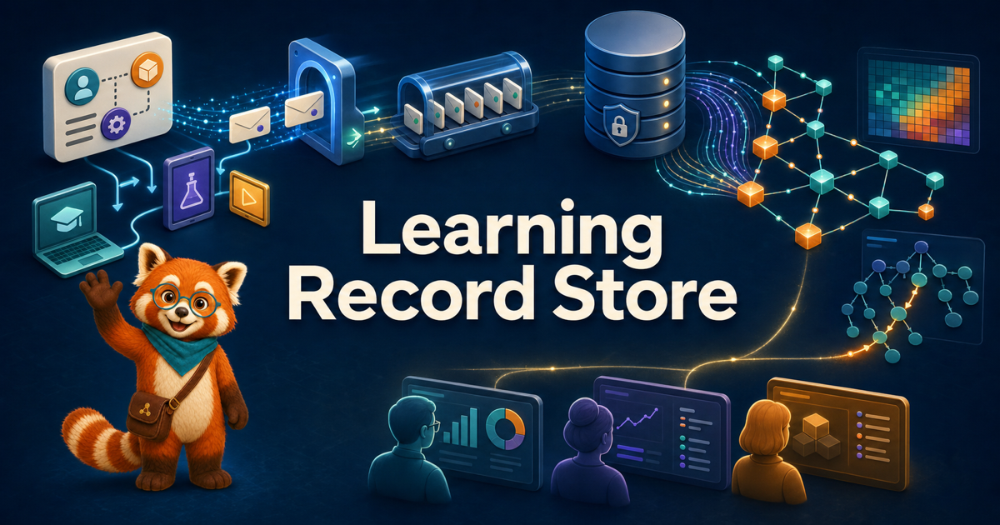

# Learning Record Store

[{ width="100%" }](chapters/01-lms-to-experience-api/index.md)

A learning experience becomes useful evidence only when its record can be trusted,
moved between systems, and interpreted in context. This intelligent textbook follows
that evidence from a learner's interaction, through a standards-based Learning Record
Store (LRS), to the reports that help educators make better decisions.

You will begin with the plain-language story behind xAPI and interoperability, then
examine the architecture of the LRS being built in this repository. Finally, you will
use the same underlying record through the eyes of a district administrator, a
classroom teacher, and an intelligent-textbook author.

!!! mascot-welcome "Let's follow the record."
    { class="mascot-admonition-img" }
    Start with one learning event. Follow where it goes, what evidence it preserves,
    and which decisions it can support.

## Choose Your Path

### Understand the standards

Learn why education moved beyond LMS-bound records, how an xAPI statement expresses
"someone did something with a learning object," and how IEEE standards make those
records portable across tools and institutions.

[Begin with Chapter 1: From LMSs to xAPI](chapters/01-lms-to-experience-api/index.md)

### Examine the architecture

Trace a statement through accept-first ingestion, a durable event queue, the event
store, and a compression pipeline that produces queryable summary vertices without
placing every raw event in the graph.

[Explore Chapter 5: The Five Architectural Planes](chapters/05-system-context-architectural-planes/index.md)

### Use the evidence

See how one standards-based statement log supports district adoption and compliance,
teacher mastery and prerequisite analysis, and author experiments on content
effectiveness.

[Meet the Three Personas in Chapter 24](chapters/24-three-personas-and-admin-uis/index.md)

## Follow One Record End to End

1. **Experience:** A learner reads a page, answers a question, or explores a MicroSim.
2. **Statement:** The learning tool describes that event as a conformant xAPI record.
3. **Ingestion:** The LRS accepts the record quickly and preserves it in the event
   stream and event store.
4. **Compression:** Processing converts repeated evidence into bounded summary
   vertices such as concept mastery and page engagement.
5. **Decision:** A role-specific report turns the summaries into a question an
   administrator, teacher, or author can act on.

## Explore the Textbook

- **[Chapters](chapters/index.md)** — the complete 32-chapter path from foundations
  and standards through architecture, operations, and persona workflows.
- **[Interactive Learning Graph](sims/graph-viewer/index.md)** — explore the concepts
  and prerequisite connections that organize the book.
- **[LRS Data Model Explorer](sims/lrs-data-model/index.md)** — inspect tenancy,
  content, experiment, and compressed-summary structures from the specification.
- **[MicroSims](sims/index.md)** — learn by manipulating interactive models and
  observing the xAPI records they emit.
- **[Glossary](glossary.md)** — look up the standards, architecture, analytics, and
  privacy vocabulary used throughout the course.
- **[Specifications](specs/lrs-spec-v1.md)** — read the authoritative LRS
  specification and follow its links to the design and producer contract.
- **[Live Graph Demo](demo/graph-queries.md)** — explore example Neo4j queries over
  the seeded demonstration graph.

## Who This Book Is For

The book is written first for the people who operate or use an LRS day to day:

- district administrators managing rollout, access, and compliance;
- classroom teachers interpreting mastery and prerequisite evidence; and
- intelligent-textbook authors measuring how content supports learning.

It also serves software engineers, learning-technology architects, standards and
compliance specialists, and upper-level students in computer science, instructional
design, or educational technology. Part 1 assumes only general computer literacy;
the architecture chapters introduce the required xAPI vocabulary from first
principles before moving into system detail.

## Getting Started

Start with [Chapter 1: From Learning Management Systems to the Experience
API](chapters/01-lms-to-experience-api/index.md), or read the [course
description](course-description.md) for the full scope, prerequisites, and learning
outcomes.

**One event at a time.**
