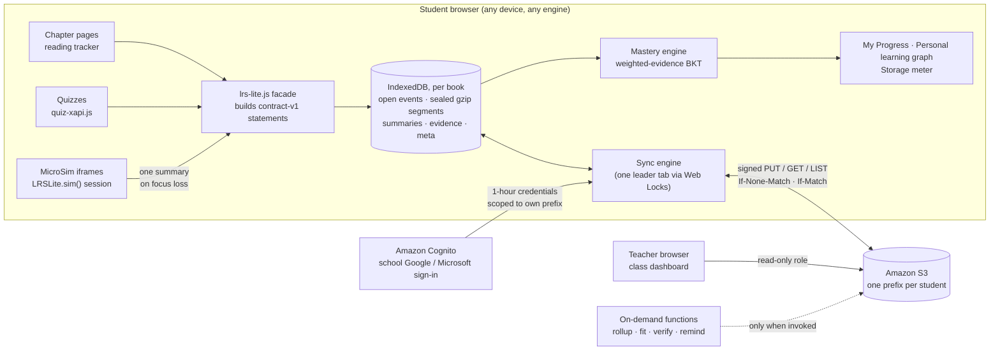
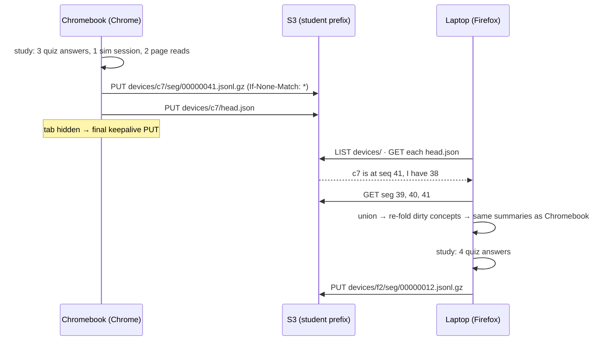
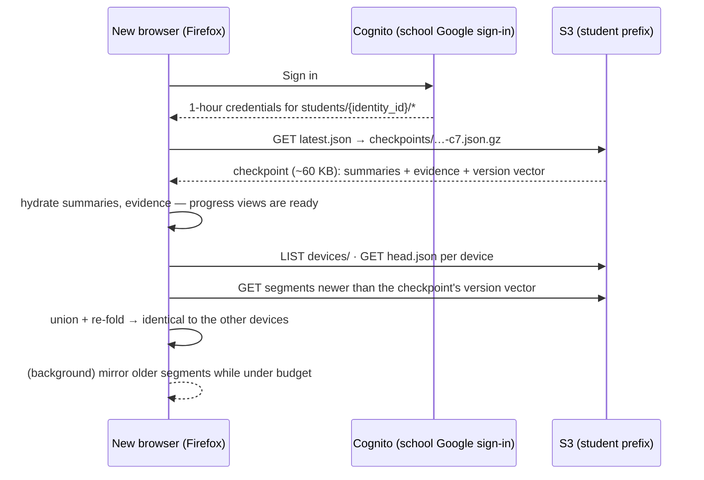

# LRS-Lite: A Serverless Learning Record Store

**Status:** analysis and implementation plan, draft for review — 2026-09-24.
**Relationship to other documents:** this builds on and in several places revises the
earlier [LRS-Lite Design (v1) draft](../specs/learning-record-store-lite-design.md)
(see [§1.3](#13-what-this-document-changes-in-the-earlier-draft)). The full-scale system
remains specified by the [LRS Specification](../specs/lrs-spec-v1.md), the
[Design & Deployment document](../specs/lrs-design-v1.md), and the
[xAPI Producer Contract](../specs/xapi-producer-contract-v1.md). Every statement LRS-Lite
stores is a valid producer-contract statement, so a school can move to the full LRS later
without rewriting anything.

---

## Summary of Findings

**Short answer: yes.** For a pilot with one textbook, one teacher, and one course, LRS-Lite
can deliver student dashboards that are as good as the full LRS's and class dashboards that
are nearly as good, with no always-on server. The pilot runs on pay-per-request object
storage and a managed sign-in service, and should cost **a few dollars a month or less**.
The single-server tier costs **$300–2,500/month** and the full-scale tier about
**$10,300/month** ([hardware estimate](../specs/hardware-requirements.md)).

The reasoning in [§2](#2-step-by-step-reasoning) comes down to six findings:

1. **An always-on server in the current LRS handles *scale* and *coordination*, not
   *computation*.** A pilot class makes about **0.01 statements per second** on average.
   The full design is built for **10,000 per second**, six orders of magnitude more. The
   work that remains at pilot scale (summarizing, mastery estimation, dashboards) takes
   milliseconds of CPU and can run in the browser.
2. **The data is small, and we measured it.** A contract-v1 xAPI statement serializes to
   about **970 bytes**. With summarization inside each MicroSim, a typical student's
   *whole semester* compresses to **about 0.2 MB**, and a heavy user's to **about
   0.4 MB**. The 10 MB budget is a safety rail, not a constraint we expect to hit
   ([§2 Step 2](#step-2-measure-the-data-before-choosing-the-machinery)).
3. **The browser holds a working copy, not the system of record.** Browsers do not share
   storage with each other, they may evict it, and Safari/WebKit deletes script-written
   storage after seven days without a visit. Each student's system of record is therefore
   an **append-only set of immutable event segments in S3**. Every browser is a rebuildable
   replica of that set.
4. **Cross-browser sync needs no server, because an append-only event set is a CRDT.**
   Merging means taking the union of event sets, and summaries are a deterministic function
   of the set, so every browser reaches the same summaries no matter what order syncs
   happen in. S3's atomic *create-if-absent* write (`If-None-Match: *`) is the only
   coordination this needs. The earlier draft used a last-writer-wins snapshot, which
   loses real evidence when a student uses two browsers on the same day. This document
   replaces it ([§8](#8-sync-and-backup-across-browsers-and-devices)).
5. **Mastery can be estimated where the evidence is created.** Bayesian Knowledge Tracing
   (the model from [Chapter 12](../chapters/12-bayesian-knowledge-tracing/index.md)),
   extended to accept weighted evidence, runs in constant time per event. A concept turns
   **green** only when *assessed* evidence (quiz answers, MicroSim goals and predictions)
   supports it. Reading and exploring mark a concept *exposed*, never *mastered*
   ([§9](#9-estimating-mastery-in-the-browser)).
6. **Class dashboards work at pilot scale because the teacher's browser can aggregate the
   whole class.** Each student's summary snapshot is about **11 KB compressed**, so a
   150-student roster is under 2 MB to download. What LRS-Lite actually gives up:
   **real-time freshness** (data is as current as each student's last sync),
   **tamper-resistant evidence** (the student's browser vouches for its own records),
   **cross-organization analytics**, and **push alerts**. Each can be added back with a
   function that runs only when needed ([§2 Step 9](#step-9-verdict-a-dashboard-quality-scorecard)).

The largest risk is **content, not infrastructure**. Every chapter now has a quiz (352
questions), but only 228 of their "Concept Tested" labels (65%) exactly match a
learning-graph concept. Only 226 of the 578 concepts have any quiz item, and just **2** have
the two distinct items the green rule needs. Until more concepts have assessments, most
of the personal learning graph can reach *exposed* but not *green*
([§9.5](#95-concept-mapping-which-concept-did-this-evidence-touch)).

**Students under 13 are supported** ([§12.1](#121-students-under-13-coppa)). Consent comes
either from the school acting for parents (FTC guidance) or from signed parent forms.
Until consent is recorded, LRS-Lite runs in **local-only mode**: the student gets full
progress views, but nothing is transmitted. Under the FTC's COPPA FAQ that is not
collection. Parents exercise their rights to review, delete, and stop collection through
a parent view. We recommend **against** parent-owned AWS accounts or shared parent
credentials: they would not move the COPPA obligations, they conflict with AWS's terms,
and they would make the required retention and deletion controls unenforceable. The
**recommended defaults**:

- a signed student-data privacy agreement first;
- school authorization plus a family notice letter with an opt-out;
- data in the district's own AWS account;
- deletion 60 days after the course ends;
- the students' existing school Google sign-in, with no email stored.

| | Full LRS (spec v1) | Single-server tier | **LRS-Lite** |
|---|---|---|---|
| Always-on compute | Kubernetes, Kafka, ClickHouse, Neo4j | 1 large VM | **None** |
| Target scale | 10k statements/s, many districts | 1k statements/s | 1 course, ≤ ~150 students |
| Monthly cost (order of magnitude) | ~$10,300 | $300–2,500 | **≈ $1–5** ([§13](#13-cost-model)) |
| Student dashboards | Server-rendered, minutes-fresh | same | **In-browser, instant, works offline** |
| Teacher dashboards | Real-time, server-aggregated | same | **Teacher-browser aggregation, fresh as of last sync** |
| Evidence integrity | Server-authenticated ingestion | same | **Self-reported by the student's browser** (optional verifier, [§12](#12-security-privacy-and-integrity)) |
| Migration path | — | — | Replays into the full LRS unchanged |

---

## 1. The Problem

### 1.1 Why the MVP costs money when nobody is studying

The proof-of-concept LRS follows the [specification](../specs/lrs-spec-v1.md): an ingestion
gateway, a durable queue, a ClickHouse event store, a compression pipeline, a Neo4j graph
of summary vertices, and Dash dashboards. Every one of those is a long-running process.
They cost the same at 3 a.m. on a Sunday as during a class period, because an always-on
server charges for *being available*, not for *doing work*. A pilot with one teacher and
thirty students uses a tiny fraction of that capacity and pays for all of it.

### 1.2 Requirements for LRS-Lite

The request, broken into testable requirements:

| # | Requirement |
|---|---|
| L-1 | **No always-on server.** Backend processes run only when invoked or on a schedule, and cost nothing while idle. |
| L-2 | Each student's xAPI data lives in a **browser database capped at 10 MB**, stored **compressed**. |
| L-3 | The student can **see how full** the local store is. |
| L-4 | At **regular intervals** the book **offers to back up** the local store to low-cost object storage (Amazon S3 or equivalent). |
| L-5 | **Cross-browser and cross-device consistency:** a student moving between Chrome and Firefox, or between a school Chromebook and a home laptop, sees the same progress everywhere. |
| L-6 | **MicroSims summarize locally** and record summary information only **after the sim loses focus**, instead of streaming per-interaction events. |
| L-7 | **Page views and scrolling** are captured as compact reading summaries. |
| L-8 | **Quizzes, MicroSims, and reading** together feed a **per-concept mastery estimate**. |
| L-9 | Students see a **personal progress dashboard**. |
| L-10 | A new **personal learning-graph viewer** colors a concept **green** when the xAPI evidence shows the student has mastered it. |
| L-11 | **Dashboard quality stays high** without a server. This document interprets that as covering the teacher's class view, not only the student's own. |
| L-12 | Statements stay **producer-contract v1** conformant, so the full LRS can ingest them later. |

### 1.3 What this document changes in the earlier draft

The earlier [LRS-Lite draft](../specs/learning-record-store-lite-design.md) got most things
right: IndexedDB, producer-side summarization with a per-sim `config.json`, per-student S3
prefixes, delegated identity, a replay script, and a migration path. This document keeps
all of that. It revises five points, each for a reason given later:

| Earlier draft | This document | Why |
|---|---|---|
| Last-writer-wins merge of one `book-status.json` snapshot per grain | **Union of immutable event segments, with summaries derived deterministically** (a CRDT) | L-5 makes two-browser use a primary case, and LWW silently drops one device's evidence ([Step 4](#step-4-keep-many-browsers-consistent-without-a-coordinator)) |
| Flush once, at end of day | **Small automatic syncs at session boundaries**, plus a user-facing **backup offer** at intervals | End-of-day flushing leaves the second browser a day behind, which breaks L-5 |
| A statement is ~700 bytes | **~970 bytes measured** | Measured against the repo's real IRIs ([Step 2](#step-2-measure-the-data-before-choosing-the-machinery)) |
| Instructor dashboards are a non-goal | **Class dashboards are in scope**, aggregated in the teacher's browser | L-11, and the data is small enough ([Step 7](#step-7-build-dashboards-where-the-data-is-small)) |
| Mastery and the learning-graph view are left open | **Weighted-evidence BKT, a seven-state color model, and a personal graph viewer** | L-8 and L-10 |

---

## 2. Step-by-Step Reasoning

The question: *can we keep high-quality LRS functions, including dashboards, without a
server?* This section answers it in nine steps. Each step states a question, presents
evidence, and draws a conclusion that the next step relies on.

### Step 1: List what the server actually does

"The server" is really a dozen jobs. If each job can run somewhere else at pilot scale,
the server is not needed. The twelve core functions ([spec §6](../specs/lrs-spec-v1.md#6-core-lrs-functions)),
plus authentication and dashboards:

| Function | Why it needs a server at district scale | Where it runs in LRS-Lite |
|---|---|---|
| F-1 Statement storage | A shared, durable log absorbing 10k statements/s | **Immutable per-student segments in S3**, with a working copy in each browser |
| F-2 Statement retrieval | Many concurrent consumers | **The files are the API.** Scripts and DuckDB-WASM read the segments directly |
| F-3 Voiding | — | A voiding statement is appended like any other, and the summarizer honors it |
| F-4 Pseudonymization | A secret HMAC salt must stay hidden | The **identity-pool ID is already an opaque pseudonym**, so no salt ships to the client |
| F-5 Activity resolution | Unknown producers appear without warning | **At build time.** The static site knows its own pages, sims, and concepts (`concept-map.json`, [§9.5](#95-concept-mapping-which-concept-did-this-evidence-touch)) |
| F-6 Concept mapping | The `COVERS` graph lives in Neo4j | Same build-time `concept-map.json` |
| F-7 Mastery computation | BKT over millions of students | **In the browser**, constant time per event |
| F-7b Statement compression | A streaming pipeline | **At the producer** (MicroSim, reader, quiz) plus a local fold |
| F-8 Progress projection | Section and district rollups | Local summaries. The class rollup is computed in the **teacher's browser** |
| F-9 Experiment assignment | A sticky assignment service | Deterministic `hash(student, experiment)` computed in the page |
| F-10 Reconciliation | Accept-first ingestion from thousands of books | **Not needed.** One book, known at build time |
| F-11 Export | Async export jobs | **The S3 prefix *is* the export** |
| F-12 Retention and purge | Policy engine | S3 lifecycle rules. Erasure is deleting one prefix |
| Authentication and RBAC | Gateway tokens, API-layer RBAC | **Managed identity (Cognito)** plus IAM policy variables that confine each student to their own prefix |
| Dashboards | A Dash server querying ClickHouse and Neo4j | **Static pages computing in the browser** |

**Conclusion:** no job on this list requires a process that stays running. Two jobs,
issuing credentials and aggregating across many classes, need *some* backend.
Credentials come from a managed service that charges only when used. Cross-class
aggregation is optional at pilot scale ([Step 8](#step-8-find-what-genuinely-needs-a-server-and-make-it-scale-to-zero)).

### Step 2: Measure the data before choosing the machinery

To size the store, we generated one semester of **contract-v1 statements** using this
repo's real chapter paths, sim paths, and concept IDs (32 chapters, 129 sims, 578
concepts), serialized them with the same shape `docs/js/lrs-xapi.js` builds, and gzipped
them. The model assumes 90 active study days, which is generous for a real course.

| Emission mode | Student profile (per active day) | Statements / semester | Raw JSON | gzip, one segment per day | Fits in 10 MB? |
|---|---|---|---|---|---|
| **summary** | typical: 6 page reads, 4 sim sessions, 15 quiz answers | 2,250 | 2.2 MB | **0.22 MB** | Yes, about 45× headroom |
| **summary** | heavy: 12 page reads, 8 sim sessions, 30 quiz answers | 4,500 | 4.4 MB | **0.37 MB** | Yes, about 27× headroom |
| full (every drag) | typical, 40 slider drags per sim session | 17,010 | 16.1 MB | 1.05 MB | Only when compressed |
| full (every drag) | heavy, 80 drags per sim session | 62,820 | 59.6 MB | 3.6 MB | Only when compressed, about one semester |

*(Method: a short Python script generated statements with `lrs-xapi.js`'s shape (actor,
verb, object with definition, `grouping`, `parent` where applicable, `concept_id`,
result extensions), drawing IRIs from `docs/chapters/`, `docs/sims/`, and
`learning-graph.csv`. Statements average 945–985 bytes, UUIDs and timestamps are random,
and gzip runs at level 6 on newline-delimited JSON, the same format S3 segments use. A dictionary-encoded "compact event" format was also measured: 60–69
bytes per event before gzip and 0.045 MB per typical semester after. It is **rejected**
for summary mode because it saves space the budget does not need and adds a second
format. It stays in reserve for full mode.)*

Rates tell the same story. Thirty students × ~25 summary statements per day comes to
about 750 statements per day, or **0.009 statements per second** averaged over a school
day. A burst of thirty students submitting a ten-question quiz in the same minute is
about **5 per second**. The full design's gateway, queue, and burst absorption exist for
**10,000–50,000 per second**.

**Conclusions:**

- **Summarizing inside the MicroSim is the lever that matters most.** It cuts statement
  count about 7.6× for typical sims, and far more for drag-heavy ones.
- **gzip is the second lever** (about 10×). Together they fit a heavy semester in under
  0.4 MB.
- The **10 MB budget can hold a full local replica of the student's entire history**, not
  just a cache of recent events. That property makes any browser able to rebuild and
  verify summaries on its own ([§8.5](#85-checkpoints-and-bootstrapping-a-new-browser)).
- At pilot scale the hard problem is not *volume*, it is **coordination**: keeping several
  copies of one student's record consistent. The next two steps address it.

### Step 3: Decide where the truth lives

A browser database cannot be the system of record, for three reasons that are each
enough on their own:

1. **Browsers do not share storage.** Chrome and Firefox on the same laptop have separate
   IndexedDB databases, and so do two computers. L-5 therefore requires a copy that
   every browser can reach.
2. **Browsers evict.** Storage is best-effort unless the origin is granted persistence,
   and eviction under pressure removes an origin's data wholesale. WebKit (Safari, and
   every browser on iOS/iPadOS) deletes script-writable storage after seven days of
   browser use without an interaction with the site
   ([§3.2](#32-quotas-eviction-and-the-browser-is-a-cache-rule)).
3. **Schools wipe devices.** Shared Chromebooks often run ephemeral or guest sessions that
   clear site data at sign-out.

**Conclusion:** each student's **system of record is an object-store prefix**, and every
browser holds a **working copy** that can be thrown away and rebuilt. Two consequences
shape the rest of the design:

- Anything not yet uploaded is at risk. The design therefore minimizes the *unsynced
  window* (minutes, not a day) instead of maximizing local capacity.
- The upload protocol must be safe to repeat and safe to run from several browsers at
  once, since students will do both.

### Step 4: Keep many browsers consistent without a coordinator

Normally a server keeps several writers consistent by serializing their writes. With no
server, the data structure itself has to make concurrent writes harmless.

**The failure the earlier draft accepted.** Suppose a student works in two browsers on
the same day, and neither has synced the other's work yet:

| Time | Chromebook (Chrome) | Home laptop (Firefox) |
|---|---|---|
| Mon 10:05 | Answers 3 questions on *Slip Parameter* (2 right). Wi-Fi drops before sync. | — |
| Mon 19:30 | — | Answers 4 more on *Slip Parameter* (4 right). Syncs. |
| Tue 08:10 | Reconnects and syncs. | — |

Under **last-writer-wins per grain**, Tuesday's sync keeps one device's *Slip Parameter*
record and discards the other. Either the three Monday-morning attempts or the four
evening attempts disappear from the mastery estimate. The earlier draft called this an
acceptable undercount, but when switching browsers is a *requirement*, it is a routine
loss.

**The alternative: make the replicated state an append-only set of events.**

- Every event is **immutable** and has a **globally unique ID** (the statement UUID, plus
  a `device_id`/`seq` pair).
- Merging two replicas means taking the **set union**. Union is commutative, associative,
  and idempotent, which makes this a *grow-only set*, the simplest conflict-free
  replicated data type (CRDT). Any number of syncs, in any order, repeated any number of
  times, leaves every replica with the same set.
- **Summaries are a deterministic function of the set**: sort events by (hybrid logical
  clock, device, sequence) and fold. Equal sets give equal summaries.

In the example above, Tuesday's sync gives both devices all seven attempts, and both
compute the same mastery estimate.

!!! mascot-thinking "Why the event set does the coordinating"
    { class="mascot-admonition-img" }
    The trick is to never *edit* the record. Every browser only ever **adds** events, and
    every summary is recalculated from the events. Two browsers can't disagree about a sum
    if they're both adding up the same pile. Let's follow the record: the record is the
    pile, and the summary is just arithmetic on it.

**What the object store must provide.** Each segment (a batch of events from one device)
is written exactly once, under a key no other device uses. That needs only an atomic
**create-if-absent**, which S3 has supported since August 2024 as
`PUT … If-None-Match: *`. Writing the small pointer to the newest checkpoint needs
**compare-and-swap**, which S3 supports as `If-Match: <etag>`
([§3.4](#34-object-storage-as-a-sync-backend)). Neither requires a server we run.

**Conditions for convergence.** They are written down because the design depends on them:

1. Events are never modified. Corrections are new events, following xAPI voiding.
2. Event IDs are globally unique, and a device never reuses a `(device_id, seq)` pair.
3. The fold is deterministic, including its tie-breaking.
4. **Every replica runs the same summarizer version.** Two browsers holding different
   cached versions of `lrs-lite.js` could compute different summaries from the same
   events. Summaries and checkpoints therefore record `summarizer_version`, and a replica
   that sees a newer version rebuilds from events once it has the new code.

**Conclusion:** cross-browser consistency comes from the data model and requires no
coordinator. S3's conditional writes supply the one atomic operation needed.

### Step 5: Move compression to the producer

The full LRS compresses on the server ([spec §5.6](../specs/lrs-spec-v1.md#56-statement-compression)).
LRS-Lite has no server, so compression moves to the **producer**: the MicroSim, the page
reader, and the quiz. This matches L-6.

- A MicroSim keeps its session state in memory, such as which controls were touched, the
  range explored, goals reached, and predictions made. When the sim **loses focus**
  (scrolled out of view, tab hidden, page left, or idle), it emits **one** summary
  statement ([§6](#6-producer-side-summarization)).
- A chapter page tracks *active* reading time, maximum scroll depth, and sections viewed,
  and emits **one** reading summary when it is hidden.
- Quiz answers are already at the right grain, one statement per attempt, and pass through
  unchanged. Each attempt is separate evidence.

**What is lost:** the per-drag sequence, the same trade the earlier draft made knowingly.
**What is kept:** every outcome mastery depends on (answers, goals, predictions) and every
engagement measure the dashboards use (active time, interaction counts, coverage).

**Conclusion:** summarizing at the producer shrinks the stream by an order of magnitude,
and the budget then holds a semester of history with room to spare.

### Step 6: Estimate mastery where the evidence is

Steps 1–5 show there is no server to compute mastery, so it must run in the browser. Is
that a problem?

- A BKT update is roughly a dozen floating-point operations. Rebuilding **every concept
  from every event of a heavy semester** (4,500 events, 578 concepts) is a few
  milliseconds of JavaScript.
- The only mastery task that benefits from **pooled** data is **fitting** the BKT
  parameters (slip, guess, transit) from many students. That can run weekly, or on
  demand, in the teacher's browser or a short-lived function. A pilot can also keep the
  textbook's default parameters for its first term ([§9.6](#96-parameters-and-calibration)).

**Conclusion:** computing mastery in the student's browser gives up no quality, and it
makes the student view **instant and available offline**.

### Step 7: Build dashboards where the data is small

**Student dashboards** read the student's own local summaries. The data is already on
the device, fresh to the most recent event, and available offline. This is strictly
*better* than a server-rendered view.

**Class dashboards** need every student's summaries. Sized with a synthetic snapshot: one student's
summary snapshot for this book, with all 578 concepts, 32 chapters, 129 sims, and 320
quiz questions touched, is about **65 KB raw, 11 KB gzipped**. For a class of 30 that is
about **0.3 MB** to download. For five sections (150 students) it is about **1.7 MB**,
roughly one hero image. The teacher's browser can fetch those snapshots in parallel and
compute heatmaps, funnels, and at-risk lists locally.

**Conclusion:** at pilot scale the teacher's browser is the analytics server. Above about
a hundred students, where 150 separate downloads take a few seconds, or for questions
spanning many classes, an on-demand function should precompute a rollup instead
([§11.3](#113-when-a-function-should-run)).

### Step 8: Find what genuinely needs a server, and make it scale to zero

After Steps 1–7, these tasks remain. Each gets a backend that exists only while it runs:

| Need | Why the browser can't do it alone | Scale-to-zero answer |
|---|---|---|
| Issuing scoped, short-lived storage credentials | A static site cannot keep a secret | **Amazon Cognito** (managed, billed per active user, free tier) |
| Class rollup for large rosters | Too many downloads for one browser | **Lambda**, triggered when a teacher opens the dashboard or nightly |
| Tamper-evident ("verified") quiz grading | The client holds the answer key and can forge success | Optional **Lambda function URL** that grades and signs a receipt |
| Fitting BKT parameters on pooled data | Needs data from many students | Weekly scheduled **Lambda**, or the teacher's browser |
| Reminders and alerts ("idle for 5 days") | Browsers can't wake up on a schedule | Scheduled **Lambda** plus email, if the pilot wants it |
| Migration or replay into the full LRS | One-time bulk job | An admin runs `scripts/lrs-lite-replay.mjs` |
| Parents reviewing, deleting, or stopping their child's record (COPPA) | The parent-to-child link can't be expressed in an IAM policy | **Lambda function URL**, invoked from the parent view ([§12.1](#121-students-under-13-coppa)) |

**Conclusion:** L-1 holds. Nothing runs, and nothing bills compute, while nobody is
studying.

### Step 9: Verdict, a dashboard-quality scorecard

Every report in the [specification's catalog](../specs/lrs-spec-v1.md#7-reports-and-analytical-tools)
scored against LRS-Lite at pilot scale:

| Report | Lite support | Notes |
|---|---|---|
| R-101 Student Progress Overview | ✅ Full | Also shown to the student |
| R-102 Concept Mastery Radar | ✅ Full | |
| R-103 Time-on-Task Timeline | ✅ Session grain | Detail inside a session is summarized, not replayable |
| R-104 Struggle Detector | ✅ Full | Attempts, P(L), and the prerequisite walk all run locally |
| R-105 Prerequisite Gap Analysis | ✅ Full | The learning graph ships with the site |
| R-106 Quiz Item Analysis (student) | ✅ Full | Every `answered` statement is kept |
| R-107 Idle / Disengagement Alert | ⚠️ Degraded | "Idle" and "hasn't synced" look the same. Shows "last seen" per student |
| R-108 Learning Velocity | ✅ Full | Evidence carries timestamps |
| R-109 Reading vs. Doing Balance | ✅ Full | Also shown to the student |
| R-201 Class Mastery Heatmap | ✅ Full | Teacher-browser aggregation |
| R-202 Concept Difficulty Ranking | ✅ Full | |
| R-203 Completion Funnel | ✅ Full | |
| R-204 Pace Distribution | ✅ Full | |
| R-205 Class Engagement Calendar | ✅ Full | From session summaries |
| R-206 Question Discrimination | ✅ Full (small-sample caveat) | The same caveat applies to the full LRS with 30 students |
| R-207 MicroSim Utilization | ✅ Full | From sim session summaries |
| R-208 Cohort Comparison | ✅ If the teacher owns both sections | |
| R-209 At-Risk Roster | ⚠️ Degraded | Freshness and self-reported evidence ([§12](#12-security-privacy-and-integrity)) |
| R-210 Standards Coverage | — | Same status as in the full LRS (needs a standards graph) |
| R-301–R-307 Content reports | ⚠️ Per class | Cross-class needs an on-demand batch query |
| R-308 Cross-District Benchmark | ❌ Out of scope | |
| R-401–R-408 Admin reports | ❌ Mostly N/A | No ingestion plane to monitor. Cost is watched with an AWS Budgets alarm |
| §8 A/B experiments | ⚠️ Possible | Hash-based assignment in the page. Analysis runs on demand |
| T-3 Statement Query Console | ⚠️ On demand | DuckDB-WASM over the segment files |
| T-7 Alert Rule Builder | ⚠️ Scheduled function only | No push without a backend |
| Real-time anything | ❌ | Fresh as of each student's last sync, typically minutes |

**Verdict:** everything a single teacher needs day to day is ✅. The ⚠️ rows are
freshness, trust, or cross-class questions, and a function that runs only when invoked
can restore each one. The ❌ rows belong to multi-district operation, which the pilot
does not have.

---

## 3. State of the Art

This section summarizes research carried out on 2026-09-24 across browser storage,
local-first sync, object-storage commit protocols, serverless pricing, and the learning
sciences. Sources are linked inline and collected in [§16](#16-references).

### 3.1 Browser storage engines

| Option | 2026 status | Download | Verdict for LRS-Lite |
|---|---|---|---|
| **IndexedDB** (optionally via [idb](https://github.com/jakearchibald/idb) or [Dexie](https://dexie.org/)) | Supported by every browser | 0 KB native. idb ≈ 3.4 KB, Dexie ≈ 31 KB gzipped | **Chosen.** Structured, transactional, asynchronous, universal |
| Origin Private File System (OPFS) | Baseline since March 2023. Synchronous access handles only in dedicated workers ([MDN](https://developer.mozilla.org/en-US/docs/Web/API/File_System_API/Origin_private_file_system)) | — | Not needed. LRS-Lite does no file-level I/O |
| Official SQLite WASM | Its full-speed `opfs` backend needs COOP/COEP response headers, which **GitHub Pages cannot set**. `opfs-sahpool` avoids that but allows one connection ([sqlite.org](https://sqlite.org/wasm/doc/trunk/persistence.md)) | ≈ 400 KB gzipped | Rejected. A hosting constraint, and SQL is unnecessary for append-and-fold |
| PGlite (Postgres in WASM) | The `idb://` backend holds the whole database in memory, and the OPFS backend exceeds Safari's cap of 252 open handles ([PGlite docs](https://pglite.dev/docs/filesystems)) | ≈ 3–5 MB gzipped | Rejected |
| DuckDB-WASM | Mature analytics engine that reads Parquet and JSON over HTTP. Range requests **fail on Firefox and with presigned URLs**, forcing full downloads ([DuckDB troubleshooting](https://duckdb.org/docs/current/clients/wasm/troubleshoot)) | Several MB | **Optional, teacher only**, for the ad-hoc query console |
| Storage Buckets API | Chrome 122+ only. Not in Firefox or Safari ([Chrome docs](https://developer.chrome.com/docs/web-platform/storage-buckets)) | — | Worth watching. It would give each book its own eviction policy on the shared origin |

**Conclusion:** LRS-Lite's workload (append events, fold them into summaries, read
summaries) needs no query engine. IndexedDB does it with no download and no hosting
headers, in every browser.

### 3.2 Quotas, eviction, and the "browser is a cache" rule

| Browser | Per-origin quota | What `navigator.storage.persist()` does | Special risks |
|---|---|---|---|
| Chrome / Edge | 60% of total disk ([MDN](https://developer.mozilla.org/en-US/docs/Web/API/Storage_API/Storage_quotas_and_eviction_criteria)) | Grants or denies **silently** by heuristics, and a 2025 test found grants unreliable ([test](https://blog.desgrange.net/post/2025/10/06/how-persistent-storage-permission-chrome.html)) | Incognito ≈ 5%. "Clear site data on close" wipes everything |
| Firefox | Best effort: the smaller of 10% of disk or 10 GiB per site group. Persistent: up to 50% | Shows the user a **permission prompt** | — |
| Safari 17+ (macOS, iOS, iPadOS) | ≈ 60% of disk for the browser app, ≈ 15% in apps that embed web views ([WebKit](https://webkit.org/blog/14403/updates-to-storage-policy/)) | Silent. Home Screen web apps are favored | **Deletes all script-writable storage after 7 days of Safari use without a click or tap on the site.** Home Screen web apps are exempt ([WebKit](https://webkit.org/blog/10218/full-third-party-cookie-blocking-and-more/)). Every iOS browser uses WebKit outside the EU. Whether the 7-day rule fires inside Chrome or Firefox *for iOS* is unverified |
| ChromeOS, managed | As Chrome | As Chrome | **Ephemeral users**: data wiped at sign-out, storage capped at half the device's RAM. **Managed guest sessions**: wiped at logout or idle. Admin policies (`BrowsingDataLifetime`) can clear site data as often as hourly ([Google admin help](https://support.google.com/chrome/a/answer/1375678)) |

In every browser, **eviction is least-recently-used by origin, and it removes all of an
origin's data at once** (IndexedDB, caches, service workers). `estimate()` is explicitly
approximate ([MDN](https://developer.mozilla.org/en-US/docs/Web/API/StorageManager/estimate)).

**Implications for LRS-Lite:**

1. **Quota is not the constraint.** 10 MB is roughly 0.01% of a typical per-origin quota.
   What threatens a student's record is *eviction and wiping*, which quota does not
   protect against. This is why [Step 3](#step-3-decide-where-the-truth-lives) makes the
   object store the system of record.
2. **Ask for persistence only from a user gesture.** Firefox shows a prompt, so calling
   `persist()` automatically at sign-in would confuse students. The meter offers "Keep my
   record on this device", which calls it ([§7.4](#74-asking-the-browser-to-keep-the-data)).
3. **iPad and iPhone students should add the book to their Home Screen.** That removes
   the 7-day deletion, and on iOS 26 a Home Screen site opens as a web app by default.
4. **The shared `dmccreary.github.io` origin shares one eviction fate.** One eviction
   wipes every book's local copy at once. With segments in S3 that is an inconvenience
   (a re-download), not a loss.

**Platform APIs LRS-Lite relies on** (from MDN browser-compat-data):

| API | Supported since | Used for |
|---|---|---|
| Web Locks (`navigator.locks`) | Chrome 69, Firefox 96, Safari 15.4 | One sync leader per browser |
| BroadcastChannel | Chrome 54, Firefox 38, Safari 15.4 | Telling tabs and sim iframes that summaries changed |
| `CompressionStream('gzip')` | Chrome 80, Firefox 113, Safari 16.4 | Sealing segments. gzip is the only format available in every browser: Chrome lacks brotli, and zstd is not on by default anywhere |
| `fetch(…, {keepalive: true})` | Chrome 66, Safari 13, Firefox 133. The **64 KiB limit is summed** over all in-flight keepalive requests | Best-effort upload when the page is left |
| `fetchLater()` | Chrome only | A future improvement for the leave-time upload |
| Storage in same-origin iframes | Shared with the parent page. Partitioning applies only to *third-party* contexts ([Privacy Sandbox](https://privacysandbox.google.com/cookies/storage-partitioning)) | MicroSims write straight to the book's database |

**Minimum browsers:** Chrome/Edge 80+, Firefox 113+, Safari/iOS 16.4+ (all from 2023 or
earlier). Chromebooks update automatically. On an older browser the book still works,
and LRS-Lite shows "progress tracking needs a newer browser".

**Page lifecycle:** use `visibilitychange` (hidden) and `pagehide`. Never use `unload`,
which Chrome finishes deprecating in September 2026
([Chrome](https://developer.chrome.com/docs/web-platform/deprecating-unload)). An open
IndexedDB connection can keep a page out of the back/forward cache, so the library closes
its connection on `pagehide` and reopens it on `pageshow`
([web.dev](https://web.dev/articles/bfcache)).

### 3.3 Local-first sync engines

The *local-first* movement ([Kleppmann et al., 2019](https://www.inkandswitch.com/local-first/))
has produced many sync engines. The question for LRS-Lite is narrow: **can any of them
sync a browser database using only object storage and functions that start on demand?**

| Engine | Always-on component? | Hosted offering | Can the backend be S3 / scale-to-zero? | Fit for an append-only event log |
|---|---|---|---|---|
| Automerge 3 + automerge-repo | Yes: a WebSocket sync server for cross-device sync | None | A community S3 adapter stores a *server's* data. It does not sync | Document CRDT, more than needed |
| Yjs | Yes: y-websocket, Hocuspocus, or WebRTC signaling | Third parties | y-sweet persists to S3 but is itself a server | Poor (text and document CRDT) |
| Replicache | **No.** You write push/pull HTTP endpoints, which can be serverless | Free, **maintenance mode** | Yes, as Lambda over S3 | Workable, but frozen |
| Zero (Rocicorp, 1.0 in June 2026) | Yes: `zero-cache` plus Postgres | $30–300/month | No | No |
| ElectricSQL | Yes: Postgres plus Electric. Reads only, "does not do write-path sync" | Usage-based | No | Data model fits, infrastructure doesn't |
| PowerSync | Yes: a service, a source database, and your write API | Free tier deactivated after one idle week | No | No |
| Dexie Cloud | Yes (SaaS or on-premises) | Free for 3 production users | No | Wrong backend |
| InstantDB | Yes | **Cloud shutting down, with apps stopping 2027-08-31** | Self-host only | Avoid |
| LiveStore | Yes: a sync backend sets the total event order (Cloudflare Durable Objects, Electric, or S2) | Pay-per-use on Cloudflare | Close, via Durable Objects | **Closest model** (event log → SQLite), but pre-1.0 |
| Evolu | A "stateless" relay that stores per-owner data | Test relay only | Possibly | Good: HLC and range-based set reconciliation |
| TinyBase | A WebSocket server or Durable Object for cross-device sync | None | Build your own | An HLC-stamped LWW map, not a log |
| RxDB | Depends on plugin (HTTP, CouchDB, Firestore, WebRTC, **Google Drive**, OneDrive) | Some plugins are premium | The **Google Drive plugin needs no backend** (beta) | Good |
| cr-sqlite | No: changesets travel over any transport | None | Yes | **Stagnant** (last release January 2024) |
| Firestore offline persistence | Managed service (no server of ours) | Free: 50k reads and 20k writes per day | Serverless, but not S3 | Works, but LWW documents, proprietary, and a K-12 compliance gap ([§12](#12-security-privacy-and-integrity)) |

*(Sources: each project's documentation and pricing page, collected in
[§16](#16-references).)*

**Findings:**

1. **No engine meets "object storage plus on-demand functions only" without an
   always-on component.** The ones that come close are either frozen (Replicache,
   cr-sqlite), beta (RxDB's Drive replication), or need a sync backend that orders events
   (LiveStore).
2. **Vendor risk is real, not hypothetical.** InstantDB's cloud closes in 2027. Triplit's
   team joined Supabase in October 2025 and the project has been quiet since. PowerSync's
   free tier deactivates idle projects, which a school holiday would trigger.
3. **The ideas transfer even where the products don't.** LRS-Lite takes the event-log
   model from LiveStore, hybrid logical clocks from TinyBase and Evolu, set reconciliation
   by version vector from the CRDT literature, and its commit protocol from Delta Lake,
   Iceberg, and SlateDB ([§3.4](#34-object-storage-as-a-sync-backend)). The remaining
   code, roughly a thousand lines of sync logic, is small enough to own.
4. **Every lightweight xAPI LRS still needs a server and a database.** Yet Analytics'
   SQL LRS (its AWS template runs EC2, Aurora, and a load balancer), Learning Locker, TRAX,
   Veracity Lite, and Ralph all do. None of them solves the pilot's cost problem.
5. **xAPI already has the key property.** Statements are immutable and carry
   client-assigned UUIDs, and an LRS receiving a duplicate ID "MUST NOT modify" the stored
   statement ([xAPI Communication](https://github.com/adlnet/xAPI-Spec/blob/master/xAPI-Communication.md)).
   An xAPI statement stream is already a grow-only set, so LRS-Lite formalizes that
   property rather than inventing it.

### 3.4 Object storage as a sync backend

Since 2024, the major object stores provide the two atomic operations a coordinator used
to be needed for:

| Operation | Amazon S3 | Cloudflare R2 | Google Cloud Storage | Azure Blob |
|---|---|---|---|---|
| **Create-if-absent** | `If-None-Match: *` (GA 2024-08-20) | `If-None-Match` | `ifGenerationMatch=0` | `If-None-Match: *` |
| **Compare-and-swap** | `If-Match: <etag>` (2024-11-25) | `If-Match` | `ifGenerationMatch=<n>` | `If-Match` |
| Failure signal | `412 Precondition Failed`. A delete racing the write gives `409` (retry) | `412` | `412` | `412` |

Details that matter for LRS-Lite
([S3 conditional writes](https://docs.aws.amazon.com/AmazonS3/latest/userguide/conditional-writes.html)):

- Among concurrent create-if-absent writers, **the first to complete wins** and the others
  get `412`. This is exactly the guarantee "a segment is written once".
- `If-Match` requires `s3:GetObject` permission as well as `s3:PutObject`.
- **Bucket policies can *require* the conditional headers** (condition keys
  `s3:if-none-match` and `s3:if-match`). LRS-Lite uses this to make segment history
  append-only on the server side: the student role cannot overwrite or delete an existing
  segment, even with a modified client ([§12](#12-security-privacy-and-integrity)).
- S3 LIST has been **strongly consistent** since December 2020
  ([S3 consistency](https://aws.amazon.com/s3/consistency/)), so a segment is visible to
  other devices' LISTs as soon as its PUT returns.

The same pattern is the commit protocol of the open table formats. **Delta Lake** writers
"MUST never overwrite an existing log entry", and delta-rs 1.0 (May 2026) replaced its
DynamoDB lock with S3 conditional puts. **Iceberg** commits by atomically swapping a
metadata pointer. **SlateDB** fences writers with sequentially numbered manifests that
need only put-if-absent. LRS-Lite's immutable segments play the part of Delta's log
entries, and `latest.json` plays the part of Iceberg's metadata pointer. The design follows
a known protocol at a much smaller scale; nothing in it is new.

### 3.5 Serverless backends compared

| Option | Always-on? | Pilot cost / month | Cross-device sync | Offline | Data portability | K-12 compliance path | Verdict |
|---|---|---|---|---|---|---|---|
| **A. S3 + Cognito (+ on-demand Lambda)** | No | **≈ $0.20–1** ([§13](#13-cost-model)) | We build it: a G-Set over conditional writes | Full | xAPI JSON-lines files | AWS FERPA whitepaper ("school official") | **Recommended** |
| B. Cloudflare R2 + Workers (+ Durable Objects) | No (Durable Objects hibernate) | $0–5 | We build it. Durable Objects allow live push later | Full | S3-compatible files | No FERPA commitment found | Strong alternative. Pick it if egress or live updates matter |
| C. Firebase / Firestore offline | Managed (not ours) | Free tier | Built in (LWW documents) | Yes | Proprietary export | Firebase is not covered by Workspace for Education terms | Not for K-12 |
| D. Managed local-first (PowerSync, Zero, ElectricSQL, Dexie Cloud, Jazz) | Yes (vendor service, often plus Postgres) | $0–300, and free tiers pause or cap | Built in | Yes | Varies | A vendor DPA per product | Violates the spirit of L-1 |
| E. Self-hosted lightweight LRS (SQL LRS, Ralph, TRAX) | Yes | A small VM plus operations | Server-mediated | Needs a client queue | Standard xAPI | School-hosted | Violates L-1 |
| F. Student's own drive (RxDB Google Drive replication) | No | $0 | Via Drive | Yes | JSON in Drive | Drive is a Workspace for Education core service | Clever, but teacher access is awkward and the plugin is beta |

**Why A over B.** The two are close. Cloudflare wins on egress (free) and on having a
natural path to real-time push, since a Durable Object per student could hold a
WebSocket. AWS wins on the request that named S3, on a published FERPA position, on
Cognito's free 10,000 MAU with Google federation, and on IAM policy variables that make
per-student isolation a one-line policy. Nothing in the design depends on AWS
specifically. The segment protocol runs unchanged on R2, GCS, or Azure, because all four
support create-if-absent and compare-and-swap.

### 3.6 Mastery estimation research

**Lightweight models are competitive, and the data matters more than the model.**

| Model | Per-event cost | Order-dependent? | Notes |
|---|---|---|---|
| Bayesian Knowledge Tracing ([Corbett & Anderson, 1994](https://doi.org/10.1007/BF01099821)) | O(1) per concept | **Yes** | The textbook's model ([Chapter 12](../chapters/12-bayesian-knowledge-tracing/index.md)). A partial-credit variant exists ([Wang & Heffernan, 2013](https://doi.org/10.1007/978-3-642-39112-5_19)) |
| Performance Factors Analysis ([Pavlik et al., 2009](https://files.eric.ed.gov/fulltext/ED506305.pdf)) | O(1) | **No.** It depends only on counts, so updates commute | A recency-weighted variant predicts better and restores order dependence ([Galyardt & Goldin, 2015](https://jedm.educationaldatamining.org/index.php/JEDM/article/view/JEDM100)) |
| Elo-based student modeling ([Pelánek, 2016](https://doi.org/10.1016/j.compedu.2016.03.017)) | O(1) | Yes | One number per student and item. Accepts non-binary scores |
| Deep knowledge tracing | Neural network per student | Yes | BKT extended with forgetting matched it ([Khajah et al., 2016](https://arxiv.org/abs/1604.02416)). Across nine datasets, logistic-regression models led on moderate-size data ([Gervet et al., 2020](https://doi.org/10.5281/zenodo.4143614)) |

Three findings shape LRS-Lite:

1. **Choosing the evidence and the threshold matters more than choosing the model**
   ([Pelánek & Řihák, 2017](https://doi.org/10.1145/3079628.3079667)). Optimal BKT mastery
   thresholds fall between 0.90 and 0.97, and **0.95 is a reasonable compromise**
   ([Pelánek & Řihák, 2018](https://doi.org/10.1080/13614568.2018.1476596)). LRS-Lite
   therefore keeps BKT, for continuity with Chapter 12 and the full LRS, and puts its
   effort into evidence mapping ([§9.5](#95-concept-mapping-which-concept-did-this-evidence-touch)).
2. **A model students look at must behave intuitively.** A correct answer should never
   lower the estimate ([Pelánek, 2017](https://doi.org/10.1007/s11257-017-9193-2)). BKT
   with non-negative weights satisfies this, and some complex models do not.
3. **Forgetting improves prediction substantially.** On ASSISTments, adding it raised AUC
   from 0.73 to 0.83 ([Khajah et al., 2016](https://arxiv.org/abs/1604.02416)). LRS-Lite
   v1 approximates forgetting with the "Needs review" state
   ([§9.3](#93-from-probability-to-color-states-and-the-green-rule)). A forgetting
   parameter is a v2 candidate.

**Reading is exposure, not mastery.**

- The **"doer effect":** across four courses and more than 12,500 students, *doing*
  (practice activities) had about **six times** the learning effect of *reading*
  ([Koedinger et al., 2016](https://doi.org/10.1145/2883851.2883957)).
- Rereading and highlighting are rated low-utility study techniques
  ([Dunlosky et al., 2013](https://doi.org/10.1177/1529100612453266)).
- Time on task correlates with learning only weakly and inconsistently
  ([Godwin et al., 2021](https://doi.org/10.1080/01443410.2021.1894324)), and the method
  used to estimate it changes analytic conclusions
  ([Kovanović et al., 2016](https://doi.org/10.18608/jla.2015.23.6)).
- E-textbook engagement predicts *course* grades
  ([Junco & Clem, 2015](https://doi.org/10.1016/j.iheduc.2015.06.001)). That is a
  between-student correlation, not evidence about a particular concept.
- **No peer-reviewed study was found validating scroll depth or sections viewed as a
  predictor of mastery of an individual concept.**

This is why reading in LRS-Lite applies only BKT's *learning-opportunity* step, with a
weight near one sixth of an assessed answer, and why exposure alone is capped below the
mastery threshold ([§9.2](#92-bkt-with-weighted-soft-evidence)).

**Exploration is engagement; checked performance is assessment.**

- Unguided discovery underperforms explicit instruction (d = −0.38), while discovery
  *with feedback or scaffolding* outperforms it (d = +0.30)
  ([Alfieri et al., 2011](https://doi.org/10.1037/a0021017)).
- In a physics simulation, the *number* of setups explored did not predict post-test
  score, but the *quality* of exploration did, such as varying one factor at a time
  ([Käser, Hallinen & Schwartz, 2017](https://doi.org/10.1145/3027385.3027422)).
- Stealth assessment works when behaviors are **designed as evidence** through
  evidence-centered design ([Shute, 2011](https://myweb.fsu.edu/vshute/pdf/shute%20pres_h.pdf)).

This is why `touch()` and `goal()` are separate calls in the MicroSim API
([§6.3](#63-the-author-api)).

**Prerequisite structure carries evidence.**

- Knowledge-space theory defines a student's **outer fringe**: the concepts they are ready
  to learn because every prerequisite is known
  ([Doignon & Falmagne, 1985](https://doi.org/10.1016/S0020-7373(85)80031-6)). In ALEKS,
  outer-fringe items had a median learning success rate of 0.86
  ([Cosyn et al., 2021](https://doi.org/10.1016/j.jmp.2021.102512)).
- Dynamic Bayesian networks with prerequisite edges beat plain BKT by up to about 10%
  ([Käser et al., 2014](https://doi.org/10.1007/978-3-319-07221-0_23)).
- The defensible asymmetry: **success on a downstream concept is soft evidence for its
  prerequisites, but failure is ambiguous and should not flow downward.**

### 3.7 Student-facing dashboards research

- Showing students their learner model, with self-assessment prompts, improved learning in
  classroom experiments with 302 students ([Long & Aleven, 2017](https://doi.org/10.1007/s11257-016-9186-6)).
  Showing the model's *uncertainty* increased confidence gains
  ([Al-Shanfari et al., 2017](https://doi.org/10.1007/978-3-319-61425-0_2)).
- The broader evidence is thin. A review of 93 papers found few experiments measuring
  effects on behavior or achievement ([Bodily & Verbert, 2017](https://doi.org/10.1109/TLT.2017.2740172)),
  and dashboards are rarely grounded in learning theory
  ([Matcha et al., 2020](https://doi.org/10.1109/TLT.2019.2916802)).
- **Social comparison is a risk.** Current dashboard designs tend to encourage competition
  rather than mastery ([Jivet et al., 2017](https://doi.org/10.1007/978-3-319-66610-5_7)),
  and not every learner wants peer comparison ([Jivet et al., 2018](https://doi.org/10.1145/3170358.3170421)).
  Uncertainty is rarely shown in learner-facing visualizations
  ([Demmans Epp & Bull, 2015](https://doi.org/10.1109/TLT.2015.2411604)).
- **Accessibility:** WCAG 2.2 success criterion 1.4.1 (Level A) forbids color as the only
  visual means of conveying information ([W3C](https://www.w3.org/WAI/WCAG22/Understanding/use-of-color.html)),
  and 1.4.11 (AA) requires 3:1 contrast for meaningful graphics
  ([W3C](https://www.w3.org/WAI/WCAG22/Understanding/non-text-contrast.html)). About 8% of
  men of European descent have red–green color-vision deficiency
  ([Birch, 2012](https://doi.org/10.1364/JOSAA.29.000313)). The Okabe–Ito palette is
  designed to stay distinguishable for them ([Okabe & Ito, 2008](https://jfly.uni-koeln.de/color/);
  [Wong, 2011](https://doi.org/10.1038/nmeth.1618)).

---

## 4. Architecture

### 4.1 Component diagram



### 4.2 Three moments in a student's day

1. **Open the book.** The book authenticates silently if the student signed in within the
   refresh-token lifetime. It pulls any segments other devices have uploaded, and
   summaries update. On a brand-new browser it first downloads the latest checkpoint
   ([§8.5](#85-checkpoints-and-bootstrapping-a-new-browser)).
2. **Study.** Pages, quizzes, and sims write statements to IndexedDB and update summaries
   in the same transaction. Every few minutes, and whenever the tab is hidden, the sync
   engine seals the open events into a gzip segment and uploads it. The student's views
   update immediately from local data.
3. **Leave.** When the tab hides, the engine tries to upload a final segment. This is best
   effort, since the events are already safe in IndexedDB and will upload next visit if
   this attempt fails. At regular intervals Rowan offers a **backup**: a verified
   checkpoint that also frees local space ([§8.4](#84-cadence-automatic-sync-and-the-offered-backup)).



### 4.3 Files

| File | Role |
|---|---|
| `docs/js/lrs-lite.js` | Facade used by pages, quizzes, and sims. Wraps `lrs-xapi.js` `build()`, so statement construction and validation stay in the one module that owns the contract |
| `docs/js/lrs-lite-db.js` | IndexedDB schema, transactional write of statement plus summary, byte accounting, segment sealing, pruning |
| `docs/js/lrs-lite-sim.js` | `LRSLite.sim()` session object with focus-loss detection ([§6](#6-producer-side-summarization)) |
| `docs/js/lrs-lite-reader.js` | Page reading tracker: active time, scroll depth, sections viewed |
| `docs/js/lrs-lite-mastery.js` | Weighted-evidence BKT, state classification, prerequisite inference |
| `docs/js/lrs-lite-sync.js` | Auth, SigV4 signing, pull/merge/push, checkpoints, multi-tab leader election |
| `docs/js/lrs-lite-meter.js` | Storage meter and backup prompt UI |
| `plugins/lrs_lite_concept_map.py` | MkDocs hook that generates `concept-map.json` at build time |
| `docs/lrs-lite/my-progress.md` | Student dashboard page |
| `docs/lrs-lite/class.md` | Teacher dashboard page |
| `docs/lrs-lite/parent.md` | Parent view: review, download, delete, stop collection ([§12.1](#121-students-under-13-coppa)) |
| `docs/lrs-lite/privacy.md` | Privacy notice, including the published retention period (COPPA §312.4, §312.10) |
| `docs/lrs-lite/security-program.md` | Written information-security program (COPPA §312.8(b)) |
| `docs/sims/personal-learning-graph/` | Mastery-colored learning-graph viewer (fork of `sims/graph-viewer`) |
| `docs/sims/*/config.json` | Per-sim emission policy and evidence mapping |
| `deploy/lrs-lite/` | Infrastructure as code: bucket, CORS, lifecycle, Cognito, IAM roles, budget alarm |
| `scripts/lrs-lite-replay.mjs` | Rebuilds and verifies summaries from a student's segments, and replays them into the full LRS |

---

## 5. Local Data Model

### 5.1 One database per book, one origin for many books

Every GitHub Pages project site for an account shares **one origin**
(`https://dmccreary.github.io`). The Biology book, this LRS book, and every other
`dmccreary.github.io/<book>/` site therefore share one IndexedDB namespace, one storage
quota, and one eviction fate. LRS-Lite handles that directly:

- **One database per book:** `lrs-lite::{book_id}`, with `book_id` taken from
  `extra.textbook_name` or the site path. One book cannot corrupt another book's
  schema upgrades.
- **One shared identity database:** `lrs-lite::_identity`. Signing in once works across
  every book on the origin, and it opens a path to a future cross-book learner profile.
- **The 10 MB budget is per book**, and an origin-wide registry records each book's
  usage, so the meter can say "this book: 0.3 MB · all books on this site: 1.1 MB".
- **Security consequence:** any script on any book on this origin can read every book's
  data. With a single author that is acceptable, but one compromised third-party script
  on one book can reach them all. [§12](#12-security-privacy-and-integrity) covers
  mitigations (CSP, pinned CDN versions, an optional custom domain per book).

MicroSims are same-origin iframes (`../../sims/x/main.html`), so a sim's
`lrs-lite-sim.js` opens the book's database directly. A sim hosted on a *different*
origin would fall back to `postMessage` to its parent page.

### 5.2 Object stores

| Store | Key | Contents | Why |
|---|---|---|---|
| `events` | statement `id` | Unsealed contract-v1 statements from the current session, with an envelope `{device_id, seq, hlc, bytes}` | Cheap appends while studying |
| `segments` | `[device_id, seq]` | **Sealed, gzip-compressed** newline-delimited JSON (`Uint8Array`) plus `{count, bytes, hlc_min, hlc_max, synced, origin: "local" or "remote"}` | The compressed stream required by L-2. Remote devices' segments are mirrored here too |
| `summaries` | `grain_key` | One rollup per grain ([§5.4](#54-summaries-the-local-summary-vertices)) | What every UI reads |
| `evidence` | `concept_id` | Ordered list of compact evidence tuples per concept ([§5.5](#55-evidence-lists)) | Lets out-of-order arrivals re-fold one concept cheaply |
| `meta` | fixed keys | `device_id`, `seq`, `hlc`, `version_vector`, `summarizer_version`, `last_sync`, `last_checkpoint`, budget counters, consent flags | Sync and meter state |

A statement write updates `events`, `summaries`, `evidence`, and `meta` **in one
IndexedDB transaction**, so a crash can never store an event whose summary doesn't
reflect it.

### 5.3 Event identity: statement ID, device sequence, hybrid clock

Each statement carries three identities, each for a different purpose:

| Field | Where | Purpose |
|---|---|---|
| `id` (UUID) | xAPI `id` | Dedup key. The contract already requires producer-supplied IDs for idempotency ([contract §9](../specs/xapi-producer-contract-v1.md#9-transport-ratified)) |
| `device_id` + `seq` | extensions `…/ext/device_id`, `…/ext/device_seq` | Version vectors ("which of your events do I have?") and gap detection |
| `hlc` | extension `…/ext/hlc` | Total order across devices despite clock skew. A **hybrid logical clock** takes the maximum of the physical clock and the largest clock seen so far, then adds a counter. The sort order stays close to wall time but never runs backward after a sync |

The xAPI `timestamp` stays the device's wall-clock time, as the contract requires. The
HLC is used only to order evidence.

### 5.4 Summaries: the local summary vertices

The grains keep the names of the full LRS's summary vertices
([spec §4.3](../specs/lrs-spec-v1.md#43-materialized-summary-vertices)), so the textbook
teaches one vocabulary:

| Grain (`grain_key`) | Full-LRS name | Fields |
|---|---|---|
| `c:{concept_id}` | `ConceptMastery` | `p_mastery`, `state`, `assessed_n`, `exposure_n`, `attempts`, `successes`, `first_seen`, `last_seen`, `mastered_at`, `statements_compressed` |
| `p:{page_iri}` | `PageEngagement` | `active_ms_total`, `visit_count`, `scroll_depth_max`, `sections_seen`, `read_state` (visited/skimmed/read), `first_seen`, `last_seen` |
| `m:{sim_iri}` | `MicroSimEngagement` | `sessions`, `active_ms_total`, `interaction_count`, `range_coverage_max`, `goals_met`, `predictions`, `last_seen` |
| `q:{question_iri}` | `QuestionResponse` | `attempts`, `successes`, `first_attempt_success`, `last_response`, `last_seen` |
| `s:{date}:{device_id}` | `LearningSession` | `started_at`, `ended_at`, `active_ms`, `objects_touched`, `event_count` |
| `b:` | *(book singleton)* | `last_page`, `pages_read`, `concepts_mastered`, `quiz_summary`, `devices_seen` |

Counters, sums, maxima, and first/last times are **order-independent** and update
incrementally. Only `p_mastery` depends on order, and [§5.5](#55-evidence-lists) keeps it
repairable.

### 5.5 Evidence lists

BKT depends on the order of observations: *right-then-wrong* and *wrong-then-right* end
at different P(L). So each concept keeps a compact, HLC-sorted list of the evidence that
touched it:

```json
"evidence/slip-parameter": [
  ["1790341203114-0-c7", "quiz", 1.0, 1.0],
  ["1790341290551-0-c7", "quiz", 0.0, 1.0],
  ["1790372011023-2-f2", "sim-goal", 1.0, 0.6],
  ["1790372100420-0-f2", "read", null, 0.1]
]
```

Each tuple is `[hlc-device, kind, soft correctness c, weight w]`, about 45 bytes. When a
synced segment brings an event whose HLC falls *before* a concept's last applied evidence,
only that concept is re-folded, usually from fewer than 50 tuples. This is the local
equivalent of the full LRS's requirement C-4 (late events update only their own grain).

---

## 6. Producer-Side Summarization

### 6.1 What "loses focus" means for a MicroSim

"Focus" in a browser has several meanings, and no single event catches every way a student
leaves a sim. `lrs-lite-sim.js` treats the **sim session** as ended when any of these
happens:

| Signal | API | Catches |
|---|---|---|
| Sim scrolled mostly out of view (< 25% visible) for ≥ 10 s | `IntersectionObserver` inside the iframe. With the default root, an iframe's observer measures against the top-level viewport | The student reads on past the sim |
| Tab or window hidden | `visibilitychange` → `hidden` (fires in iframes too) | Tab switch, minimize, phone lock |
| Page left | `pagehide` | Navigation, close. `unload` and `beforeunload` are unreliable and are not used |
| Idle ≥ 90 s while visible | No `pointer*`, `key*`, or `wheel` input | The sim left open while the student does something else |
| Iframe blurred and no refocus for 30 s | `window` `blur` / `focus` inside the iframe | Clicking into the surrounding text and staying there |
| Explicit end | `sim.end()` from a "Check" or "Done" button | Sims with a natural finish |

Re-engaging (becoming visible, focused, and receiving input) starts a **new** session. A
student who alternates between reading and a sim for ten minutes produces a handful of
session summaries, not hundreds of drag events.

The existing Start/Pause **dwell pattern** ([contract §7](../specs/xapi-producer-contract-v1.md#7-startpause-the-dwell-pattern-new-2026-07-16))
still applies. A running interval that ends because of a focus loss is closed and included
in the summary. A sim that loads paused and is never started records only its active
(input) time.

### 6.2 The session summary statement

A summary is an ordinary contract-v1 `experienced` statement on the sim's page IRI, typed
`MicroSim`, with summary extensions:

```json
{
  "verb":   {"id": "http://adlnet.gov/expapi/verbs/experienced"},
  "object": {"id": "https://dmccreary.github.io/learning-record-store/sims/bkt-four-parameters-explorer/",
             "definition": {"type": "http://adlnet.gov/expapi/activities/simulation"}},
  "result": {
    "duration": "PT3M12S",
    "extensions": {
      "https://w3id.org/lrs/ext/active_ms": 141000,
      "https://w3id.org/lrs/ext/interaction_count": 57,
      "https://w3id.org/lrs/ext/controls": {"slip": {"n": 22, "min": 0.02, "max": 0.41},
                                             "guess": {"n": 18, "min": 0.1, "max": 0.5}},
      "https://w3id.org/lrs/ext/range_coverage": 0.64,
      "https://w3id.org/lrs/ext/goals": {"see-crash-after-wrong": true, "reach-0.95": false},
      "https://w3id.org/lrs/ext/predictions": {"correct": 2, "total": 3},
      "https://w3id.org/lrs/ext/end_reason": "scrolled-away"
    }
  },
  "context": {"extensions": {"https://w3id.org/lrs/ext/concept_id": "slip-parameter",
                             "https://w3id.org/lrs/ext/interaction_count_represented": 57}}
}
```

*(Actor, grouping, `id`, `timestamp`, `device_id`, `device_seq`, and `hlc` are omitted
for brevity.)* The new extension IRIs must be added to the producer contract's extension
table so the full LRS's processor can fold them on replay (Phase 0 of
[§14](#14-implementation-plan)).

### 6.3 The author API

The MicroSim author writes one line per control and one per goal. The library handles
focus, timing, and emission:

```js
// in setup(), after updateCanvasSize() and createCanvas(...)
const sim = LRSLite.sim();                 // reads ./config.json; defaults if absent

slipSlider.input(() => sim.touch('slip', slipSlider.value()));
guessSlider.input(() => sim.touch('guess', guessSlider.value()));

// performance evidence, the kind that can turn a concept green
if (pl >= 0.95) sim.goal('reach-0.95');
checkButton.mousePressed(() => sim.predict('trajectory-after-wrong', studentPick === truth));
```

`touch()` records **exploration**, which counts as engagement and exposure. `goal()` and
`predict()` record **performance**, which counts as assessed evidence
([§9.1](#91-evidence-classes)). Keeping the two distinct is what stops the personal graph
from turning green because a student wiggled a slider.

### 6.4 `config.json` v2

This extends the earlier draft's schema (§5.2 there) with an evidence map:

```json
{
  "schema": "lrs-lite-config/v2",
  "emission": { "mode": "summary", "idle_ms": 90000, "offscreen_ms": 10000,
                "min_active_ms": 3000, "max_summaries_per_hour": 20 },
  "concepts": ["slip-parameter", "guess-parameter"],
  "goals": {
    "see-crash-after-wrong": { "concept": "slip-parameter", "weight": 0.6 },
    "reach-0.95":            { "concept": "evidence-conditioning-step", "weight": 0.6 }
  },
  "predictions": {
    "trajectory-after-wrong": { "concept": "slip-parameter", "weight": 0.8 }
  }
}
```

A missing `config.json` means summary mode, with the sim inheriting the **concepts of the
chapter that embeds it** as *exposure-only* evidence. Tooling can generate
`config.json` stubs from the chapter's concept list. The `microsim-generator` skill's
template should emit one for every new sim.

### 6.5 Page reading summaries

`lrs-lite-reader.js` runs on every chapter page and emits **one** `experienced` statement
(type `Page`) when the page is hidden or left:

| Measure | How | Why |
|---|---|---|
| `active_ms` | Time the page is visible **and** focused **and** had input within the last 30 s | Separates reading from a tab left open overnight |
| `scroll_depth_max` | Maximum fraction of the `<article>` that has passed the bottom of the viewport | Coverage |
| `sections_seen` | Count of `<h2>` sections ≥ 50% visible for ≥ 5 s (IntersectionObserver) | Coverage that jumping to the end can't fake |
| `words` | Word count of the article, computed once | Denominator for expected reading time |
| `read_state` | `read` if scroll ≥ 0.8 **and** active time ≥ 50% of words ÷ 230 wpm; `skimmed` if scroll ≥ 0.5; else `visited` | A single categorical value the dashboards and mastery engine use |

Reading is **exposure evidence only**. It marks the chapter's concepts *exposed* and
counts as a learning opportunity, but it never counts as evidence that the student
*knows* the concept ([§9.1](#91-evidence-classes)). That follows both the research
([§3.6](#36-mastery-estimation-research)) and the full LRS's own statement that "reading a
page is weak evidence of mastery and the model should say so" ([design §3.5](../specs/lrs-design-v1.md)).

### 6.6 Quizzes

`quiz-xapi.js` keeps emitting one `answered` statement per attempt, now written to the
local store instead of the log panel. Two additions:

- `first_attempt: true|false` in `result.extensions`. BKT treats a retry, made after the
  answer may have been revealed, as much weaker evidence.
- `answer_revealed_before: true|false`, set if the student opened *Show Answer* before
  choosing. The page can observe this through the `<details>` `toggle` event.

**Caution:** the answer key is in the page. [§12](#12-security-privacy-and-integrity)
explains why that is acceptable for formative use and what to do if it isn't.

### 6.7 Volume before and after

For one student session with three sim uses (40, 25, and 60 drags), two page reads, and
ten quiz answers:

| | Per-event (full) | LRS-Lite summary |
|---|---|---|
| Sim statements | 125 `interacted` + ~6 `experienced` | ~4 session summaries |
| Page statements | 2 | 2 |
| Quiz statements | 10 | 10 |
| **Total** | **~143** | **~16** (about 9× fewer) |

---

## 7. The 10 MB Budget and the Storage Meter

### 7.1 Budget allocation

| Slice | Typical semester | Hard cap | Pruned? |
|---|---|---|---|
| Summaries + evidence | 50–150 KB | 1 MB | **Never** (they are the student's state) |
| Unsealed events (current session) | < 20 KB | 0.5 MB | Sealed into segments every few minutes |
| Sealed segments, this device | 0.2–0.4 MB | — | Only after synced **and** a verified checkpoint covers them |
| Mirrored segments, other devices | 0–0.4 MB | — | First to go under pressure |
| **Total** | **~0.3–0.9 MB** | **10 MB** | |

The budget is enforced by **the library's own byte accounting** (compressed bytes of
segments plus serialized sizes of the other stores), not by waiting for a browser
`QuotaExceededError`. The meter's numbers are therefore exact and identical across
browsers, while `navigator.storage.estimate()` reports engine-specific on-disk overhead
([§3.2](#32-quotas-eviction-and-the-browser-is-a-cache-rule)).

### 7.2 The meter

A small component in the site header, expanded on the My Progress page:

```text
┌─ Your learning record ────────────────────────────────────────────┐
│  ▓▓░░░░░░░░░░░░░░░░░░  0.34 MB of 10 MB  (3%)                     │
│  ✔ Synced 2 minutes ago · 0 events waiting                        │
│  Last backup: Mon Sep 21, 3:10 pm (this Chromebook)               │
│  Also on: Firefox · home laptop (yesterday 7:42 pm)               │
│  [ Back up now ]   [ What is stored about me? ]                   │
└───────────────────────────────────────────────────────────────────┘
```

- **Fill bar**, with a text percentage and a status word next to it. Meaning never
  depends on color alone.
- **Sync line:** time since the last sync and the count of events not yet uploaded. This
  is the number that represents real risk.
- **Devices line:** read from other devices' `head.json`, so the student can see the
  record is shared across their devices.
- **"What is stored about me?"** opens a readable view of the summaries and a download of
  the raw statements (JSON). The student can inspect exactly what the book records.

### 7.3 Pressure levels

| Level | Condition | Behavior |
|---|---|---|
| Normal | < 60% | Nothing visible beyond the meter |
| Offer | ≥ 60%, **or** 7 days since last backup, **or** unsynced events older than 24 h | Rowan's backup card appears at the end of the next section ([§8.4](#84-cadence-automatic-sync-and-the-offered-backup)) |
| Reclaim | ≥ 80% | Drop mirrored segments from other devices, oldest first, then this device's segments that a verified checkpoint covers |
| Protect | ≥ 95% with unsynced data (offline for a long time) | Force all sims into `summary` mode regardless of config. Fold the oldest unsynced raw statements into summaries and record `truncated_statements: N` in the session grain, so the loss is visible in the data |

At the measured rate of 0.2–0.4 MB per *semester*, "Protect" is a correctness path that
should never run in a summary-mode pilot. It matters for `full` mode, where a heavy
student produces about 3.6 MB compressed per semester.

### 7.4 Asking the browser to keep the data

The meter offers a **"Keep my record on this device"** button that calls
`navigator.storage.persist()`. It is triggered by the student rather than run
automatically, because Firefox answers with a permission prompt and Chrome and Safari
decide silently ([§3.2](#32-quotas-eviction-and-the-browser-is-a-cache-rule)). The design
does not depend on persistence being granted, because the object store is the system of
record. When persistence is denied, the meter says "This browser may clear your local
copy; your synced record is safe". On iPads it suggests adding the book to the Home
Screen, which also removes Safari's 7-day deletion.

---

## 8. Sync and Backup Across Browsers and Devices

### 8.1 Object layout

```text
s3://lrs-lite-{school}/
  {course_id}/                              ← e.g. lrs-2026-fall-p3 (book + section)
    roster/profiles/{identity_id}.json      ← display name, consent status (no email under 13); teacher-readable
    students/{identity_id}/                 ← Cognito identity ID: opaque, never a name
      devices/{device_id}/seg/{seq:08d}.jsonl.gz   ← immutable; PUT If-None-Match: *
      devices/{device_id}/head.json         ← {seq, hlc, summarizer, ua_label, updated_at}; one writer
      checkpoints/{hlc}-{device_id}.json.gz ← immutable snapshot + version vector
      latest.json                           ← pointer to newest checkpoint; PUT If-Match: <etag>
      summary.json                          ← teacher-facing projection (derived, ~11 KB gz)
```

- **Segments** are the system of record. They are immutable, their keys are unique to
  one device, and they are never rewritten.
- **`head.json`** has exactly one writer (its device), so it never conflicts. Other
  devices read it to learn how far that device has uploaded.
- **Checkpoints** are projections. Like the full LRS's summary vertices, they are never a
  source of truth, and any device can rebuild one from segments.
- **`latest.json`** is the only object with several writers, so it is updated with
  compare-and-swap.

**The student role's policy** is the whole authorization layer. Cognito substitutes the
identity ID for the policy variable. This is a sketch, to be checked against the AWS
documentation in Phase 4:

```json
{
  "Version": "2012-10-17",
  "Statement": [
    { "Sid": "OwnRecordReadWrite", "Effect": "Allow",
      "Action": ["s3:GetObject", "s3:PutObject"],
      "Resource": [
        "arn:aws:s3:::lrs-lite-school/*/students/${cognito-identity.amazonaws.com:sub}/*",
        "arn:aws:s3:::lrs-lite-school/*/roster/profiles/${cognito-identity.amazonaws.com:sub}.json" ] },
    { "Sid": "OwnRecordList", "Effect": "Allow",
      "Action": "s3:ListBucket", "Resource": "arn:aws:s3:::lrs-lite-school",
      "Condition": { "StringLike": { "s3:prefix": "*/students/${cognito-identity.amazonaws.com:sub}/*" } } },
    { "Sid": "SegmentsAreAppendOnly", "Effect": "Deny",
      "Action": "s3:PutObject",
      "Resource": "arn:aws:s3:::lrs-lite-school/*/students/*/devices/*/seg/*",
      "Condition": { "Null": { "s3:if-none-match": "true" } } }
  ]
}
```

The role has no `s3:DeleteObject`. The third statement refuses any segment write that
lacks `If-None-Match: *`, so the append-only rule is enforced by S3, not only by our
JavaScript.

### 8.2 One sync cycle

```js
async function sync() {
  // Only one tab per browser syncs at a time; others are notified when it finishes.
  await navigator.locks.request(`lrs-lite-sync:${bookId}`, async () => {
    const s3 = await authedClient();                         // Cognito creds, cached < 1 h

    // PUSH — seal the open events, upload every unsynced local segment.
    await db.sealOpenEvents();                               // gzip via CompressionStream
    for (const seg of await db.unsyncedLocalSegments()) {
      const r = await s3.put(segKey(me, seg.seq), seg.bytes, { 'If-None-Match': '*' });
      if (r.status === 412) await onCollision(seg);          // same bytes → already there;
                                                             // different → cloned profile: rotate device_id
      await db.markSynced(seg.seq);
    }
    await s3.put(headKey(me), { seq: db.lastSeq(), hlc: db.hlc(), summarizer: VERSION });

    // PULL — fetch what other devices uploaded since we last looked.
    for (const [dev, head] of await readHeads(s3)) {         // LIST devices/ at session start; GET heads after
      for (let n = (vv[dev] ?? -1) + 1; n <= head.seq; n++) {
        await db.ingestRemoteSegment(dev, n, await s3.get(segKey(dev, n)));  // dedupe by id, fold, re-fold dirty concepts
      }
    }

    // PROJECT — occasionally publish a checkpoint and the teacher's summary.json.
    if (checkpointDue()) await publishCheckpoint(s3);
  });
  channel.postMessage({ type: 'summaries-changed' });        // BroadcastChannel → other tabs refresh views
}
```

Every step is safe to repeat. A retried segment PUT gets `412 Precondition Failed` when
the object already exists, and the client then confirms the stored ETag matches its own
bytes. A pull that dies halfway leaves the version vector at the last fully ingested
segment. Local state is marked synced only after S3 has confirmed the write.

### 8.3 Why this converges

Two browsers that have both run `sync()` after the other's last push hold **the same
event set**, because every segment is uploaded once and downloaded by every other device.
The fold is deterministic, so they compute **the same summaries**, and the same
green concepts in the personal graph. Clock skew changes neither conclusion: the HLC
provides one total order that every replica computes the same way. The condition that
needs active care is the summarizer version ([Step 4](#step-4-keep-many-browsers-consistent-without-a-coordinator),
condition 4). Checkpoints record it, and a replica running older code never overwrites
`latest.json` with a checkpoint built by a newer version.

A **property test** makes this concrete ([§14](#14-implementation-plan)): simulate three
devices generating random events and syncing in random orders, with random failures and
retries, then assert that all replicas end with byte-identical summaries.

### 8.4 Cadence: automatic sync and the offered backup

L-4 ("offer to back up at regular intervals") and L-5 ("stay in sync") pull in different
directions. A backup that is only *offered* can be *declined*, and a declined backup
leaves the other browser behind. The design resolves this by separating two operations:

| | **Sync** | **Backup** |
|---|---|---|
| What | Upload the newest small segment and pull other devices' segments | Publish a **verified checkpoint** (upload, download again, compare hashes), then reclaim local space |
| Size | 1–10 KB | 20–200 KB |
| When | Book opened; every 5 min while active (if events are waiting); tab hidden (keepalive); tab visible again after > 5 min | **Offered** by Rowan: weekly, at ≥ 60% full, when unsynced data is > 24 h old, and before sign-out on a shared device |
| Consent | One-time notice at first sign-in, with a setting to switch to "ask every time" | Every time: an explicit, visible act |
| Visible as | The meter's sync line | Rowan's card and the meter's "Last backup" line |

```text
!!! mascot-tip "Time to back up your learning record?"
    You've studied 4 sessions since your last backup (Mon Sep 21).
    Backing up saves a verified copy to your school's storage and frees space here.
    [ Back up now ]  [ Remind me next time ]
```

**A school that wants no automatic transmission** can set `sync.mode: "ask"` in the
book's `lrs-lite.config.json`. Every sync then becomes a prompt at session end. The
consequence should be stated plainly: another browser is only as current as the last
accepted prompt, and it shows *"This browser may be behind — your last backup was Tuesday
on another device"* until it pulls.

**The leave-time upload improves freshness; it is not needed for durability.** Every
event is committed to IndexedDB *before* any upload is attempted, and the upload is
idempotent. If the leave-time upload is lost, nothing is lost with it: the segment goes up
on the next visit from that device. The only exposure is a device that is wiped before it
comes back online. With that understood, the engine prepares for a tab closing:

- A hidden tab may be frozen or discarded soon after, leaving little time for asynchronous
  work such as gzip compression and SigV4 signing. The engine therefore **seals and
  compresses** open events every couple of minutes and keeps a **presigned PUT URL** ready
  for the next segment key, with `If-None-Match` in the signed headers. Cognito
  credentials last about an hour, so the URL is refreshed with them.
- On `visibilitychange` → `hidden`, the page is still alive, so the engine first tries an
  **ordinary** `fetch` upload.
- On `pagehide` it fires `fetch(url, {method: 'PUT', body, keepalive: true})`. That stays
  under the 64 KiB keepalive limit, which is summed across all in-flight keepalive
  requests.
- A cross-origin `PUT` always triggers a CORS preflight. Whether a *keepalive* request
  survives the preflight in every engine is **unverified**, and Phase 4 tests it
  explicitly. If an engine drops it, that engine simply uploads on the next visit.

### 8.5 Checkpoints and bootstrapping a new browser

A **checkpoint** contains all summaries, all evidence lists, the version vector
(`{device_id: highest seq included}`), and the summarizer version, gzipped to about
20–200 KB. It is written under an immutable key and then pointed to from `latest.json`
with `If-Match`. If two devices checkpoint concurrently, the CAS loser re-reads
`latest.json`. It keeps the winner's pointer if the winner's version vector covers its
own, and otherwise the next sync produces a checkpoint covering both.

**First visit on a new browser:**



This takes a handful of requests and under a second on school Wi-Fi. Because a semester
of compressed segments fits easily in the budget, the new browser can then **mirror the
full history** in the background. After that it can verify its own summaries by rebuilding
them from scratch, the same check `scripts/lrs-lite-replay.mjs` runs from the command line.

### 8.6 Tabs and iframes on one device

- **Web Locks** (`navigator.locks`) make one tab the sync leader. The others write events
  locally, and IndexedDB transactions keep concurrent writers safe.
- **BroadcastChannel** tells every open tab and sim iframe when summaries change, so the
  personal graph in one tab turns a node green the moment a quiz is answered in another.
- Every page and sim iframe writes through the same database. There is no per-iframe
  store to reconcile.

### 8.7 Failure cases

| Situation | What happens | Data at risk |
|---|---|---|
| PUT succeeded but the response was lost | The retry gets `412`. ETags match, so the segment is marked synced | None |
| Two tabs try to sync | The Web Lock serializes them | None |
| Chrome and Firefox open at the same time | Different `device_id`s. Both push and both pull, then converge | None |
| Student offline for a week | Everything works locally. The meter shows events waiting, and the next sync uploads them | Only if the device is wiped before reconnecting |
| Browser evicts storage / Safari's 7-day rule / ephemeral Chromebook sign-out | Next visit re-bootstraps from the checkpoint and segments | Events since the last successful sync, typically minutes |
| Student clears site data | Same as eviction | Same |
| Browser profile copied to another machine (duplicate `device_id`) | Detected on the first colliding `412` with different bytes. The copy rotates to a new `device_id` | None |
| Old cached `lrs-lite.js` on one device | It keeps syncing events, but does not overwrite a newer summarizer's checkpoint. It rebuilds after the site update loads | None |
| Credentials expire mid-session | Refreshed silently from the Cognito refresh token. If that has expired, the student is asked to sign in again. Events keep accumulating locally | None |
| S3 unavailable | Retry with exponential backoff. The UI shows "waiting to sync" | None while the device survives |
| Student signs in on a shared computer | "Sign out" runs a final sync and checkpoint, then **deletes the local database** | None |

---

## 9. Estimating Mastery in the Browser

### 9.1 Evidence classes

Evidence is sorted into two classes that the rest of the design keeps apart. **Assessed**
evidence is an observation of what the student can do. **Exposure** evidence is a record
of an opportunity to learn.

| Evidence | Source | Soft correctness \(c\) | Weight \(w\) | Class |
|---|---|---|---|---|
| Quiz answer, first attempt, answer not revealed | `answered` | 1 or 0 | 1.0 | **Assessed** |
| Quiz answer, retry or after revealing the answer | `answered` | 1 or 0 | 0.25 | Assessed (weak) |
| MicroSim prediction checked (committed before the sim shows the outcome) | sim summary `predictions` | correct ÷ total | 0.8 | **Assessed** |
| MicroSim goal achieved | sim summary `goals` | 1 per goal met | 0.6 (from `config.json`), with a raised guess parameter (0.4) because trial and error with feedback inflates success | **Assessed** |
| MicroSim exploration (coverage ≥ 0.5, active ≥ 60 s) | sim summary | — | opportunity only | Exposure |
| Page read (`read_state = read`) | page summary | — | opportunity only | Exposure |
| Page skimmed or visited | page summary | — | none | Visit only |

### 9.2 BKT with weighted soft evidence

[Chapter 12](../chapters/12-bayesian-knowledge-tracing/index.md) gives the two-step BKT
update for binary evidence. LRS-Lite needs the same update to accept a soft correctness
\(c \in [0,1]\) and an evidence weight \(w \in (0,1]\). It uses a **tempered likelihood**,
raising each likelihood to the power \(w\):

$$
P(L \mid e) = \frac{P(L)\,\big[(1-p_{slip})^{c}\,p_{slip}^{\,1-c}\big]^{w}}
{P(L)\,\big[(1-p_{slip})^{c}\,p_{slip}^{\,1-c}\big]^{w} + \big(1-P(L)\big)\,\big[p_{guess}^{\,c}\,(1-p_{guess})^{1-c}\big]^{w}}
$$

$$
P(L_{n+1}) = P(L \mid e) + \big(1 - P(L \mid e)\big)\, w\, p_{transit}
$$

- With \(w = 1\) and \(c \in \{0, 1\}\), this reduces **exactly** to Chapter 12's update.
  The chapter's worked example (prior 0.30, slip 0.10, guess 0.20, transit 0.15, evidence
  correct–incorrect–correct–correct → P(L) ≈ 0.94) becomes the engine's first unit test.
- With \(w \to 0\), the evidence has no effect, which is the right limit for weak signals.
- **Exposure evidence** applies only the transition step, as a learning opportunity, with
  a small \(w\) (0.1 for reading, 0.2 for exploration). It is **capped**: exposure alone
  can never raise P(L) above 0.5.

This is a design choice to validate, not an established standard. It is simple,
reproduces the textbook's model at its limits, and is monotone in both \(c\) and \(w\).
[§14](#14-implementation-plan) includes calibrating it against real pilot data.

### 9.3 From probability to color: states and the green rule

The palette is Okabe–Ito ([§3.7](#37-student-facing-dashboards-research)). Its
bluish green is the "green" the personal graph promises.

| State | Rule | Fill | Border | Glyph |
|---|---|---|---|---|
| **Mastered** | P(L) ≥ 0.95 **and** ≥ 3 assessed observations across ≥ 2 distinct items **and** the most recent assessed observation has \(c \ge 0.5\) | bluish green `#009E73` | thick solid | ✓ |
| **Needs review** | Was mastered, but the most recent assessed observation is wrong, or nothing has been assessed in 45 days | white | thick vermilion `#D55E00` | ! |
| **Developing** | ≥ 1 assessed observation, not mastered | orange `#E69F00`, half-filled | solid | ◐ |
| **Inferred** | Not directly assessed, but a mastered concept depends on it within 2 hops, with no contrary direct evidence | white (**never filled**) | dashed bluish green | (✓) |
| **Exposed** | Only exposure evidence (read or explored) | pale gray `#EEEEEE` | dashed gray | 👁 |
| **Ready to learn** | No evidence, and every prerequisite is mastered or inferred | white | thick blue `#0072B2` | → |
| **Not started** | Everything else | light gray `#E0E0E0` | thin gray | — |

**Why green requires more than a probability.** With the default parameters
([§9.6](#96-parameters-and-calibration)), a first-attempt correct answer moves P(L) from
0.30 to 0.67, a second to 0.90, and a third to 0.97. The 0.95 threshold, the traditional
Cognitive Tutor criterion and within the empirically good range of 0.90–0.97
([§3.6](#36-mastery-estimation-research)), therefore already asks for about **three
consecutive correct answers**. The count rule adds two protections. It guards against
high-weight soft evidence, such as a burst of sim goals, reaching the threshold on one
item. And it guards against a lucky guess, which is right a quarter of the time on a
four-option question. Requiring **two distinct items** ensures the student answered more
than one question, not the same one retried. All of these numbers are configuration, not
code.

**Why "Ready to learn" matters.** Knowledge-space theory, and the ALEKS system built on it,
calls the concepts whose prerequisites are all mastered the student's **outer fringe**:
what they are ready to learn next. On the personal graph this blue-ringed set works as a
built-in *"what should I do next?"* list.

Each state is encoded **three ways** (fill color, border style, and glyph), and the state
name also appears in the tooltip and the table view. The graph is therefore readable in
grayscale and by students with color-vision deficiencies
([§3.7](#37-student-facing-dashboards-research)).

### 9.4 Prerequisite inference

When a student masters *Evidence Conditioning Step*, the learning graph says they very
likely know its prerequisites (*Bayesian Knowledge Tracing*, *Prior Mastery Probability*,
…). LRS-Lite shows this as **Inferred** (a dashed green outline), and **never** as a
filled green node:

- Inference walks prerequisite edges **up to 2 hops** from each mastered concept.
- **Success propagates to prerequisites; failure does not.** A wrong answer on a
  downstream concept is ambiguous: the prerequisite may be fine and the new concept not
  yet learned. It is never counted against the prerequisite
  ([§3.6](#36-mastery-estimation-research)). A prerequisite that is *not* mastered keeps
  its dependents out of "Ready to learn". It does not color them as failing.
- **Direct evidence always wins.** A prerequisite that is *Developing* from its own quiz
  answers stays *Developing*, and the dashboard flags the inconsistency. A student who
  masters the downstream concept but misses its prerequisite is the case the Struggle
  Detector (R-104) and Prerequisite Gap Analysis (R-105) exist to surface.
- Inference is a display rule computed at render time. It never writes into P(L), so it
  cannot compound.

The learning graph's rows are not in topological order (46 of 53 books contain forward
references), so the viewer computes an order with Kahn's algorithm, as `catalog.py`
already does.

### 9.5 Concept mapping: which concept did this evidence touch?

Mastery needs every piece of evidence tied to concept IDs. Measured against this repo on
2026-09-25, after quizzes were generated for all 32 chapters:

| Evidence source | Mapping | Status today |
|---|---|---|
| Chapter pages | The chapter `index.md` "Concepts Covered" list | ✅ **578 of 578** entries exactly match learning-graph labels. The mapping is exact and free |
| Quiz questions | The "Concept Tested" line in `quiz.md` | ⚠️ **All 32 chapters have a quiz (352 questions)**, but only **228 (65%)** of the "Concept Tested" labels exactly match a graph concept. Only **226 of 578** concepts have at least one quiz item, and **2** have two or more |
| MicroSims | `config.json` `concepts`, `goals`, `predictions` | ❌ No sim has one yet. Fallback: the embedding chapter's concepts as exposure (124 embeds across chapters) |

A build-time hook (`plugins/lrs_lite_concept_map.py`) generates `concept-map.json`, about
60 KB and served statically, so it doesn't count against the 10 MB. It maps every page
IRI, question IRI, and sim IRI to concept IDs and writes a **coverage report** listing
concepts with no assessed evidence source. The report shows which concepts can never turn
green and why.

**Consequence:** the green graph needs **content work** that the engineering does not
replace. The mastery rule asks for at least two distinct assessment items per concept. For
578 concepts that is **about 1,160 items**. The chapter quizzes supply 352, about 11 per
chapter, and the matching labels spread them almost one per concept. That is less than a
third of what is needed. Three complementary ways to close the gap:

1. **Fix and extend the chapter quizzes.** Correct the 124 "Concept Tested" labels that
   don't match a graph concept, and change the `quiz-generator` skill to emit exact
   learning-graph labels (or IDs) and to prefer a second item on an already-covered
   concept over a first item on a new one.
2. **Inline concept checks:** two short questions per concept, embedded in the chapter
   where the concept is taught and emitted as `answered` with the same fragment scheme
   ([contract §2](../specs/xapi-producer-contract-v1.md#2-question-iris-the-fragment-scheme-resolved-2026-07-16)).
3. **MicroSim predictions and goals** in `config.json`, for the sims that already teach
   those concepts.

A pilot does not need the whole book. Covering **the chapters the pilot actually teaches**
is enough, and the coverage report shows exactly which concepts still lack two items.

### 9.6 Parameters and calibration

- **Defaults** come from Chapter 12: prior 0.30, slip 0.10, transit 0.15. Guess is 0.25
  for four-option multiple choice, where the chapter's example uses 0.20.
- **Per-taxonomy priors:** until a concept has data, it inherits its taxonomy category's
  parameters, as the full LRS design specifies.
- **Fitting:** once the pilot has data (for example, 20 students × 5 observations on a
  concept), a weekly on-demand job fits per-concept parameters by expectation-maximization
  over the class's evidence lists. It can run in the teacher's browser or as a Lambda,
  and it publishes `bkt-params.json` beside `concept-map.json`. Every student browser then
  re-folds with the new parameters. This is a derived-state change like any other, so all
  devices converge again.

---

## 10. Student Dashboards

### 10.1 The My Progress page

`docs/lrs-lite/my-progress.md` renders entirely from local summaries, so it works
offline:

```text
┌──────────────────────────────────────────────────────────────────────────┐
│ My Progress — Learning Record Store              [storage meter ▓░░ 3%]  │
├──────────────────────────────┬───────────────────────────────────────────┤
│ 42 mastered · 17 developing  │  Ready to learn next (outer fringe)       │
│ 31 exposed · 9 ready         │   → Soft Correctness Mapping  (Ch 12)     │
│ ▓▓▓▓▓▓▓░░░░░░░░ 7% of book   │   → Summary Vertex Properties (Ch 8)      │
├──────────────────────────────┼───────────────────────────────────────────┤
│ Mastery by topic (bars)      │  Chapters: ✔ read ◐ skimmed ○ not yet     │
│ Standards & Gov.  ▓▓▓▓░ 62%  │   1 ✔  2 ✔  3 ◐  4 ○  5 ○ …               │
│ Graph Data Model  ▓▓░░░ 31%  │                                           │
├──────────────────────────────┴───────────────────────────────────────────┤
│ This week: 4 sessions · 2 h 10 min active · reading 55% / doing 45%      │
│ Quiz review: 3 questions to revisit  [review]                            │
└──────────────────────────────────────────────────────────────────────────┘
```

- **Topic bars**, one per taxonomy category, replace a radar chart for accuracy. Each
  shows the fraction of concepts mastered, with the evidence count available on hover.
- **Ready to learn next** links to the page, quiz, or sim that would produce evidence for
  each fringe concept.
- **Reading vs. doing** (R-109, shown to the student) points toward active practice
  without judging.
- **Quiz review** lists questions answered incorrectly and not yet answered correctly.

### 10.2 The personal learning graph

A new MicroSim, `docs/sims/personal-learning-graph/`, forks
[`sims/graph-viewer`](../sims/graph-viewer/index.md) and keeps its search, pan/zoom, and
statistics. It changes four things:

1. **Color by mastery state** ([§9.3](#93-from-probability-to-color-states-and-the-green-rule))
   instead of by taxonomy. A toggle restores the taxonomy coloring, and taxonomy stays
   available as a filter.
2. **A legend with counts** that doubles as a filter ("show only Ready to learn").
3. **An evidence panel on click:** *"Mastered on Sep 18 — 3 quiz answers (Ch 12 Q4 ✓, Q7 ✓,
   Q9 ✓), 1 MicroSim goal (BKT Four Parameters Explorer). P(L) = 0.97."* Each item links
   to its source. Every green node explains why it is green, and a student who disagrees
   can see what to do.
4. **Live updates** through BroadcastChannel, so a node turns green while the student is
   still on the quiz page in another tab.

It reads `concept-map.json` (structure) and the local `summaries` store (state). No
student data leaves the browser to render it. The vis-network edge-label rendering quirk
noted in the project conventions applies unchanged.

### 10.3 Design rules from open-learner-model research

The research in [§3.7](#37-student-facing-dashboards-research) translates into six rules
for every student-facing view:

1. **Compare students only with their own past.** No class averages, ranks, or
   leaderboards by default. A teacher may enable an anonymous class distribution per
   concept, but the student view never ranks.
2. **Show how much evidence there is and how old it is.** "Mastered · 4 quiz items · last
   3 days ago", not just a green dot. A thin evidence base is shown as thin.
3. **Explain every color.** Every node and bar opens the evidence behind it, with links.
4. **Frame everything as a next step.** The "Ready to learn" fringe and the quiz-review
   list are the primary calls to action. Rowan's voice ("One event at a time.") sets the
   tone.
5. **Never encode meaning by color alone.** Every state has a glyph, a border style, a
   text label, and an `aria-label`. A table view lists the same states for screen
   readers.
6. **Let students see and question their record.** "What is stored about me?" shows
   everything that is kept. A student who thinks a concept is wrongly colored can see
   exactly which evidence produced it.

---

## 11. Teacher Dashboards Without a Server

### 11.1 Access

The teacher signs in through the same Cognito setup. An identity-pool **role-mapping
rule** (for example, the teacher's email appears in the course's teacher list) assigns a
**read-only teacher role** with permission to:

- `LIST` and `GET` `{course_id}/students/*/summary.json` and `…/head.json`
- `GET` `{course_id}/roster/profiles/*`
- `GET` segments, only for the on-demand drill-down and query console

The role has no write access to student prefixes. A teacher cannot alter a student's
record.

### 11.2 Aggregation in the teacher's browser

`docs/lrs-lite/class.md` loads `concept-map.json`, lists the students, and fetches every
`summary.json` in parallel (about 11 KB each gzipped). It then computes:

| View | From |
|---|---|
| Class mastery heatmap (R-201) | `concepts.*.state` for every student |
| Concept difficulty (R-202) | Mean P(L) and first-attempt success per concept |
| Completion funnel (R-203) | `pages.*.read_state` in chapter order |
| Engagement calendar (R-205) | Session grains |
| MicroSim utilization (R-207) | Sim grains |
| At-risk roster (R-209) | Composite: days since last seen, share of developing concepts, prerequisite gaps |
| "As of" column | Each student's `summary.json` `updated_at`. Freshness is always shown, never implied |

For 30 students this takes well under a second. For 150 it takes about 1–4 s, because S3's
direct endpoints serve HTTP/1.1 and a browser opens only about six connections per host.
Above roughly 100 students, the rollup function in [§11.3](#113-when-a-function-should-run)
reduces this to a single GET. The page shows **plausibility flags**
next to evidence that looks implausible, such as 20 correct answers in 15 seconds
([§12](#12-security-privacy-and-integrity)).

### 11.3 When a function should run

| Trigger | Function | Output |
|---|---|---|
| Teacher opens the class page and the roster is > ~100 students | Lambda (function URL) merges every `summary.json` | `class-rollup.json`, one GET for the teacher |
| Weekly schedule (EventBridge) or a teacher's button | Lambda fits BKT parameters | `bkt-params.json` |
| Teacher opens the query console | None: DuckDB-WASM in the teacher's browser reads segments over HTTPS | Ad-hoc tables |
| Nightly (optional) | Lambda compacts a day's segments into Parquet for Athena | Cross-class content reports |
| Daily (optional) | Lambda finds students not seen in N days and emails the teacher | R-107 alert |

Each runs for seconds, bills per invocation, and does not exist between invocations.

### 11.4 Names and identities

Student prefixes use the Cognito **identity ID**, an opaque identifier. The teacher still
needs to know who is who, so at first sign-in the student's browser writes
`roster/profiles/{identity_id}.json` with a display name and the consent status. For
students 13 and older it may also hold the school email from the sign-in token. For
**under-13 students it holds no email**, only a display name or a teacher-chosen alias
([§12.1](#121-students-under-13-coppa)). With class-code sign-in it holds no name either,
and the teacher keeps the code-to-name roster. Only the teacher role can read the profile.
That keeps the design close to the full LRS's split between a pseudonymous analytics store
and a PII vault ([spec §3.3](../specs/lrs-spec-v1.md#33-identity-and-roster)), at a size
one teacher can reason about.

---

## 12. Security, Privacy, and Integrity

| Concern | Position |
|---|---|
| **Who can read a student's record** | The student (their own prefix only, via IAM policy variables), the teacher role (read-only), and the bucket owner. Nobody else. No public access, TLS-only bucket policy, default encryption |
| **Can history be rewritten?** | **No.** The bucket policy denies any `PutObject` on `*/seg/*` that lacks `If-None-Match` (condition key `s3:if-none-match`), and the student role has no `DeleteObject`. A student, even with a modified client, can only *append* segments, never alter or remove one ([§3.4](#34-object-storage-as-a-sync-backend)). Their own `head.json`, `latest.json`, checkpoints, and `summary.json` are derived and can always be rebuilt from segments by the replay verifier |
| **Stolen credentials** | Scoped to one student's prefix and expire within an hour. Worst case: one student's own record |
| **Integrity: can a student fake mastery?** | **Yes.** Their browser writes their record and the page contains the quiz answer key. LRS-Lite evidence is **self-reported**, which is acceptable for **formative, low-stakes** use (the purpose of a pilot) and must be stated in the pilot's documentation. Mitigations: plausibility flags in the teacher view, and, if anything becomes graded, a **verified-quiz Lambda** that grades server-side from a key the page never sees and returns a signed receipt stored with the statement. The teacher view then separates *verified* from *self-reported* |
| **Shared origin on GitHub Pages** | Every `dmccreary.github.io` book can read every other book's IndexedDB and the short-lived credentials. Mitigations: a strict Content-Security-Policy (`<meta>`), pinned and integrity-checked CDN scripts (SRI), keeping credentials in memory rather than storage where possible, and, for a school that wants stronger isolation, a custom domain per book |
| **Shared computers** | "Sign out" runs a final sync, then deletes the local database. Ephemeral Chromebook sessions already wipe on sign-out, and the checkpoint restores the record next time |
| **Minimization** | Summary mode by default. No keystrokes, no free-text capture, no mouse trails. The "What is stored about me?" view shows everything that is kept |
| **Erasure (FERPA/GDPR)** | Delete `students/{identity_id}/` and `roster/profiles/{identity_id}.json`. One command |
| **Agreements (FERPA)** | AWS's FERPA whitepaper states that AWS "acts as a school official when it provides its services to Schools", under a shared-responsibility model ([AWS, 2024](https://d1.awsstatic.com/whitepapers/compliance/FERPA_Compliance_on-AWS.pdf)). The district still signs a data-privacy agreement with *whoever operates the book*, commonly the SDPC National DPA, v2.2 as of November 2025 ([SDPC](https://privacy.a4l.org/national-dpa/)). Google's FERPA/COPPA commitments cover Workspace for Education *core services*, and Firebase's privacy page makes no such commitment ([Firebase](https://firebase.google.com/support/privacy)). That is one reason this plan does not build on Firebase for K-12 |
| **Students under 13 (COPPA)** | **The pilot will include students under 13** (confirmed 2026-09-24). [§12.1](#121-students-under-13-coppa) sets out the consent routes, the local-only mode for students without consent, parents' rights, and the design changes that follow |

### 12.1 Students under 13 (COPPA)

*This section is a design checklist for the school's counsel, not legal advice. It rests
on the amended COPPA Rule
([90 FR 16918, April 22, 2025](https://www.govinfo.gov/content/pkg/FR-2025-04-22/pdf/2025-05904.pdf)),
in force since 2025-06-23 with compliance required from 2026-04-22, and on the FTC's
[COPPA FAQ](https://www.ftc.gov/business-guidance/resources/complying-coppa-frequently-asked-questions).*

#### Recommended defaults

*Recommended 2026-09-25. Awaiting confirmation by the school and its counsel. The rest of
this section explains the options behind each row.*

| Decision | Recommendation | Why | Fallback |
|---|---|---|---|
| **1. Agreement** | Before anything else, sign the **SDPC National Data Privacy Agreement** between the district and whoever operates the book | School authorization relies on a school–operator agreement (COPPA FAQ §N.2), and FERPA's school-official exception needs one too | — |
| **2. Consent route** | **Route 1, school authorization, plus a notice letter to families with an opt-out.** The letter explains what is recorded, carries the parent-view **link code**, and has an opt-out box. Opting out puts the child into local-only mode | Every student is supported from the first day, and the teacher's view has no gaps. Parents stay informed and keep the right to refuse that COPPA gives them anyway | **Route 2, signed parent forms**, where district policy or state law requires them |
| **3. Data custody** | The bucket and Cognito pools live in the **district's own AWS account**. The project supplies the code and the infrastructure template, and **never holds student data** | The school plainly controls the records, which is what FERPA's school-official exception and COPPA's school-authorization guidance turn on. Cost is about $1/month on the district's bill ([§13](#13-cost-model)) | The project's AWS account, under the signed agreement |
| **4. Retention** | **Delete everything 60 days after the course's last day**, using a date-based S3 lifecycle *expiration* rule on the course prefix. Publish the period in the privacy notice. Students can download their record before the date | Sixty days covers grade questions and end-of-term review. COPPA forbids indefinite retention, and an automatic rule makes deletion provable | A longer period, such as the end of the school year plus 30 days, only with the reason stated in the notice |
| **5. Data for improving the textbook** | Keep nothing past the deletion date unless the agreement **explicitly permits it**, and then only **class-level totals with no student identifiers** | Data collected under school authorization may be used "only to provide the requested online education service" ([FTC, 2022](https://www.ftc.gov/system/files/ftc_gov/pdf/Policy%20Statement%20of%20the%20Federal%20Trade%20Commission%20on%20Education%20Technology.pdf)) | Nothing is kept |
| **6. Sign-in** | **The accounts students already use**, most likely **school Google accounts** on Chromebooks. The school's Google admin marks LRS-Lite *Trusted* once. Cognito requests only `openid profile` and maps no email attribute, so **no email is stored** | One click, no new passwords, and it works at home with the same account. Without email, most of the privacy difference from code cards disappears | Teacher-issued **code cards** for grades K–2 or schools without Google or Microsoft accounts. Clever only if the district already licenses Clever Complete |

#### What COPPA asks of LRS-Lite

LRS-Lite collects **personal information** in COPPA's sense, even with no names:

- A persistent identifier (the Cognito identity ID, the `device_id`) is personal
  information.
- So is "information concerning the child … that the operator collects online from the
  child and combines with an identifier", which covers learning records keyed to that ID
  (16 CFR 312.2).

Whoever operates the book is an **operator**: one who "collects or maintains personal
information … or on whose behalf such information is collected or maintained". Counsel
should confirm which party that is. The definition excludes certain nonprofits, and the
school and the book's publisher may divide the role by contract.

| Requirement | Rule | What LRS-Lite does |
|---|---|---|
| Notice | §312.4 | A plain-language privacy notice page (`docs/lrs-lite/privacy.md`) that serves as the online notice, plus a direct notice to the school, the **family notice letter** (recommended default), and under Route 2 the consent form |
| Consent before collection | §312.5 | **Route 1** (school authorization) or **Route 2** (signed parent forms). No consent means **local-only mode**, which is not collection |
| Parents' rights: review, delete, refuse further collection | §312.6 | A **parent view** to review and download the record, delete it, or stop collection. Stopping reverts the student to local-only mode |
| Written data-retention policy, **published in the online notice**. No indefinite retention | §312.10, §312.4(d) | A published retention period, **enforced automatically** by an S3 lifecycle *expiration* rule on the course prefix (for example, 60 days after the course ends) |
| Written information-security program: a named coordinator, risk assessment at least annually, safeguards, testing | §312.8(b) | A short document in `docs/lrs-lite/` covering the IAM policy, append-only enforcement, encryption, credential lifetime, and the annual review |
| Written assurances from service providers | §312.8(c) | AWS acts as a service provider. The AWS terms and FERPA position ([§12](#12-security-privacy-and-integrity)) are recorded in the security program |
| Separate consent for disclosure to third parties | §312.5(a)(2) | Not needed. **LRS-Lite discloses to no third party**: no advertising, no analytics, no data sales |

#### Two consent routes, and a mode that needs neither

**Route 1: school authorization (recommended default).** Under FTC guidance, which the
2025 rule left in place, a school may consent in place of parents. The final rule states
the Commission "will continue to enforce COPPA in the ed tech context consistent with its
existing guidance". The conditions (COPPA FAQ §N):

- The school may act as the parent's agent only "for the use and benefit of the school,
  and for no other commercial purpose".
- The operator must give the school "the same type of direct notice" it would give a
  parent.
- The operator must let the school review a child's data, delete it, and stop further
  collection on request. Otherwise "the school cannot consent on behalf of the parent".
- The operator may not claim "that the school is responsible for complying with COPPA".

Under this route the school handles parents' requests and relays them. LRS-Lite fits all
four conditions as designed: its only purpose is the student's own learning and the
teacher's instruction.

The recommended default adds a **notice letter** to families. It is not a consent form,
and nobody has to return it. It says what is recorded, where the record is kept, who can
see it, and when it is deleted. It includes the parent-view link code and an opt-out box.
A parent who opts out, on the letter or later in the parent view, puts their child into
local-only mode. Many districts send such a letter anyway, and some state laws have their
own notice requirements (for example California's SOPIPA, Illinois's SOPPA, and New York's
Education Law 2-d).

**Route 2: signed parental consent forms.** This is the forms part of your proposal, and
it is sound. "A consent form to be signed by the parent and returned to the operator by
postal mail, facsimile, or electronic scan" is an approved method of verifiable parental
consent (§312.5(b)(2)(i)). The design treats the forms as follows:

- The school distributes and collects the forms and **keeps them in its own records**.
  Signed forms carry parents' names and signatures, so they are **never uploaded to the
  LRS-Lite bucket**.
- LRS-Lite stores only the consent *status* (`school-authorized`, `parent-consented`, or
  `none`), with a date and the method, in the student's roster profile.
- Each form carries a one-time **link code** that later connects the parent's own sign-in
  to their child's record (below).

**Mode 0: local-only, for a student without consent.** The FTC's FAQ (F.5) says: "You are
not collecting personal information simply because your app interacts with personal
information that is stored on the device and is never transmitted." LRS-Lite's
architecture already supports that mode:

- The student gets the full local experience: My Progress, the storage meter, and the
  mastery-colored personal learning graph.
- There is **no sign-in, no sync, and no teacher visibility**. Nothing is transmitted.
- The cost is continuity: progress lives only in that browser, subject to the eviction
  risks in [§3.2](#32-quotas-eviction-and-the-browser-is-a-cache-rule).
- **When consent arrives, upgrading is seamless.** The local event set merges into the
  new cloud record by the same set union that syncs devices ([Step 4](#step-4-keep-many-browsers-consistent-without-a-coordinator)).
  The history recorded before consent is uploaded **only if the parent opts in** on the
  consent form or notice letter. Otherwise the student starts fresh in the cloud. Under
  Route 1 this rarely matters, because students are authorized from the first day of the
  course.

Local-only is the **default** until a consent status is set, so a missing form can
never cause data to be transmitted. Two cautions for counsel: the book's pages are
served from GitHub Pages and load libraries from a CDN, and both necessarily see IP
addresses to deliver content. FAQ F.5 also speaks of data that is "never transmitted",
and a quiz answer never leaves the device in this mode.

#### About using parents' credentials to create the storage

We recommend **keeping the forms and not using parents' credentials or parent-owned AWS
accounts**, for four reasons:

1. **It does not move the COPPA obligations.** The definitions turn on who *gathers* the
   data and on whose behalf it is *collected or maintained*, not on who owns the storage.
   The book's code would still gather the child's records, and the teacher would still
   read them. We found no FTC guidance suggesting a parent-owned bucket changes who the
   operator is. Every requirement in the table above would remain, now spread across
   thirty accounts.
2. **It conflicts with AWS's terms and with basic credential safety.** The AWS Customer
   Agreement says account credentials "are for your internal use only and you will not
   sell, transfer or sublicense them to any other entity or person", and the account
   holder is "responsible for all activities that occur under your account" (§2.1, §2.4,
   [AWS](https://aws.amazon.com/agreement/)). A parent's credentials in a child's browser,
   or in the project's hands, is exactly the transfer those clauses rule out. LRS-Lite
   never holds anyone's long-lived credentials: students receive one-hour credentials
   scoped to their own record.
3. **It makes the required controls unenforceable.** Each family would need an AWS
   account with a payment card, plus a correctly configured bucket policy, CORS rules,
   and IAM roles. Misconfigured buckets are a well-known cause of data exposure. The
   teacher would need cross-account access to every family's account. And the published
   retention period and deletion duties could not be enforced or verified by the school.
4. **It mixes identities.** A parent's login used as the child's login puts the parent's
   name and email on the child's learning record.

**What achieves the goal of parental control instead: a parent view.** A parent signs in
with *their own* account (Google, Microsoft, or email and password through the same
Cognito user pool, inside the free 10,000-MAU tier) and enters the link code from the
notice letter or consent form. A small function then serves that parent's requests. It runs only when
invoked, like the others in [§11.3](#113-when-a-function-should-run):

| Parent action | What happens |
|---|---|
| **Review** | The function verifies the parent's token and the link, then returns the child's summary and a download of every raw statement |
| **Delete** | The function deletes `students/{identity_id}/` and the profile, and records the erasure in an audit log |
| **Refuse further collection** | The function sets consent status to `none`. The child's browsers stop syncing and revert to local-only mode |

A mapping from parent to child cannot be expressed as an IAM policy variable, so this
check lives in the function rather than in the bucket policy. The function holds the
only permission to read a child's prefix on a parent's behalf.

#### Sign-in for young students

| Option | Notes |
|---|---|
| **Google Workspace for Education** (**recommended** where the school uses Google) | Configure Cognito's Google identity provider with `openid profile` scopes and no email attribute mapping (verify in Phase 4). Since 2023-10-23, users designated under 18 are **blocked from third-party apps the admin has not configured**. The school's Google admin must mark LRS-Lite's sign-in client as *Trusted* or *Limited*, or allow apps that request only basic sign-in information ([Google](https://knowledge.workspace.google.com/admin/getting-started/editions/manage-access-to-unconfigured-third-party-apps-for-users-designated-as-under-18)). Google's education terms put COPPA consent for under-13 users, and parental consent for third-party offerings "to the extent required by applicable law", on the school ([Workspace for Education terms](https://workspace.google.com/terms/education_terms/)), which is Route 1 or Route 2 |
| **Microsoft 365** (the equivalent recommendation where the school uses Microsoft) | Cognito federates Microsoft Entra ID over OIDC or SAML. Those users cost $0.015/MAU after the first 50, about $1.50/month for 150 students ([§13](#13-cost-model)) |
| **Clever or ClassLink** (common in K–8; only if already licensed) | Both publish OpenID Connect endpoints that Cognito can federate. Clever's OIDC requires a *Clever Complete* subscription ([Clever](https://dev.clever.com/docs/oidc-implementation)). Cognito integration with either is **untested**. OIDC/SAML users cost $0.015/MAU after the first 50 |
| **Teacher-issued class codes** (most private; the fallback for K–2 or schools without Google or Microsoft) | The teacher's page creates Cognito accounts named by random codes, printed on badge cards with a short PIN. **No email and no real name enter the system.** The teacher keeps the code-to-name roster on paper or in their own browser. This is still personal information (an identifier combined with learning records), but it is the minimum possible |

#### Design changes adopted for under-13 students

| Change | Reason |
|---|---|
| **Consent gate:** local-only until a consent status is set, then sync | FAQ F.5, §312.5 |
| **No email** in the roster profile for under-13 students. A display name or teacher-chosen alias only | Minimization |
| **Retention by lifecycle expiration** on the course prefix, with the period stated in the privacy notice | §312.10 |
| **Parent view function** for review, download, deletion, and stopping collection | §312.6 |
| **Written information-security program** in `docs/lrs-lite/` | §312.8(b) |
| **Privacy notice page** plus a consent-form template with the link code and the pre-consent-history opt-in | §312.4, §312.5 |
| **No third-party analytics** on any book pilot students use. Google Analytics' `_ga` cookie holds a persistent identifier for two years. Do not run the `register-book-analytics` skill on these books, and keep `extra.analytics` commented out in their `mkdocs.yml` | §312.2 (persistent identifiers) |
| **Consent forms stay with the school** and are never uploaded | Minimization |

---

## 13. Cost Model

### 13.1 Unit prices

Prices are for AWS us-east-1, taken from the AWS Price List files published
2026-09-11 to 2026-09-19 and checked on 2026-09-24.

| Item | Price | Source |
|---|---|---|
| S3 Standard storage | $0.023 per GB-month | [S3 pricing](https://aws.amazon.com/s3/pricing/) |
| S3 PUT, COPY, POST, **and LIST** | $0.005 per 1,000 | same. **LIST is billed at the PUT rate** |
| S3 GET | $0.0004 per 1,000 | same |
| S3 conditional writes (`If-None-Match`, `If-Match`) | No surcharge. A `412` is billed as an ordinary request | [AWS announcement](https://aws.amazon.com/about-aws/whats-new/2024/11/amazon-s3-functionality-conditional-writes/) |
| Data transfer out | First 100 GB/month free, account-wide | [S3 pricing](https://aws.amazon.com/s3/pricing/) |
| Lambda | $0.20 per million requests. $0.0000133334 per GB-s (arm64). **Always free:** 1 M requests and 400,000 GB-s per month | [Lambda pricing](https://aws.amazon.com/lambda/pricing/) |
| Cognito identity pool | Free | [Cognito pricing](https://aws.amazon.com/cognito/pricing/) |
| Cognito user pool with Google (social) sign-in | 10,000 MAU/month free (Lite and Essentials tiers) | same |
| Cognito with SAML/OIDC federation (for example, Microsoft Entra) | 50 MAU free, then $0.015 per MAU | same |
| EventBridge Scheduler | 14 M invocations/month free | [EventBridge pricing](https://aws.amazon.com/eventbridge/pricing/) |

### 13.2 A pilot month, with the arithmetic

The assumptions are generous: **150 students** (five sections), **20 school days** per
month, **20 syncs** per student per school day (the real count is lower because a sync
only runs when events are waiting), and **3 sessions** per student per day.

| Line | Monthly quantity | Arithmetic | $/month |
|---|---|---|---|
| Segment PUT + `head.json` PUT | 150 × 20 × 20 × 2 = 120,000 | 120 × $0.005 | 0.600 |
| Peer `head.json` GETs (≈ 2 devices) | 150 × 20 × 20 × 2 = 120,000 | 120 × $0.0004 | 0.048 |
| Segments pulled by the other device | ≈ 60,000 | 60 × $0.0004 | 0.024 |
| LIST at session start | 150 × 20 × 3 = 9,000 | 9 × $0.005 | 0.045 |
| `summary.json` PUT at session end | 9,000 | 9 × $0.005 | 0.045 |
| Weekly checkpoints | 150 × 4 × 2 PUT = 1,200 | 1.2 × $0.005 | 0.006 |
| Teacher dashboard: 2 opens/day × 150 GETs | 6,000 | 6 × $0.0004 | 0.002 |
| Storage at the end of the semester | 150 × ~0.5 MB ≈ 0.08 GB | 0.08 × $0.023 | 0.002 |
| Egress | < 1 GB | inside the 100 GB free allowance | 0.000 |
| Lambda (weekly fit, optional nightly jobs) | < 1,000 GB-s | inside the always-free tier | 0.000 |
| Cognito (Google sign-in, 151 MAU) | 151 MAU | inside 10,000 free MAU | 0.000 |
| **Total, 150 students** | | | **≈ $0.77** |
| Total, 30 students | | one fifth of the requests | **≈ $0.16** |
| *Add if signing in through Microsoft Entra (SAML/OIDC)* | 151 MAU | (151 − 50) × $0.015 | *+ $1.52* |

**A whole semester for five sections costs about $4–12.** New AWS accounts opened after
2025-07-15 receive $100–200 in sign-up credits, which would cover it
([AWS Free Tier FAQ](https://aws.amazon.com/free/free-tier-faqs/)). For comparison, the
[single-server tier](../specs/hardware-requirements.md#84-cost-estimate) is $300–2,500
**per month**, and the full design is about $10,300 per month. A $10/month AWS Budgets
alarm is part of the deployment template, so a runaway loop or a misconfigured client
shows up the day it starts.

### 13.3 How cost shaped the design

- **LIST costs as much as PUT**, and in a naive design it would be about half the
  request bill. LRS-Lite therefore LISTs only at session start (to discover new devices)
  and otherwise GETs each known device's `head.json`, which is 12.5× cheaper per request.
- **No storage-class tiering.** Infrequent-access and Glacier classes bill a
  **128 KB minimum** per object, and LRS-Lite's segments are 1–10 KB, so tiering would
  *raise* cost. At about $0.002 a month, Standard storage is effectively free. For
  multi-year retention, a semester-end job can concatenate each student's segments into
  one archive object first.
- **Avoid per-seat identity products.** Cloudflare Access, for example, is free up to 50
  users and then about $7 per user per month, which for 150 students would cost more than
  the always-on server. Use Cognito's MAU pricing, or verify Google ID tokens directly.

**The Cloudflare equivalent** (R2 + Workers) fits inside R2's free tier (1 M Class A and
10 M Class B operations, 10 GB, **no egress fees**) and the Workers free tier (100,000
requests per day). The one exception is a long-running compaction job, which exceeds the
free plan's 10 ms CPU cap. Expect **$0–5 per month**
([R2 pricing](https://developers.cloudflare.com/r2/pricing/),
[Workers pricing](https://developers.cloudflare.com/workers/platform/pricing/)).

---

## 14. Implementation Plan

The plan is ordered so each phase ends with something observable. Phases 1–3 need **no
cloud account at all**: a student gets local progress, a meter, and a personal graph
before any sync exists. The estimate assumes one developer familiar with the codebase.

### Phase 0 — Decisions and contract updates (1 week)

- Ratify the ADRs in [§15](#15-architecture-decisions-and-open-questions).
- Add the new extension IRIs to the [producer contract](../specs/xapi-producer-contract-v1.md)
  (`active_ms`, `scroll_depth_max`, `sections_seen`, `read_state`, `interaction_count`,
  `controls`, `range_coverage`, `goals`, `predictions`, `end_reason`, `first_attempt`,
  `answer_revealed_before`, `device_id`, `device_seq`, `hlc`, `summarizer_version`).
- Write `plugins/lrs_lite_concept_map.py`, which emits `concept-map.json` and the coverage
  report.
- Fix the 124 non-matching "Concept Tested" labels across the 32 quizzes, and update the
  `quiz-generator` skill to emit exact labels.
- **With the school:** confirm the recommended defaults in [§12.1](#121-students-under-13-coppa).
  Start the SDPC agreement, set up the district AWS account, and draft the family notice
  letter, the privacy notice, and the information-security program early, since the
  school's counsel will want to review them. Ask the school's Google admin to mark
  LRS-Lite *Trusted*.

**Exit:** `concept-map.json` builds, and the coverage report lists every concept's
evidence sources. The school has confirmed the consent route, data custody, retention
period, and sign-in method.

### Phase 1 — Local store, reader, quiz, meter (2 weeks)

- `lrs-lite-db.js` (IndexedDB schema, transactions, sealing with `CompressionStream`, byte
  accounting) and the `lrs-lite.js` facade over `lrs-xapi.js`.
- `lrs-lite-reader.js` on every page. `quiz-xapi.js` writes to the store.
- `lrs-lite-meter.js` in the header, plus the "What is stored about me?" view.

**Exit:** reading a chapter and answering the quiz leaves statements, sealed segments, and
summaries in IndexedDB. The meter matches the stored bytes, in Chrome, Firefox, and
Safari. A network trace shows **zero requests carrying learning data**. Phases 1–3 are
local-only mode (FAQ F.5), so they can reach students of any age before any consent
process finishes.

### Phase 2 — MicroSim sessions (2 weeks)

- `lrs-lite-sim.js` with every focus-loss signal from [§6.1](#61-what-loses-focus-means-for-a-microsim).
- Retrofit three reference sims (`sine-wave`, `bouncing-ball`, `bkt-four-parameters-explorer`)
  with `config.json`, goals, and predictions.
- Update the `microsim-generator` templates so new sims include the session API and a
  `config.json` stub.

**Exit:** 40 slider drags produce one statement. Switching tabs mid-session emits the
summary. Scrolling the iframe off screen for 10 s emits it. Returning starts a new
session.

### Phase 3 — Mastery engine and student views (2 weeks)

- `lrs-lite-mastery.js`, the state classifier, and prerequisite inference.
- `docs/sims/personal-learning-graph/` and `docs/lrs-lite/my-progress.md`.

**Exit:** Chapter 12's worked example reproduces P(L) ≈ 0.94. A scripted evidence sequence
yields each of the seven states. The graph turns a node green live while a quiz is answered
in another tab.

### Phase 4 — Sync across browsers and devices (3 weeks)

- Local S3 stand-in (MinIO in the existing Compose tooling) for development.
- `deploy/lrs-lite/`: bucket (CORS for the site origin allowing `If-Match` and
  `If-None-Match` and exposing `ETag`, no storage-class tiering, see [§13.3](#133-how-cost-shaped-the-design)),
  Cognito user pool with Google (or Microsoft) federation, identity pool, student and
  teacher roles, AWS Budgets alarm.
- `lrs-lite-sync.js`: pull/merge/push, `head.json`, checkpoints with CAS, Web Locks
  leader, BroadcastChannel, presigned keepalive flush, collision handling.
- **Consent gate:** sync starts only when the roster profile has a consent status other
  than `none`. Upgrading from local-only merges the local event set, and uploads
  pre-consent history only with the parent's opt-in.
- **Retention:** an S3 lifecycle *expiration* rule on each course prefix, set to the
  period published in the privacy notice.

**Exit:**

- **Consent-gate test:** with status `none`, a network trace shows no request to the
  bucket. After the status changes, local history uploads only when the opt-in flag is
  set.

- A **cross-engine test matrix** passes. Playwright drives Chromium, Firefox, and WebKit
  against one MinIO bucket, interleaving study and sync; all three end with identical
  summaries.
- A **convergence property test** passes: 1,000 random schedules of three simulated
  devices with injected failures (lost responses, `412`s, expired credentials) end with
  byte-identical summaries.
- A **kill test** passes: closing the tab mid-session loses nothing that was sealed.
- A **leave-time upload probe** records, per engine, whether a keepalive presigned `PUT`
  survives its CORS preflight. The result sets the default leave-time strategy for each
  engine ([§8.4](#84-cadence-automatic-sync-and-the-offered-backup)).

### Phase 5 — Teacher dashboard (2 weeks)

- `docs/lrs-lite/class.md` with the views in [§11.2](#112-aggregation-in-the-teachers-browser),
  teacher role mapping, and profile objects.
- `scripts/lrs-lite-seed-class.mjs`, which writes 30 synthetic students' segments for
  testing.

- **Parent view** (`docs/lrs-lite/parent.md`) and its Lambda function URL: link-code
  redemption, review and download, delete, and stop collection, with an audit log
  ([§12.1](#121-students-under-13-coppa)).
- If the school chooses class codes: a teacher page that creates Cognito accounts and
  prints badge cards.

**Exit:** with 30 seeded students, the heatmap, funnel, and at-risk views render in under
2 seconds, and each row shows its "as of" time. A test parent can review, download, and
delete a seeded child's record, and "stop collection" returns that child's browser to
local-only mode.

### Phase 6 — Pilot hardening (1–2 weeks)

- `scripts/lrs-lite-replay.mjs`: rebuilds summaries from a prefix, diffs them against the
  stored checkpoint, and replays statements into the full LRS gateway.
- Erasure script, runbook, and a family-facing explainer.
- **COPPA package for the school's counsel:** the privacy notice with the published
  retention period (`docs/lrs-lite/privacy.md`), the direct notice to the school, the family
  notice letter (with link code and opt-out), the consent-form template for Route 2 (with
  link code and pre-consent-history opt-in), and
  the written information-security program. Confirm that no book used by pilot students
  loads analytics.
- A dry run with 3 real students across a Chromebook, a home laptop, and a phone.

**Exit:** the replay verifier reports zero differences on the dry-run prefixes, and the
AWS bill for the dry run matches the cost model.

**Total: about 14–15 weeks for one developer**, including about a week for the under-13
work (consent gate, parent view, COPPA documents). Phases 1–3 and the Phase 4
infrastructure work can overlap if two people are available. The school's consent process
runs in parallel with Phases 1–3, which need no consent.

### Test strategy

| Layer | Tooling | What it proves |
|---|---|---|
| Unit | Vitest | Fold functions, BKT update (Chapter 12 numbers), HLC ordering, state classifier |
| Property | fast-check | Convergence under random sync schedules and failures. Fold is order-independent where it should be |
| Browser integration | Playwright (Chromium, Firefox, WebKit) | Focus-loss emission, keepalive flush, multi-tab lock, cross-engine sync |
| Budget | Loadgen page | Meter accuracy, reclaim and protect levels, no summary loss at 10 MB |
| Replay | `lrs-lite-replay.mjs` | Checkpoints equal a from-scratch rebuild (C-2 carried over) |

This introduces JavaScript test tooling (Node, Vitest, Playwright) to a repo whose
gates are currently Python (`uv`, `ruff`, `mypy`). It should live under `tests/lrs-lite/`
with its own `package.json`, so the Python gates are unaffected.

---

## 15. Architecture Decisions and Open Questions

### 15.1 Decisions this document proposes

| ADR | Decision | Alternative rejected | Reason |
|---|---|---|---|
| L-A1 | **IndexedDB** holds the local store, with gzip segments as `Uint8Array` | SQLite-WASM/OPFS, PGlite | No query engine is needed, IndexedDB is universal, and the bundle is zero bytes ([§3.1](#31-browser-storage-engines)) |
| L-A2 | **The object store is the system of record**, and browsers are replicas | Browser as system of record, with S3 as backup only | Browsers don't share storage and do evict ([Step 3](#step-3-decide-where-the-truth-lives)) |
| L-A3 | **Append-only event set (G-Set CRDT)** with deterministic summaries | LWW snapshot per grain | LWW drops evidence in the two-browser case ([Step 4](#step-4-keep-many-browsers-consistent-without-a-coordinator)) |
| L-A4 | **Plain S3 with conditional writes** as the sync backend | A hosted sync engine or BaaS | No always-on server, no vendor lock-in, pennies per month ([§3.3](#33-local-first-sync-engines)–[§3.5](#35-serverless-backends-compared)) |
| L-A5 | **Summarize at the producer**, emitting on focus loss | Per-event emission with local compression | About 9× fewer statements, and the budget is never at risk |
| L-A6 | **Weighted-evidence BKT**, and green requires assessed evidence | Heuristic scores, or reading counted as mastery | Consistent with Chapter 12. Honest about weak signals |
| L-A7 | **Automatic small syncs plus an offered, verified backup** | End-of-day flush only | L-5 needs minutes-fresh replicas |
| L-A8 | **Teacher-browser aggregation**, with a rollup function above ~100 students | A dashboard server | The data is ~11 KB per student |
| L-A9 | **Under-13 defaults:** school authorization plus a notice letter with opt-out; local-only until authorized; data in the district's AWS account; 60-day post-course deletion; existing school sign-in with no email stored ([§12.1](#121-students-under-13-coppa)) | Mandatory signed forms; parent-owned AWS accounts | Full coverage from day one, school custody, provable deletion, minimal personal data |

### 15.2 Questions for the project owner

1. **Students under 13: consent, custody, retention, sign-in.** *Answered in part.
   2026-09-24: students under 13 will participate. 2026-09-25: recommended defaults
   recorded in [§12.1](#121-students-under-13-coppa):*
    - the SDPC agreement first;
    - school authorization plus a family notice letter with an opt-out;
    - data in the district's own AWS account;
    - deletion 60 days after the course ends;
    - school Google sign-in with no email stored.

   *Still needed: the school's and counsel's confirmation, and whether the school uses
   Google, Microsoft, or neither.*
2. **Default sync mode.** Automatic small syncs after a one-time notice (recommended), or
   ask every time?
3. **Teacher view in the pilot.** This document assumes yes. If not, Phase 5 can be
   dropped.
4. **Hosting.** Stay on the shared `dmccreary.github.io` origin, or give pilot books a
   custom domain for storage isolation?
5. **AWS or Cloudflare.** This plan uses S3 because the request named it. Cloudflare
   R2 + Workers is a close alternative with zero egress fees ([§3.5](#35-serverless-backends-compared)).
6. **Assessment items per concept.** Every chapter now has a quiz, but green needs two
   distinct items per concept, and only 2 concepts have that today
   ([§9.5](#95-concept-mapping-which-concept-did-this-evidence-touch)). Should the
   pilot's chapters get inline concept checks before launch?
7. **Stakes.** Is LRS-Lite evidence strictly formative? If any of it feeds grades, the
   verified-quiz function moves into scope.
8. **The earlier draft.** Should `specs/learning-record-store-lite-design.md` be revised to
   match this document, or retired in favor of it?

---

## 16. References

Research was carried out on 2026-09-24. Prices and browser-support facts change, so
re-check them before procurement or launch. Items marked *(abstract)* were assessed
from abstracts or secondary summaries only.

### This project

- [LRS Specification v1](../specs/lrs-spec-v1.md) · [LRS Design & Deployment v1](../specs/lrs-design-v1.md) ·
  [xAPI Producer Contract v1](../specs/xapi-producer-contract-v1.md) ·
  [Earlier LRS-Lite draft](../specs/learning-record-store-lite-design.md) ·
  [Hardware Requirements & Cost](../specs/hardware-requirements.md) ·
  [Chapter 12: Bayesian Knowledge Tracing](../chapters/12-bayesian-knowledge-tracing/index.md)

### Browser platform

- MDN, *Storage quotas and eviction criteria* — <https://developer.mozilla.org/en-US/docs/Web/API/Storage_API/Storage_quotas_and_eviction_criteria>
- MDN, *StorageManager.estimate()* — <https://developer.mozilla.org/en-US/docs/Web/API/StorageManager/estimate>
- web.dev, *Persistent storage* — <https://web.dev/articles/persistent-storage>; desgrange (2025), *How to get persistent storage permission in Chrome* — <https://blog.desgrange.net/post/2025/10/06/how-persistent-storage-permission-chrome.html>
- WebKit, *Updates to storage policy* (2023) — <https://webkit.org/blog/14403/updates-to-storage-policy/>
- WebKit, *Full third-party cookie blocking and more* (7-day cap, 2020) — <https://webkit.org/blog/10218/full-third-party-cookie-blocking-and-more/>
- WebKit, *News from WWDC25* (Home Screen web apps) — <https://webkit.org/blog/16993/news-from-wwdc25-web-technology-coming-this-fall-in-safari-26-beta/>
- Google, *ChromeOS device settings: ephemeral users* — <https://support.google.com/chrome/a/answer/1375678>; *Managed guest sessions* — <https://support.google.com/chrome/a/answer/3017014>; *Browsing data lifetime policies* — <https://support.google.com/chrome/a/answer/10686330>
- MDN, *Origin private file system* — <https://developer.mozilla.org/en-US/docs/Web/API/File_System_API/Origin_private_file_system>
- SQLite, *WASM persistence* — <https://sqlite.org/wasm/doc/trunk/persistence.md>; PGlite, *Filesystems* — <https://pglite.dev/docs/filesystems>
- DuckDB, *WASM overview* — <https://duckdb.org/docs/current/clients/wasm/overview>; *troubleshooting* — <https://duckdb.org/docs/current/clients/wasm/troubleshoot>
- Chrome, *Storage Buckets API* — <https://developer.chrome.com/docs/web-platform/storage-buckets>
- MDN, *Web Locks API* — <https://developer.mozilla.org/en-US/docs/Web/API/Web_Locks_API>; MDN browser-compat-data — <https://github.com/mdn/browser-compat-data>
- Privacy Sandbox, *Storage partitioning* — <https://privacysandbox.google.com/cookies/storage-partitioning>
- Chrome, *Page Lifecycle API* — <https://developer.chrome.com/docs/web-platform/page-lifecycle-api>; *Deprecating the unload event* — <https://developer.chrome.com/docs/web-platform/deprecating-unload>; web.dev, *Back/forward cache* — <https://web.dev/articles/bfcache>
- WHATWG, *Fetch Standard* (keepalive quota, `fetchLater`) — <https://fetch.spec.whatwg.org/>
- GitHub Docs, *About GitHub Pages* — <https://docs.github.com/en/pages/getting-started-with-github-pages/about-github-pages>; Public Suffix List — <https://publicsuffix.org/list/public_suffix_list.dat>

### Sync, CRDTs, and object storage

- Kleppmann, Wiggins, van Hardenberg & McGranaghan (2019), *Local-first software* — <https://www.inkandswitch.com/local-first/>
- Shapiro, Preguiça, Baquero & Zawirski (2011), *Conflict-free replicated data types* — <https://inria.hal.science/inria-00555588>
- Parker et al. (1983), *Detection of mutual inconsistency in distributed systems* (version vectors) — <https://dl.acm.org/doi/10.1109/TSE.1983.236733>
- Kulkarni, Demirbas et al. (2014), *Logical physical clocks and consistent snapshots* (HLC) — <https://cse.buffalo.edu/tech-reports/2014-04.pdf>
- Amazon S3, *Conditional writes* — <https://docs.aws.amazon.com/AmazonS3/latest/userguide/conditional-writes.html>; announcements [Aug 2024](https://aws.amazon.com/about-aws/whats-new/2024/08/amazon-s3-conditional-writes), [Nov 2024](https://aws.amazon.com/about-aws/whats-new/2024/11/amazon-s3-functionality-conditional-writes), [enforcement](https://aws.amazon.com/about-aws/whats-new/2024/11/amazon-s3-enforcement-conditional-write-operations-general-purpose-buckets)
- Amazon S3, *Strong consistency* — <https://aws.amazon.com/s3/consistency/>
- Cloudflare R2 S3 API compatibility — <https://developers.cloudflare.com/r2/api/s3/api/>; Google Cloud Storage request preconditions — <https://docs.cloud.google.com/storage/docs/request-preconditions>; Azure Blob conditional headers — <https://learn.microsoft.com/en-us/rest/api/storageservices/specifying-conditional-headers-for-blob-service-operations>
- Delta Lake protocol — <https://github.com/delta-io/delta/blob/master/PROTOCOL.md>; Apache Iceberg spec — <https://github.com/apache/iceberg/blob/main/format/spec.md>; SlateDB manifest RFC — <https://slatedb.io/rfcs/0001-manifest/>
- AWS Storage Blog, *Building multi-writer applications on Amazon S3 using native controls* — <https://aws.amazon.com/blogs/storage/building-multi-writer-applications-on-amazon-s3-using-native-controls/>
- Sync engines: [automerge-repo](https://github.com/automerge/automerge-repo) · [Yjs providers](https://docs.yjs.dev/ecosystem/connection-provider) · [Replicache](https://doc.replicache.dev/concepts/how-it-works) · [Zero deployment](https://zero.rocicorp.dev/docs/deployment) · [ElectricSQL writes](https://electric.ax/docs/guides/writes) · [PowerSync pricing](https://www.powersync.com/pricing) · [Dexie Cloud pricing](https://dexie.org/cloud/pricing) · [InstantDB announcement](https://www.instantdb.com/essays/instant_team_joins_openai) · [LiveStore syncing](https://docs.livestore.dev/reference/syncing/) · [Evolu relay](https://www.evolu.dev/docs/relay) · [TinyBase synchronizers](https://tinybase.org/api/synchronizers/) · [RxDB replication](https://rxdb.info/replication.html) · [RxDB Google Drive](https://rxdb.info/replication-google-drive.html) · [cr-sqlite](https://github.com/vlcn-io/cr-sqlite) · [Firestore offline](https://firebase.google.com/docs/firestore/manage-data/enable-offline)
- xAPI: [Communication spec](https://github.com/adlnet/xAPI-Spec/blob/master/xAPI-Communication.md) · [Data spec](https://github.com/adlnet/xAPI-Spec/blob/master/xAPI-Data.md) · [cmi5 spec](https://github.com/AICC/CMI-5_Spec_Current/blob/quartz/cmi5_spec.md) · [SQL LRS](https://github.com/yetanalytics/lrsql) · [Ralph](https://github.com/openfun/ralph)

### Cloud pricing and compliance

- [Amazon S3 pricing](https://aws.amazon.com/s3/pricing/) · [AWS Lambda pricing](https://aws.amazon.com/lambda/pricing/) · [Amazon Cognito pricing](https://aws.amazon.com/cognito/pricing/) · [Amazon EventBridge pricing](https://aws.amazon.com/eventbridge/pricing/) · [Amazon Athena pricing](https://aws.amazon.com/athena/pricing/) · [AWS Free Tier FAQ](https://aws.amazon.com/free/free-tier-faqs/) · AWS Price List (us-east-1) — <https://pricing.us-east-1.amazonaws.com/offers/v1.0/aws/AmazonS3/current/us-east-1/index.json>
- Amazon Cognito, *IAM roles and policy variables* — <https://docs.aws.amazon.com/cognito/latest/developerguide/iam-roles.html>; *User pool federation* — <https://docs.aws.amazon.com/cognito/latest/developerguide/cognito-user-pools-identity-federation.html>
- Amazon S3, *Presigned URLs* — <https://docs.aws.amazon.com/AmazonS3/latest/userguide/using-presigned-url.html>; *CORS* — <https://docs.aws.amazon.com/AmazonS3/latest/userguide/ManageCorsUsing.html>
- [Cloudflare R2 pricing](https://developers.cloudflare.com/r2/pricing/) · [Workers pricing](https://developers.cloudflare.com/workers/platform/pricing/) · [Durable Objects pricing](https://developers.cloudflare.com/durable-objects/platform/pricing/)
- [Firebase pricing](https://firebase.google.com/pricing) · [Firestore quotas](https://firebase.google.com/docs/firestore/quotas) · [Firebase privacy](https://firebase.google.com/support/privacy)
- AWS (2024), *FERPA Compliance on AWS* — <https://d1.awsstatic.com/whitepapers/compliance/FERPA_Compliance_on-AWS.pdf>
- Student Data Privacy Consortium, *National Data Privacy Agreement* — <https://privacy.a4l.org/national-dpa/>
- FTC (2025), *Children's Online Privacy Protection Rule*, final rule, 90 FR 16918 — <https://www.federalregister.gov/documents/2025/04/22/2025-05904/childrens-online-privacy-protection-rule> ([PDF](https://www.govinfo.gov/content/pkg/FR-2025-04-22/pdf/2025-05904.pdf))
- FTC, *Complying with COPPA: Frequently Asked Questions* (sections F.5 and N) — <https://www.ftc.gov/business-guidance/resources/complying-coppa-frequently-asked-questions>
- FTC (2022), *Policy Statement on Education Technology and COPPA* — <https://www.ftc.gov/system/files/ftc_gov/pdf/Policy%20Statement%20of%20the%20Federal%20Trade%20Commission%20on%20Education%20Technology.pdf>
- AWS Customer Agreement (§2.1, §2.4) — <https://aws.amazon.com/agreement/>
- Google, *Manage access to unconfigured third-party apps for users designated as under 18* — <https://knowledge.workspace.google.com/admin/getting-started/editions/manage-access-to-unconfigured-third-party-apps-for-users-designated-as-under-18>; *Google Workspace for Education Terms* — <https://workspace.google.com/terms/education_terms/>
- Clever, *OIDC implementation* — <https://dev.clever.com/docs/oidc-implementation>; ClassLink, *SSO connections* — <https://help.classlink.com/s/article/pp-add-manage-sso-connections>
- State student-privacy laws: [California SOPIPA](https://leginfo.legislature.ca.gov/faces/codes_displaySection.xhtml?lawCode=BPC&sectionNum=22584) · [Illinois SOPPA](https://www.ilga.gov/legislation/ilcs/ilcs3.asp?ActID=3806&ChapterID=17) · [New York Education Law 2-d](https://www.nysed.gov/data-privacy-security)

### Learning science and dashboards

- Corbett & Anderson (1994), *Knowledge tracing*, UMUAI — <https://doi.org/10.1007/BF01099821>
- Pavlik, Cen & Koedinger (2009), *Performance Factors Analysis*, AIED — <https://files.eric.ed.gov/fulltext/ED506305.pdf>
- Galyardt & Goldin (2015), *Move your lamp post: recent data reflects learner knowledge better than older data*, JEDM — <https://jedm.educationaldatamining.org/index.php/JEDM/article/view/JEDM100>
- Pelánek (2016), *Applications of the Elo rating system in adaptive educational systems*, Computers & Education — <https://doi.org/10.1016/j.compedu.2016.03.017>
- Pelánek (2017), *Bayesian knowledge tracing, logistic models, and beyond*, UMUAI — <https://doi.org/10.1007/s11257-017-9193-2>
- Wang & Heffernan (2013), *Extending knowledge tracing to allow partial credit*, AIED — <https://doi.org/10.1007/978-3-642-39112-5_19>
- Khajah, Lindsey & Mozer (2016), *How deep is knowledge tracing?*, EDM — <https://arxiv.org/abs/1604.02416>
- Gervet, Koedinger, Schneider & Mitchell (2020), *When is deep learning the best approach to knowledge tracing?*, JEDM — <https://doi.org/10.5281/zenodo.4143614>
- Pelánek & Řihák (2017), *Experimental analysis of mastery learning criteria*, UMAP — <https://doi.org/10.1145/3079628.3079667>; (2018) NRHM — <https://doi.org/10.1080/13614568.2018.1476596>
- Koedinger, McLaughlin, Jia & Bier (2016), *Is the doer effect a causal relationship?*, LAK — <https://doi.org/10.1145/2883851.2883957>
- Dunlosky et al. (2013), *Improving students' learning with effective learning techniques*, PSPI — <https://doi.org/10.1177/1529100612453266>
- Godwin et al. (2021), *time-on-task and learning* *(abstract)* — <https://doi.org/10.1080/01443410.2021.1894324>; Kovanović et al. (2016), JLA — <https://doi.org/10.18608/jla.2015.23.6>
- Junco & Clem (2015), *Predicting course outcomes with digital textbook usage data*, Internet & Higher Education *(abstract)* — <https://doi.org/10.1016/j.iheduc.2015.06.001>
- Alfieri, Brooks, Aldrich & Tenenbaum (2011), *Does discovery-based instruction enhance learning?*, J. Ed. Psych. — <https://doi.org/10.1037/a0021017>
- Käser, Hallinen & Schwartz (2017), *Modeling exploration strategies to predict student performance within a learning environment*, LAK — <https://doi.org/10.1145/3027385.3027422>
- Shute (2011), *Stealth assessment in computer-based games* — <https://myweb.fsu.edu/vshute/pdf/shute%20pres_h.pdf>
- Doignon & Falmagne (1985), *Spaces for the assessment of knowledge*, IJMMS — <https://doi.org/10.1016/S0020-7373(85)80031-6>; Cosyn et al. (2021), J. Math. Psych. — <https://doi.org/10.1016/j.jmp.2021.102512>
- Käser et al. (2014), *Beyond knowledge tracing: modeling skill topologies with Bayesian networks*, ITS — <https://doi.org/10.1007/978-3-319-07221-0_23>
- Long & Aleven (2017), *Enhancing learning outcomes through self-regulated learning support with an open learner model*, UMUAI *(abstract)* — <https://doi.org/10.1007/s11257-016-9186-6>
- Al-Shanfari, Demmans Epp & Baber (2017), AIED *(abstract)* — <https://doi.org/10.1007/978-3-319-61425-0_2>
- Bull & Kay (2016), *SMILI☺: a framework for interfaces to learning data in open learner models*, IJAIED — <https://doi.org/10.1007/s40593-015-0090-8>
- Bodily & Verbert (2017), *Review of research on student-facing learning analytics dashboards*, IEEE TLT — <https://doi.org/10.1109/TLT.2017.2740172>
- Matcha, Uzir, Gašević & Pardo (2020), *A systematic review of empirical studies on learning analytics dashboards*, IEEE TLT — <https://doi.org/10.1109/TLT.2019.2916802>
- Jivet, Scheffel, Drachsler & Specht (2017), EC-TEL — <https://doi.org/10.1007/978-3-319-66610-5_7>; Jivet et al. (2018), *License to evaluate*, LAK — <https://doi.org/10.1145/3170358.3170421>
- Demmans Epp & Bull (2015), *Uncertainty representation in visualizations of learning analytics*, IEEE TLT — <https://doi.org/10.1109/TLT.2015.2411604>
- W3C, *Understanding WCAG 2.2 SC 1.4.1 Use of Color* — <https://www.w3.org/WAI/WCAG22/Understanding/use-of-color.html>; *SC 1.4.11 Non-text Contrast* — <https://www.w3.org/WAI/WCAG22/Understanding/non-text-contrast.html>
- Okabe & Ito (2008), *Color Universal Design* — <https://jfly.uni-koeln.de/color/>; Wong (2011), *Points of view: color blindness*, Nature Methods — <https://doi.org/10.1038/nmeth.1618>; Birch (2012), JOSA A — <https://doi.org/10.1364/JOSAA.29.000313>
