# List of MicroSims

Interactive Micro Simulations that help readers explore the concepts behind the
Learning Record Store — from xAPI statements and the compression graph to
dashboards, privacy, and A/B experiments. Each one is embedded in the chapter it
supports; this page is the full catalog (128 MicroSims).

-   **[A Timeline of Learning Interoperability Standards](./learning-standards-timeline/index.md)**

    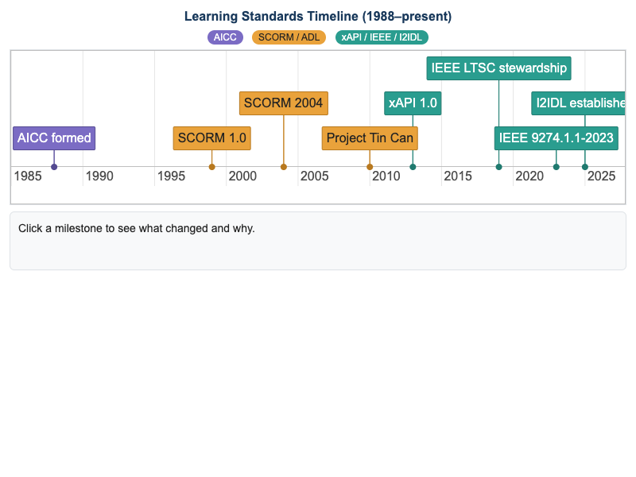

    Place SCORM, AICC, and xAPI in chronological order and see that xAPI did not replace the others overnight — it emerged from documented limitations in the SCORM/AICC model.

-   **[Accept-First Ingestion and Reconciliation Flow](./accept-first-reconciliation-flow/index.md)**

    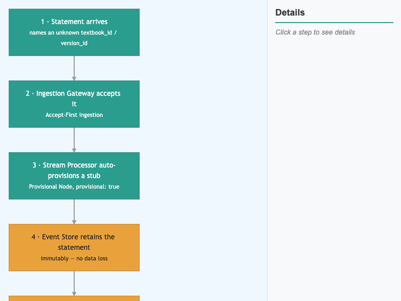

    Explain how a newly published textbook can emit statements before its metadata is registered, and sequence the four steps of Accept-First Ingestion from a statement's arrival to a Provisional Node's promotion.

-   **[Access Review and Impersonation Audit Workflow](./access-review-impersonation-workflow/index.md)**

    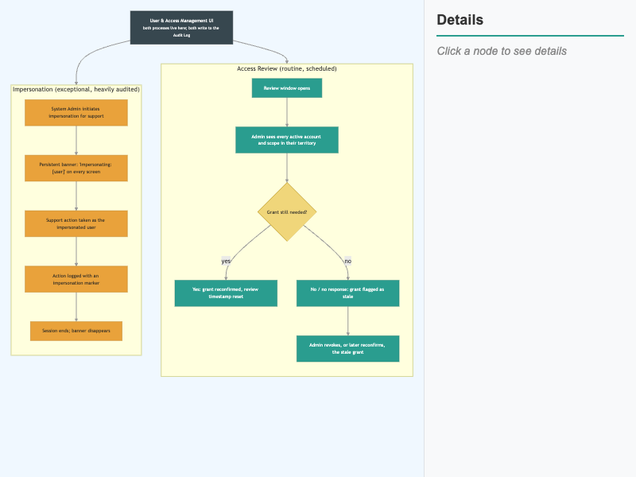

    Operate the Access Review Workflow as an administrator would, and differentiate its routine, scheduled nature from an Impersonation session's exceptional, heavily-audited one, even though both live…

-   **[Analytics Cache Key and the Privacy Filter Choke Point](./dashboard-request-cache-flow/index.md)**

    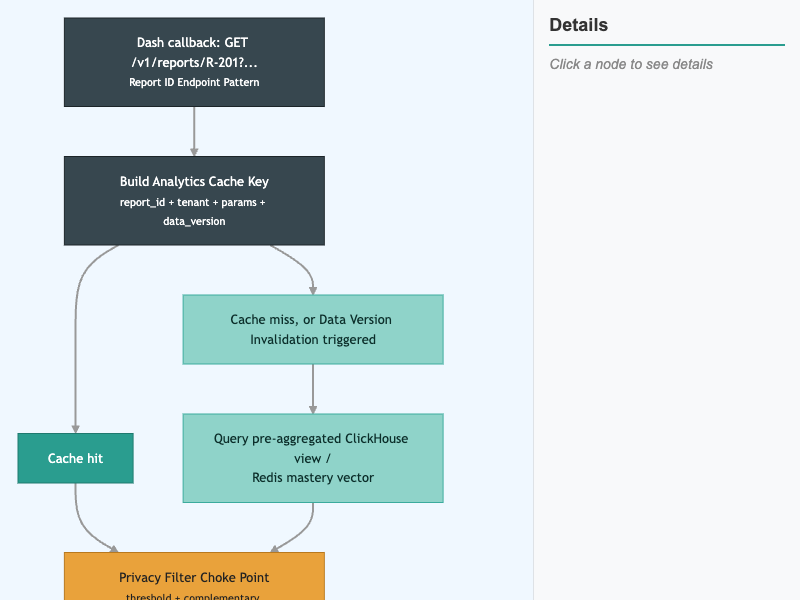

    Trace a dashboard request from its Report ID Endpoint Pattern URL through an Analytics Cache Key lookup, a Data Version Invalidation check, and the single Privacy Filter Choke Point, to a response…

-   **[Analytics Plane API Map](./analytics-plane-api-map/index.md)**

    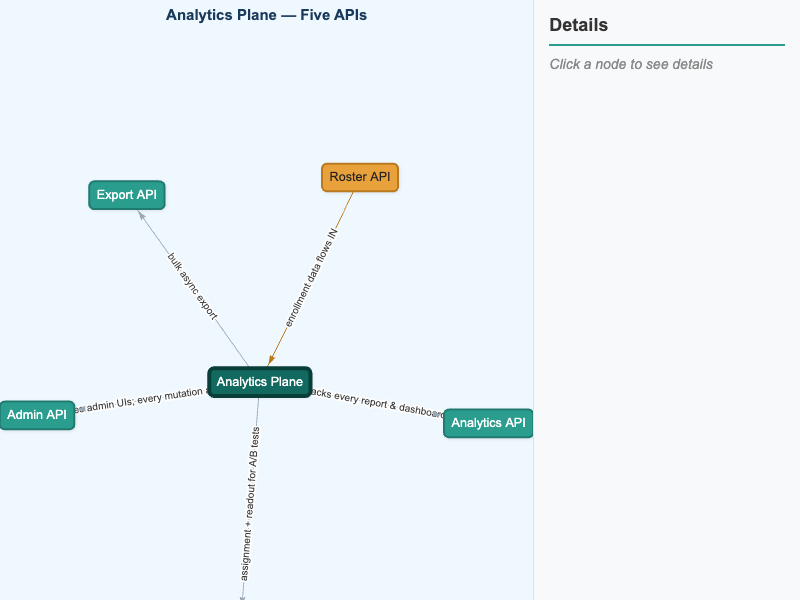

    Analyze how the five Analytics Plane APIs relate to the Analytics Plane as a whole and to their primary audiences, correctly distinguishing the four outbound, report-serving APIs from the Roster…

-   **[Anatomy of an Activity Definition](./activity-naming-and-occurrence-fields/index.md)**

    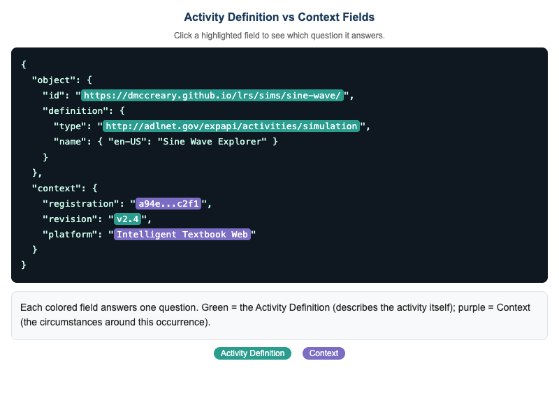

    Anatomy of an Activity Definition

-   **[Anatomy of an Experiment Definition](./experiment-definition-anatomy/index.md)**

    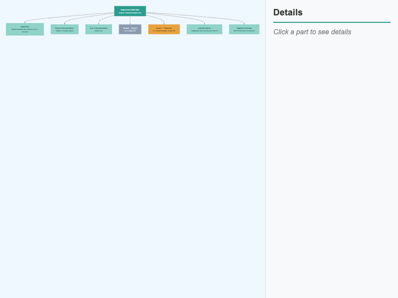

    Map the six named parts of an Experiment Definition (Experiment Hypothesis, Primary Outcome Metric, Unit Of Randomization, Experiment Variant, Allocation Weight, Guardrail Metric, Eligibility…

-   **[Anatomy of an Extended Statement](./extended-statement-anatomy/index.md)**

    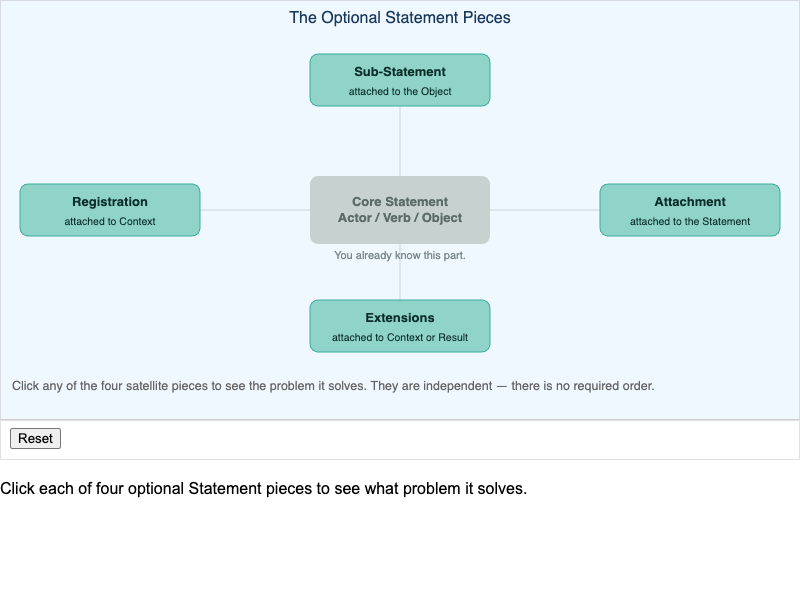

    Classify each of the four optional Statement pieces (Sub-Statement, Attachment, Extensions, Registration) by clicking on it and seeing what problem it solves, reinforcing the JSON example above with…

-   **[Anatomy of an xAPI Profile](./xapi-profile-anatomy/index.md)**

    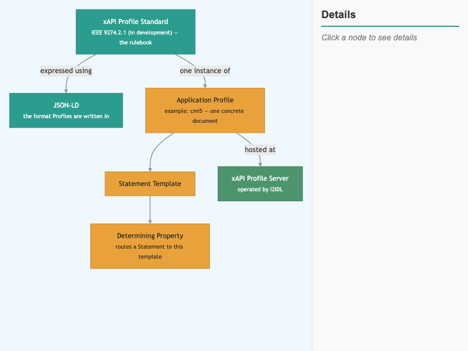

    Classify how the xAPI Profile Standard, JSON-LD, an Application Profile, a Determining Property, and the xAPI Profile Server relate to one another, distinguishing the general rulebook from one…

-   **[Animal Cell](./animal-cell/index.md)**

    

    A labeled, interactive diagram of an animal cell and its organelles for exploring cell structure.

-   **[At-Risk Roster — How the Composite Score Is Built](./at-risk-roster-composite-score/index.md)**

    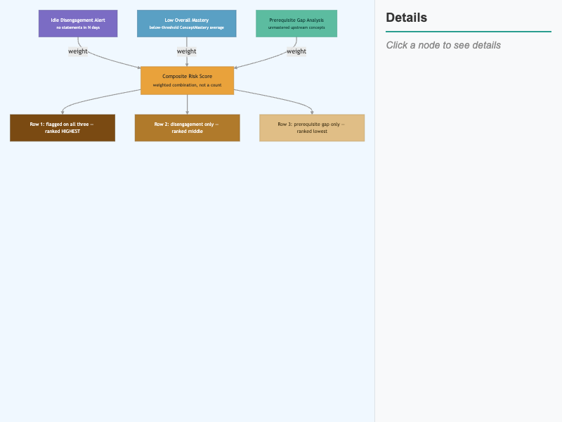

    Decompose one student's composite at-risk score into its three contributing signals (disengagement, low mastery, prerequisite gaps) and justify why a student flagged on all three ranks higher than a…

-   **[Authentication Scheme Comparison](./authentication-scheme-comparison/index.md)**

    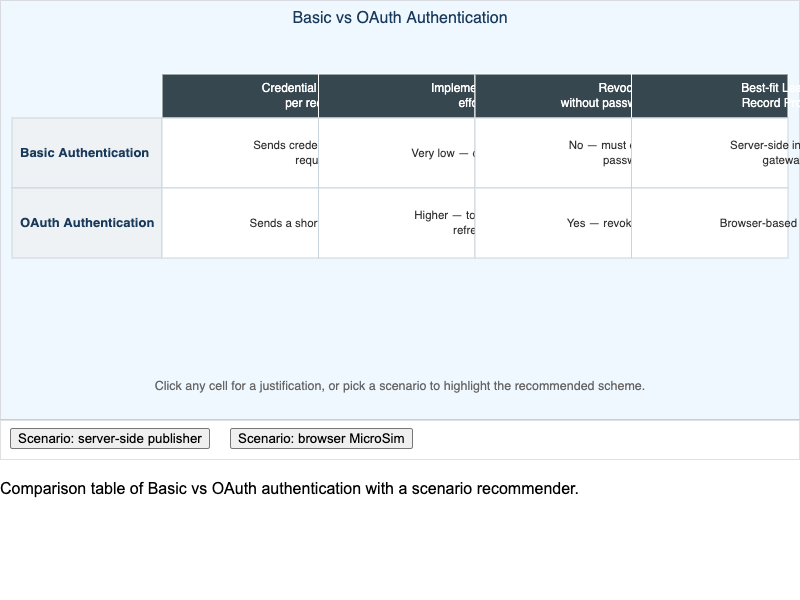

    Evaluate which authentication scheme fits a given Learning Record Provider scenario, justifying the choice against criteria introduced in the prose above.

-   **[Bouncing Ball](./bouncing-ball/index.md)**

    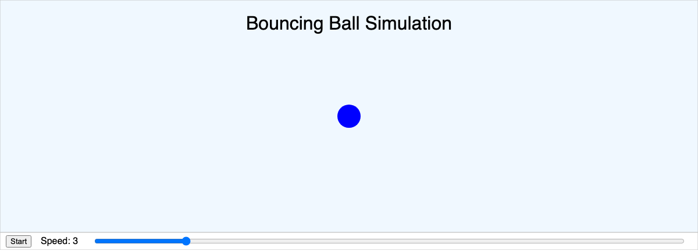

    An interactive MicroSim demonstrating motion and collision, and the reference emitter for the xAPI Start/Pause dwell pattern.

-   **[Build Steps to Development Host Tier](./build-steps-to-host-tier-timeline/index.md)**

    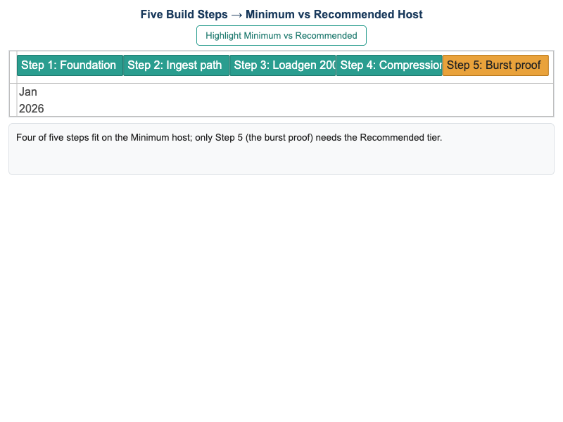

    Match each of the five MVP build steps to the minimum development host tier that can prove it, and recognize that only the final step — the burst-throughput proof — requires the Recommended tier.

-   **[Burst Insensitivity — Graph Write Rate vs. Ingest Rate](./burst-insensitivity-chart/index.md)**

    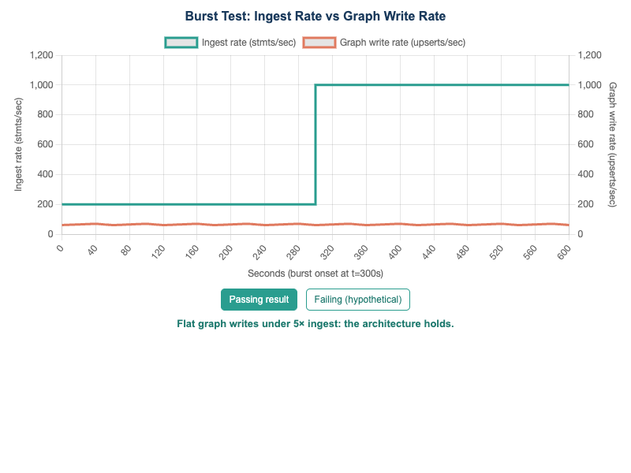

    Evaluate a burst-test result by comparing an ingest-rate line against a graph-write-rate line across a 5x load increase, and judge whether the pattern confirms or falsifies the burst insensitivity claim.

-   **[Canonical Activity IRI Anatomy](./canonical-activity-iri-anatomy/index.md)**

    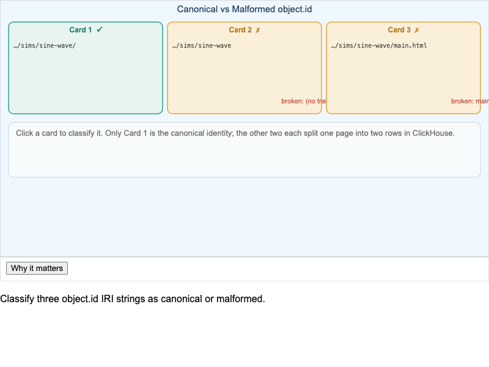

    Classify a candidate object.id string as canonical or malformed by clicking through three worked examples and seeing which rule each one satisfies or breaks.

-   **[Chaos Kill Test Simulator](./chaos-kill-test-simulator/index.md)**

    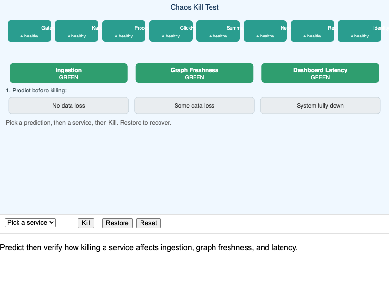

    Given a choice of which service to kill in a simulated staging environment, predict the resulting system behavior before revealing it, reinforcing this chapter's failure-mode-to-behavior mapping.

-   **[Class Mastery Heatmap for One Section](./class-mastery-heatmap/index.md)**

    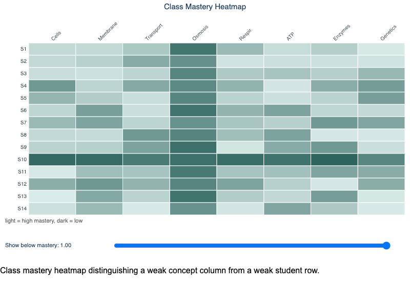

    Distinguish a concept-wide weakness (a dark column across most students) from a student-specific weakness (a dark row across most concepts) in a class mastery heatmap, and identify which pattern…

-   **[ClickHouse `lrs.statements` Table Anatomy](./clickhouse-statements-anatomy/index.md)**

    

    Click through each column group of the lrs.statements table and explain why the ORDER BY key leads with district_id and student_key rather than timestamp alone.

-   **[ClickHouse Storage Growth Over the Retention Window](./clickhouse-storage-growth/index.md)**

    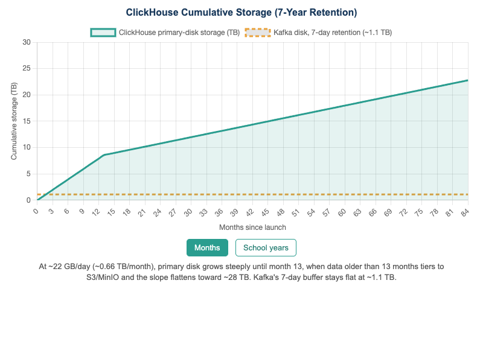

    Apply the ~22 GB/day ClickHouse ingest figure to project cumulative storage across a seven-year retention window, and observe where the tiering policy changes the growth curve's slope.

-   **[cmi5 Launch Sequence](./cmi5-launch-sequence/index.md)**

    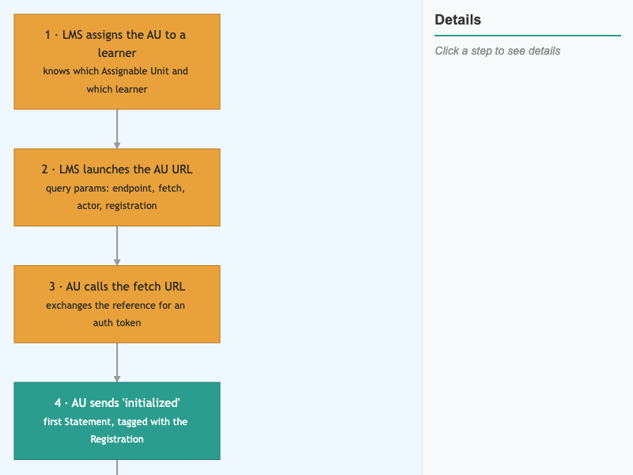

    Apply their understanding of the cmi5 Launch Method by tracing a full launch sequence from LMS assignment through the Assignable Unit's xAPI Statements, predicting which Launch Method parameter…

-   **[Complementary Suppression Attack](./complementary-suppression-attack/index.md)**

    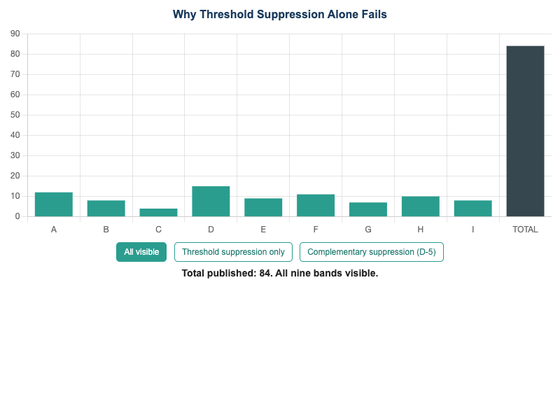

    Demonstrate how a single suppressed small-group value in a published table can be recovered by subtraction from the row's published total, and justify why complementary suppression — hiding a second,…

-   **[Compose Startup Dependency Graph](./compose-startup-dependency-graph/index.md)**

    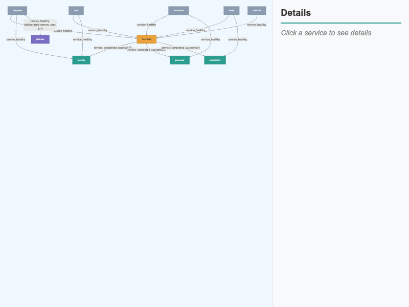

    Trace which services gate which other services at startup, and explain why the gateway's dependency list is deliberately narrower than every other application role's.

-   **[Concept Mastery Radar for One Student](./concept-mastery-radar/index.md)**

    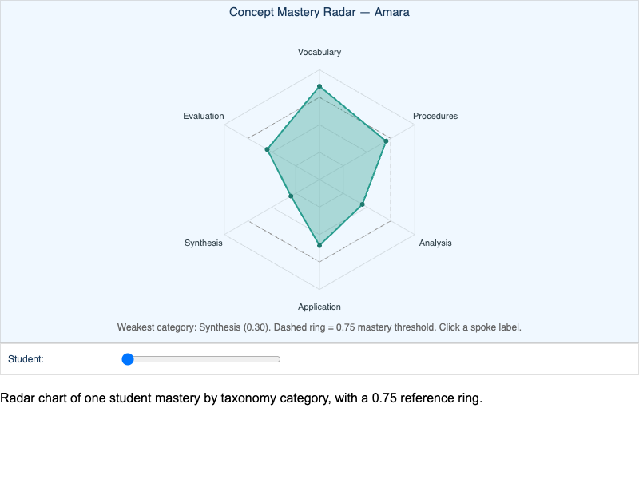

    Interpret a radar chart of one student's Bayesian Knowledge Tracing mastery scores grouped by taxonomy category, identifying the category where that student is weakest.

-   **[Concept-Coverage Gaps Overlaid on the Learning Graph](./concept-coverage-gaps-overlay/index.md)**

    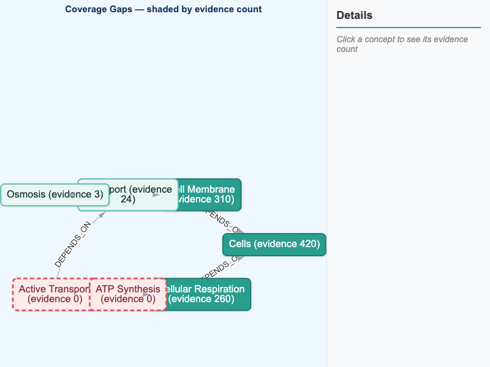

    Identify which concepts in a dependency graph have little or no engagement evidence behind them, and distinguish a coverage gap (no content or no engagement) from a mastery gap (content exists but…

-   **[Config and Secrets Flow](./config-secrets-flow/index.md)**

    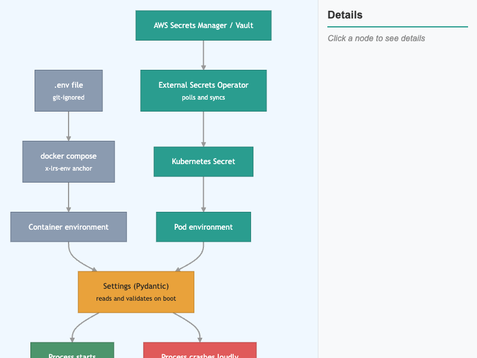

    Trace a configuration value from its source (a dev .env file, or AWS Secrets Manager in production) to the running process's Settings object, and explain why the application code never needs to know…

-   **[Cross-District Benchmark — Applying the Privacy Aggregation Threshold](./cross-district-benchmark-privacy-threshold/index.md)**

    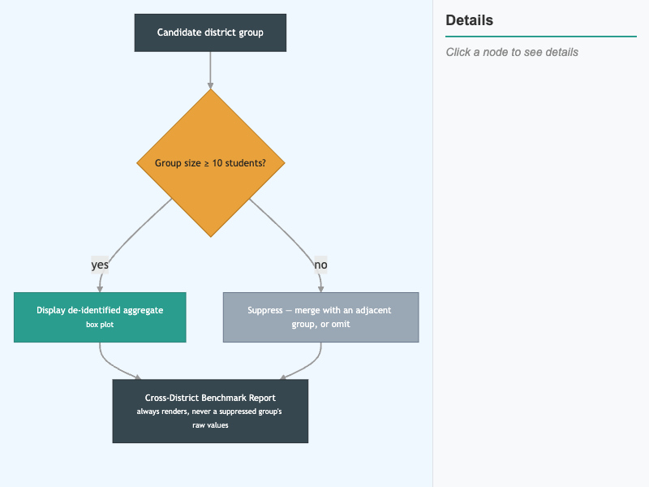

    Apply the aggregation-threshold rule to determine whether a cross-district comparison may be displayed to an author, given a set of candidate district groupings of varying size.

-   **[Cross-Persona Workflow](./cross-persona-workflow/index.md)**

    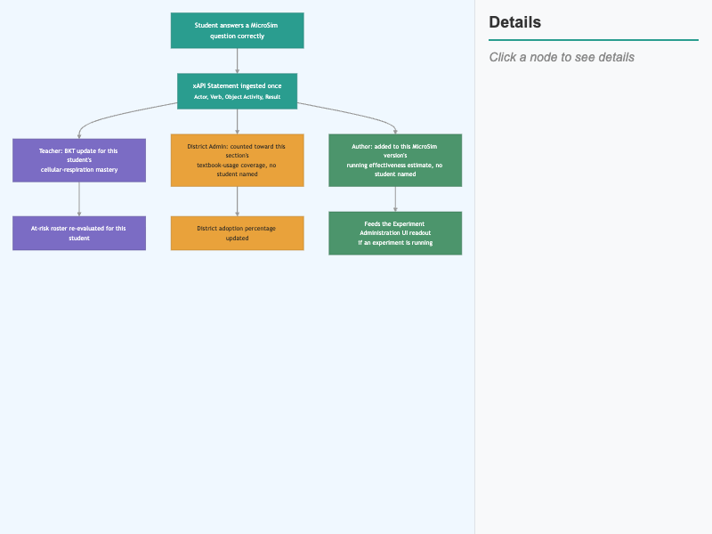

    Trace one ingested xAPI Statement through three independent, simultaneously-updated aggregations, and analyze why no persona's view requires a separate data pipeline from the others.

-   **[DAG Viewer](./dag-viewer/index.md)**

    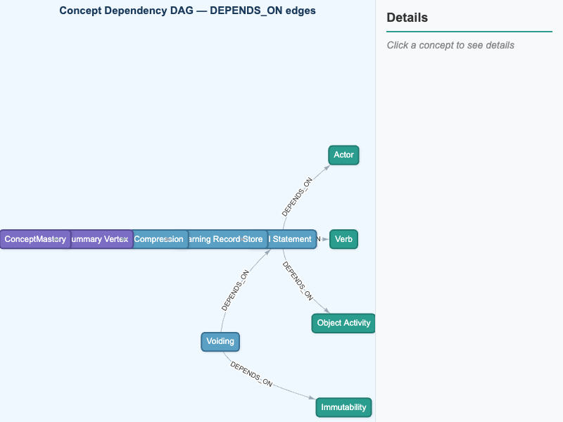

    DAG Viewer

-   **[Dashboard Layout Builder](./dashboard-patterns/index.md)**

    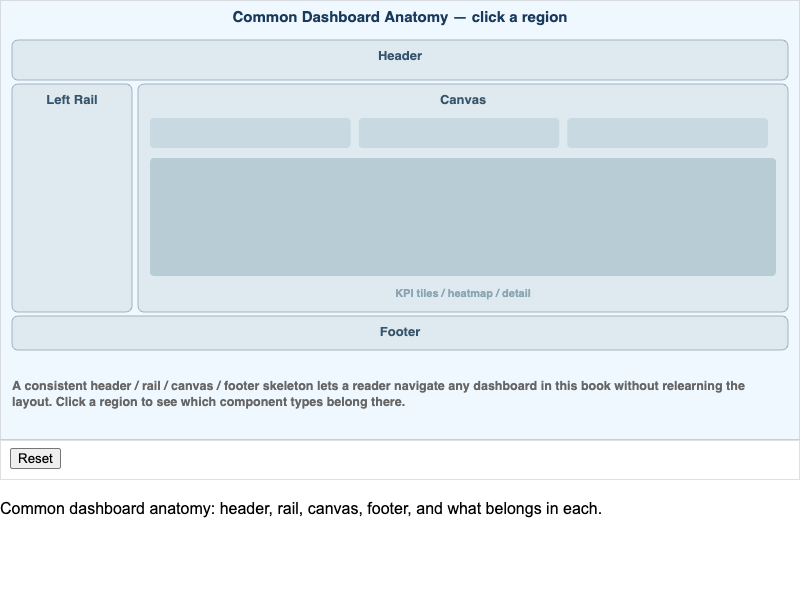

    Dashboard Layout Builder

-   **[Delivery Roadmap Timeline](./delivery-roadmap-m0-to-m5-timeline/index.md)**

    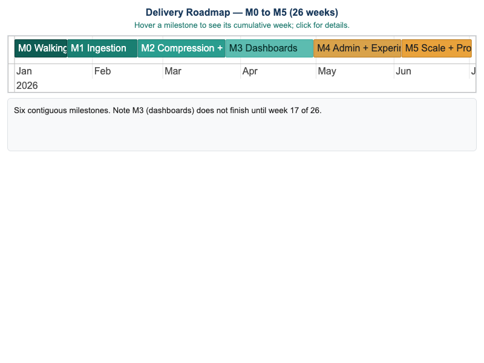

    Sequence the six delivery milestones by duration and cumulative week number, and recall each milestone's headline deliverable and exit criterion.

-   **[Deterministic Bucketing and the Ramping Rule](./experiment-bucketing-ramp/index.md)**

    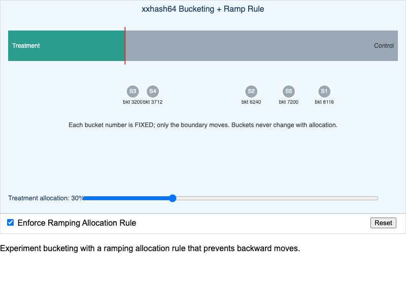

    Manipulate an experiment's allocation percentage and observe that xxhash64 Bucketing keeps every student's bucket number fixed while only the Bucket To Variant Map's boundary moves, and that the…

-   **[Deterministic Sticky Assignment and District Opt-Out](./sticky-assignment-and-opt-out/index.md)**

    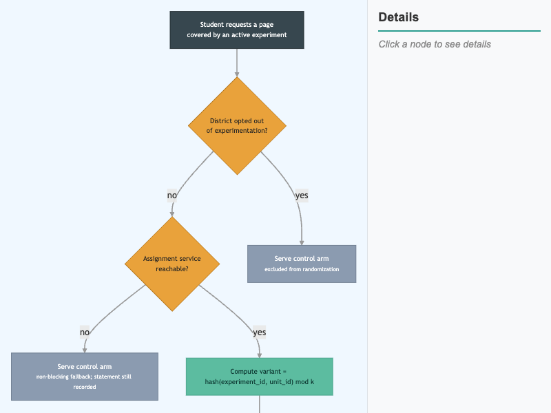

    Trace a single student's request through the eligibility check, the hash-based assignment formula, and the non-blocking fallback path, applying the deterministic sticky assignment rule to a concrete decision.

-   **[District Management UI Mock Dashboard](./district-management-ui-mockup/index.md)**

    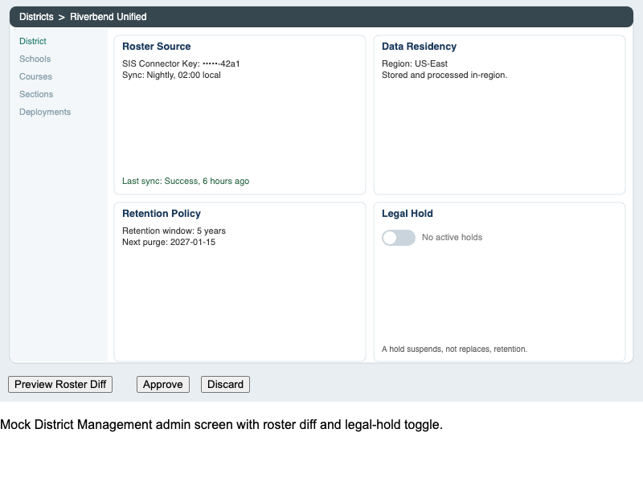

    Operate a realistic mock-up of the District Management UI, locating each of the four fields this section explains — Roster Source Configuration, Data Residency Policy, Retention Policy, and Legal…

-   **[District Overview vs. System Health — Two Lenses on One Log](./two-dashboards-one-log/index.md)**

    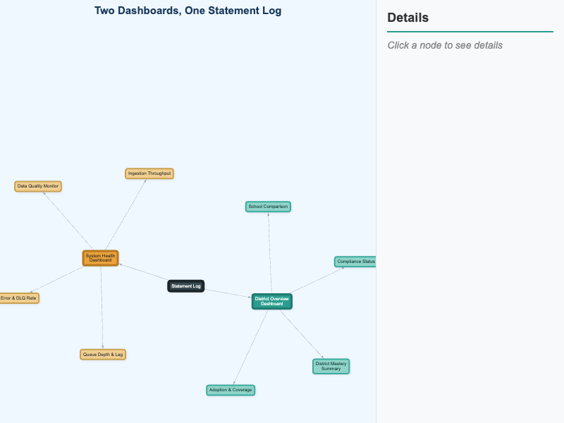

    Classify each of the eight reports under the dashboard it belongs to, and see that both dashboards read from the same underlying statement log rather than separate data sources.

-   **[District Tenancy Hierarchy Explorer](./district-tenancy-hierarchy-explorer/index.md)**

    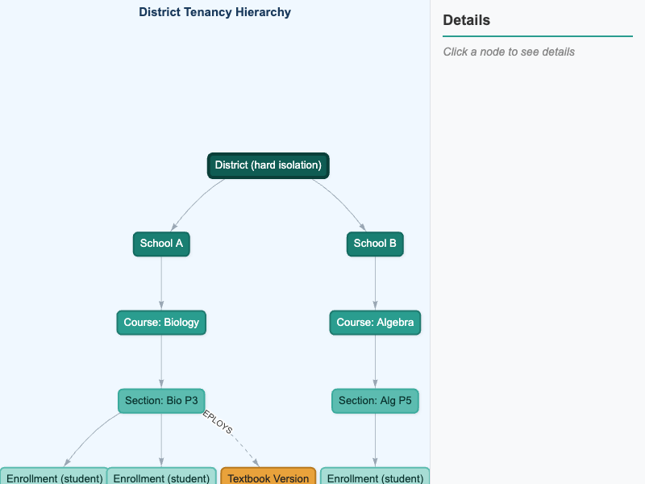

    Identify the nested tenancy hierarchy a District Administrator operates within — District, School, Course, Section, Enrollment — and distinguish the hard isolation boundary at the district level from…

-   **[District-Keyed versus Composite-Keyed Partitioning](./district-vs-composite-partition-key/index.md)**

    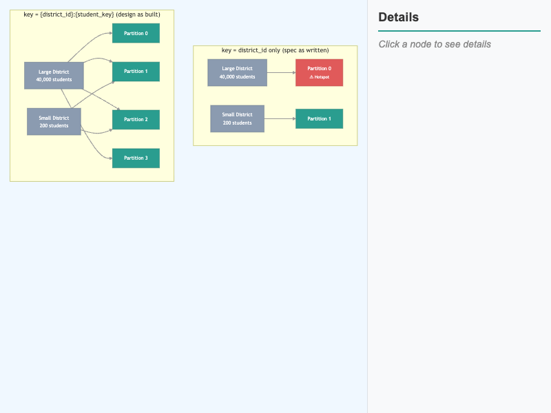

    Compare a Kafka queue partitioned by `district_id` alone against one keyed by `{district_id}:{student_key}`, and explain why the composite key avoids a write hotspot while still preserving the…

-   **[Expand-Contract Step Sequencer](./expand-contract-step-sequencer/index.md)**

    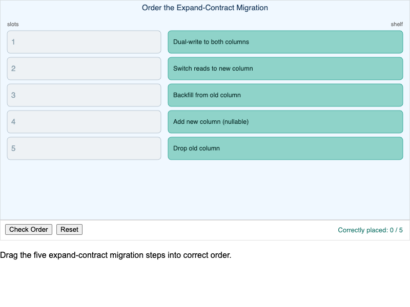

    Given the five steps of an Expand Contract Migration in scrambled order, arrange them into the correct sequence and identify which steps can ship independently.

-   **[Four Functions at the System's Edges](./functions-at-the-edges/index.md)**

    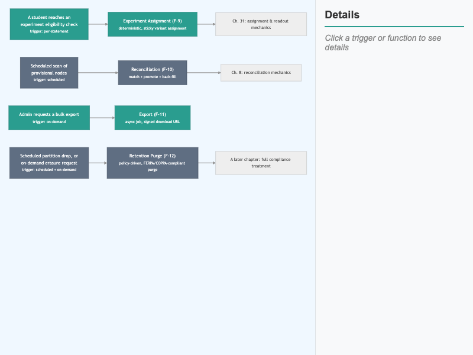

    Explain what triggers each of the four functions that run off the main statement pipeline — Experiment Assignment, Reconciliation, Export, and Retention Purge — and classify each by whether its…

-   **[From Compressed Evidence to Graph Edges](./compressed-evidence-graph-edges/index.md)**

    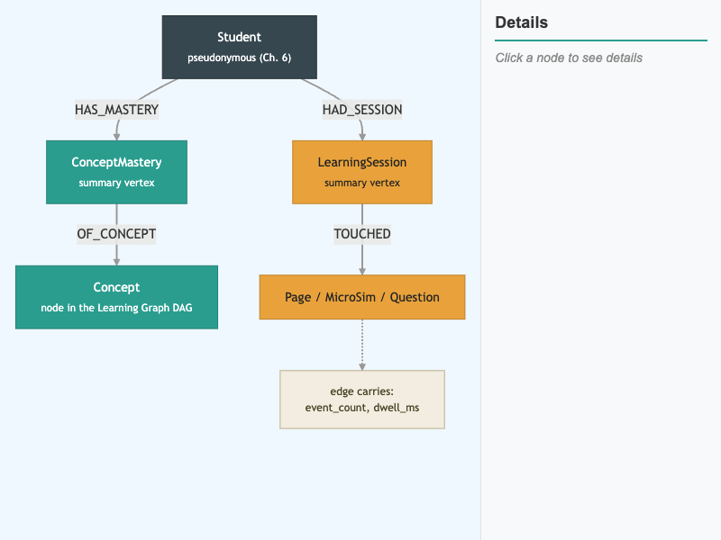

    Trace how a Student node connects to compressed summary vertices through the Has Mastery, Of Concept, and Touched relationships, and explain what question each edge answers, without needing the…

-   **[From Gateway to Event Store — the Ingestion and Processing Pipeline](./ingestion-processing-storage-pipeline/index.md)**

    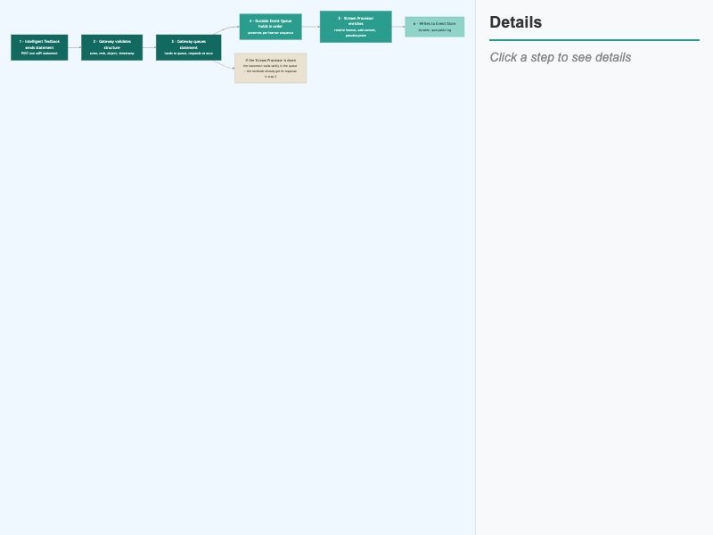

    Trace one xAPI statement's path from an intelligent textbook through the Ingestion Gateway, the Durable Event Queue, and the Stream Processor, into the Event Store, and predict which steps can…

-   **[From Login to RBAC-Checked Action](./sso-rbac-login-flow/index.md)**

    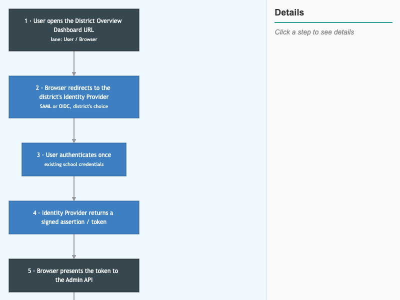

    Trace a single login from browser to RBAC-checked action across four lanes, distinguishing the identity-proving job (SSO via SAML or OIDC) from the authorization-granting job (RBAC).

-   **[From Raw Evidence to Soft Correctness](./bkt-soft-correctness-mapping/index.md)**

    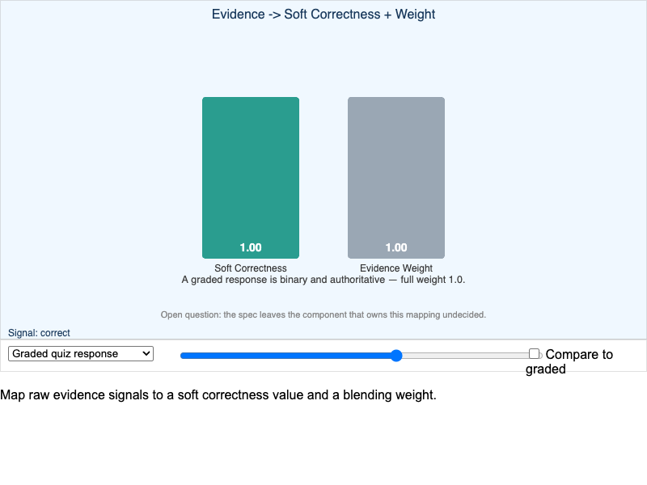

    Evaluate how different raw evidence signals (a graded quiz answer, dwell time on a page, MicroSim interaction depth) map to a soft correctness value and a blending weight, and differentiate why…

-   **[From Student Information System to Enrollment](./roster-ingestion-workflow/index.md)**

    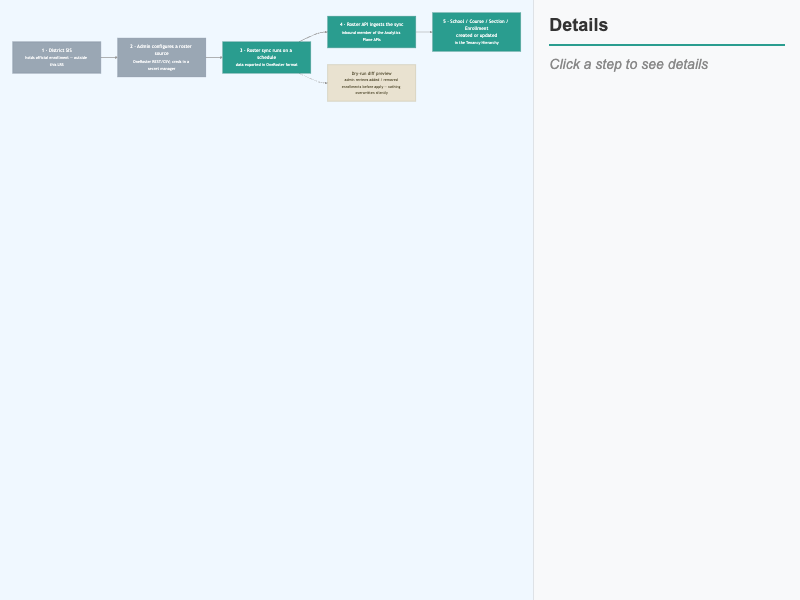

    Trace how roster data travels from a district's Student Information System, through the OneRoster standard and the Roster API, into School, Course, Section, and Enrollment structure inside this LRS.

-   **[From Walking Skeleton to Scaled Production](./production-delivery-roadmap/index.md)**

    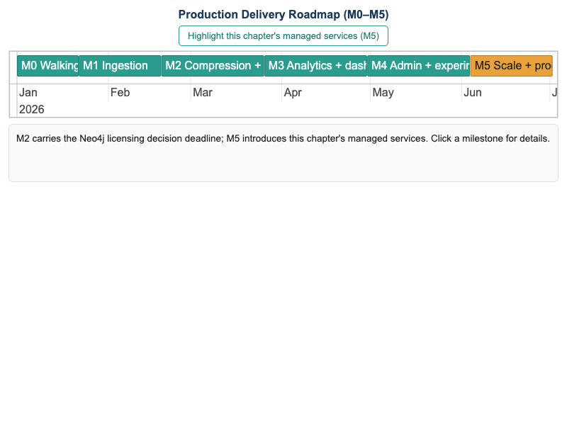

    Sequence the design document's delivery milestones from a walking skeleton through scaled production, and identify which milestone introduces each managed service covered in this chapter.

-   **[Gateway Request Pipeline](./gateway-request-pipeline/index.md)**

    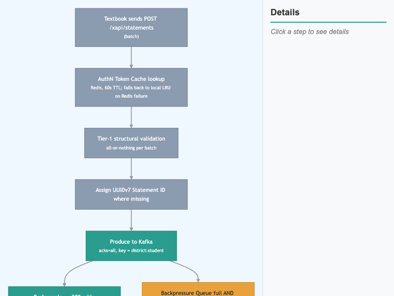

    Trace one xAPI statement batch through the gateway's five-step request path — token cache lookup, structural validation, statement ID assignment, durable-queue produce with acks=all, and response —…

-   **[Gateway-First Deploy and Rollback Order](./gateway-first-deploy-rollback/index.md)**

    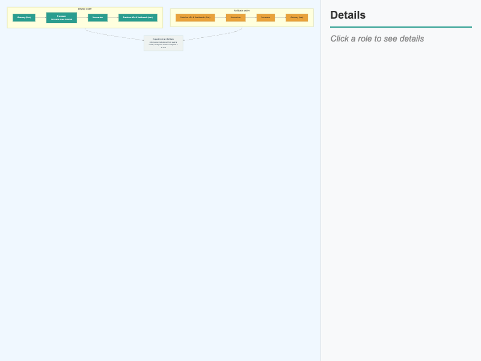

    Trace the deploy order and the reverse rollback order across the gateway, processors, and stateless roles, and explain why the gateway sits at both ends of the sequence.

-   **[Grain Constraints and the Statement Label Prohibition](./grain-constraint-enforcement/index.md)**

    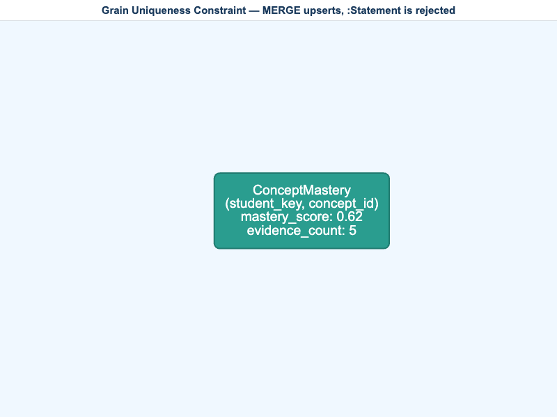

    Simulate a summarizer write attempt against a Grain Uniqueness Constraint and observe why a second write for the same grain upserts rather than duplicates, then contrast that outcome with a…

-   **[Graph Write Rate vs. Compression Sync Cadence](./write-rate-vs-sync-cadence/index.md)**

    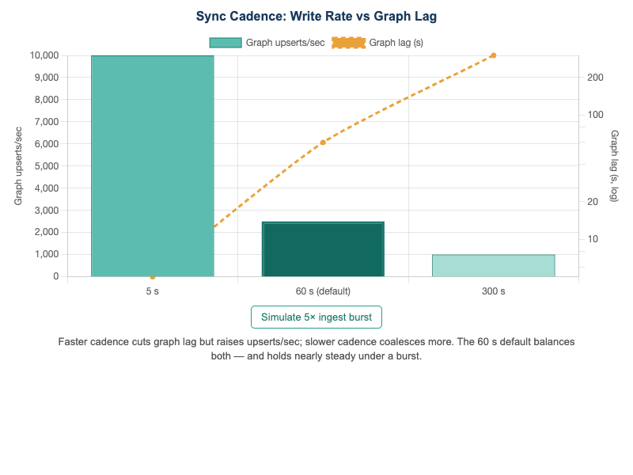

    Evaluate the tradeoff between sync cadence, graph write rate, and graph lag in Change-Driven Materialization, and predict how each candidate cadence would behave during an ingestion burst.

-   **[How Concept Mastery Rolls Up to a Section](./section-rollup-aggregation/index.md)**

    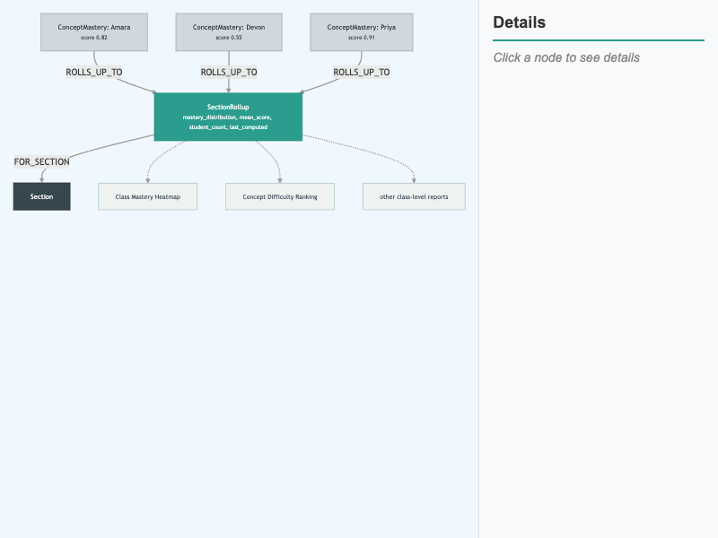

    Explain how many students' individual ConceptMastery vertices aggregate, through a ROLLS_UP_TO edge, into one SectionRollup vertex per concept, which the ten class-level reports in this chapter all read from.

-   **[How Eight Content Reports Read Four Summary Vertices](./content-insights-pipeline-flow/index.md)**

    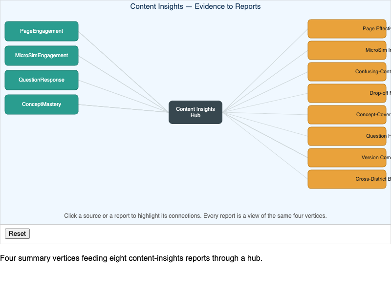

    Explain how the four summary vertices already introduced in this book (PageEngagement, MicroSimEngagement, QuestionResponse, ConceptMastery) feed into the eight Content Insights reports, so the…

-   **[HPA vs. KEDA — Two Autoscalers React to a Burst](./hpa-vs-keda-burst-response/index.md)**

    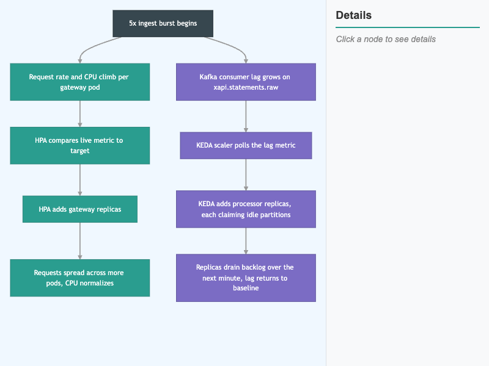

    Differentiate between CPU/RPS-driven autoscaling (HPA on the gateway) and consumer-lag-driven autoscaling (KEDA on the processor), and trace how each responds to the same 5x ingest burst.

-   **[Image Supply Chain Pipeline](./image-supply-chain-pipeline/index.md)**

    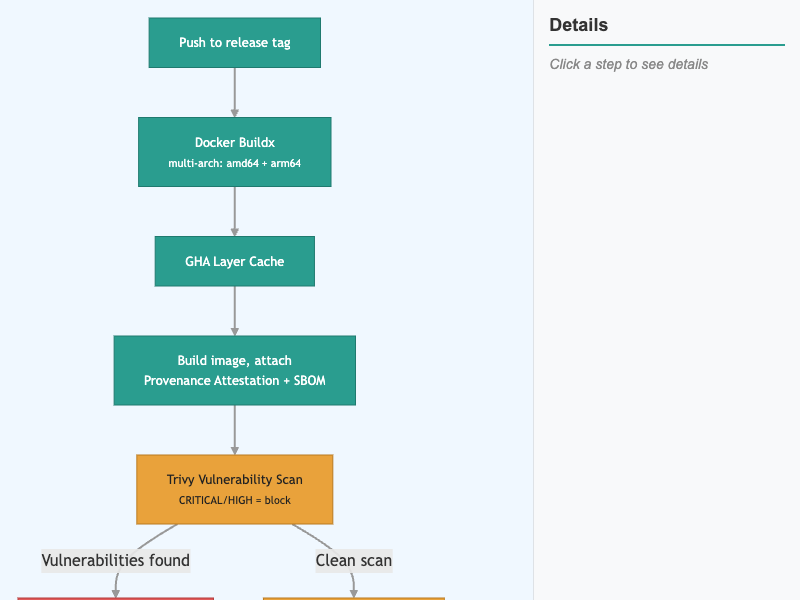

    Trace a single image from a release-tag push through build, cache, provenance/SBOM generation, vulnerability scanning, and signing, and explain why a deployment must reference the resulting digest…

-   **[Kafka Topic Map for the LRS Event Backbone](./kafka-topic-map/index.md)**

    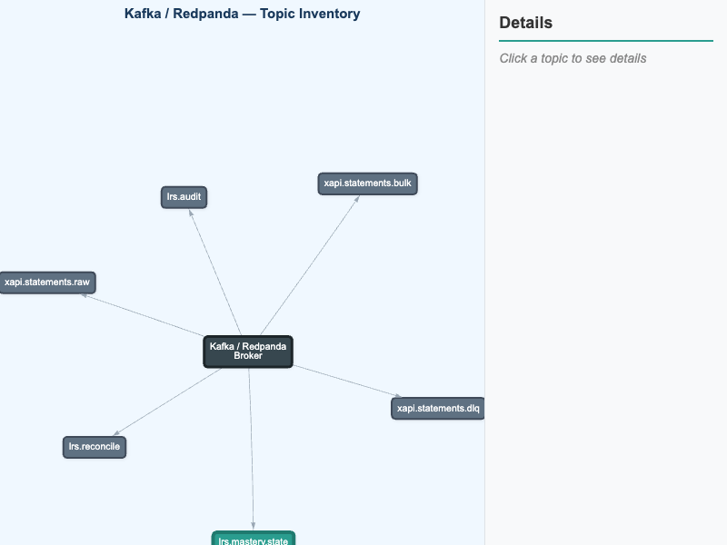

    Classify each of the six Kafka topics by its key format, partition count, and retention policy, and explain why the compacted mastery-state topic differs structurally from the other five.

-   **[Learning Ecosystem Map](./learning-ecosystem-map/index.md)**

    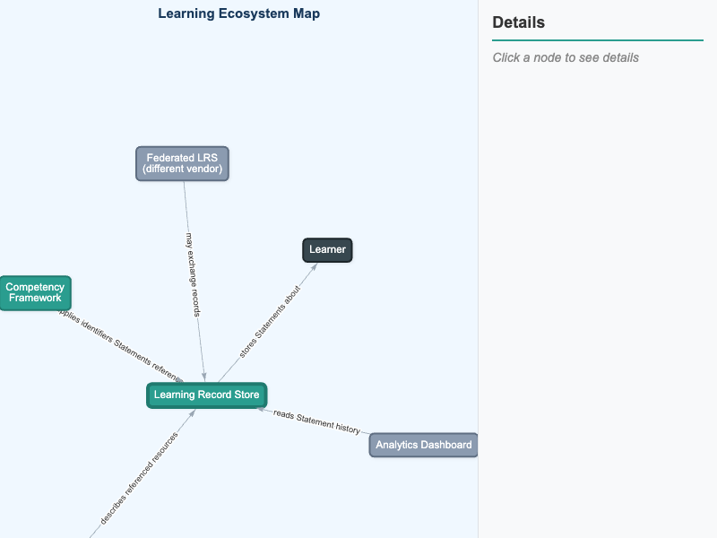

    Analyze how a Learning Record Store, a Competency Framework, a content repository, and analytics tools interoperate within a Learning Ecosystem, in a general, vendor-neutral form that generalizes…

-   **[Learning Graph Viewer](./graph-viewer/index.md)**

    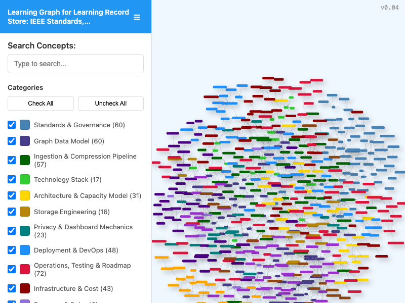

    An interactive vis-network viewer for the course's concept dependency graph, with search, category filtering, zoom, and live node/edge counts.

-   **[LMS-Centric versus LRS-Centric Architecture](./lms-vs-lrs-architecture/index.md)**

    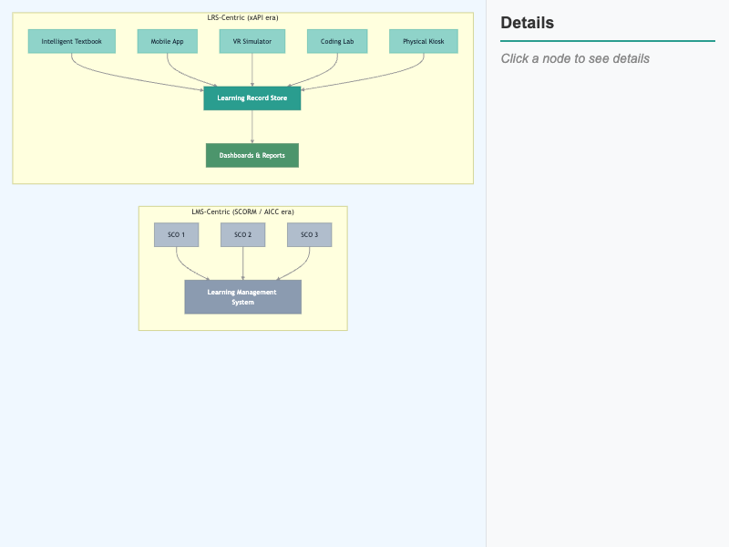

    Compare a single-hub LMS-centric architecture against a hub-and-spoke LRS-centric architecture, and see structurally why the second scales to many kinds of Learning Record Providers while the first does not.

-   **[LRS Graph Data Model Explorer](./lrs-data-model/index.md)**

    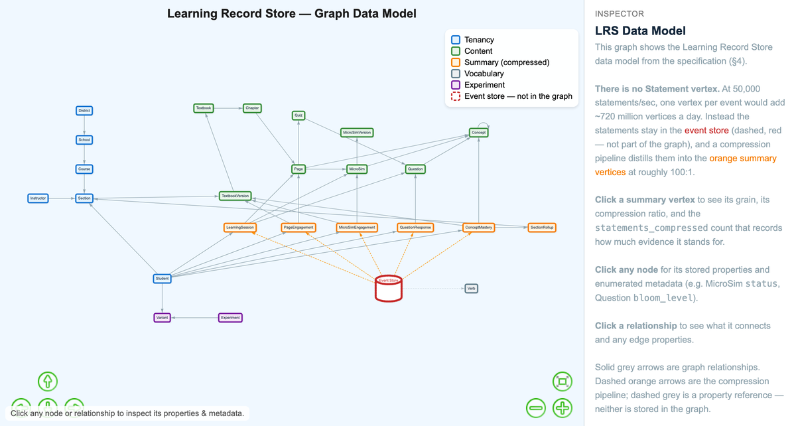

    Interactive vis-network diagram of the Learning Record Store graph data model. Click any node label or relationship to see its properties and enumerated metadata.

-   **[Makefile Target Command Explorer](./makefile-target-explorer/index.md)**

    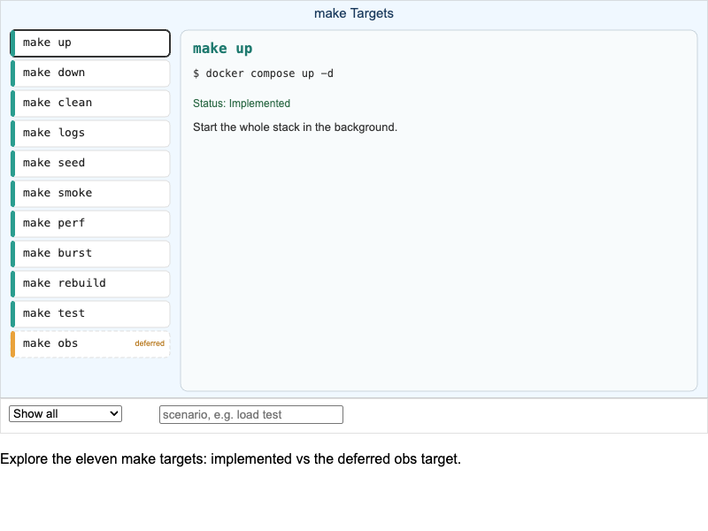

    Given a development scenario, select the correct make target, distinguish implemented targets from the deferred obs target, and identify the underlying docker compose (or script) command each one expands to.

-   **[Materialized Views to Summary Vertex Mapping](./mv-to-vertex-mapping/index.md)**

    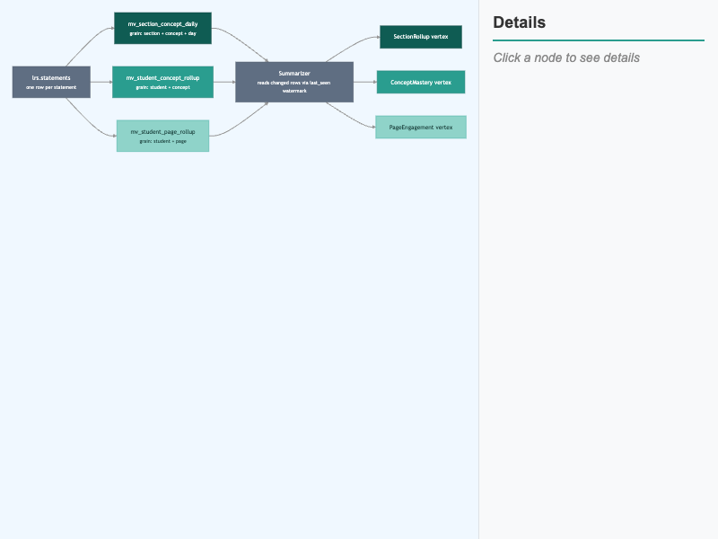

    Trace raw rows in lrs.statements through each of the three materialized views to the specific Neo4j summary vertex label each view feeds, and differentiate the aggregation grain of each path.

-   **[MicroSim Evidence to BKT Mapping Gap](./microsim-bkt-mapping-gap-workflow/index.md)**

    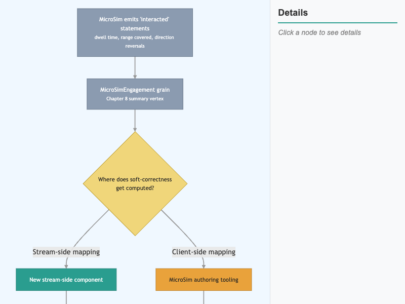

    Trace two candidate designs for turning raw MicroSim interaction facts into a soft-correctness value that feeds a concept's Bayesian Knowledge Tracing update, and critique the trade-off each one makes.

-   **[MicroSim Impact — Observational Delta vs. a Controlled Effect](./microsim-impact-observational-vs-controlled/index.md)**

    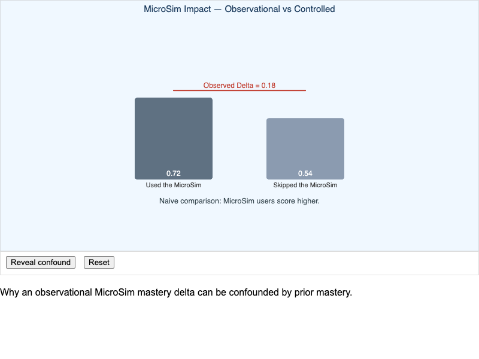

    Evaluate why an observational mastery delta between MicroSim users and non-users can be confounded by a hidden third factor, and justify why only a controlled experiment can support a causal claim…

-   **[My Classes to Student Detail — One Click, Nine Reports](./my-classes-student-detail-drilldown/index.md)**

    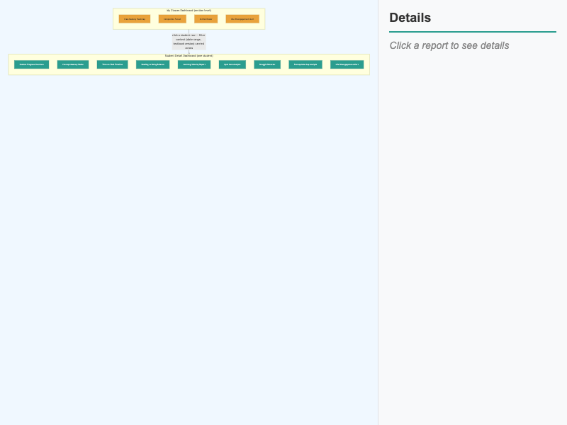

    Explain how a teacher moves from a section-level roster on My Classes to a single student's nine-report Student Detail view, carrying filter context (the selected date range and textbook version)…

-   **[Naive vs. Compressed Graph Write Rate](./naive-vs-compressed-graph-write-rate/index.md)**

    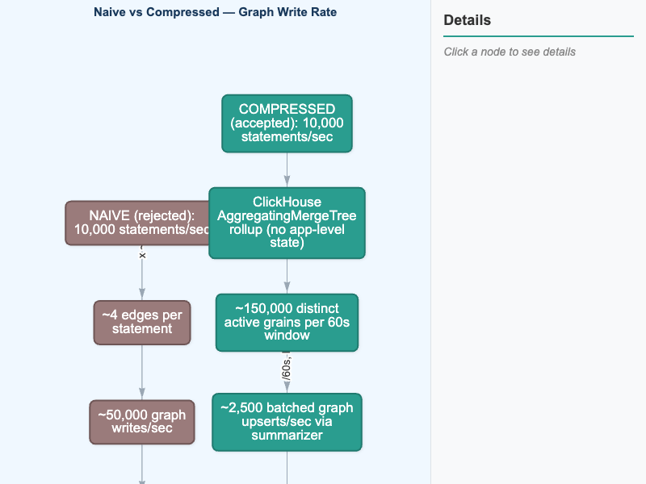

    Compare the naive per-statement graph write rate against the compressed summarizer write rate side by side, and attribute the ~20x reduction to the specific mechanism (ADR-001/ADR-002) that produces it.

-   **[Neo4j's Production Path — Community, Enterprise, AuraDB, or an Alternative](./neo4j-licensing-decision-tree/index.md)**

    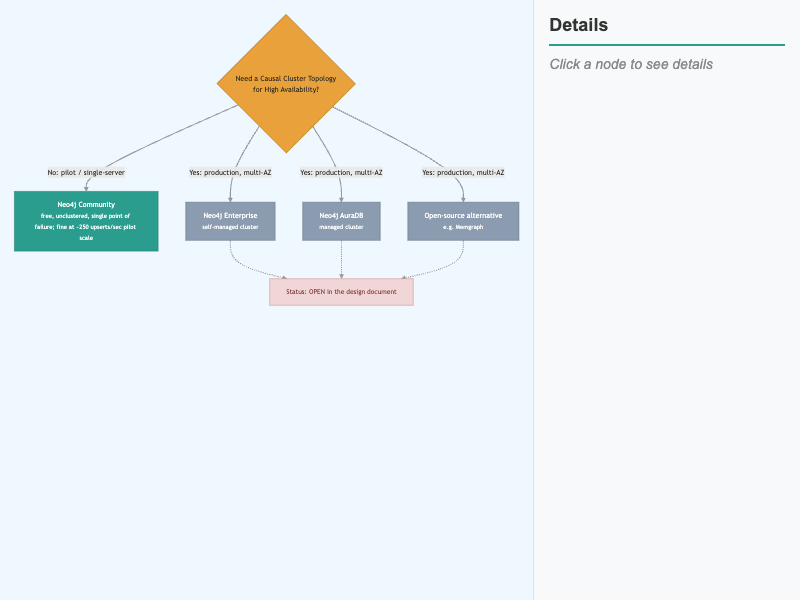

    Evaluate why Neo4j Community's lack of clustering forces a production choice between Enterprise, AuraDB, and an open-source alternative, and judge each option against cost and high-availability requirements.

-   **[One Statement, Three Ways to Touch the Record](./statement-storage-retrieval-voiding-flow/index.md)**

    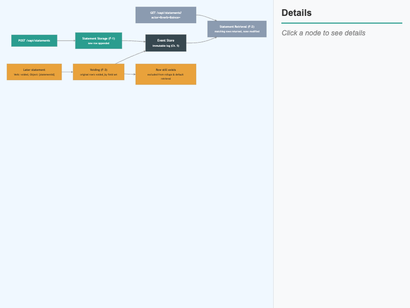

    Distinguish the Statement Storage Function, the Statement Retrieval Function, and the Voiding Function as three separate operations against one shared Event Store, and trace how a voided statement is…

-   **[One Student's Time-on-Task Timeline](./time-on-task-timeline/index.md)**

    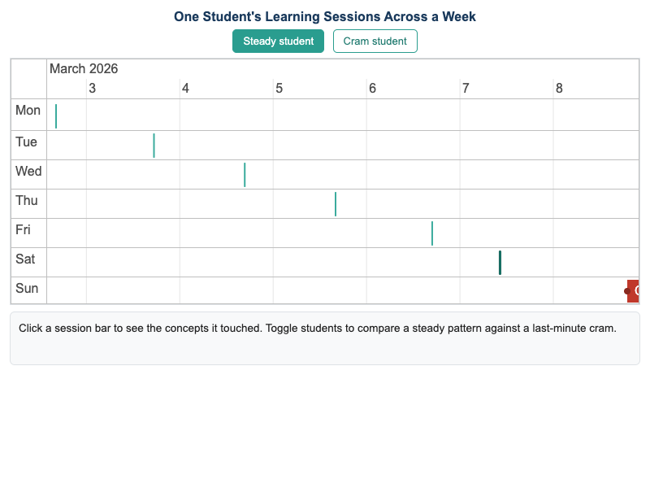

    Interpret a Gantt-style timeline of one student's learning sessions across a week, distinguishing a steady engagement pattern from a single last-minute cram session.

-   **[PID 1 Signal Handling — Exec Form versus Shell Form](./pid1-signal-handling-comparison/index.md)**

    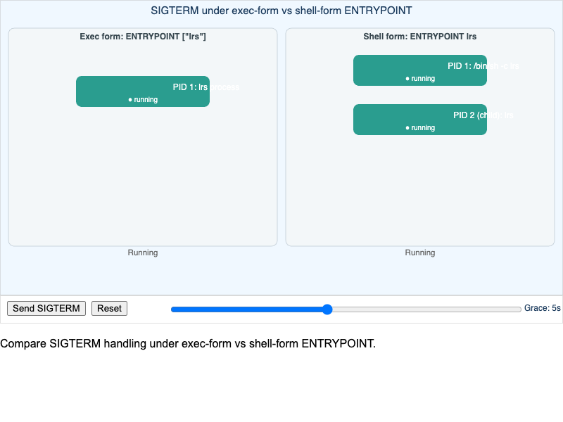

    Given a simulated SIGTERM, compare how the signal propagates under exec-form versus shell-form ENTRYPOINT, and predict whether in-flight work finishes cleanly or is killed.

-   **[Poison Message Retry and Dead-Letter Queue Workflow](./poison-message-dlq-retry-workflow/index.md)**

    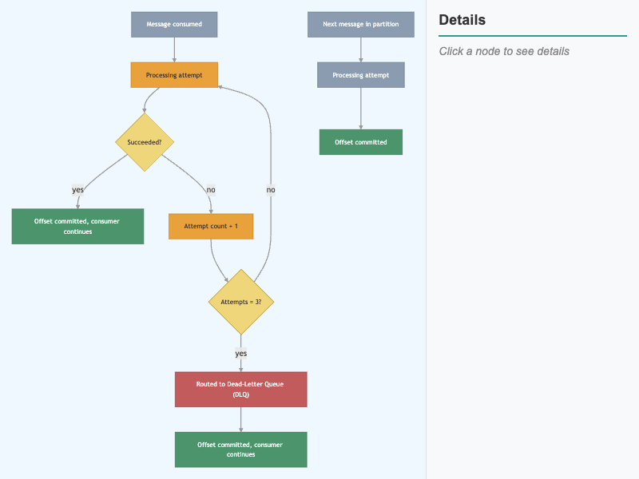

    Trace a single malformed statement through three consumption attempts and its landing in the dead-letter queue, and explain why the consumer keeps processing other messages throughout.

-   **[Prerequisite Gap Analysis — Walking Upstream From a Weak Concept](./concept-dependencies/index.md)**

    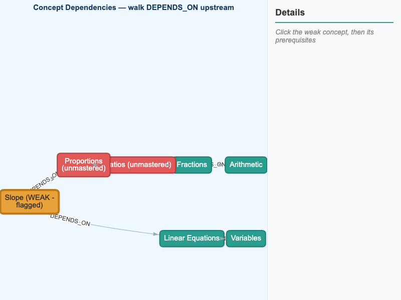

    Prerequisite Gap Analysis — Walking Upstream From a Weak Concept

-   **[Privacy Access Audit Explorer](./privacy-access-audit-explorer/index.md)**

    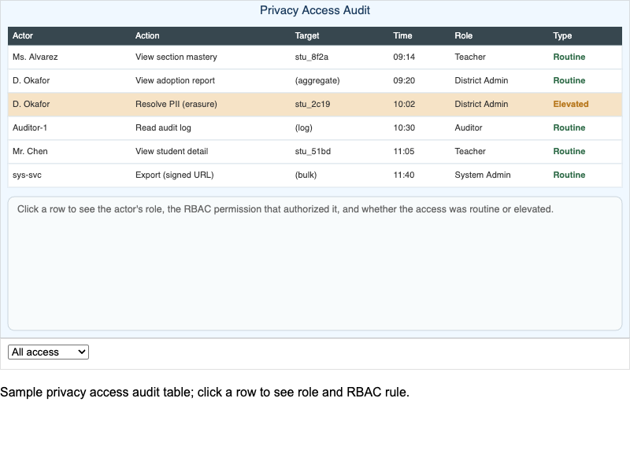

    Analyze a sample Privacy Access Audit table by clicking a row to reveal the actor's role, the RBAC rule that granted the access, and whether the access was routine or elevated (e.g., a data-subject…

-   **[Privacy and Compliance UI Mockup](./privacy-compliance-ui-mockup/index.md)**

    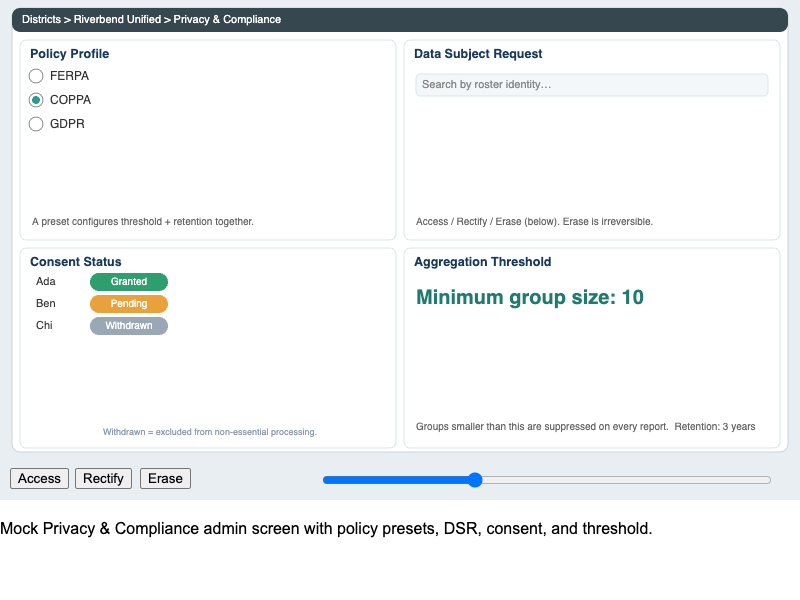

    Operate a realistic mock-up of the Privacy & Compliance UI, locating each of the four fields this section explains — Policy Profile Preset, Data Subject Request, Consent Status, and Aggregation…

-   **[Processor Batch Loop — Dedup, Score, and Replay](./processor-batch-dedup-replay/index.md)**

    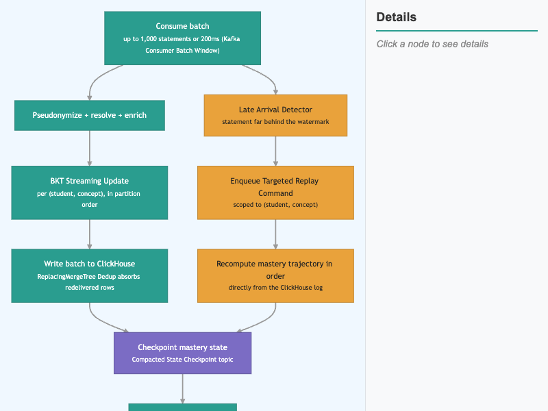

    Trace a batch of statements through the processor's Kafka Consumer Batch Window, ReplacingMergeTree Dedup, and BKT Streaming Update, then differentiate the ordinary redelivery path from the…

-   **[Production Monthly Cost Breakdown](./production-monthly-cost-breakdown/index.md)**

    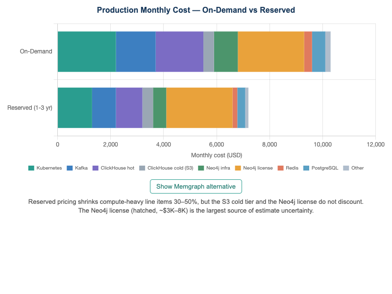

    Break down the production system's monthly cost into its component line items, and compare the on-demand total against the reserved-pricing total to see which line items are fixed and which shrink…

-   **[Provisional Reconcile Queue Workflow](./provisional-reconcile-queue-workflow/index.md)**

    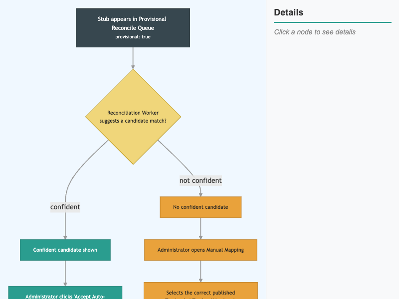

    Operate the Provisional Reconcile Queue as a District Administrator would — reviewing a queued entry, choosing between one-click accept and manual mapping — and connect that screen-level action to…

-   **[Pseudonymization Pipeline](./pseudonymization-pipeline/index.md)**

    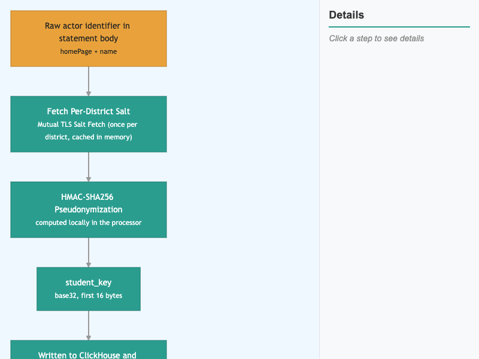

    Trace how a raw actor identifier becomes an irreversible `student_key`, following the hop from the statement body through the Mutual TLS Salt Fetch and the HMAC-SHA256 Pseudonymization computation to…

-   **[Reading the Experiment Readout Dashboard](./experiment-readout-dashboard-mockup/index.md)**

    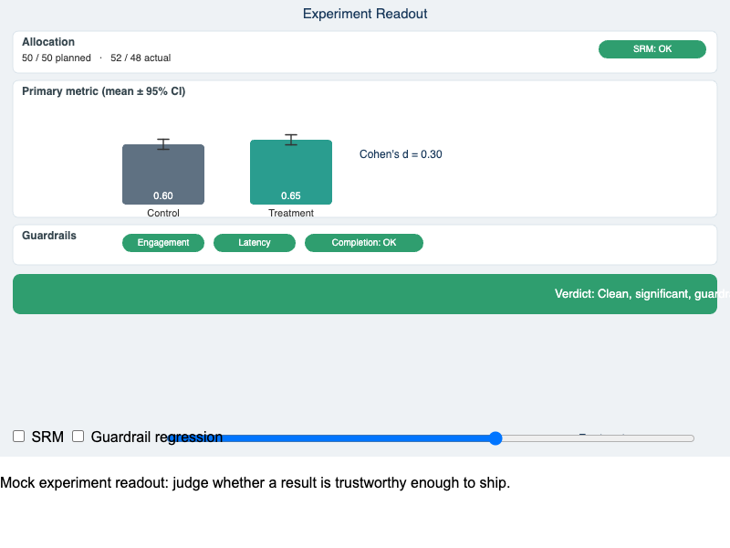

    Practice judging, from a single mocked-up readout, whether an experiment's result is trustworthy enough to act on — weighing effect size, confidence interval width, sample-ratio mismatch status, and…

-   **[Rebuild Time by Scenario and Cache State](./build-cache-rebuild-times/index.md)**

    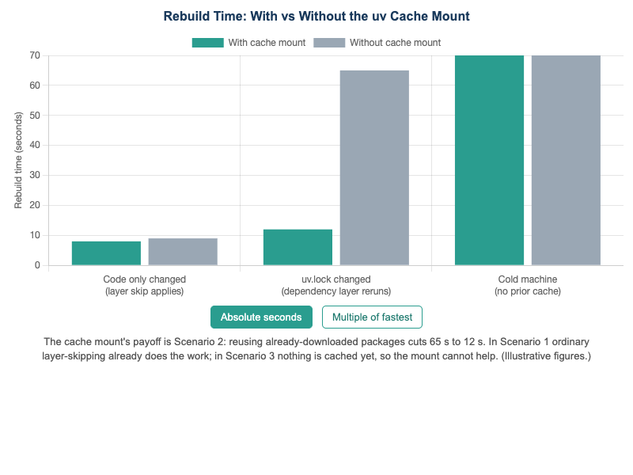

    Given three rebuild scenarios, determine which of ordinary layer caching versus the build cache mount is responsible for the time saved in each case.

-   **[Recovery Point and Recovery Time by Data Store](./rpo-rto-by-data-store/index.md)**

    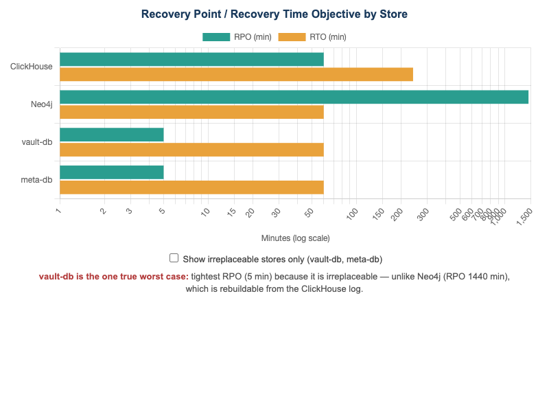

    Compare Recovery Point Objective and Recovery Time Objective across ClickHouse, Neo4j, vault-db, and meta-db, and judge which store's backup strategy the whole system depends on most.

-   **[Replay Command and Rebuild Graph Command Compared](./replay-shadow-table-swap/index.md)**

    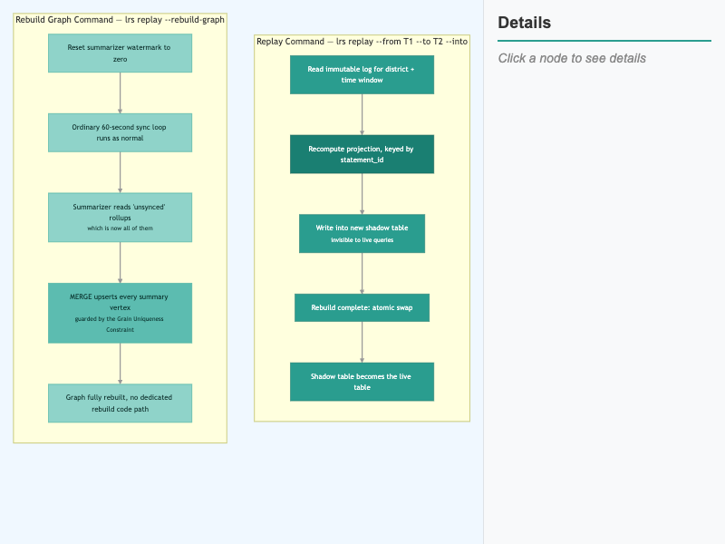

    Trace the Replay Command's shadow-table-and-swap path side by side with the Rebuild Graph Command's watermark-reset path, and explain why the second needs no separate rebuild logic of its own.

-   **[Role Assignment Scope Explorer](./role-assignment-scope-explorer/index.md)**

    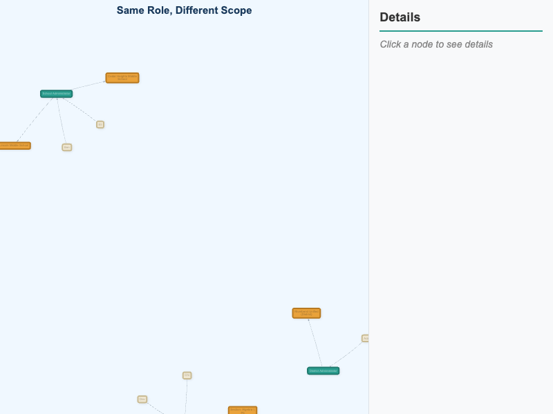

    Distinguish a role (a fixed set of capabilities) from a scope (the specific district, school, or section that role applies to for one account), and see how two accounts sharing a role can still be…

-   **[Role Hierarchy and Scope](./lrs-role-hierarchy-scope/index.md)**

    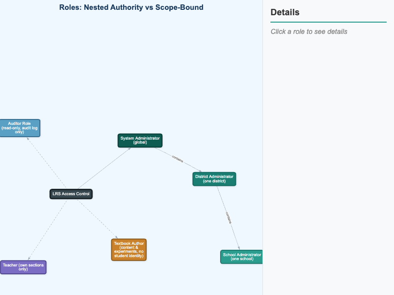

    Differentiate the three nested administrative roles (System Administrator, District Administrator, School Administrator) from the three scope-bound roles (Teacher, Textbook Author, Auditor Role) by…

-   **[Scientific Method Workflow](./scientific-method/index.md)**

    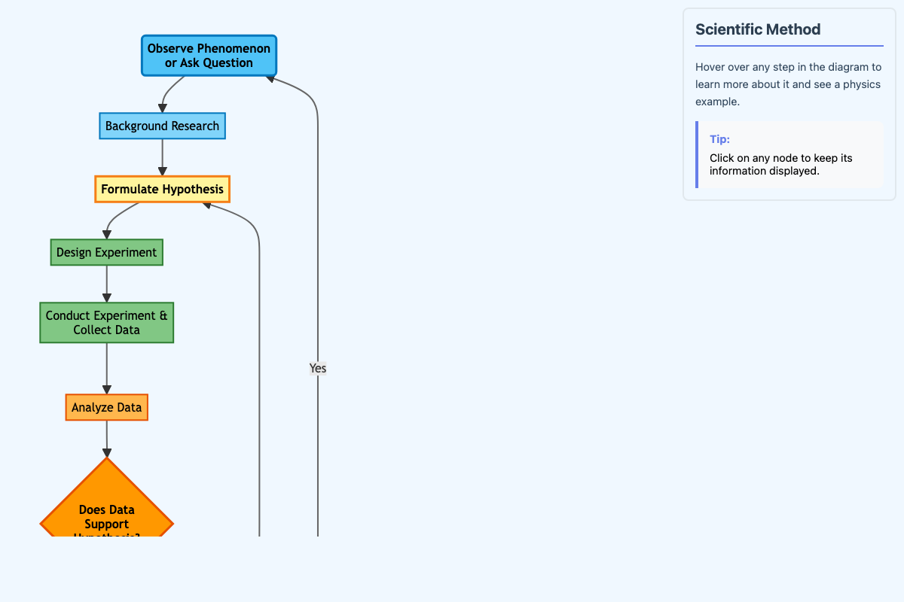

    An interactive flowchart of the scientific method — question, hypothesis, experiment, analysis, and conclusion — as used across scientific disciplines.

-   **[Sine Wave](./sine-wave/index.md)**

    

    An interactive MicroSim demonstrating sine wave.

-   **[Single-Server Pilot Tier VM Layout](./single-server-pilot-vm-layout/index.md)**

    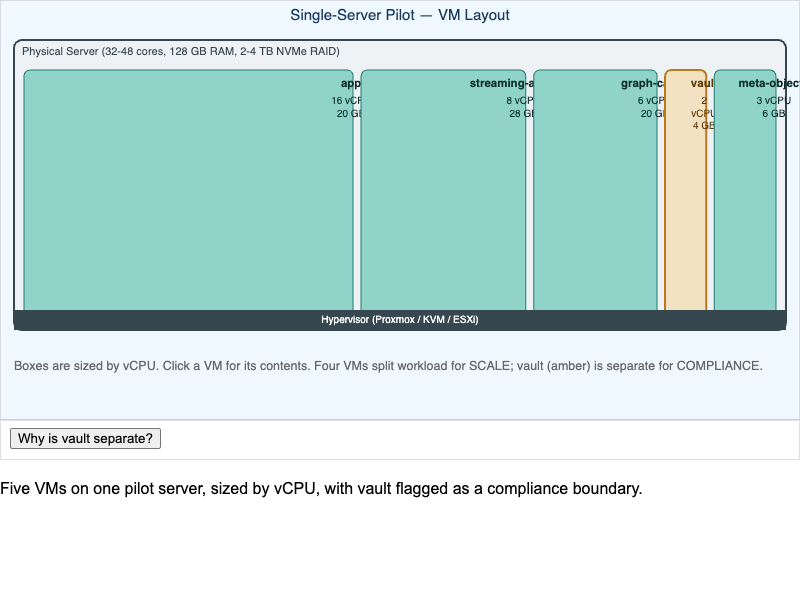

    Explain how five virtual machines on one physical server separate workload roles and compliance boundaries, and identify which VM exists for a scale reason versus a compliance reason.

-   **[Sort Each Level into Hard or Soft Isolation](./hard-vs-soft-isolation-sorter/index.md)**

    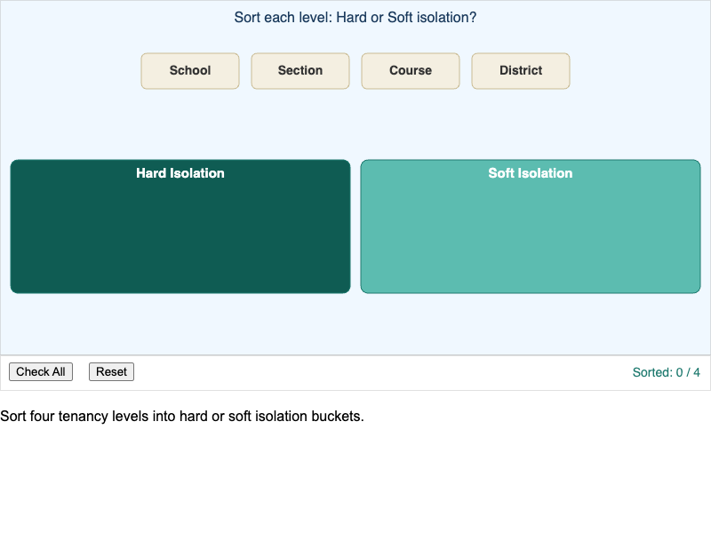

    Apply the definitions of Hard Isolation and Soft Isolation by sorting the four Tenancy Hierarchy levels (District, School, Course, Section) into the correct isolation-guarantee bucket.

-   **[Sort the Component into Its Plane](./five-architectural-planes-infographic/index.md)**

    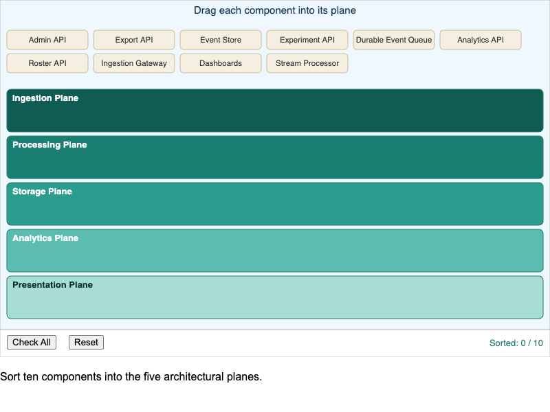

    Apply their understanding of the five architectural planes by sorting eight named components (Ingestion Gateway, Durable Event Queue, Stream Processor, Event Store, Analytics API, Admin API,…

-   **[Standards Governance Handoff](./xapi-governance-handoff/index.md)**

    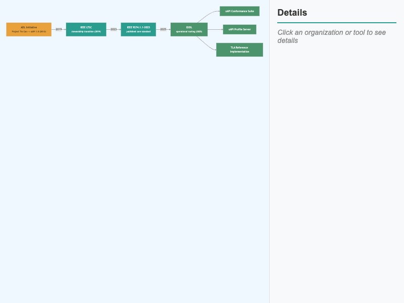

    Trace how stewardship of xAPI moved across three organizations over time, and correctly attribute each organization's distinct role rather than treating "the standard" as owned by one undifferentiated group.

-   **[Statement Ingestion Pipeline — From Statement to Summary Vertex](./statement-ingestion-pipeline/index.md)**

    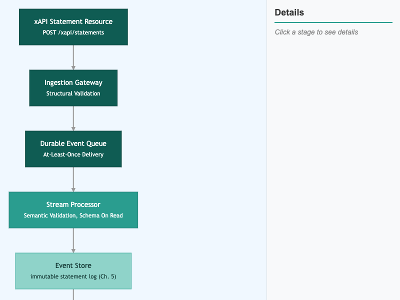

    Trace a single xAPI statement's full path from the xAPI Statement Resource through the Ingestion Gateway, the Durable Event Queue, the Stream Processor, the Event Store, and the Compression Pipeline,…

-   **[Statement Journey — Producer to Graph](./statement-journey-producer-to-graph/index.md)**

    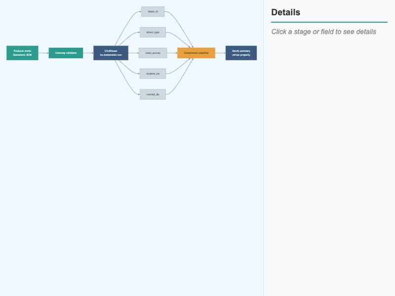

    Decompose a single xAPI Statement into its storage destinations, tracing one JSON field from the producer through the gateway to a ClickHouse column and on to a Neo4j summary-vertex property.

-   **[Statement Path Under ADR-001 and ADR-002](./statement-path-adr-001-002/index.md)**

    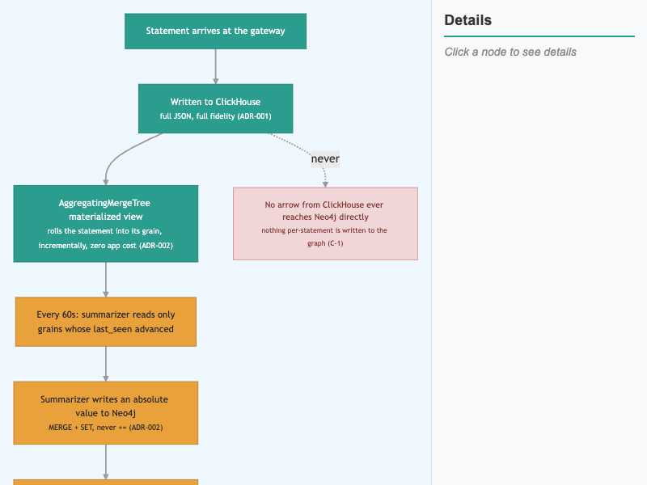

    Trace one xAPI statement's storage path and explain, node by node, which decision (ADR-001 or ADR-002) governs each hop, reinforcing that the graph never receives a per-statement write.

-   **[Statement Timestamp and the Verifiability Chain](./statement-timestamp-verifiability-chain/index.md)**

    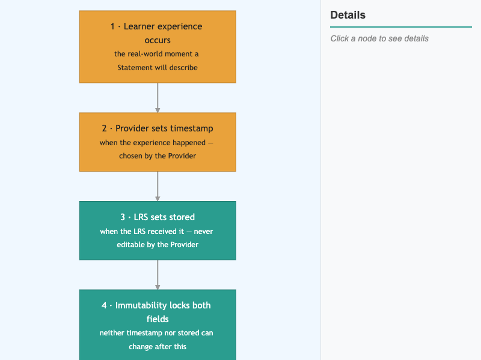

    Apply their understanding of Statement Timestamp and Statement Immutability by tracing how the two combine to produce a verifiable audit trail, and predict what an auditor would flag as suspicious…

-   **[Storage Compression Ratio by Summary-Vertex Grain](./compression-ratio-by-grain/index.md)**

    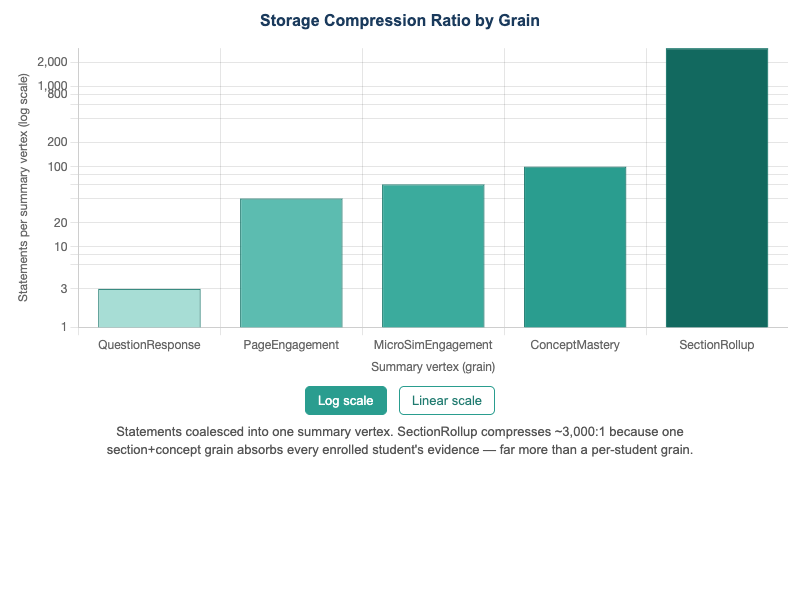

    Compare the storage compression ratio across the five grains that compress within-student evidence (QuestionResponse, PageEngagement, MicroSimEngagement, ConceptMastery, SectionRollup) and evaluate…

-   **[Sync Cadence Tradeoff Explorer](./sync-cadence-tradeoff-explorer/index.md)**

    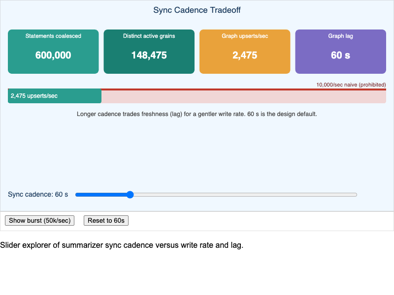

    Manipulate the summarizer's sync cadence and observe, with real computed numbers, how distinct active grains, graph upserts per second, and graph lag all move together — building intuition for why…

-   **[System Configuration and Alerting Dashboard](./system-config-alerting-dashboard/index.md)**

    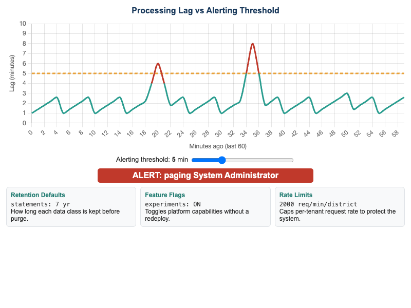

    Interpret a live-style processing-lag chart against a configurable Alerting Configuration threshold line, and relate that threshold to the platform-wide Retention Defaults Config, Feature Flag…

-   **[Term Rollover Timeline](./term-rollover-timeline/index.md)**

    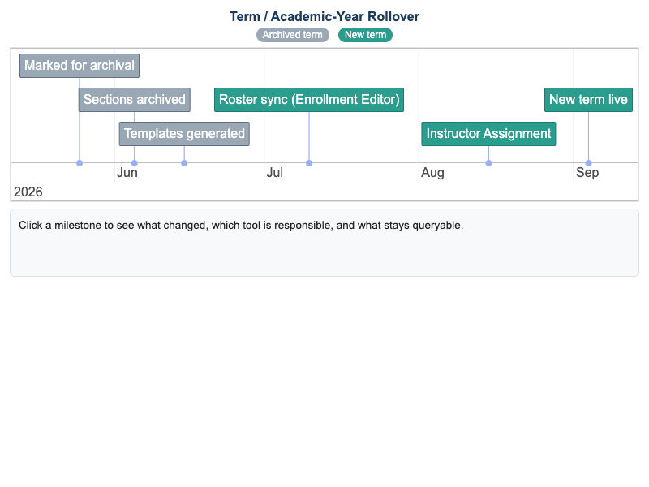

    Sequence the steps of a Term / Academic-Year Rollover, from archiving the outgoing term through rolling section templates forward into the new one, and see where the Enrollment Editor and Instructor…

-   **[Testing Layers by Scope and Run Frequency](./testing-layers-scope-frequency-chart/index.md)**

    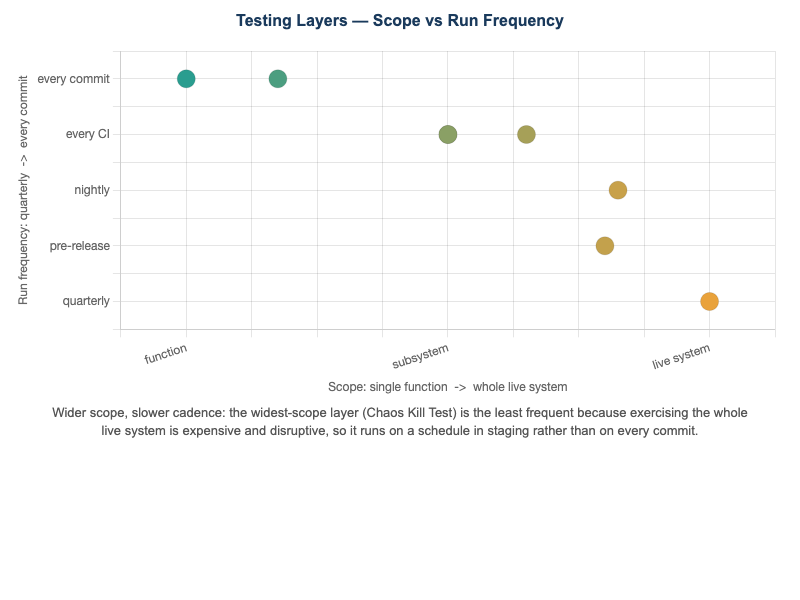

    Compare the eight testing layers by how much of the system each exercises and how often each runs, and justify why the widest-scope layer is also the least frequent.

-   **[The AB Test Lifecycle](./ab-test-lifecycle-states/index.md)**

    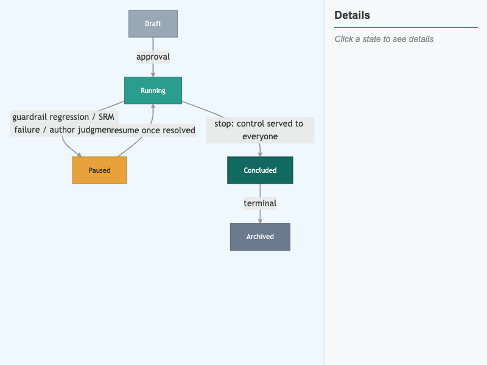

    Sequence the states an experiment moves through — draft, running, paused, concluded, archived — and identify which transitions are reversible versus terminal.

-   **[The Content Tree — From Textbook to Concept](./content-tree-graph-model/index.md)**

    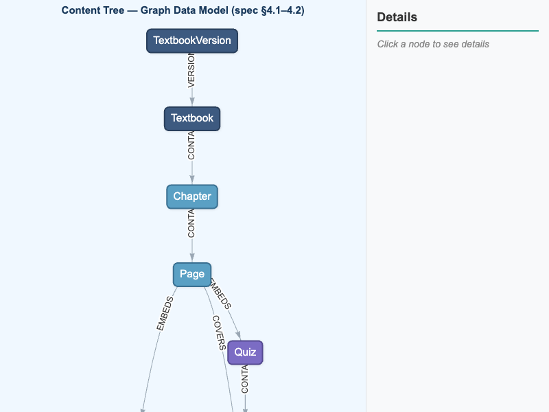

    Identify every content-tree node label from Textbook down to Concept, and describe which relationship type connects each pair, exactly as cataloged in this project's specification §4.1–§4.2.

-   **[The Data-Loss Boundary Across the Compression Pipeline](./lrs-failure-mode-data-loss-boundary/index.md)**

    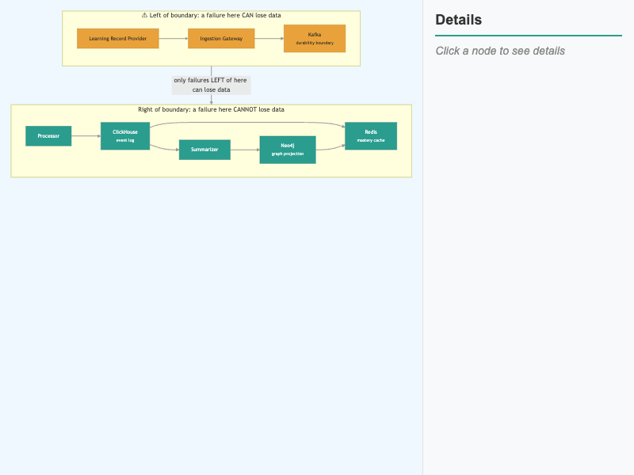

    Given any one of six failure modes in the compression pipeline, classify it as occurring before or after the Kafka durability boundary and predict whether it can lose data.

-   **[The Five MVP Build Steps](./five-mvp-build-steps/index.md)**

    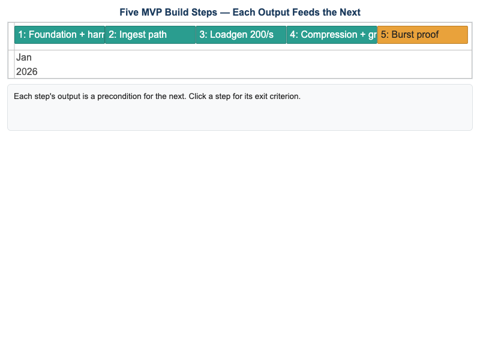

    Sequence the five MVP build steps and match each to its exit criterion, recognizing each step's output as a precondition for the next.

-   **[The Four BKT Parameters Explorer](./bkt-four-parameters-explorer/index.md)**

    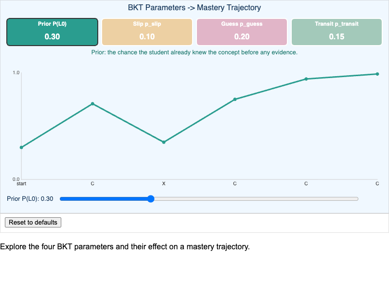

    Explain what each of the four BKT parameters (prior, slip, guess, transit) controls, and illustrate how changing one parameter's value shifts a mastery trajectory while holding the evidence sequence fixed.

-   **[The Ingestion Plane Technology Stack](./ingestion-plane-technology-stack/index.md)**

    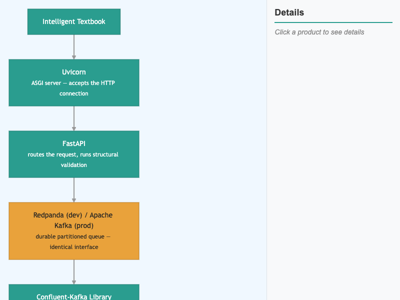

    Trace a single xAPI statement's path through the ingestion plane's actual technology stack — FastAPI, Uvicorn, Redpanda/Apache Kafka, and the Confluent-Kafka Library — and explain what each product…

-   **[The Multi-Stage Build Pipeline](./multi-stage-build-pipeline/index.md)**

    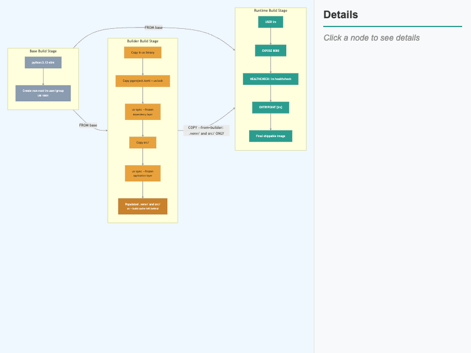

    Trace which files and tools enter each of the three Dockerfile stages, and see which artifacts the Runtime stage copies forward versus what the Builder stage's tools are discarded along with.

-   **[The Nine Admin UIs at a Glance](./nine-admin-uis-survey/index.md)**

    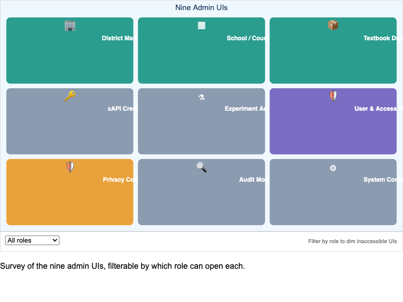

    Identify each of the nine admin UIs, its one-line purpose, and which of the six roles from this chapter can open it, as a quick-reference survey before Chapters 25 through 27 cover several of them in depth.

-   **[The Observability Pipeline, From Statement to Screen](./observability-pipeline-trace-flow/index.md)**

    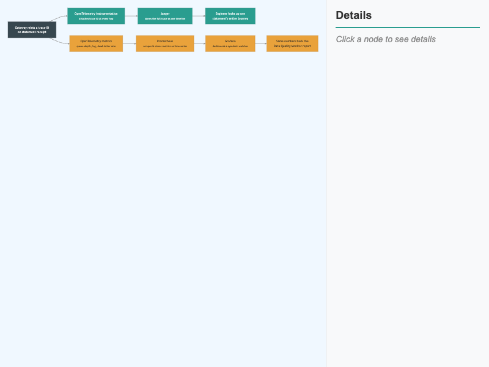

    Trace how a single trace ID and a separate metrics stream flow through OpenTelemetry, Jaeger, Prometheus, and Grafana, from statement receipt to a screen a system administrator actually watches.

-   **[The Privacy Filter Pipeline](./privacy-filter-pipeline/index.md)**

    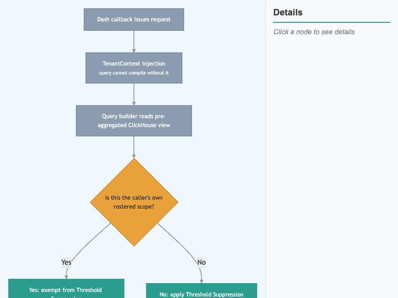

    Trace an Analytics API request from Tenant Context Injection through Threshold Suppression, Complementary Suppression, and Privacy Audit Write, and identify at which stage a rostered-teacher…

-   **[The Role Dispatcher Command Explorer](./role-dispatcher-command-explorer/index.md)**

    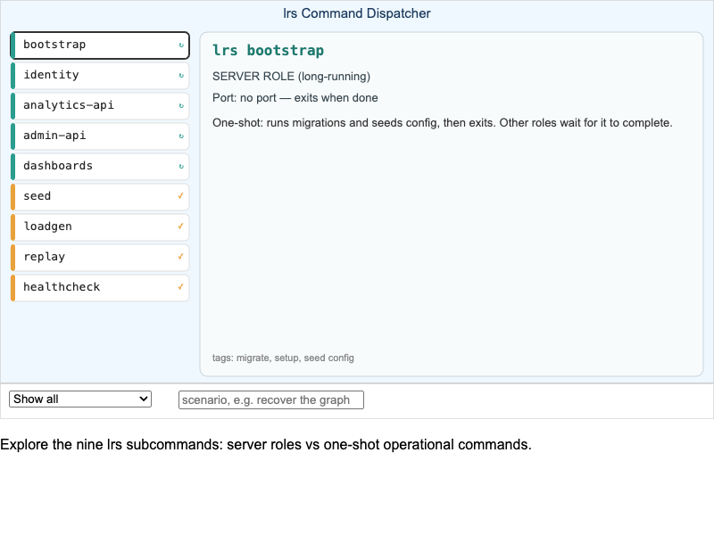

    Given a deployment scenario, select the correct lrs subcommand and identify whether it is a long-running server role or a one-shot operational command.

-   **[The Start/Pause Dwell Pattern](./start-pause-dwell-pattern-workflow/index.md)**

    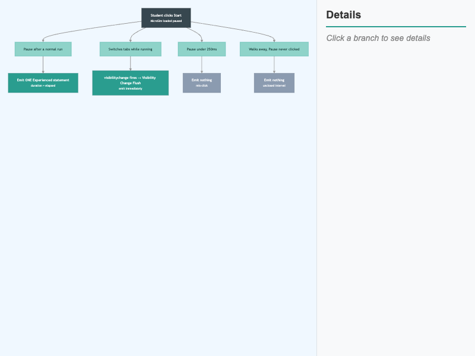

    Trace a MicroSim's Start/Pause lifecycle through four branches — normal Pause, tab hidden while running, sub-250ms run, walk-away-with-no-pause — and predict which emits an Experienced Verb statement.

-   **[The Storage Plane, Which Technology Holds What](./storage-plane-technology-map/index.md)**

    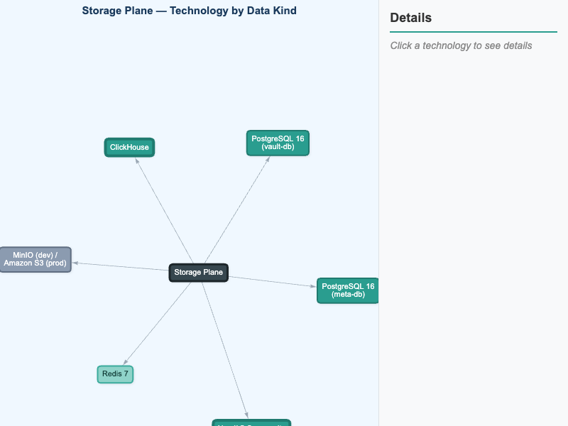

    Classify each storage-plane technology — ClickHouse, Neo4j 5 Community, PostgreSQL 16 (×2), Redis 7, MinIO, and Amazon S3 — by the specific kind of data it is responsible for, differentiating the…

-   **[The Token Cache's Fallback Chain](./token-cache-fallback-chain/index.md)**

    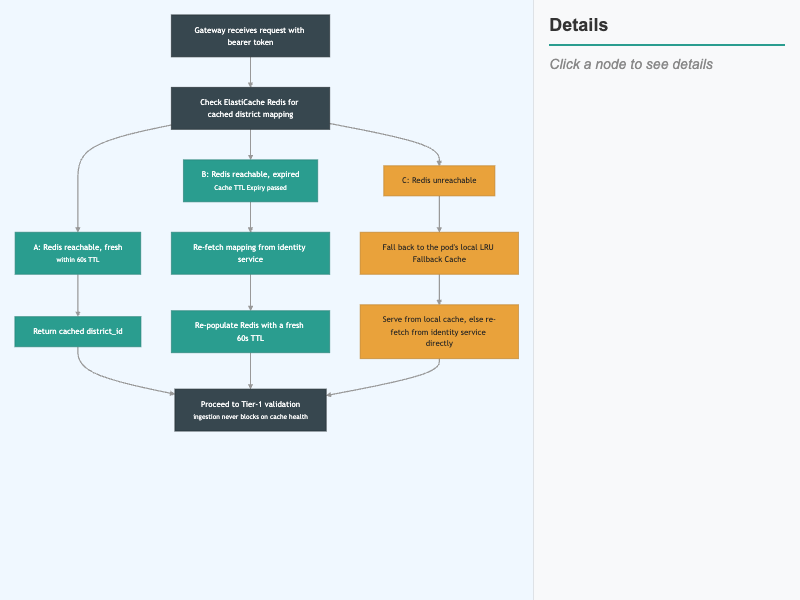

    Explain how a gateway's token-to-district lookup degrades from a shared Redis cache to a local LRU fallback as Cache TTL Expiry and Redis availability change, without ever blocking ingestion.

-   **[The Twelve Core Functions Explorer](./twelve-core-functions-explorer/index.md)**

    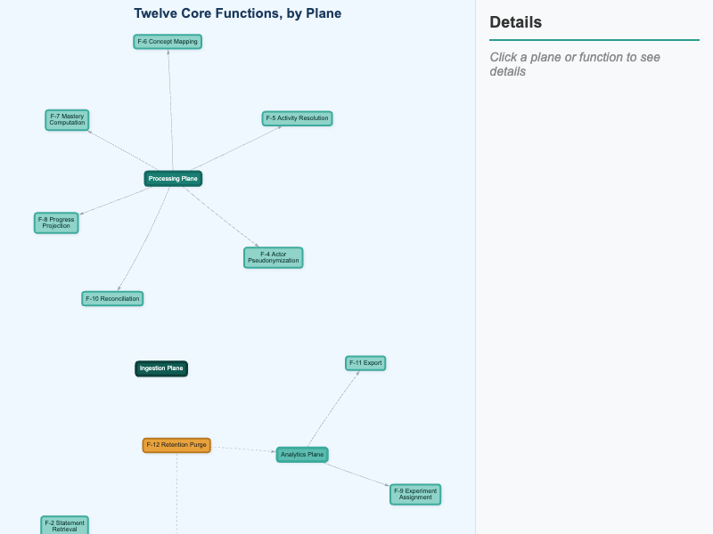

    Classify all twelve core LRS functions by the architectural plane and specific component that implements each one, using a single explorable network rather than twelve separate diagrams.

-   **[The Wider Standards Ecosystem Map](./standards-ecosystem-map/index.md)**

    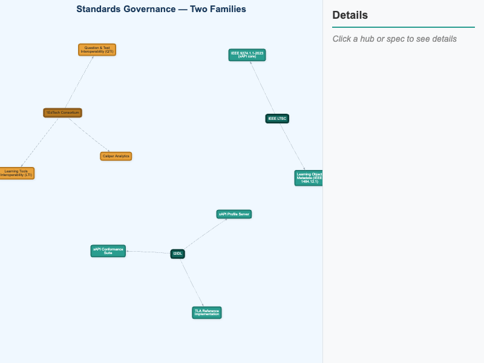

    Analyze how IEEE LTSC, the ADL Initiative, I2IDL, and the 1EdTech Consortium relate to one another and to the specifications each governs, correctly attributing xAPI, cmi5, and the Total Learning…

-   **[This Project's System Context Diagram](./lrs-system-context-diagram/index.md)**

    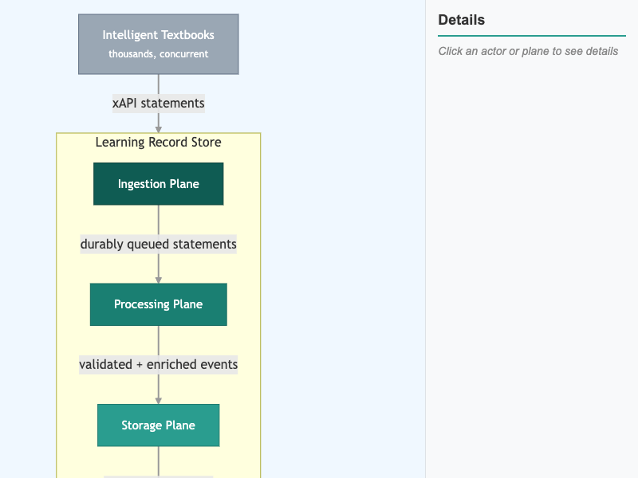

    Identify the external actors and the five internal planes of this project's Learning Record Store, and describe in one sentence what crosses the system boundary in each direction.

-   **[This Project's Tenancy Hierarchy](./tenancy-hierarchy-tree/index.md)**

    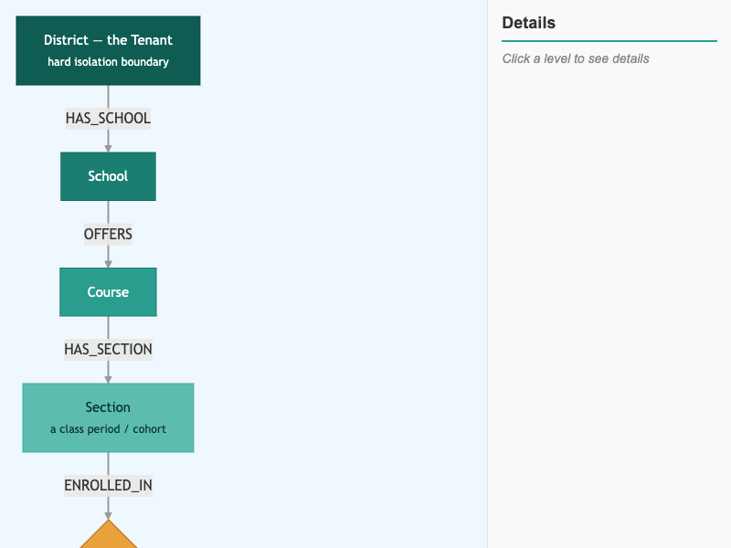

    Identify each level of this project's Tenancy Hierarchy, in order, and describe in one sentence what each level represents and which entities live directly beneath it.

-   **[Three Personas, One Statement Log](./three-personas-one-statement-log/index.md)**

    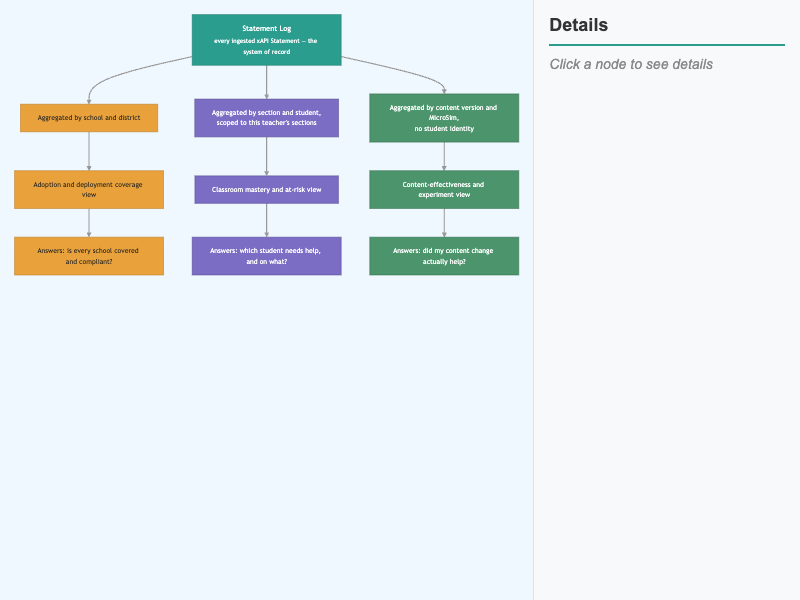

    Explain how the District Administrator, Teacher, and Textbook Author each draw on the same underlying xAPI statement log, filtered through a different aggregation and access lens, rather than three…

-   **[Three Ways to Develop Against a Remote Host](./remote-dev-workflow-comparison/index.md)**

    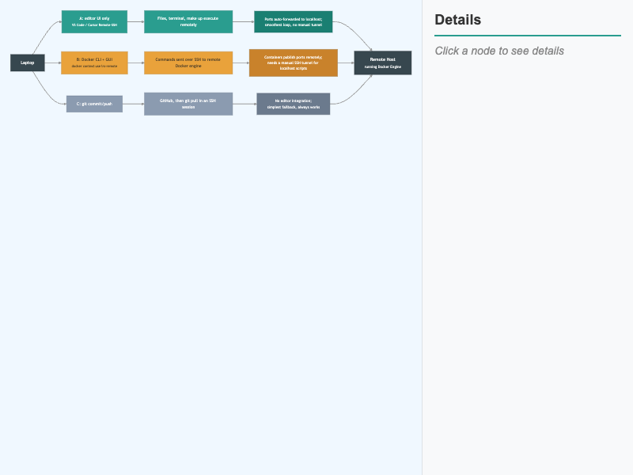

    Compare Remote SSH Development, Docker Context Over SSH, and plain git-plus-SSH as three ways of developing against containers running on a rented host, and identify which piece of tooling runs…

-   **[Threshold and Complementary Suppression Simulator](./threshold-complementary-suppression-simulator/index.md)**

    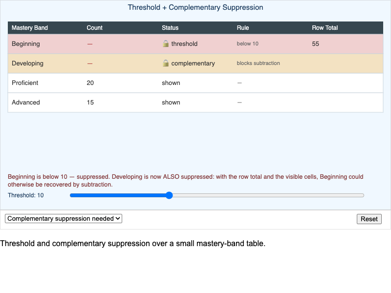

    Given a small table of per-mastery-band student counts and a row total, let the learner determine which cells Threshold Suppression hides and which additional cell Complementary Suppression must hide…

-   **[Total Learning Architecture Ecosystem Map](./tla-ecosystem-map/index.md)**

    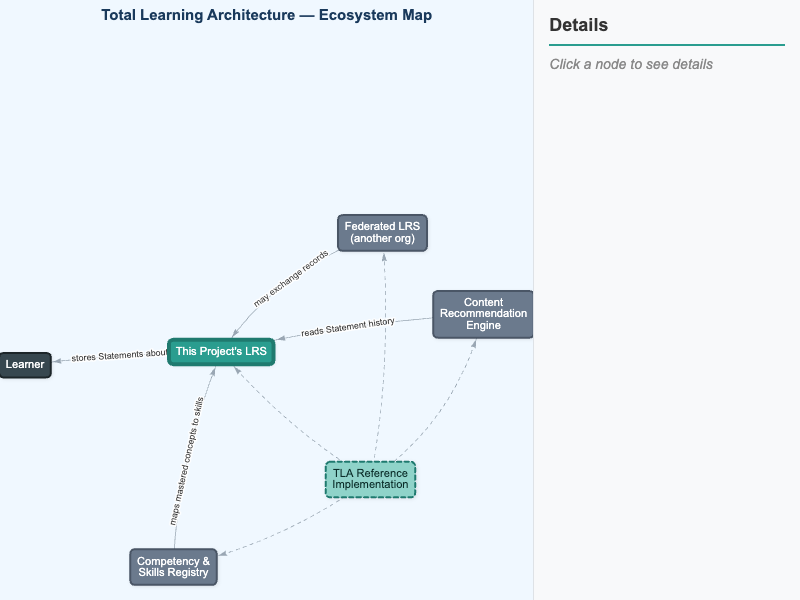

    Analyze how a Learning Record Store relates to the other named components of the Total Learning Architecture, and locate this project's own LRS within that wider ecosystem rather than treating it as…

-   **[Tracing One Student's Mastery Across Four Observations](./bkt-mastery-trace-stepper/index.md)**

    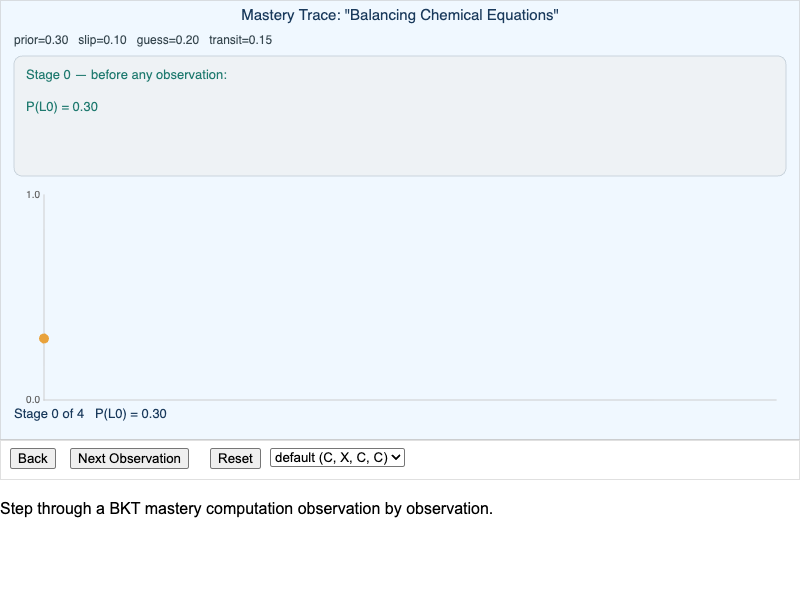

    Compute the Prior Mastery Probability after each of four observations using the Evidence Conditioning Step and the Learning Transition Step, tracing exactly how the numbers move rather than watching…

-   **[Two Bugs Behind a Green Checkmark](./two-bugs-green-checkmark/index.md)**

    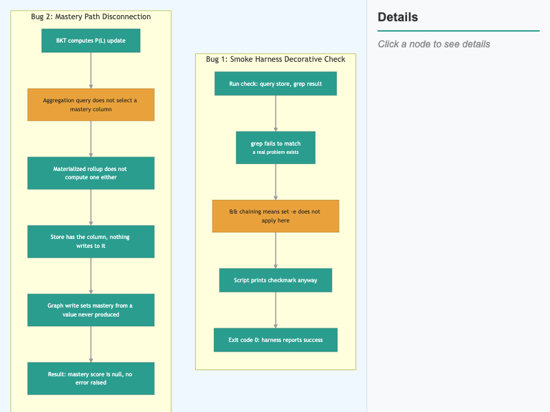

    Analyze why a passing smoke-test script and a graph with mastery scores present can both hide a real defect, by tracing where each verification silently breaks.

-   **[Two Kinds of Identity in This Learning Record Store](./two-kinds-of-identity/index.md)**

    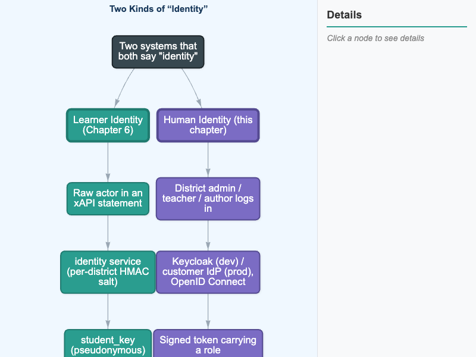

    Distinguish the Chapter 6 pseudonymization identity service from Keycloak's human single-sign-on role, so the two systems that both use the word "identity" are never conflated.

-   **[Two Summary-Building Functions — Mastery and Progress](./mastery-vs-progress-rollup/index.md)**

    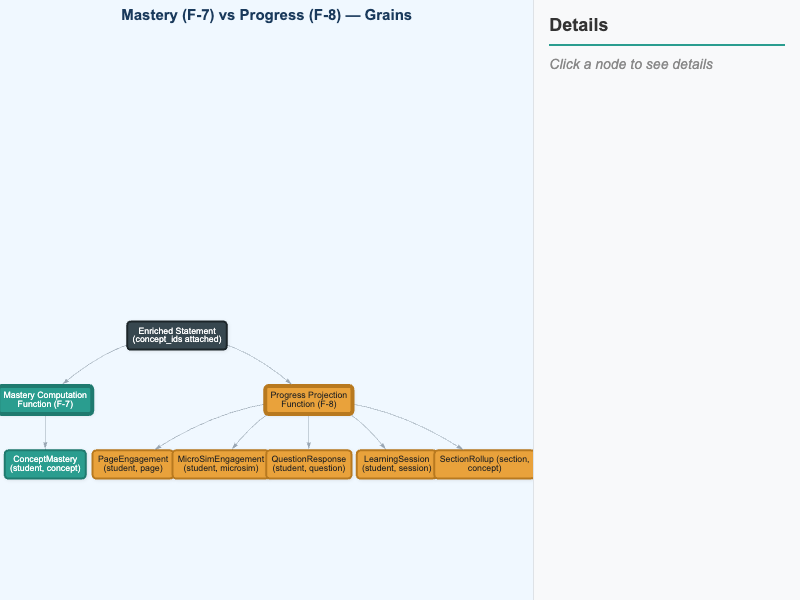

    Differentiate the Mastery Computation Function's single grain (ConceptMastery) from the Progress Projection Function's five grains (PageEngagement, MicroSimEngagement, QuestionResponse,…

-   **[Vault Network Isolation in the Compose Topology](./vault-net-isolation-workflow/index.md)**

    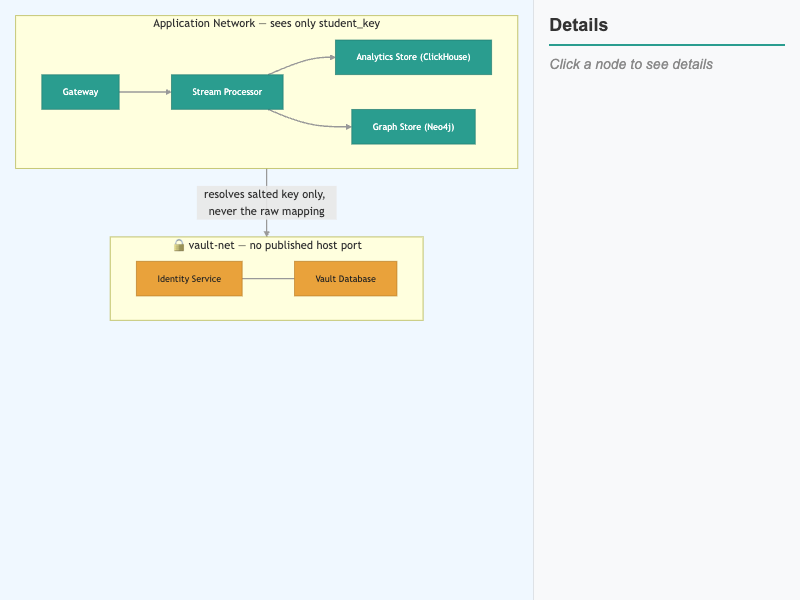

    Explain why the vault database is reachable only by the identity service on an isolated network, and identify which services can and cannot see a real learner identity.

-   **[Voiding Lifecycle Flow](./voiding-lifecycle-flow/index.md)**

    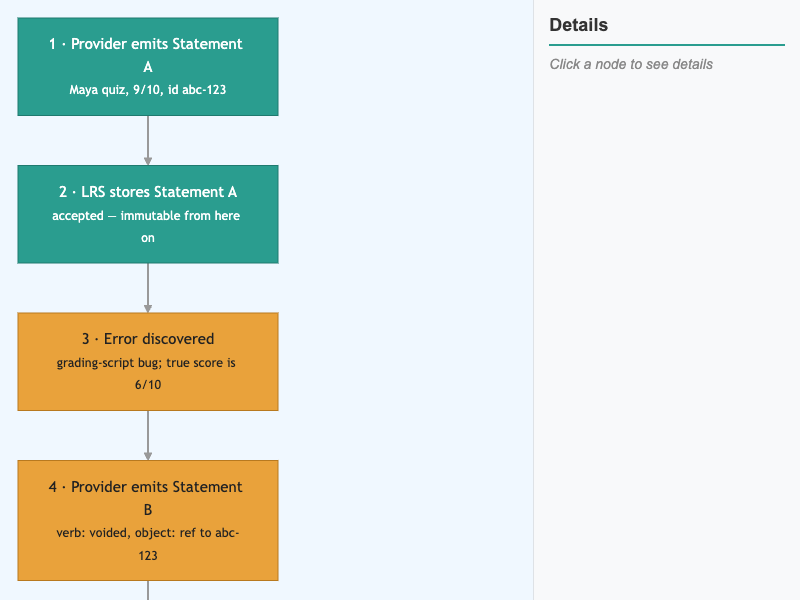

    Trace the full lifecycle of a mistaken Statement from emission through correction, and see concretely why immutability and voiding are two halves of one mechanism rather than opposing rules.

-   **[xAPI Endpoint and HTTP Verbs](./xapi-endpoint-http-verbs/index.md)**

    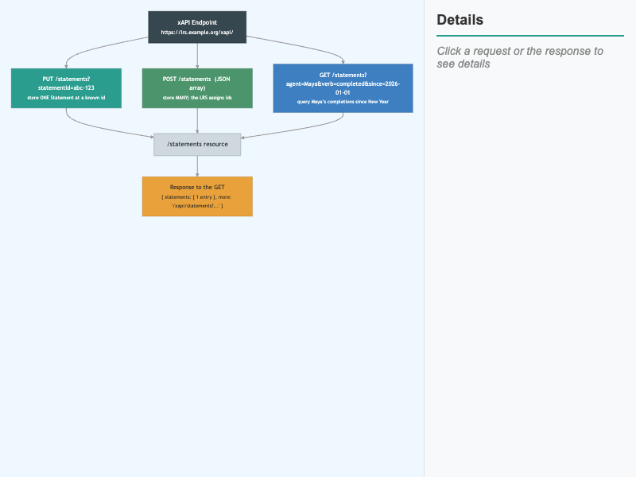

    Apply their knowledge of HTTP Verbs and Statement Query Parameters by tracing three concrete requests against one xAPI Endpoint and predicting what each returns.

-   **[xAPI Statement Building Blocks](./xapi-statement-triple/index.md)**

    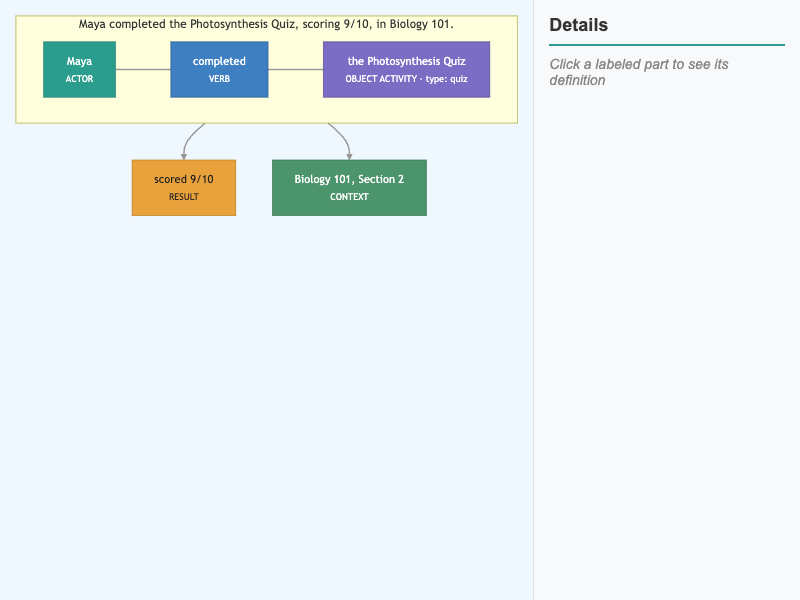

    A first, plain-language mental model of the five Statement components (Actor, Verb, Object Activity, Result, Context) using one worked example, before Chapter 2 formalizes the JSON structure.

-   **[xAPI Vocabulary Matching Pairs](./xapi-vocabulary-matching-pairs/index.md)**

    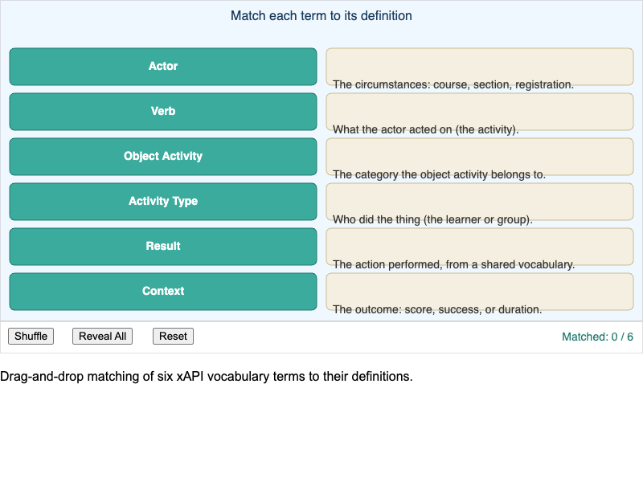

    Reinforce recall of the six terms introduced in this chapter's statement-anatomy section (Actor, Verb, Object Activity, Activity Type, Result, Context) by matching each term to its one-sentence definition.

