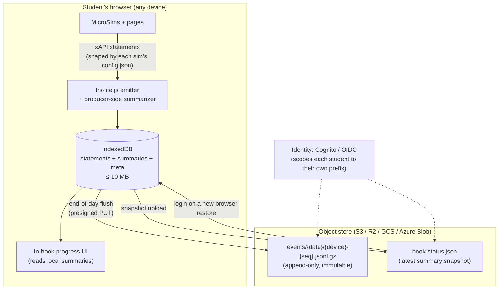

# Learning Record Store Lite (LRS-Lite) — Design v1

## 1. Purpose and Scope

[`lrs-spec-v1.md`](lrs-spec-v1.md) specifies a server-based LRS sized for 10,000 concurrent
students: ingestion gateway, Kafka, ClickHouse event store, Neo4j summaries, dashboards.
That is the right architecture for a district. It is the wrong architecture for a single
teacher publishing an intelligent textbook from GitHub Pages, where there is no server to
run, no ops budget, and a class of 30 — not 10,000.

**LRS-Lite is the same learning-record model with the infrastructure removed.** The three
planes of the full system collapse into two components:

| Full LRS plane | LRS-Lite equivalent |
|---|---|
| Ingestion gateway + Kafka | A JavaScript module writing to **IndexedDB** in the student's browser |
| ClickHouse event store | The **local store** (≤ 10 MB budget) + daily **JSONL objects in S3** |
| Compression pipeline (§5.6) | **Producer-side summarization**, configured per MicroSim by `config.json` |
| Neo4j summary vertices (§4.3) | A single **`book-status.json`** snapshot per student in S3 |
| Analytics dashboards | The textbook itself renders the student's own progress from local summaries |

Everything that made the full spec's data model good — one summary per analytical grain,
an immutable event log that summaries can be rebuilt from, statement shapes pinned by the
[producer contract](xapi-producer-contract-v1.md) — is **kept**. Everything that exists
only to serve scale and multi-tenancy is **dropped**.

### 1.1 Design goals

1. **Zero servers on the hot path.** The textbook is a static MkDocs site. During a
   study session, nothing leaves the browser. The only cloud dependency is an object
   store, touched at login and at end of day.
2. **The local store is bounded at 10 MB** and the design must degrade gracefully as it
   fills — never by losing summaries, only by shedding already-uploaded raw events.
3. **Cross-browser continuity.** A student who worked on the library Chromebook today can
   log in from a home laptop tomorrow and find the book exactly as they left it:
   completed pages, quiz history, concept mastery, last position.
4. **Same statements, different transport.** A statement emitted by LRS-Lite is
   byte-for-byte a valid [producer-contract v1](xapi-producer-contract-v1.md) statement.
   If a school later adopts the full LRS, the S3 archive replays through its gateway
   unchanged — LRS-Lite is a migration on-ramp, not a fork.
5. **Privacy by scarcity.** The best privacy posture for a small deployment is to collect
   less. Summary-mode emission (§5) is the default precisely because a per-drag event
   stream is a liability nobody here needs.

### 1.2 Explicit non-goals

- No instructor dashboards, cohort analytics, or A/B experimentation (spec §7–§9). A
  teacher who wants those reads the S3 objects with a notebook, or graduates to the full
  LRS.
- No real-time anything. Freshness is "since the student's last flush."
- No multi-tenancy. One bucket serves one book deployment (or one teacher's set of
  books). District isolation is a bucket boundary, not a query predicate.
- No xAPI `GET /statements` endpoint. The archive is files, deliberately.

---

## 2. Architecture Overview



Three moments in a student's day touch the design:

1. **Login / open the book** — authenticate, fetch `book-status.json`, hydrate the local
   store if it is empty or stale (§7).
2. **Study session** — sims and pages emit statements into IndexedDB via the shared
   emitter; the summarizer maintains per-grain rollups locally; nothing goes over the
   network (§4–§5).
3. **Done for the day** — an explicit "Save my progress" action (with automatic
   safety-net triggers) uploads the day's events and the refreshed snapshot to the
   object store, then releases local budget (§6).

---

## 3. Key Design Decisions

### 3.1 ADR-L1 — IndexedDB is the local store, with an app-enforced 10 MB budget

**Decision.** The web-attached database is **IndexedDB**, accessed through a thin wrapper
(`lrs-lite-db.js`). `localStorage` is rejected: it is synchronous (blocks the main thread
a sim is animating on), string-only, and capped near 5 MB in several browsers — below the
stated budget before overhead. IndexedDB is asynchronous, structured, indexable, and its
real quota is far above 10 MB everywhere that matters.

The 10 MB ceiling is therefore **our policy, not the browser's limit** — enforced by the
wrapper's own byte accounting (§4.4), not discovered by catching `QuotaExceededError`.
That matters because browser eviction under real quota pressure is all-or-nothing
(Firefox drops the whole origin's data); a self-imposed budget with graceful shedding
never gets near that cliff.

`navigator.storage.persist()` is requested once at first login. Grant or not, the design
survives eviction: anything not yet flushed is at risk only since the last flush, and the
snapshot in S3 bounds the loss to one day.

### 3.2 ADR-L2 — Summarize at the producer, not the server

The full LRS accepts every raw statement and compresses server-side (spec §5.6), because
a district needs the raw log for reproducibility and audit. LRS-Lite has no server to
compress on — so **compression moves to the only compute available: the emitting page
itself.**

Each MicroSim carries a `config.json` (§5) that sets its **emission mode**. In the
default `summary` mode, high-frequency interactions (slider drags, per-step `interacted`
events) are *accumulated in memory* and emitted as **one statement per grain per
session** — exactly the compression the full pipeline would have performed, done before
the statement is ever stored. Low-frequency, high-value events (`answered`, the §7 dwell
`experienced`) are always emitted individually; they are already at summary grain.

This is the same principle as spec C-1 ("no vertex finer than the analytical grain"),
applied one stage earlier. The cost is honest and stated: in summary mode the fine-grained
interaction sequence is **not reconstructable** — there is no server log behind it. That
trade is correct here (goal 5) and is the main dial a deployment turns when it wants more
detail (§5.3).

### 3.3 ADR-L3 — The object store holds two kinds of object, and only two

Per student:

1. **Event objects** — `events/{yyyy-mm-dd}/{device_id}-{seq}.jsonl.gz`. Append-only,
   immutable, one per flush. These are the system of record, playing the role ClickHouse
   plays in the full design. Nothing ever rewrites one.
2. **`book-status.json`** — a single snapshot object, overwritten at every flush. It is a
   **projection** of the event objects (spec C-2 carries over: if snapshot and events
   disagree, the events win and the snapshot is rebuilt by replaying them).

No database, no index, no manifest. Listing `events/` *is* the index — the day and device
are in the key. This is deliberately boring: every "similar system" the requirement allows
(Cloudflare R2, Google Cloud Storage, Azure Blob, MinIO on a school NAS) supports GET,
PUT, and LIST with prefix, and nothing here needs more.

### 3.4 ADR-L4 — Identity is delegated; authorization is a key prefix

A static site cannot hold a secret, so the browser must obtain **short-lived, scoped**
credentials from an identity provider. The reference implementation is **Amazon Cognito**
(an identity pool federating a school Google/Microsoft login), because it makes the
authorization rule a one-line IAM policy:

```json
{
  "Effect": "Allow",
  "Action": ["s3:GetObject", "s3:PutObject", "s3:ListBucket"],
  "Resource": "arn:aws:s3:::BOOK_BUCKET/students/${cognito-identity.amazonaws.com:sub}/*"
}
```

Each student can read and write **only their own prefix**. There is no LRS auth code to
get wrong — the object store's own access control is the entire authorization layer.

**Portable alternative** (for R2/GCS or when Cognito is unwanted): one small serverless
function (Lambda function URL / Cloudflare Worker) that validates the student's OIDC
token and returns presigned PUT/GET URLs for that student's prefix. This is the only
optional server component in the design, it holds no state, and it is on the cold path
(login and flush only).

The `student_id` used in the S3 key is the **identity provider's stable subject**, not a
name or email. The mapping from subject to human lives in the school's IdP — LRS-Lite
never stores it, which is the lite equivalent of the full spec's PII vault.

### 3.5 ADR-L5 — Last-writer-wins per grain, union for events

Two browsers used on the *same* day (Chromebook at school, laptop at home) is the one
real concurrency case. Event objects never conflict — each flush writes a new key that
embeds a per-browser `device_id`. `book-status.json` can conflict, and the rule is:

> On flush, **merge before overwrite**: GET the current snapshot, merge per grain
> (union of grains; for a grain present in both, the one with the later `last_seen`
> wins; additive counters are **not** summed cross-device), then PUT.

Last-writer-wins per grain can undercount a same-day split across devices (it keeps one
device's counters for the contested grain, not the sum). That is accepted for v1 and is
always repairable, because the event objects hold both devices' full contribution — a
replay rebuilds the true snapshot (§7.3). Additive cross-device merge is explicitly
deferred: summing counters without idempotency keys double-counts on retry, which is
worse than undercounting (spec C-3's lesson, relearned cheaply).

---

## 4. The Local Store

### 4.1 IndexedDB schema

Database `lrs-lite`, version 1, three object stores:

| Store | Key | Contents | Indexes |
|---|---|---|---|
| `statements` | `id` (statement UUID) | Full contract-v1 statement + `{synced: 0\|1, bytes: N}` envelope | `by-synced`, `by-timestamp` |
| `summaries` | `grain_key` (string, §4.2) | One rollup object per grain — the local mirror of the full LRS's summary vertices | `by-kind` |
| `meta` | fixed keys | `device_id`, `student_id`, `sync_cursor`, `budget_bytes_used`, `snapshot_etag`, `last_flush_at` | — |

### 4.2 Grains

The grain set is the spec §4.3 set, minus what only a cohort needs:

| Kind | `grain_key` | Fields |
|---|---|---|
| `concept` | `c:{concept_id}` | `mastery_score`, `attempts`, `successes`, `statements_compressed`, `first_seen`, `last_seen` |
| `page` | `p:{object_id}` | `dwell_ms_total`, `visit_count`, `completed`, `first_seen`, `last_seen`, `statements_compressed` |
| `question` | `q:{object_id}` | `attempts`, `successes`, `mean_score`, `first_success_attempt`, `last_seen` |
| `session` | `s:{date}:{device_id}` | `started_at`, `ended_at`, `event_count`, `objects_touched` |
| `book` | `b:` (singleton) | `last_page`, `pages_completed`, `concepts_touched`, `quiz_score_summary` — what the "resume where you left off" UI reads |

`grain_key`s reuse the contract's canonical IRIs (`object_id` with its trailing slash,
`#q…` fragments), so the same identity discipline that protects the full LRS's rollups —
one activity, one IRI (§1–§2 of the contract) — protects these.

Summaries are updated **transactionally with the statement write**: one IndexedDB
transaction spans both stores, so a crash can never persist an event whose summary
doesn't reflect it, or vice versa.

`SectionRollup` has no lite equivalent — there is no section, and no aggregation
threshold is needed because no one but the student (and whoever holds bucket credentials)
can read the data at all.

### 4.3 What the book does with local summaries

The in-book progress features read `summaries` **only** — never `statements`:

- resume-where-you-left-off (the `book` grain),
- per-chapter completion checkmarks in the nav (`page` grains),
- a personal mastery page rendered from `concept` grains against the learning graph
  (`docs/learning-graph/learning-graph.json` is already shipped with the site),
- quiz review from `question` grains.

This keeps the read path fast and keeps a firm rule from the full design intact: **UI
reads summaries; the event log is for replay and export.**

### 4.4 The 10 MB budget and shedding order

The wrapper maintains `budget_bytes_used` (sum of stored statements' serialized sizes;
summaries and meta are negligible and exempt — they are the last thing we would ever
shed). Thresholds:

| Level | Threshold | Behavior |
|---|---|---|
| Green | < 7 MB | Normal operation. |
| Amber | ≥ 7 MB | Delete **synced** statements, oldest first, back to green. Routine and invisible. |
| Red | ≥ 9 MB with **unsynced** backlog | Prompt the student to save progress now (triggers a flush, §6). Sims are switched to summary-only emission regardless of `config.json`. |
| Hard | 10 MB, flush impossible (offline for days) | Compact: fold the oldest unsynced raw statements into their grains' summaries, then drop them — recording a `truncated_statements: N` marker in the session grain so the loss is visible in the data, not silent. |

Capacity check: a contract-v1 statement serializes to roughly 700 bytes. In summary mode
a diligent student produces on the order of 100–300 statements per school day —
**~200 KB/day**, so the budget holds weeks of unflushed work even fully offline. The
hard level exists for correctness, not because it is expected.

---

## 5. Per-MicroSim `config.json`

### 5.1 Placement and loading

Each sim directory gains a `config.json` beside its existing `metadata.json`:

```
docs/sims/bouncing-ball/
  index.md
  main.html
  bouncing-ball.js
  metadata.json
  config.json      ← emission policy (this section)
```

`lrs-lite.js` fetches it relative to the page at load (same-origin, cached by the site's
normal HTTP caching). **A missing or malformed `config.json` means the defaults below** —
a sim without one is in summary mode, not silent and not verbose.

### 5.2 Schema

```json
{
  "schema": "lrs-lite-config/v1",
  "emission": {
    "mode": "summary",
    "interacted": "aggregate",
    "aggregate_window": "session",
    "min_dwell_ms": 250,
    "max_statements_per_session": 50
  },
  "concepts": ["compression-ratio"]
}
```

| Field | Values (default bold) | Meaning |
|---|---|---|
| `emission.mode` | **`summary`** \| `full` \| `off` | `summary`: aggregate high-frequency events (below). `full`: emit every contract-v1 statement individually — for sims under study, or deployments feeding a real LRS later. `off`: emit nothing (decorative sims). |
| `emission.interacted` | **`aggregate`** \| `individual` \| `suppress` | What happens to `interacted` (control-manipulation) events in summary mode. `aggregate`: fold into one statement per control per window. `suppress`: count into the local summary's `statements_compressed` but emit no statement at all. |
| `emission.aggregate_window` | **`session`** \| `pause` | When aggregated `interacted` statements are cut: once per page session, or at each §7 dwell Pause (aligning interaction summaries with dwell intervals). |
| `emission.min_dwell_ms` | **`250`** | Contract §7's mis-click floor, now configurable per sim. |
| `emission.max_statements_per_session` | **`50`** | Circuit breaker: past this, the sim is forced to `suppress` for the rest of the session. A runaway `mousemove` handler in one sim must not eat the shared budget. |
| `concepts` | `[]` | The `concept_id`s this sim's statements carry (contract §6). Declared here once instead of hardcoded in each emitter call — and now discoverable by tooling, which is a step toward closing the "sims carry no concept ids" gap noted in the repo's catalog docs. |

### 5.3 What `summary` mode emits — worked example

Contract semantics are preserved; only multiplicity changes. `answered` statements are
**never** aggregated — each attempt is distinct evidence (contract §12.6's brute-force
argument applies with full force). The dwell pattern (contract §7) is already one
statement per run interval and passes through unchanged. Only `interacted` is compressed:

A student drags `#speed-slider` 40 times, runs the sim twice (12 s, 26 s), answers one
question wrong then right.

| Mode | Statements stored |
|---|---|
| `full` | 40 `interacted` + 2 `experienced` + 2 `answered` = **44** |
| `summary` (default) | **1** `interacted` (`#speed-slider`, `ext/interaction_count: 40`, first/last values) + 2 `experienced` + 2 `answered` = **5** |

The aggregated statement is still contract-shaped: verb `interacted`, fragment-qualified
`Control` IRI, `concept_id` extension — plus `https://w3id.org/lrs/ext/interaction_count`
so `statements_compressed` stays honest (spec C-6's observable-compression principle,
producer-side). A future replay into the full LRS ingests it as one statement that
declares it stands for 40.

---

## 6. End-of-Day Flush to the Object Store

### 6.1 Triggers

| Trigger | Kind | Notes |
|---|---|---|
| **"Save my progress"** button (site header, and in the session-end mascot callout) | Primary, explicit | The student's own act. Shows a confirmation with what was saved — the flush is a visible ritual, not surveillance. |
| `visibilitychange` → hidden, with unsynced statements older than 30 min | Safety net | Uses `fetch(..., {keepalive: true})` — the only mechanism that survives tab close on mobile Safari (same reasoning as contract §7's flush rule). Payload capped at the keepalive limit (64 KB); if the backlog is larger, it flushes the snapshot only and leaves events for next login. |
| Login detects a previous day's unsynced backlog | Catch-up | Yesterday's Chromebook crashed before flushing; today's login on the same device uploads it before restoring. |
| Red budget level (§4.4) | Pressure | Prompt + flush. |

There is deliberately **no periodic background sync**. "Transmit when the student is done
for the day" is the requirement, and it is also the honest privacy posture: the network
transmission is an event the student can see and understand.

### 6.2 Protocol

1. Read all `statements` where `synced = 0`, in timestamp order.
2. Serialize to JSONL, gzip (`CompressionStream` — no library), producing typically
   10–40 KB.
3. `PUT students/{student_id}/events/{yyyy-mm-dd}/{device_id}-{seq}.jsonl.gz` with
   `If-None-Match: *` (S3 conditional writes) so a retry after a lost response cannot
   overwrite — it collides, and the client bumps `seq`. `seq` comes from `meta`.
4. GET current `book-status.json` (with ETag), merge per §3.5, `PUT` the merged snapshot.
5. Only after both PUTs succeed: mark the statements `synced = 1`, advance `sync_cursor`,
   record `last_flush_at`. A failure anywhere leaves everything unsynced — the flush is
   **idempotent and resumable** because step 3's key is deterministic until it succeeds.

### 6.3 Object layout

```
s3://ibook-lrs-lite/
  {book_id}/
    students/
      {student_id}/                     ← IdP subject, never a name
        book-status.json                ← latest snapshot (overwritten)
        events/
          2026-07-19/
            a3f2-000.jsonl.gz           ← {device_id}-{seq}
            a3f2-001.jsonl.gz
            9c1b-000.jsonl.gz           ← a second device, same day: no conflict
          2026-07-20/
            ...
```

Bucket policy: no public access, TLS-only, default encryption, and a lifecycle rule
transitioning `events/` to infrequent-access after 90 days. Retention/erasure for a
student is `aws s3 rm --recursive` on one prefix — FERPA erasure as a one-liner.

### 6.4 `book-status.json`

```json
{
  "schema": "lrs-lite-status/v1",
  "student_id": "us-east-1:9f3c…",
  "book_id": "learning-record-store",
  "textbook_version": "https://dmccreary.github.io/learning-record-store/textbook/lrs/v1.0.0",
  "updated_at": "2026-07-19T21:04:11Z",
  "updated_by_device": "a3f2",
  "event_log_watermark": {"2026-07-19": ["a3f2-001", "9c1b-000"]},
  "grains": {
    "b:": {"last_page": "…/chapters/04-summaries/", "pages_completed": 23},
    "c:compression-ratio": {"mastery_score": 0.72, "attempts": 5, "successes": 4,
                             "statements_compressed": 41, "last_seen": "2026-07-19T20:58:02Z"},
    "p:https://dmccreary.github.io/learning-record-store/sims/bouncing-ball/":
        {"dwell_ms_total": 38120, "visit_count": 3, "last_seen": "2026-07-19T20:41:11Z"}
  }
}
```

The `event_log_watermark` records which event objects the snapshot has incorporated —
this is what makes staleness detectable (§7.2) and replay verifiable (§7.3). Size check:
~150 bytes per grain × a few hundred grains for a whole book ≈ **tens of KB**. It never
approaches the point of needing pagination.

---

## 7. Restore: a New Browser, the Next Day

### 7.1 Flow

```mermaid
sequenceDiagram
  participant S as Student (new browser)
  participant B as Book (static site)
  participant I as IdP (Cognito/OIDC)
  participant O as Object store

  S->>B: open book, click "Sign in"
  B->>I: OIDC login (school Google/Microsoft account)
  I-->>B: scoped credentials for students/{sub}/*
  B->>O: GET book-status.json
  alt snapshot exists
    O-->>B: snapshot (ETag)
    B->>B: hydrate summaries store from grains;<br/>statements store starts empty
    B-->>S: "Welcome back — resuming at Chapter 4"
  else 404 (first ever login)
    B-->>S: fresh book, empty local store
  end
```

The `statements` store **starts empty on a new browser** — raw history is not pulled
down. Restore means restoring *state* (summaries), not mirroring the archive; the archive
stays in S3 where a later analysis or replay can reach it. This keeps restore to one GET
of tens of KB, instant on school Wi-Fi.

### 7.2 Staleness and the returning browser

A browser that already has local data compares on login: if the remote snapshot's
`updated_at` is newer than local `last_flush_at` **and** the local store has no unsynced
statements, remote wins wholesale. If the local store *does* have unsynced statements
(yesterday's crash), it flushes them first (§6.1 catch-up), then merges per §3.5. The
invariant either way: **no unsynced statement is ever discarded by a restore.**

### 7.3 Replay — the projection guarantee, kept

Spec C-2 survives into lite: `book-status.json` must be reproducible by replaying
`events/` in timestamp order through the same summarizer that runs in the browser. The
summarizer is therefore packaged to run in Node as well as in the page
(`scripts/lrs-lite-replay.mjs`): given a student prefix, it rebuilds the snapshot from
the event objects and diffs it against the stored one. That script is the repair tool for
§3.5's accepted undercount, the audit tool for teacher trust, and the acceptance test for
the summarizer itself.

---

## 8. Security and Privacy

| Concern | Position |
|---|---|
| Identity in statements | `actor.account.name` is the IdP subject — same value as the S3 prefix. No name or email ever enters a statement or an object key. The IdP is the only place the mapping exists (the lite PII vault, §3.4). |
| Transport | HTTPS only, enforced by bucket policy. Statements carry the *published* site IRIs per contract §1 regardless of where the browser is. |
| Blast radius of a stolen token | One student's own prefix, read/write, until the short-lived credential expires (≤ 1 h). No cross-student read is possible at any layer. |
| Local device | IndexedDB is origin-scoped but unencrypted at rest; a shared computer's other *users* can't reach it, but the same OS account can. Mitigation is minimization: summary mode by default, and "Sign out" clears the local store after a final flush. |
| Consent posture | The flush is explicit and visible (§6.1); the in-book progress page shows the student exactly what is stored about them — the same summaries, nothing hidden. |
| What a teacher can see | Whatever the bucket owner can read: everything, per student. This is the honest statement of the lite trust model — it is a classroom tool, not an anonymization system, and deployments should say so in their privacy note. |

---

## 9. Migration Path to the Full LRS

Because every stored statement is contract-v1:

1. Stand up the full LRS (design-v1 compose stack).
2. For each student prefix: replay `events/**/*.jsonl.gz` to `POST /xapi/statements` in
   timestamp order. The gateway's idempotency on `statement_id` (statements always carry
   producer-supplied `id`s here — §6.2's dedup requirement is *satisfied by default* in
   lite) makes the replay safely re-runnable.
3. Point `lrs-lite.js`'s transport at the gateway instead of S3 — the emitter API and
   every sim's `config.json` are unchanged; `full` emission mode becomes the norm.
4. Retire the bucket or keep it as cold archive.

The compression caveat is the one real cost, and it was paid knowingly at §3.2: history
recorded in summary mode replays as summaries. Mastery and engagement rollups come out
right (the aggregated statements carry their counts); per-drag detail from the lite era
does not exist to recover.

---

## 10. Implementation Sketch

New files, all under the existing site (no build-system changes):

| File | Role |
|---|---|
| `docs/js/lrs-lite-db.js` | IndexedDB wrapper: schema, transactional statement+summary write, budget accounting, shedding (§4). |
| `docs/js/lrs-lite-sync.js` | Auth/credentials, flush protocol, restore, merge (§6–§7). |
| `docs/js/lrs-lite.js` | The facade sims call. **Wraps the existing [`lrs-xapi.js`](https://github.com/dmccreary/learning-record-store/blob/main/docs/js/lrs-xapi.js)** — statement construction and validation stay in the one module that owns the contract; lite adds `config.json` loading, the summarizer, and the store instead of the log panel. |
| `docs/sims/*/config.json` | Per-sim emission policy (§5). Rolled out sim-by-sim; absent means defaults. |
| `scripts/lrs-lite-replay.mjs` | Snapshot rebuild/verify from an S3 prefix (§7.3). |
| `infra/lrs-lite/` | Bucket + Cognito identity pool as a small CloudFormation/Terraform template, plus the optional presigned-URL worker for non-AWS stores. |

Suggested build order (each step ends observable): **(1)** db + facade with sine-wave in
summary mode, progress visible on a local test page → **(2)** budget + shedding under a
loadgen page → **(3)** flush/restore against a MinIO container (no AWS needed to
develop) → **(4)** replay script closes the C-2 loop → **(5)** Cognito template and a
real bucket.

---

## 11. Open Questions

1. **Anonymous-first login?** Should a student be able to read the book and accumulate
   local state *before* signing in, with the store adopted into their prefix at first
   login? Pedagogically attractive (no login wall on page one); the adoption merge is the
   §3.5 machinery reused, but it needs a decision on what happens if they never sign in.
2. **Teacher rollup object.** A tiny scheduled job (or the teacher's own notebook) could
   write `class-status.json` aggregating all students' snapshots — the lite ancestor of
   R-201. Worth speccing only when a real teacher asks.
3. **`interaction_count` extension IRI.** `https://w3id.org/lrs/ext/interaction_count`
   needs adding to the producer contract's extension table when lite ships, so the full
   LRS's processor knows to fold it into `statements_compressed` on replay.
4. **Same-day cross-device undercount** (§3.5) — acceptable, or should the snapshot merge
   go additive with per-device sub-records? Decide after observing whether same-day
   device switching actually happens in a pilot.
5. **Quota `persist()` denial telemetry.** If browsers commonly deny persistence for
   school-managed profiles, the safety-net flush cadence in §6.1 may need to tighten.
