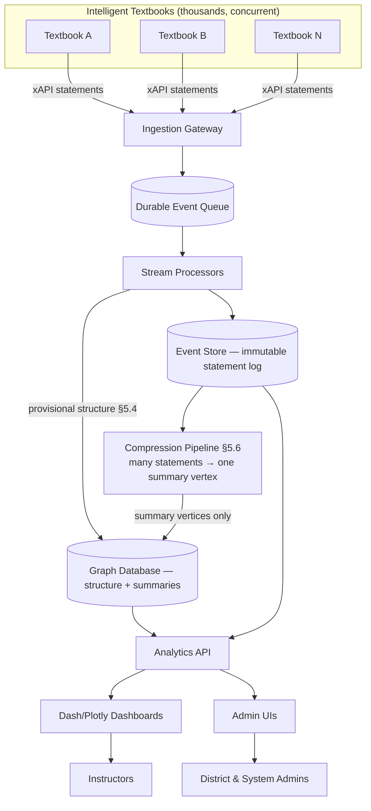

# Learning Record Store (LRS) Specification — v1

## 1. Purpose and Scope

This document specifies the functions of a **Learning Record Store (LRS)** built on a **graph database**. The LRS ingests **xAPI (Experience [Application Programming Interface](../glossary.md#application-programming-interface-api) (API))** event streams emitted by thousands of concurrently running intelligent textbooks and turns those events into actionable analytics for instructors, curriculum designers, and administrators.

The specification covers:

1. Multi-tenant organization of school districts, courses, and intelligent textbooks.
2. Non-blocking, high-throughput ingestion of xAPI statements.
3. A property-graph data model optimized for learning analytics.
4. An extensive catalog of reports and analytical tools for teachers and administrators.
5. A controlled experimentation (A/B testing) subsystem for textbooks and MicroSims.
6. Dashboard specifications modeled on the open-source **Dash / Plotly** framework.
7. Complete administrative user interfaces.
8. Non-functional requirements: scale, availability, security, and student-privacy compliance.

### 1.1 Definitions

| Term | Definition |
|------|------------|
| **xAPI** | The Experience API specification, published by [Advanced Distributed Learning](../glossary.md#advanced-distributed-learning-adl) (ADL). Learning events are expressed as *statements* of the form Actor–Verb–Object with optional Result, Context, and Timestamp. |
| **Statement** | A single immutable xAPI event, e.g. "student-123 *completed* microsim-ohms-law with score 0.9". Statements live in the event store; the graph holds only compressed summaries of them ([§5.6](#56-statement-compression)). |
| **Summary Vertex** | A graph vertex that compresses every statement at one analytical grain — e.g. all of a student's evidence for one concept — into a single node. The only event-derived vertices in the graph ([§4.3](#43-materialized-summary-vertices)). |
| **Grain** | The key a summary is computed at: (student, concept), (student, page), (section, concept), and so on. |
| **Actor** | The learner (or, less commonly, an instructor or system) who performed the action. |
| **Verb** | The action performed (e.g. `experienced`, `answered`, `completed`, `interacted`). |
| **Object (Activity)** | The thing acted upon: a page, a MicroSim, a quiz question, a concept. |
| **LRS** | This system: the store of record for all xAPI statements plus the analytics built atop them. |
| **MicroSim** | An interactive, embeddable simulation inside an intelligent textbook. |
| **Learning Graph** | The concept dependency [Directed Acyclic Graph](../glossary.md#directed-acyclic-graph-dag) (DAG) that defines a textbook's knowledge structure. |
| **Tenant** | A school district — the top-level isolation boundary. |

### 1.2 Design Principles

- **Non-blocking ingestion by default.** New textbooks may come online and begin emitting statements without any pre-registration step blocking the stream. Registration is *reconciled asynchronously*, never gated at ingest time. (See [§5.4](#54-non-blocking-onboarding-of-new-textbooks).)
- **Schema-on-read.** Unknown activities, verbs, and textbook versions are accepted, buffered, and back-filled into the graph rather than rejected.
- **Immutability of the event log.** Statements are append-only; corrections are new statements (`voided`), never mutations. The log lives in the event store.
- **Compress before materializing.** The graph stores *summaries*, never raw events. A processing pipeline compresses many statements into a **single vertex per analytical grain**, materializing only the information the graph is actually needed for. There is no per-statement vertex. (See [§4.3](#43-materialized-summary-vertices) and [§5.6](#56-statement-compression).)
- **Graph-native analytics.** Learner progress, concept mastery, and prerequisite gaps are traversal problems, and the data model is shaped to make them cheap — over compressed summaries, which is what makes the traversals small enough to be cheap.
- **Privacy by design.** Student identifiers are pseudonymized; [Personally Identifiable Information](../glossary.md#personally-identifiable-information-pii) (PII) lives behind a separate access boundary; all reporting supports aggregation thresholds (see [§12](#12-non-functional-requirements)).

---

## 2. System Context



The LRS is decomposed into five planes:

1. **Ingestion plane** — the xAPI-conformant statement endpoint and its durable queue.
2. **Processing plane** — stream workers that validate, enrich, and pseudonymize events into the event store, plus the **compression pipeline** ([§5.6](#56-statement-compression)) that distills them into summary vertices.
3. **Storage plane** — the **event store** (system of record for statements — every event, at full fidelity) plus the **property graph** (system of record for structure and relationships, holding compressed summaries of learner activity and never raw events).
4. **Analytics plane** — the query and computation services that back all reports.
5. **Presentation plane** — Dash/Plotly dashboards and the administrative [User Interfaces](../glossary.md#user-interface-ui) (UIs).

---

## 3. Multi-Tenancy Model

The LRS serves **multiple school districts**, each with **multiple courses**, each course delivered through **one or more intelligent textbooks**, each textbook composed of **chapters, pages, MicroSims, quizzes, and concepts**.

### 3.1 Tenancy Hierarchy

```
System (global)
└── District (tenant, hard isolation boundary)
    └── School
        └── Course
            └── Section (a class period / cohort)
                └── Enrollment (student ↔ section)
    └── Textbook Deployment (a textbook version assigned to one or more courses)
        └── Chapter → Page → {MicroSim, Quiz, Concept}
```

### 3.2 Isolation Requirements

| Level | Isolation Guarantee |
|-------|---------------------|
| District | **Hard.** No query may cross district boundaries except by explicit system-admin action for benchmarking, and only over de-identified aggregates above the privacy threshold ([§12.3](#123-privacy-compliance)). |
| School / Course / Section | **Soft.** Enforced by role-based access control; a teacher sees only their sections. |
| Textbook Deployment | Shared *definition* (a textbook version can be deployed in many districts) but **partitioned events** (each district's event stream is isolated). |

### 3.3 Identity and Roster

- Rosters are ingested via **OneRoster ([Comma-Separated Values](../glossary.md#comma-separated-values-csv) (CSV) or [Representational State Transfer](../glossary.md#representational-state-transfer-rest) (REST))** or [Student Information System](../glossary.md#student-information-system-sis) (SIS) integrations; the LRS never becomes the authoritative source of student identity.
- Every actor arriving on the event stream carries a **pseudonymous account** (`account.homePage` + `account.name`) resolved to an internal `student_key`. The mapping table lives in a separate, access-restricted PII vault ([§12.2](#122-security)).

---

## 4. Graph Data Model

The LRS uses a **labeled property graph**. Below is the canonical node and relationship catalog. Property names use `snake_case`; labels use `PascalCase`.

The graph holds exactly two kinds of thing: **structure** ([§4.1](#41-node-labels)–[§4.2](#42-relationship-types) — the tenancy hierarchy, the content tree, the concept DAG, deployments, experiments) and **compressed summaries** of learner activity ([§4.3](#43-materialized-summary-vertices)). It does **not** hold the statement log. Raw events live in the event store and are compressed into summary vertices by the pipeline in [§5.6](#56-statement-compression).

### 4.1 Node Labels

| Label | Key Properties | Notes |
|-------|----------------|-------|
| `District` | `district_id`, `name`, `state`, `timezone` | Tenant root. |
| `School` | `school_id`, `name`, `grade_band` | |
| `Course` | `course_id`, `title`, `subject` | |
| `Section` | `section_id`, `period`, `term`, `academic_year` | A class cohort. |
| `Student` | `student_key` (pseudonymous), `grade_level` | No PII stored here. |
| `Instructor` | `instructor_key`, `role` | |
| `Textbook` | `textbook_id`, `title`, `repo_url` | Definition, district-independent. |
| `TextbookVersion` | `version_id`, `semver`, `git_sha`, `published_at` | Enables A/B testing ([§8](#8-experimentation-ab-testing-subsystem)). |
| `Chapter` | `chapter_id`, `order`, `title` | |
| `Page` | `page_id`, `path`, `title`, `word_count` | |
| `MicroSim` | `microsim_id`, `type`, `title`, `status` | `status` ∈ {scaffold, built, approved}. |
| `MicroSimVersion` | `msv_id`, `semver`, `git_sha` | A/B unit for interactive content. |
| `Quiz` | `quiz_id`, `title` | |
| `Question` | `question_id`, `bloom_level`, `concept_ref` | |
| `Concept` | `concept_id`, `label`, `taxonomy_category` | Node of the learning graph. |
| `Verb` | `verb_id`, `iri`, `display` | Controlled vocabulary, maintained for the vocabulary browser ([§10.5](#105-xapi-endpoint-credentials-ui)). Statements reference it by `verb_id` from the event store; it is not edged to from the graph. |
| `Experiment` | `experiment_id`, `hypothesis`, `status` | A/B test definition ([§8](#8-experimentation-ab-testing-subsystem)). |
| `Variant` | `variant_id`, `arm_label`, `allocation` | Experiment arm. |

### 4.2 Relationship Types

| Relationship | From → To | Notes |
|--------------|-----------|-------|
| `HAS_SCHOOL` | District → School | |
| `OFFERS` | School → Course | |
| `HAS_SECTION` | Course → Section | |
| `ENROLLED_IN` | Student → Section | Carries `enrolled_at`, `status`. |
| `TEACHES` | Instructor → Section | |
| `DEPLOYS` | Section → TextbookVersion | Which version a cohort actually sees. |
| `VERSION_OF` | TextbookVersion → Textbook | |
| `CONTAINS` | Textbook → Chapter → Page; Quiz → Question | Structural containment. |
| `EMBEDS` | Page → {MicroSim, Quiz} | A page embeds MicroSims and quizzes. |
| `HAS_VERSION` | MicroSim → MicroSimVersion | |
| `COVERS` | {Page, MicroSim, Question} → Concept | Concept coverage mapping. |
| `DEPENDS_ON` | Concept → Concept | The learning-graph DAG edges. |
| `HAS_MASTERY` | Student → ConceptMastery | One edge per concept the student has evidence for. |
| `OF_CONCEPT` | ConceptMastery → Concept | Ties the summary into the learning graph. |
| `ENGAGED_WITH` | Student → {PageEngagement, MicroSimEngagement} | Compressed engagement summary. |
| `RESPONDED_TO` | Student → QuestionResponse | Compressed response summary. |
| `SUMMARIZES` | {PageEngagement, MicroSimEngagement, QuestionResponse} → {Page, MicroSim, Question} | The content object a summary is about. |
| `IN_CONTEXT_OF` | {ConceptMastery, PageEngagement, MicroSimEngagement} → TextbookVersion | Version-level attribution, preserved through compression. |
| `HAD_SESSION` | Student → LearningSession | A contiguous burst of learner activity. |
| `TOUCHED` | LearningSession → {Page, MicroSim, Question} | Carries `event_count`, `dwell_ms`. |
| `ROLLS_UP_TO` | ConceptMastery → SectionRollup | Feeds the class aggregate. |
| `FOR_SECTION` | SectionRollup → Section | The cohort the rollup aggregates. |
| `ASSIGNED_TO` | Student → Variant | Experiment assignment (sticky). |
| `HAS_VARIANT` | Experiment → Variant | |

### 4.3 Materialized Summary Vertices

**These are the only event-derived vertices in the graph.** There is no per-statement vertex. Each label below compresses *every statement at its grain* into a **single vertex**, refreshed incrementally by the pipeline in [§5.6](#56-statement-compression).

| Label | Grain — one vertex per… | Key Properties |
|-------|-------------------------|----------------|
| `ConceptMastery` | (student, concept) | `mastery_score`, `evidence_count`, `attempts`, `successes`, `first_seen`, `last_seen`, `statements_compressed` |
| `PageEngagement` | (student, page) | `dwell_ms_total`, `revisit_count`, `scroll_depth_max`, `first_seen`, `last_seen`, `statements_compressed` |
| `MicroSimEngagement` | (student, microsim) | `interaction_count`, `dwell_ms_total`, `completed`, `last_seen`, `statements_compressed` |
| `QuestionResponse` | (student, question) | `attempts`, `successes`, `mean_score`, `first_success_attempt`, `last_seen`, `statements_compressed` |
| `LearningSession` | (student, session) | `started_at`, `ended_at`, `duration_ms`, `event_count`, `objects_touched` |
| `SectionRollup` | (section, concept) | `mastery_distribution`, `mean_score`, `student_count`, `last_computed` |

Every summary vertex carries **`statements_compressed`** — the number of statements it represents. This makes the compression ratio observable directly in the graph (C-6) and gives every mastery and engagement figure an explicit evidence count, so a report can always say *how much* evidence a number rests on.

These are **projections**, always reproducible by replaying the immutable statement log. A summary vertex is never a source of truth: if it disagrees with the log, the log wins and the summary is rebuilt.

---

## 5. xAPI Ingestion

### 5.1 Endpoint

- Conformant **xAPI Statement Resource** at `POST /xapi/statements` (single or batched array).
- Accepts `PUT` with a client-supplied `statementId` for [idempotent](../glossary.md#idempotent) delivery.
- Returns `200`/`204` immediately after the statement is **durably queued** — not after graph projection. This decouples producer latency from processing.

### 5.2 Statement Validation

Two tiers:

1. **Structural (synchronous, at the gateway).** Well-formed [JavaScript Object Notation](../glossary.md#javascript-object-notation-json) (JSON); required `actor`, `verb`, `object`; valid timestamp. Malformed statements are rejected with `400` and logged to a dead-letter stream.
2. **Semantic (asynchronous, in the processor).** Unknown verbs, activities, or textbook versions are **accepted, not rejected** (schema-on-read). They are recorded and flagged for later reconciliation.

### 5.3 Durability and Ordering

- Statements land on a **partitioned durable queue** keyed by `district_id` (and sub-keyed by `student_key` to preserve per-learner order).
- **At-least-once** delivery to processors; idempotency enforced by `statement_id` uniqueness in the graph.
- Out-of-order arrival is tolerated: projections are timestamp-driven, not arrival-driven.

### 5.4 Non-Blocking Onboarding of New Textbooks

**Requirement:** A newly published intelligent textbook (or a new version, or a brand-new MicroSim) must be able to start emitting xAPI statements immediately, with **no pre-registration step that could block or drop the stream.**

Mechanism:

1. **Accept-first.** The gateway accepts any statement whose `context.contextActivities.grouping` names a `textbook_id`/`version_id` the LRS has never seen.
2. **Auto-provision stubs.** The processor creates placeholder `Textbook`, `TextbookVersion`, `MicroSim`, and `Concept` nodes on first sight, marked `provisional: true`.
3. **Asynchronous reconciliation.** A reconciliation worker later matches provisional nodes against the textbook's published metadata (learning graph, MicroSim registry) and promotes them to `provisional: false`, back-filling `COVERS`, `EMBEDS`, and `DEPENDS_ON` edges.
4. **No data loss.** Statements about not-yet-reconciled activities are fully retained and become richly queryable the moment reconciliation completes — retroactively, because the events are immutable and re-projectable.

> **Rationale.** Blocking ingestion on a registration handshake creates a class of failures where a classroom of students loses a lesson's worth of telemetry because a textbook shipped an hour before its metadata was registered. Accept-first, reconcile-later removes that failure mode entirely.

### 5.5 Backpressure and Scale

- Target sustained ingest: **≥ 10,000 statements/sec** aggregate, bursting to 50,000/sec (start-of-class-period spikes across time zones).
- Backpressure is applied at the queue, never by rejecting producers; producers receive `202 Accepted` with a retry hint only in extreme overload.
- Horizontal scaling: gateway and processors are stateless and autoscale on queue depth.

### 5.6 Statement Compression

**Requirement:** The graph database MUST NOT store one vertex per xAPI statement. A processing pipeline compresses many statements into a **single summary vertex per analytical grain** ([§4.3](#43-materialized-summary-vertices)), materializing only the information the graph is needed for.

> **Rationale.** At the [§5.5](#55-backpressure-and-scale) target, one-to-one materialization would add roughly 144 million vertices per day and demand on the order of 50,000 graph writes/sec. No property graph sustains that, and no report in [§7](#7-reports-and-analytical-tools) requires it — every report is an aggregate. Storing raw events in the graph would pay the full cost of the event log twice and buy nothing. The graph's job is structure and summary; the event store's job is events.

Mechanism:

1. **The log lives in the event store.** The immutable statement log ([§2](#2-system-context), storage plane) remains the system of record and stays fully queryable for F-1, F-2, and T-3. Compression discards nothing — the detail is always one query away.
2. **Incremental aggregation.** As statements land, the pipeline maintains rollups at each [§4.3](#43-materialized-summary-vertices) grain. Aggregation is incremental: a new statement updates its grain's rollup without rereading that grain's history.
3. **Change-driven materialization.** Rollups whose values changed since the last sync are written to the graph as **absolute values** on a single vertex per grain. Absolute writes are idempotent, which is what makes redelivery and replay safe.
4. **Decoupled write rate.** Graph writes are a function of *distinct active grains per sync window*, not statements/sec. An ingest burst ([§5.5](#55-backpressure-and-scale)) increases the statement count **per grain**, not the **number** of grains — so the burst is absorbed by the compressor and never reaches the graph. This is the property that makes the [§12.1](#121-scale-availability) burst target survivable.

**Requirements:**

| # | Requirement |
|---|-------------|
| C-1 | Per-statement vertices are **prohibited**. No graph vertex may represent less than one analytical grain. |
| C-2 | Summary vertices MUST be reproducible by replaying the statement log ([§12.4](#124-observability-data-quality)). They are projections, never sources of truth. |
| C-3 | Materialization MUST be **idempotent**: applying the same rollup twice leaves the graph unchanged. |
| C-4 | Late and out-of-order statements ([§5.3](#53-durability-and-ordering)) MUST be reflected in the affected summary, without reprocessing unaffected grains. |
| C-5 | Graph freshness lag MUST be configurable and reported as a first-class metric (R-405). |
| C-6 | The compression ratio (statements ÷ summary vertices) MUST be observable per district and per grain. |
| C-7 | The grain set is **configurable per deployment**. A deployment may materialize fewer grains than [§4.3](#43-materialized-summary-vertices) defines, but never a finer one than the analytical grain. |

---

## 6. Core LRS Functions

| # | Function | Description |
|---|----------|-------------|
| F-1 | **Statement storage** | Durable, immutable, queryable record of every xAPI event, held in the event store — not the graph ([§5.6](#56-statement-compression)). |
| F-2 | **Statement retrieval** | xAPI-conformant `GET /xapi/statements` with filtering by actor, verb, activity, time range, and registration. |
| F-3 | **Voiding** | Support `voided` statements to retract prior events without deletion. |
| F-4 | **Actor pseudonymization** | Resolve incoming actors to `student_key`; keep PII in the vault. |
| F-5 | **Activity resolution** | Map object [Internationalized Resource Identifiers](../glossary.md#internationalized-resource-identifier-iri) (IRIs) to graph nodes; auto-provision on first sight. |
| F-6 | **Concept mapping** | Attach statements to concepts via the `COVERS` graph so mastery can be computed. |
| F-7 | **Mastery computation** | Maintain `ConceptMastery` from evidence (quiz results, MicroSim interactions, dwell time). |
| F-7b | **Statement compression** | Compress many statements into one summary vertex per analytical grain; never materialize per-statement vertices ([§4.3](#43-materialized-summary-vertices), [§5.6](#56-statement-compression)). |
| F-8 | **Progress projection** | Maintain per-student, per-section, per-textbook progress rollups. |
| F-9 | **Experiment assignment** | Sticky, deterministic variant assignment for A/B tests ([§8](#8-experimentation-ab-testing-subsystem)). |
| F-10 | **Reconciliation** | Promote provisional nodes and back-fill structure asynchronously ([§5.4](#54-non-blocking-onboarding-of-new-textbooks)). |
| F-11 | **Export** | Bulk export of statements (per district) for archival and external analysis. |
| F-12 | **Retention & purge** | Policy-driven retention with [Family Educational Rights and Privacy Act](../glossary.md#family-educational-rights-and-privacy-act-ferpa) (FERPA)/[Children's Online Privacy Protection Act](../glossary.md#childrens-online-privacy-protection-act-coppa) (COPPA)-compliant purge on request ([§12](#12-non-functional-requirements)). |

---

## 7. Reports and Analytical Tools

This section is the **extensive catalog** of reports. Reports are grouped by audience and scope. Each report entry lists its unit of analysis, primary visualization, and the graph traversal or aggregate that powers it.

### 7.1 Instructor Reports — Student-Level

| ID | Report | Unit | Primary Viz | Backing Query |
|----|--------|------|-------------|---------------|
| R-101 | **Student Progress Overview** | Student | Progress bar + concept checklist | Traverse `Student → HAS_MASTERY → ConceptMastery → OF_CONCEPT → Concept`; compare against textbook `Concept` set. |
| R-102 | **Concept Mastery Radar** | Student | Radar/spider chart per taxonomy category | Aggregate `ConceptMastery` by `taxonomy_category`. |
| R-103 | **Time-on-Task Timeline** | Student | Gantt-style timeline | `LearningSession` summaries and their `TOUCHED` edges; drill to the event store for within-session detail. |
| R-104 | **Struggle Detector** | Student | Ranked list with severity chips | Concepts with high attempt count + low `result_score`; prerequisite gaps via `DEPENDS_ON` traversal. |
| R-105 | **Prerequisite Gap Analysis** | Student | Learning-graph subgraph highlight | For any weak concept, walk `DEPENDS_ON` upstream and flag unmastered prerequisites. |
| R-106 | **Quiz Item Analysis (per student)** | Student | Table + per-question sparkline | `QuestionResponse` summaries (`attempts`, `successes`); drill to the event store for individual attempts. |
| R-107 | **Idle / Disengagement Alert** | Student | Alert card | Students with no statements in the trailing N days for an active deployment. |
| R-108 | **Learning Velocity** | Student | Line: concepts mastered / week | Slope of cumulative mastery over time. |
| R-109 | **Reading vs. Doing Balance** | Student | Stacked bar | Ratio of `experienced` (reading) verbs to `interacted`/`answered` verbs. |

### 7.2 Instructor Reports — Section / Class-Level

| ID | Report | Unit | Primary Viz | Backing Query |
|----|--------|------|-------------|---------------|
| R-201 | **Class Mastery Heatmap** | Section × Concept | Heatmap (students × concepts) | `SectionRollup` mastery distribution. |
| R-202 | **Concept Difficulty Ranking** | Section | Horizontal bar, sorted | Mean class `result_score` per concept (ascending). |
| R-203 | **Completion Funnel** | Section | Funnel chart | Count of students reaching each chapter/page in order. |
| R-204 | **Pace Distribution** | Section | Box plot per chapter | Distribution of days-to-complete per chapter. |
| R-205 | **Class Engagement Calendar** | Section | Calendar heatmap | Daily statement counts across the term. |
| R-206 | **Question Discrimination** | Section | Scatter (difficulty × discrimination) | Classic item analysis over `Question` statements. |
| R-207 | **MicroSim Utilization** | Section | Bar + dwell distribution | Interaction counts and dwell per `MicroSim`. |
| R-208 | **Cohort Comparison** | Section vs. Section | Grouped bar / small multiples | Compare two sections a teacher owns on shared concepts. |
| R-209 | **At-Risk Roster** | Section | Ranked table with risk score | Composite: disengagement + low mastery + prerequisite gaps. |
| R-210 | **Standards Coverage** | Section | Coverage matrix | Concepts mapped to external standards (if standards graph present). |

### 7.3 Curriculum / Textbook-Performance Reports

These evaluate the **textbook itself**, not the students — the feedback loop for authors.

| ID | Report | Unit | Primary Viz | Backing Query |
|----|--------|------|-------------|---------------|
| R-301 | **Page Effectiveness** | Page | Scored table | Correlate page engagement with downstream concept mastery. |
| R-302 | **MicroSim Impact** | MicroSim | Effect-size chart | Mastery delta for students who used vs. skipped a MicroSim (observational; confounded — see A/B, [§8](#8-experimentation-ab-testing-subsystem)). |
| R-303 | **Confusing-Content Finder** | Page/Question | Ranked list | Pages with high dwell + high revisit + low subsequent success. |
| R-304 | **Drop-off Map** | Chapter/Page | Sankey / funnel | Where students stop progressing within a textbook version. |
| R-305 | **Concept-Coverage Gaps** | Textbook | Learning-graph overlay | Concepts in the DAG with little or no engagement evidence. |
| R-306 | **Question Health** | Question | Table with flags | Items that are too easy, too hard, or non-discriminating across all sections. |
| R-307 | **Version Comparison** | TextbookVersion | Small multiples | Compare engagement/mastery across two published versions. |
| R-308 | **Cross-District Benchmark** | Textbook | Box plot (de-identified) | Aggregate performance across districts, above privacy threshold only. |

### 7.4 Administrator Reports — District & System

| ID | Report | Unit | Primary Viz | Backing Query |
|----|--------|------|-------------|---------------|
| R-401 | **District Adoption Dashboard** | District | [Key Performance Indicator](../glossary.md#key-performance-indicator-kpi) (KPI) tiles + trend lines | Active textbooks, active students, statements/day. |
| R-402 | **School Comparison** | School | Grouped bar | Engagement and mastery by school. |
| R-403 | **Course Rollup** | Course | Tree map | Students and activity by course. |
| R-404 | **Deployment Inventory** | TextbookVersion | Table | Which versions are live where; provisional vs. reconciled. |
| R-405 | **Data Quality Monitor** | System | Status board | Dead-letter volume, reconciliation backlog, unknown-verb rate. |
| R-406 | **Ingestion Health** | System | Time series | Statements/sec, queue depth, processing lag. |
| R-407 | **License / Seat Utilization** | District | Gauge + trend | Active seats vs. licensed seats. |
| R-408 | **Privacy & Access Audit** | System | Audit log table | Who queried what PII, when. |

### 7.5 Analytical Tools (Interactive, not fixed reports)

| ID | Tool | Description |
|----|------|-------------|
| T-1 | **Ad-hoc Cohort Builder** | Define a cohort by predicates (grade, section, mastery band) and run any report against it. |
| T-2 | **Learning-Graph Explorer** | Interactive DAG; click a concept to see class mastery, prerequisite chains, and linked content. |
| T-3 | **Statement Query Console** | Guided (non-[Structured Query Language](../glossary.md#structured-query-language-sql) (SQL)) filter builder over the statement log with export. |
| T-4 | **Funnel Builder** | Drag content nodes to define a custom progression funnel. |
| T-5 | **Correlation Explorer** | Pick an engagement metric and an outcome metric; see scatter + trendline (clearly labeled correlational, not causal). |
| T-6 | **Experiment Designer** | Define A/B tests ([§8](#8-experimentation-ab-testing-subsystem)). |
| T-7 | **Alert Rule Builder** | Define thresholds (e.g. "notify me when a student is idle 5 days") that push to instructor notifications. |
| T-8 | **Report Scheduler** | Schedule any report to email/export on a cadence. |

---

## 8. Experimentation (A/B Testing) Subsystem

**Goal:** Determine which **versions of textbooks or MicroSims** produce the best learning outcomes, using controlled experiments rather than confounded observational comparisons.

### 8.1 Experiment Model

An `Experiment` node defines:

- **Hypothesis** (free text) and a **primary outcome metric** (e.g. downstream concept mastery, quiz success rate, completion).
- **Unit of randomization** — usually `student_key`, optionally `section_id` (cluster-randomized to avoid contamination within a class).
- **Variants** (`Variant` nodes), each an arm mapped to a specific `TextbookVersion` or `MicroSimVersion`, with an `allocation` weight.
- **Guardrail metrics** — e.g. engagement must not drop; disengagement alerts must not rise.
- **Eligibility predicate** — which districts/courses/sections participate.

### 8.2 Assignment

- **Deterministic + sticky.** `variant = hash(experiment_id, unit_id) mod buckets`, stored as `ASSIGNED_TO`. A student always sees the same arm for the life of the experiment.
- **Respects tenancy.** A district may opt out of experimentation entirely (policy flag); opted-out districts always receive the control arm.
- **Non-blocking.** Assignment is computed at ingest/serve time and does not gate the event stream — if the experiment service is unavailable, the control arm is served and the event is still recorded.

### 8.3 Analysis

| Feature | Specification |
|---------|---------------|
| **Metric computation** | Per-arm outcome means with [confidence intervals](../glossary.md#confidence-interval-ci) (CI); effect size (e.g. [Cohen's d](../glossary.md#cohens-d)) and lift %. |
| **Significance** | Two-sided test with configurable α; sequential-testing correction to allow safe peeking. |
| **Segmentation** | Break results down by grade band, prior-mastery band, district — with the privacy threshold enforced. |
| **Guardrails** | Automatic flag if any guardrail metric regresses beyond tolerance. |
| **Sample-ratio mismatch check** | Detect assignment skew that would invalidate results. |
| **Readout dashboard** | Per-experiment Dash view: allocation, enrollment over time, primary metric with CI band, guardrails, segment table, and a plain-language verdict ("Variant B improved mastery by 7% ± 2%, p < 0.01"). |

### 8.4 Example Experiments

- **Textbook version A/B:** v2.3 (control) vs. v2.4 (adds worked examples) → outcome: chapter-3 concept mastery.
- **MicroSim A/B:** static diagram vs. interactive `microsim-ohms-law` → outcome: quiz success on Ohm's-law questions.
- **Sequencing A/B:** MicroSim-before-reading vs. reading-before-MicroSim → outcome: time-to-mastery.

---

## 9. Dashboard Specifications (Dash / Plotly Model)

Dashboards are specified against the **open-source Dash / Plotly** framework as the reference implementation model: a reactive layout of components whose state is driven by **callbacks** wired to **inputs** (filters) and **outputs** (figures/tables).

### 9.1 Common Dashboard Anatomy

Every dashboard follows the same skeleton:

```
┌─────────────────────────────────────────────────────────────┐
│  Header:  District ▸ School ▸ Course ▸ Section  (breadcrumb)│
│           [Date range] [Textbook version] [Cohort] filters  │
├───────────────┬─────────────────────────────────────────────┤
│  Left rail:   │  Main canvas:                               │
│  report menu  │  KPI tiles  →  primary figure  →  detail    │
│  (dcc.Tabs)   │  (grid of dcc.Graph + dash_table)           │
├───────────────┴─────────────────────────────────────────────┤
│  Footer:  export ▾ | schedule ▾ | last refreshed | privacy  │
└─────────────────────────────────────────────────────────────┘
```

### 9.2 Component Mapping

| Dashboard concept | Dash/Plotly component | Notes |
|-------------------|-----------------------|-------|
| Global filters | `dcc.Dropdown`, `dcc.DatePickerRange`, `dcc.Store` | Filter state persisted in a `dcc.Store` so it survives tab switches. |
| KPI tiles | Plotly `Indicator` traces | Big-number + delta vs. prior period. |
| Heatmaps | `go.Heatmap` | Class mastery (R-201). |
| Funnels | `go.Funnel` | Completion funnels (R-203, R-304). |
| Radar | `go.Scatterpolar` | Concept mastery (R-102). |
| Sankey | `go.Sankey` | Drop-off maps (R-304). |
| Time series | `go.Scatter` | Engagement, ingestion health. |
| Tables | `dash_table.DataTable` | Sortable, filterable, paginated, CSV-exportable. |
| Graph explorer | `cytoscape` (dash-cytoscape) | Learning-graph DAG (T-2). |
| Reactivity | `@callback(Output, Input, State)` | Every filter change re-queries the analytics API and re-renders figures. |
| Live updates | `dcc.Interval` | Admin ingestion-health board polls on an interval. |

### 9.3 Interaction Requirements

- **Cross-filtering.** Clicking a concept in the heatmap filters the student table and the timeline (Plotly `clickData` → callback).
- **Drill-down.** Section view → click a student → student view, carrying filter context.
- **Server-side aggregation.** Figures request pre-aggregated data from the analytics API; the browser never receives raw per-statement rows for large cohorts.
- **Export.** Every figure and table exports to PNG/CSV; every dashboard exports to a shareable PDF snapshot.
- **Theming.** Light/dark parity; color scales chosen for color-vision accessibility; no meaning encoded by color alone.
- **Performance budget.** Any dashboard view renders in ≤ 2 s at the [Ninety-Fifth Percentile](../glossary.md#ninety-fifth-percentile-p95) (P95) for a section of 40 students; ≤ 5 s for a district rollup.

### 9.4 Dashboard Catalog

| Dashboard | Audience | Primary reports |
|-----------|----------|-----------------|
| **My Classes** | Instructor | R-201, R-203, R-209, R-107 |
| **Student Detail** | Instructor | R-101–R-109 |
| **Content Insights** | Author / Curriculum | R-301–R-307, T-5 |
| **Experiments** | Author / Researcher | [§8.3](#83-analysis) readout, T-6 |
| **District Overview** | District Admin | R-401–R-404, R-407 |
| **System Health** | System Admin | R-405, R-406, R-408 |
| **Learning Graph** | All (scoped) | T-2 |

---

## 10. Administrative User Interfaces

This section specifies every administrative UI in detail. Admin UIs are **separate from analytics dashboards** and are gated by elevated roles.

### 10.1 Roles and Permissions

| Role | Scope | Capabilities |
|------|-------|--------------|
| **System Admin** | Global | Everything; manages districts, ingestion, retention, cross-district benchmarks. |
| **District Admin** | One district | Manage schools, courses, sections, deployments, users, privacy policy within the district. |
| **School Admin** | One school | Manage sections and instructors within the school. |
| **Instructor** | Own sections | View analytics; no admin config. |
| **Author / Curriculum** | Textbook definitions | Content insights, experiments; no student PII. |
| **Auditor** | Read-only | Audit logs and access records only. |

[Role-Based Access Control](../glossary.md#role-based-access-control-rbac) (RBAC) is enforced at the API layer, not merely hidden in the UI. Every admin action writes to the audit log ([§10.9](#109-audit-monitoring-ui)).

### 10.2 District Management UI

- **List/create/edit districts** (System Admin only): `district_id`, name, state, timezone, privacy policy profile, experimentation opt-in flag, retention policy.
- **Roster source configuration**: OneRoster REST/CSV endpoint, SIS connector credentials (stored in a secret manager, never displayed), sync schedule, last-sync status, and a dry-run preview of roster diffs before apply.
- **Data residency & retention**: per-district retention window, purge schedule, and legal-hold toggle.

### 10.3 School / Course / Section Management UI

- [Create, Read, Update, Delete](../glossary.md#create-read-update-delete-crud) (CRUD) for schools, courses, sections with bulk import from roster sync.
- **Enrollment editor**: add/remove students from sections (usually roster-driven; manual override with reason logged).
- **Instructor assignment**: assign `TEACHES` edges; supports co-teachers.
- **Term/academic-year management**: archive prior terms; new term rolls forward section templates.

### 10.4 Textbook & Deployment Management UI

- **Textbook registry**: list all `Textbook` definitions and their `TextbookVersion`s, with reconciliation status (provisional vs. reconciled) surfaced prominently.
- **Deployment editor**: bind a `TextbookVersion` to sections/courses (`DEPLOYS` edges); schedule version rollovers.
- **Provisional reconciliation queue**: a work list of auto-provisioned stubs (from [§5.4](#54-non-blocking-onboarding-of-new-textbooks)) awaiting metadata match, with one-click "accept auto-match" or manual mapping. This UI is how the *accept-first* ingestion model stays clean over time.
- **MicroSim registry view**: list MicroSims and versions per textbook, their `status` (scaffold/built/approved), and their utilization link (R-207).

### 10.5 xAPI Endpoint & Credentials UI

- **Endpoint keys**: issue/rotate per-textbook or per-district ingest credentials ([OAuth 2.0](../glossary.md#oauth-20) client credentials or scoped bearer tokens). Keys are shown once on creation, then masked.
- **Verb & Activity vocabulary**: browse the controlled vocabulary; view *unknown verbs/activities* seen on the stream (the schema-on-read overflow) with counts, so an admin can decide to canonicalize or ignore them.
- **Dead-letter inspector**: view rejected/malformed statements (redacted), with replay-after-fix capability.

### 10.6 Experiment Administration UI

- **Experiment list**: status (draft, running, paused, concluded), owner, primary metric, current effect + CI.
- **Designer**: define hypothesis, unit of randomization, variants (bound to specific versions), allocation, eligibility predicate, guardrails, and planned sample size / power.
- **Lifecycle controls**: start, pause, ramp allocation, stop (with reason), and archive. Stopping serves everyone the control arm going forward.
- **Governance**: district-level opt-out enforcement is visible and non-overridable by authors; every start/stop is logged and, if configured, requires a second approver.

### 10.7 User & Access Management UI

- CRUD for admin/instructor/author/auditor accounts ([Single Sign-On](../glossary.md#single-sign-on-sso) (SSO)/[Security Assertion Markup Language](../glossary.md#security-assertion-markup-language-saml) (SAML)/[OpenID Connect](../glossary.md#openid-connect-oidc) (OIDC) preferred; local accounts as fallback).
- **Role assignment** scoped to district/school/section.
- **Access review**: periodic attestation workflow — an admin confirms who still needs access; stale grants flagged.
- **Impersonation** (System Admin, heavily audited) for support, with a persistent banner and full action logging.

### 10.8 Privacy & Compliance UI

- **Policy profiles**: FERPA/COPPA/[General Data Protection Regulation](../glossary.md#general-data-protection-regulation-gdpr) (GDPR) presets that set retention, aggregation thresholds, and export rules per district.
- **Data-subject requests**: search a student (by roster identity, via the PII vault with elevated auth), and execute **access**, **rectification**, or **erasure** — erasure voids/purges statements and removes the pseudonym mapping while preserving de-identified aggregates.
- **Consent status**: display and manage parental-consent state where COPPA applies; students without consent are excluded from any non-essential processing.
- **Aggregation-threshold control**: set the minimum group size (default 10) below which no disaggregated result is shown ([§12.3](#123-privacy-compliance)).

### 10.9 Audit & Monitoring UI

- **Audit log browser**: immutable log of every admin action, PII access, export, and experiment change — filterable by actor, action, target, and time; exportable for compliance review.
- **Ingestion & processing health**: live view of statements/sec, queue depth, processing lag, reconciliation backlog, dead-letter rate (mirrors R-405/R-406).
- **Alerting configuration**: thresholds that page System Admins (e.g. processing lag > 5 min, dead-letter rate > 1%).

### 10.10 System Configuration UI (System Admin)

- Retention defaults, aggregation-threshold defaults, feature flags, rate limits, autoscaling policy visibility, and integration catalog (SIS/[Learning Management System](../glossary.md#learning-management-system-lms) (LMS) connectors).

---

## 11. APIs

| API | Purpose | Notes |
|-----|---------|-------|
| **xAPI Statement API** | Ingest and retrieve statements | ADL-conformant; [§5](#5-xapi-ingestion). |
| **Analytics API** | Backs all reports/dashboards | Returns pre-aggregated, privacy-thresholded results; [GraphQL](../glossary.md#graphql) or REST. |
| **Admin API** | All admin-UI operations | RBAC-enforced; every mutation audited. |
| **Experiment API** | Assignment + readouts | Sticky assignment; [§8](#8-experimentation-ab-testing-subsystem). |
| **Roster API** | OneRoster ingest | Inbound sync. |
| **Export API** | Bulk statement/report export | Async job model with signed download URLs. |

All APIs: authenticated (OAuth2/OIDC), rate-limited, versioned, and tenant-scoped. The ingestion API's `POST /statements` is explicitly exempt from any registration precondition ([§5.4](#54-non-blocking-onboarding-of-new-textbooks)).

---

## 12. Non-Functional Requirements

### 12.1 Scale & Availability

- Sustained ingest ≥ 10k statements/sec; burst 50k/sec.
- Ingestion availability ≥ 99.95% (the stream must not drop lessons).
- Analytics availability ≥ 99.9%.
- Horizontal scale on all planes; no single-tenant hotspot may degrade others (per-district queue partitioning).

### 12.2 Security

- Encryption in transit ([Transport Layer Security](../glossary.md#transport-layer-security-tls) (TLS) 1.2+) and at rest.
- PII vault isolated from the analytics graph; join keys are pseudonyms only.
- Secrets (SIS creds, ingest keys) in a managed secret store; never rendered in any UI after creation.
- Least-privilege RBAC enforced at the API layer; all privileged actions audited.

### 12.3 Privacy & Compliance

- **FERPA / COPPA / GDPR** aligned. Districts choose a policy profile that governs retention, export, and consent.
- **Aggregation threshold** (default group size ≥ 10): no report may reveal a disaggregated result for a group smaller than the threshold; cross-district benchmarks (R-308, R-402) enforce it strictly.
- **Right to erasure**: implemented via void + purge + pseudonym-mapping deletion, preserving only de-identified aggregates.
- **Data minimization**: only learning telemetry is stored; no keystroke/behavioral surveillance beyond declared learning events.

### 12.4 Observability & Data Quality

- End-to-end tracing from statement receipt to projection.
- Reconciliation backlog, unknown-verb rate, and dead-letter volume are first-class monitored metrics (R-405).
- Every projection is reproducible by replaying the immutable log — the ultimate data-quality backstop.

---

## 13. Open Questions / Future Work

- **Real-time nudges**: push in-textbook interventions when the LRS detects a struggle pattern (requires a low-latency serve path back to the textbook).
- **Predictive risk models**: [Machine Learning](../glossary.md#machine-learning-ml) (ML) on the graph to forecast at-risk students earlier than threshold rules (R-209) — with strict fairness and transparency review.
- **Standards-progression graph**: deeper integration with external standards frameworks for R-210.
- **Federated benchmarking**: privacy-preserving cross-district comparison via [differential privacy](../glossary.md#differential-privacy) rather than simple thresholds.

---

*Specification v1 — initial draft. This is a scaffold-status design document intended to seed the textbook's architecture chapters and to guide an initial implementation.*
