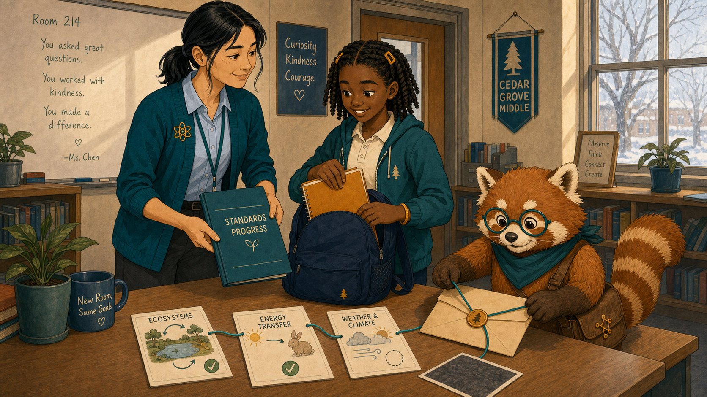
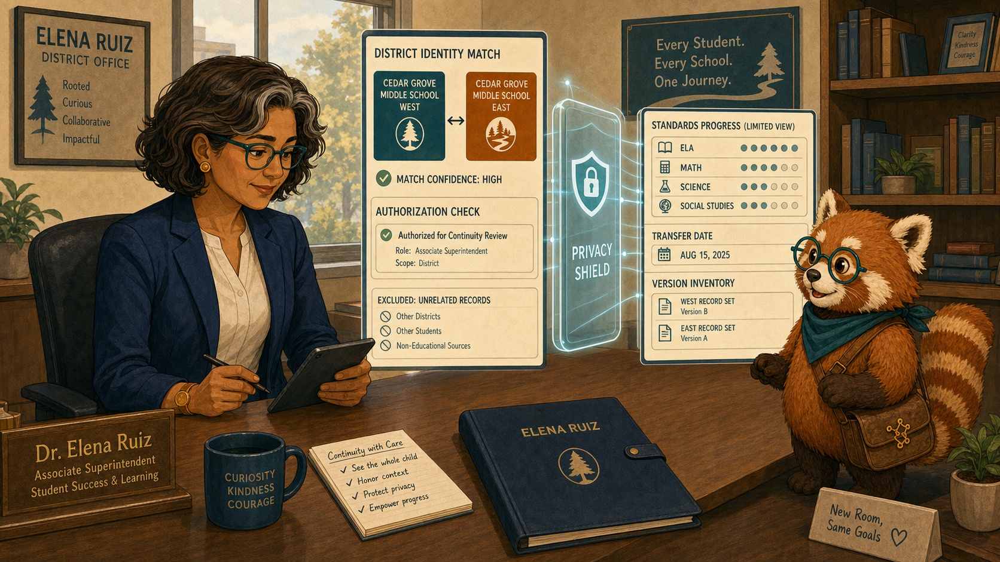
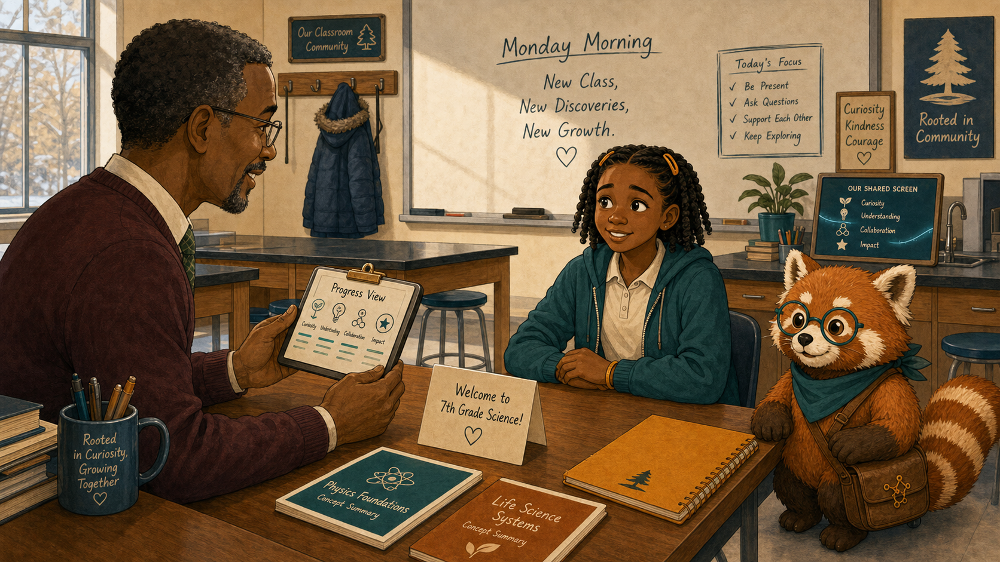
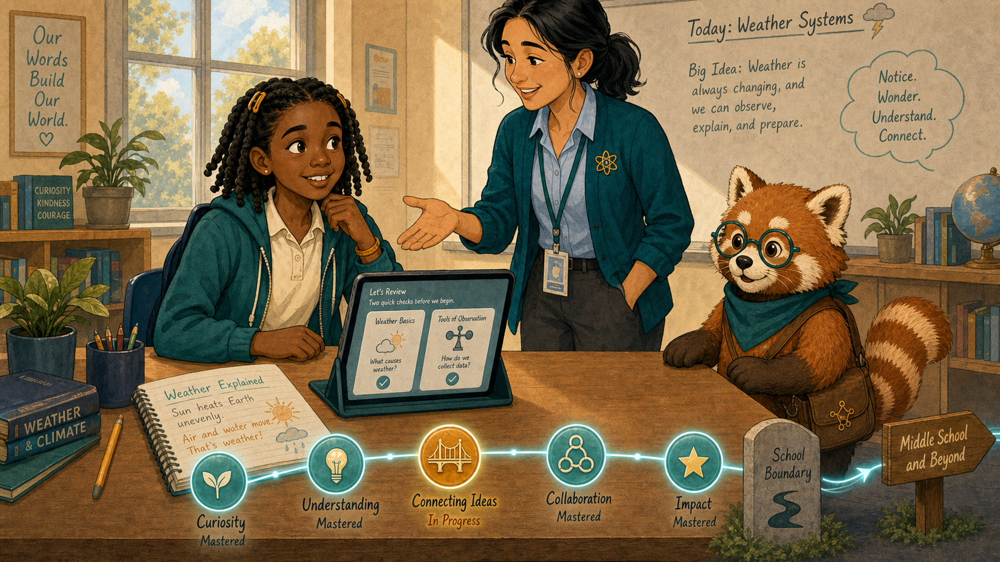
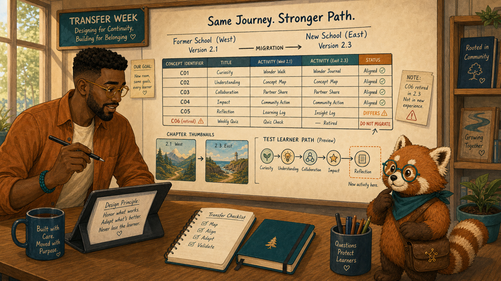
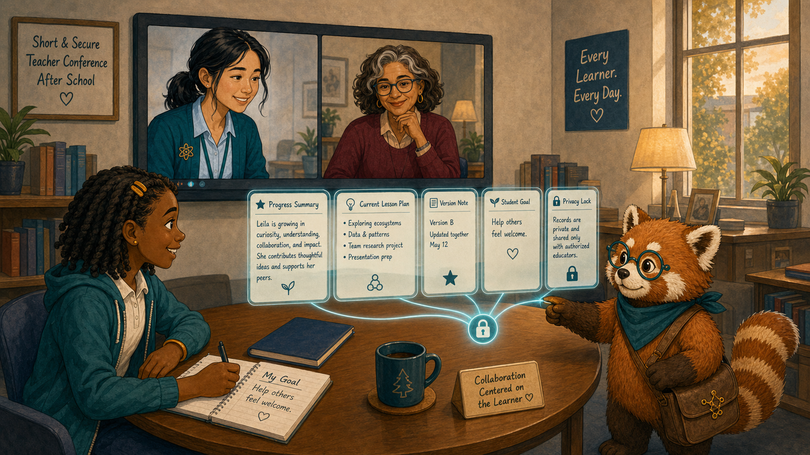
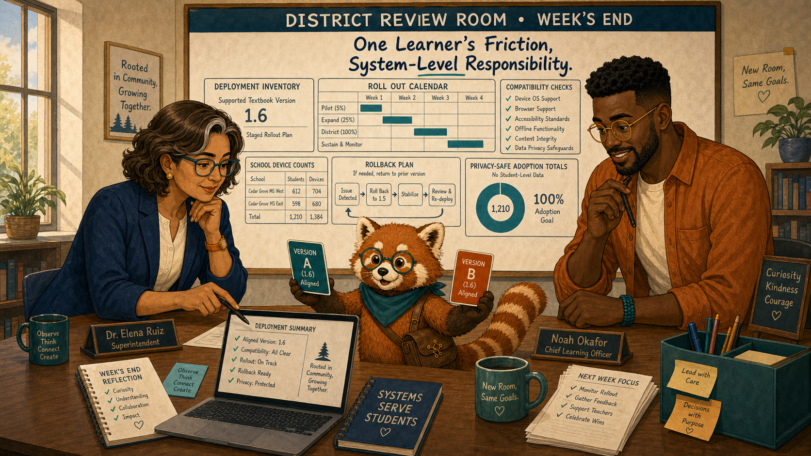
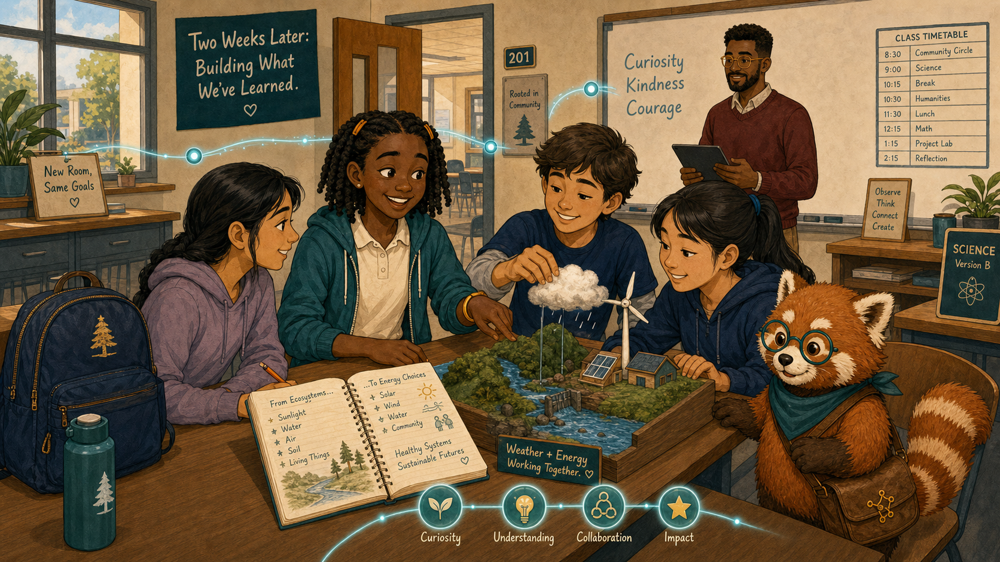

# A New Classroom, the Same Learning Journey

Cover Image Prompt

(This is the Cover Image. Do not include this label in the image.)
Generate a wide-landscape 16:9 illustration in a warm contemporary educational-comic style with clean ink contours, softly painted color, expressive natural faces, gentle paper texture, realistic proportions, and a navy, deep-teal, cinnamon, cream, and amber palette. Set the scene between two Cedar Grove district middle schools on a crisp January morning. Show Leila Brooks, a 13-year-old Black American girl with a slender, age-appropriate build, rich dark-brown skin, a heart-shaped full-cheeked face, broad nose, large dark-brown eyes, and a small gap between her upper front teeth visible when she smiles; her black shoulder-length two-strand twists have a center part and are held back by two symmetrical matte amber barrettes, and she wears a cream short-sleeved polo under a teal zip-front school hoodie, dark-navy straight-leg trousers, cinnamon high-top sneakers, and an amber elastic wristband on her left wrist. Show Ms. Maya Chen, a 35-year-old Chinese American woman with a compact athletic build, light warm-beige skin, a softly square face with rounded cheeks, a small beauty mark below the outer corner of her left eye, and dark-brown almond-shaped eyes; her straight blue-black hair is center-parted in a low ponytail with two short face-framing strands, and she wears a deep-teal cardigan with pushed-up sleeves over a pale-blue button-front shirt, charcoal ankle trousers, white low-profile sneakers, an amber atom pin, and a dark-teal school lanyard. Show Dr. Elena Ruiz, a 47-year-old Mexican American woman of medium height and build, with warm medium-brown skin, an oval high-cheekboned face, dark-brown eyes behind thin rectangular deep-teal glasses, and a collarbone-length wavy espresso-brown bob with a side part and one narrow silver streak at her right temple; she wears a navy blazer over a cream collarless blouse, charcoal trousers, small hammered-gold circular studs, and a slim amber watch on her left wrist. Show Noah Okafor, a 31-year-old Nigerian American man who is tall and lean, with deep umber-brown skin, a long oval face, broad nose, high forehead, dark-brown eyes behind round translucent amber glasses, a very short boxed beard and mustache, and dense black hair in a neat flat-topped coil cut with faded sides; he wears an open cinnamon overshirt over a cream crew-neck shirt, dark indigo trousers, teal canvas shoes, and a narrow deep-teal woven bracelet on his right wrist, and he usually holds a black stylus in his left hand. Show Rowan, a small rounded anthropomorphic red panda about desk height, with cinnamon-orange fur, a cream muzzle, cream eyebrow patches and belly, large kind brown eyes, dark-brown legs, and a thick ringed cinnamon-and-cream tail; he wears round deep-teal glasses, a deep-teal triangular neckerchief, and a compact brown cross-body satchel bearing a small gold connected-dots emblem. Create two distinct classroom doorways connected by a glowing teal record thread passing through a privacy shield. Leila stands between them with her amber notebook and navy backpack; Maya offers a farewell folder, Elena checks district authorization, Noah aligns two textbook version cards, and Rowan carries only a compact progress summary. Include a moving box, two school icons, concept nodes, a welcome desk, and no reset arrow. Render the exact title “A New Classroom, the Same Learning Journey” once in bold hand-lettered navy type. Emotional tone: uncertainty giving way to continuity and welcome. Keep every named character exactly consistent with this description, keep Rowan desk-height, and show no brands, logos, rankings, exposed private records, or decorative data. Generate the image immediately without asking clarifying questions.

Narrative Prompt

This fictional eight-panel story follows Leila during a transfer between two schools in the same district. Preserve all recurring character anchors. The receiving teacher is unnamed and visually consistent within this story: a middle-aged Black man with close-cropped salt-and-pepper hair, burgundy sweater, cream shirt, and green checked tie. Authorized standards-based progress supports a conversation; it never replaces teacher judgment or exposes unrelated history.

### Prologue – Moving Should Not Erase Learning

Leila Brooks is a 13-year-old seventh-grade science student preparing to transfer between two Cedar Grove schools. She expected a new hallway and unfamiliar faces. She feared the new textbook would also send her back to the beginning.

## Panel 1: The Last Day in Room 214

Image Prompt

(This is Panel 01. Do not include the panel number in the image.)
Generate a wide-landscape 16:9 illustration in a warm contemporary educational-comic style with clean ink contours, softly painted color, expressive natural faces, gentle paper texture, realistic proportions, and a navy, deep-teal, cinnamon, cream, and amber palette. Set the scene in Room 214 after Leila's final class in January. Show Leila Brooks, a 13-year-old Black American girl with a slender, age-appropriate build, rich dark-brown skin, a heart-shaped full-cheeked face, broad nose, large dark-brown eyes, and a small gap between her upper front teeth visible when she smiles; her black shoulder-length two-strand twists have a center part and are held back by two symmetrical matte amber barrettes, and she wears a cream short-sleeved polo under a teal zip-front school hoodie, dark-navy straight-leg trousers, cinnamon high-top sneakers, and an amber elastic wristband on her left wrist. Show Ms. Maya Chen, a 35-year-old Chinese American woman with a compact athletic build, light warm-beige skin, a softly square face with rounded cheeks, a small beauty mark below the outer corner of her left eye, and dark-brown almond-shaped eyes; her straight blue-black hair is center-parted in a low ponytail with two short face-framing strands, and she wears a deep-teal cardigan with pushed-up sleeves over a pale-blue button-front shirt, charcoal ankle trousers, white low-profile sneakers, an amber atom pin, and a dark-teal school lanyard. Show Rowan, a small rounded anthropomorphic red panda about desk height, with cinnamon-orange fur, a cream muzzle, cream eyebrow patches and belly, large kind brown eyes, dark-brown legs, and a thick ringed cinnamon-and-cream tail; he wears round deep-teal glasses, a deep-teal triangular neckerchief, and a compact brown cross-body satchel bearing a small gold connected-dots emblem. Leila places her amber notebook into a navy backpack while Maya gives her a simple standards-progress folder; Rowan traces a teal thread from completed concept cards into a sealed transfer envelope. Include an ecosystems diagram, a mastered energy-transfer node, a partial weather node, a class photo turned face-down, and winter window light.  Emotional tone: bittersweet transition with dignity. Keep every named character exactly consistent with this description, keep Rowan desk-height, and show no brands, logos, rankings, exposed private records, or decorative data. Generate the image immediately without asking clarifying questions.

Ms. Maya Chen teaches Leila's current science class. Rowan is the textbook's red-panda learning guide, helping people follow evidence without deciding for them. Maya reviewed what Leila could explain, what still needed practice, and what she wanted her next teacher to know. “You are changing classrooms,” Maya said, “not becoming a blank page.”

## Panel 2: Authorized, Not Automatic

Image Prompt

(This is Panel 02. Do not include the panel number in the image.)
Generate a wide-landscape 16:9 illustration in a warm contemporary educational-comic style with clean ink contours, softly painted color, expressive natural faces, gentle paper texture, realistic proportions, and a navy, deep-teal, cinnamon, cream, and amber palette. Set the scene in Elena's district office that afternoon. Show Dr. Elena Ruiz, a 47-year-old Mexican American woman of medium height and build, with warm medium-brown skin, an oval high-cheekboned face, dark-brown eyes behind thin rectangular deep-teal glasses, and a collarbone-length wavy espresso-brown bob with a side part and one narrow silver streak at her right temple; she wears a navy blazer over a cream collarless blouse, charcoal trousers, small hammered-gold circular studs, and a slim amber watch on her left wrist. Show Rowan, a small rounded anthropomorphic red panda about desk height, with cinnamon-orange fur, a cream muzzle, cream eyebrow patches and belly, large kind brown eyes, dark-brown legs, and a thick ringed cinnamon-and-cream tail; he wears round deep-teal glasses, a deep-teal triangular neckerchief, and a compact brown cross-body satchel bearing a small gold connected-dots emblem. Elena reviews a district-scoped identity match and a limited standards-progress card passing through a privacy shield. Include two school identifiers, an authorization check, excluded unrelated records, a transfer date, a version inventory, and Elena's navy folio.  Emotional tone: careful continuity with clear boundaries. Keep every named character exactly consistent with this description, keep Rowan desk-height, and show no brands, logos, rankings, exposed private records, or decorative data. Generate the image immediately without asking clarifying questions.

Dr. Elena Ruiz is the district learning director and oversees appropriate use of district learning records. She confirmed the student identity match and limited the receiving view to educationally relevant progress. Portability meant carrying useful context—not opening every record to everyone.

## Panel 3: A Welcome with Context

Image Prompt

(This is Panel 03. Do not include the panel number in the image.)
Generate a wide-landscape 16:9 illustration in a warm contemporary educational-comic style with clean ink contours, softly painted color, expressive natural faces, gentle paper texture, realistic proportions, and a navy, deep-teal, cinnamon, cream, and amber palette. Set the scene in a new science classroom on Monday morning. Show Leila Brooks, a 13-year-old Black American girl with a slender, age-appropriate build, rich dark-brown skin, a heart-shaped full-cheeked face, broad nose, large dark-brown eyes, and a small gap between her upper front teeth visible when she smiles; her black shoulder-length two-strand twists have a center part and are held back by two symmetrical matte amber barrettes, and she wears a cream short-sleeved polo under a teal zip-front school hoodie, dark-navy straight-leg trousers, cinnamon high-top sneakers, and an amber elastic wristband on her left wrist. Show Rowan, a small rounded anthropomorphic red panda about desk height, with cinnamon-orange fur, a cream muzzle, cream eyebrow patches and belly, large kind brown eyes, dark-brown legs, and a thick ringed cinnamon-and-cream tail; he wears round deep-teal glasses, a deep-teal triangular neckerchief, and a compact brown cross-body satchel bearing a small gold connected-dots emblem. Leila sits across from the unnamed receiving teacher, a middle-aged Black man with close-cropped salt-and-pepper hair, burgundy sweater, cream shirt, and green checked tie; he turns a compact progress view toward Leila. Include a welcome card, two secure concept summaries, her amber notebook, unfamiliar lab stools, a winter coat hook, and Rowan beside the shared screen.  Emotional tone: nervousness softened by respectful conversation. Keep every named character exactly consistent with this description, keep Rowan desk-height, and show no brands, logos, rankings, exposed private records, or decorative data. Generate the image immediately without asking clarifying questions.

Mr. Adrian Bell is Leila's new seventh-grade science teacher. He did not begin by announcing what the dashboard said. He asked Leila what she remembered, then turned the authorized progress summary toward her so they could compare it with her own account.

## Panel 4: Review Without Restarting

Image Prompt

(This is Panel 04. Do not include the panel number in the image.)
Generate a wide-landscape 16:9 illustration in a warm contemporary educational-comic style with clean ink contours, softly painted color, expressive natural faces, gentle paper texture, realistic proportions, and a navy, deep-teal, cinnamon, cream, and amber palette. Set the scene at Leila's new classroom desk later that morning. Show Leila Brooks, a 13-year-old Black American girl with a slender, age-appropriate build, rich dark-brown skin, a heart-shaped full-cheeked face, broad nose, large dark-brown eyes, and a small gap between her upper front teeth visible when she smiles; her black shoulder-length two-strand twists have a center part and are held back by two symmetrical matte amber barrettes, and she wears a cream short-sleeved polo under a teal zip-front school hoodie, dark-navy straight-leg trousers, cinnamon high-top sneakers, and an amber elastic wristband on her left wrist. Show Rowan, a small rounded anthropomorphic red panda about desk height, with cinnamon-orange fur, a cream muzzle, cream eyebrow patches and belly, large kind brown eyes, dark-brown legs, and a thick ringed cinnamon-and-cream tail; he wears round deep-teal glasses, a deep-teal triangular neckerchief, and a compact brown cross-body satchel bearing a small gold connected-dots emblem. Leila's tablet offers two short review cards leading into the current weather lesson rather than a long locked chapter sequence. Include mastered nodes remaining teal, one amber bridge node, her notebook explanation, the teacher's open-hand gesture, a progress path continuing across the school boundary, and no skip-as-reward icon.  Emotional tone: relief and regained momentum. Keep every named character exactly consistent with this description, keep Rowan desk-height, and show no brands, logos, rankings, exposed private records, or decorative data. Generate the image immediately without asking clarifying questions.

The textbook recognized secure prerequisites and offered two short review checks for the new chapter. Leila completed them, explained one missed idea, and joined the class lesson before lunch. Continuity saved time without pretending every prior result was permanent truth.

## Panel 5: The Version Mismatch

Image Prompt

(This is Panel 05. Do not include the panel number in the image.)
Generate a wide-landscape 16:9 illustration in a warm contemporary educational-comic style with clean ink contours, softly painted color, expressive natural faces, gentle paper texture, realistic proportions, and a navy, deep-teal, cinnamon, cream, and amber palette. Set the scene in Noah's design studio during the transfer week. Show Noah Okafor, a 31-year-old Nigerian American man who is tall and lean, with deep umber-brown skin, a long oval face, broad nose, high forehead, dark-brown eyes behind round translucent amber glasses, a very short boxed beard and mustache, and dense black hair in a neat flat-topped coil cut with faded sides; he wears an open cinnamon overshirt over a cream crew-neck shirt, dark indigo trousers, teal canvas shoes, and a narrow deep-teal woven bracelet on his right wrist, and he usually holds a black stylus in his left hand. Show Rowan, a small rounded anthropomorphic red panda about desk height, with cinnamon-orange fur, a cream muzzle, cream eyebrow patches and belly, large kind brown eyes, dark-brown legs, and a thick ringed cinnamon-and-cream tail; he wears round deep-teal glasses, a deep-teal triangular neckerchief, and a compact brown cross-body satchel bearing a small gold connected-dots emblem. Noah compares version 2.1 from the former school with version 2.3 at the new school; equivalent concept identifiers align while one activity differs. Include a mapping table, two chapter thumbnails, a left-hand stylus, a warning on one retired identifier, a migration arrow, and a test learner path.  Emotional tone: precise attention to an invisible transition risk. Keep every named character exactly consistent with this description, keep Rowan desk-height, and show no brands, logos, rankings, exposed private records, or decorative data. Generate the image immediately without asking clarifying questions.

Noah Okafor designs the district's interactive science textbook. He found that the two schools used different releases, and one review activity had changed identifiers. Noah added a version-aware mapping so Leila's evidence reached the same learning concepts instead of disappearing between editions.

## Panel 6: Teachers Compare Notes

Image Prompt

(This is Panel 06. Do not include the panel number in the image.)
Generate a wide-landscape 16:9 illustration in a warm contemporary educational-comic style with clean ink contours, softly painted color, expressive natural faces, gentle paper texture, realistic proportions, and a navy, deep-teal, cinnamon, cream, and amber palette. Set the scene in a short secure teacher conference after school. Show Ms. Maya Chen, a 35-year-old Chinese American woman with a compact athletic build, light warm-beige skin, a softly square face with rounded cheeks, a small beauty mark below the outer corner of her left eye, and dark-brown almond-shaped eyes; her straight blue-black hair is center-parted in a low ponytail with two short face-framing strands, and she wears a deep-teal cardigan with pushed-up sleeves over a pale-blue button-front shirt, charcoal ankle trousers, white low-profile sneakers, an amber atom pin, and a dark-teal school lanyard. Show Leila Brooks, a 13-year-old Black American girl with a slender, age-appropriate build, rich dark-brown skin, a heart-shaped full-cheeked face, broad nose, large dark-brown eyes, and a small gap between her upper front teeth visible when she smiles; her black shoulder-length two-strand twists have a center part and are held back by two symmetrical matte amber barrettes, and she wears a cream short-sleeved polo under a teal zip-front school hoodie, dark-navy straight-leg trousers, cinnamon high-top sneakers, and an amber elastic wristband on her left wrist. Show Rowan, a small rounded anthropomorphic red panda about desk height, with cinnamon-orange fur, a cream muzzle, cream eyebrow patches and belly, large kind brown eyes, dark-brown legs, and a thick ringed cinnamon-and-cream tail; he wears round deep-teal glasses, a deep-teal triangular neckerchief, and a compact brown cross-body satchel bearing a small gold connected-dots emblem. Maya appears on a video tile beside the unnamed receiving teacher with salt-and-pepper hair and burgundy sweater; Leila sits present with her notebook open. Include only the authorized progress summary, a current lesson plan, a version note, one student-authored goal, a privacy lock, and Rowan connecting—not opening—the records.  Emotional tone: collaboration centered on the learner. Keep every named character exactly consistent with this description, keep Rowan desk-height, and show no brands, logos, rankings, exposed private records, or decorative data. Generate the image immediately without asking clarifying questions.

With Leila present, Maya and Mr. Bell compared instructional context. Maya described the energy-transfer bridge; Leila explained which part had helped. The teachers used the record to ask better questions, not to speak around her.

## Panel 7: Align the Schools

Image Prompt

(This is Panel 07. Do not include the panel number in the image.)
Generate a wide-landscape 16:9 illustration in a warm contemporary educational-comic style with clean ink contours, softly painted color, expressive natural faces, gentle paper texture, realistic proportions, and a navy, deep-teal, cinnamon, cream, and amber palette. Set the scene in Elena's district review room at week's end. Show Dr. Elena Ruiz, a 47-year-old Mexican American woman of medium height and build, with warm medium-brown skin, an oval high-cheekboned face, dark-brown eyes behind thin rectangular deep-teal glasses, and a collarbone-length wavy espresso-brown bob with a side part and one narrow silver streak at her right temple; she wears a navy blazer over a cream collarless blouse, charcoal trousers, small hammered-gold circular studs, and a slim amber watch on her left wrist. Show Noah Okafor, a 31-year-old Nigerian American man who is tall and lean, with deep umber-brown skin, a long oval face, broad nose, high forehead, dark-brown eyes behind round translucent amber glasses, a very short boxed beard and mustache, and dense black hair in a neat flat-topped coil cut with faded sides; he wears an open cinnamon overshirt over a cream crew-neck shirt, dark indigo trousers, teal canvas shoes, and a narrow deep-teal woven bracelet on his right wrist, and he usually holds a black stylus in his left hand. Show Rowan, a small rounded anthropomorphic red panda about desk height, with cinnamon-orange fur, a cream muzzle, cream eyebrow patches and belly, large kind brown eyes, dark-brown legs, and a thick ringed cinnamon-and-cream tail; he wears round deep-teal glasses, a deep-teal triangular neckerchief, and a compact brown cross-body satchel bearing a small gold connected-dots emblem. Elena and Noah examine a deployment inventory showing the two schools moving onto the same supported textbook version in a staged rollout. Include compatibility checks, an update calendar, rollback arrows, school device counts, privacy-safe adoption totals, and Rowan holding aligned version cards.  Emotional tone: system-level responsibility following one learner's friction. Keep every named character exactly consistent with this description, keep Rowan desk-height, and show no brands, logos, rankings, exposed private records, or decorative data. Generate the image immediately without asking clarifying questions.

Elena used the transfer mismatch to improve the deployment inventory. She scheduled a controlled update, kept rollback available, and notified teachers about the mapping. The fix helped future transfers without turning Leila's experience into a public case file.

## Panel 8: The Journey Continues

Image Prompt

(This is Panel 08. Do not include the panel number in the image.)
Generate a wide-landscape 16:9 illustration in a warm contemporary educational-comic style with clean ink contours, softly painted color, expressive natural faces, gentle paper texture, realistic proportions, and a navy, deep-teal, cinnamon, cream, and amber palette. Set the scene in the new classroom two weeks later. Show Leila Brooks, a 13-year-old Black American girl with a slender, age-appropriate build, rich dark-brown skin, a heart-shaped full-cheeked face, broad nose, large dark-brown eyes, and a small gap between her upper front teeth visible when she smiles; her black shoulder-length two-strand twists have a center part and are held back by two symmetrical matte amber barrettes, and she wears a cream short-sleeved polo under a teal zip-front school hoodie, dark-navy straight-leg trousers, cinnamon high-top sneakers, and an amber elastic wristband on her left wrist. Show Rowan, a small rounded anthropomorphic red panda about desk height, with cinnamon-orange fur, a cream muzzle, cream eyebrow patches and belly, large kind brown eyes, dark-brown legs, and a thick ringed cinnamon-and-cream tail; he wears round deep-teal glasses, a deep-teal triangular neckerchief, and a compact brown cross-body satchel bearing a small gold connected-dots emblem. Leila works with three unnamed new classmates on a weather model, her amber notebook open to a page linking old ecosystem learning with new energy ideas. Include the continuing teal progress thread, the burgundy-sweater teacher in the background, an aligned version tag, a new class timetable, her navy backpack, and a genuine tooth-gap smile.  Emotional tone: belonging earned without erasing the transition. Keep every named character exactly consistent with this description, keep Rowan desk-height, and show no brands, logos, rankings, exposed private records, or decorative data. Generate the image immediately without asking clarifying questions.

Two weeks later, Leila was not repeating old chapters or racing past needed review. Her record had preserved momentum, while conversations had corrected its limits. The new classroom became part of the same learning journey.

### Epilogue – Continuity Needs Context

Portable records worked because identities, standards, permissions, and textbook versions aligned. Just as important, Leila and both teachers interpreted the summary together. Transfer support preserved learning without freezing the learner in an old snapshot.

| Challenge | How the Team Responded | Lesson for Today |
|---|---|---|
| A move threatened a full restart | The district carried standards-based progress | Learning should be portable |
| A summary could have become a label | The new teacher began with conversation | Records support relationships |
| Schools used different releases | Noah mapped equivalent concepts | Version context preserves meaning |
| One transfer revealed a system gap | Elena aligned deployments | Individual friction can guide systemic repair |

### Call to Action

When learners change schools, preserve useful evidence, state its limits, and invite them to interpret it. Continuity is strongest when interoperable records travel with context, consent, and version awareness.

---

*“I changed schools. My learning didn't disappear.”* 
—Leila Brooks, fictional student

*“A record should help us welcome a learner, not pre-write the learner's story.”* 
—Mr. Adrian Bell, fictional teacher

*“Portability without context is only movement.”* 
—Dr. Elena Ruiz, fictional district learning director

---

## References

1. [Wikipedia: Learning record store](https://en.wikipedia.org/wiki/Learning_record_store) - Overview of systems that store learning-experience records
2. [Wikipedia: Interoperability](https://en.wikipedia.org/wiki/Interoperability) - Background on systems exchanging and using information consistently
3. [Wikipedia: Student mobility](https://en.wikipedia.org/wiki/Student_mobility) - Introduction to learners changing schools during their education
4. [ADL: Experience API specification](https://github.com/adlnet/xAPI-Spec) - Specification for interoperable learning-experience records
5. [Ed-Fi Alliance: Data Standard](https://www.ed-fi.org/what-is-ed-fi/ed-fi-data-standard/) - Education data standard supporting consistent exchange across systems
