# Learning Record Store Stories

These stories are short mini-graphic novel stories about how the following groups will all benefit from having a high-quality real-time Learning Record Store: school district administrators, teachers/instructors, textbook designers, and students.

- **[The Red Node Before Monday](the-red-node-before-monday/index.md)**

    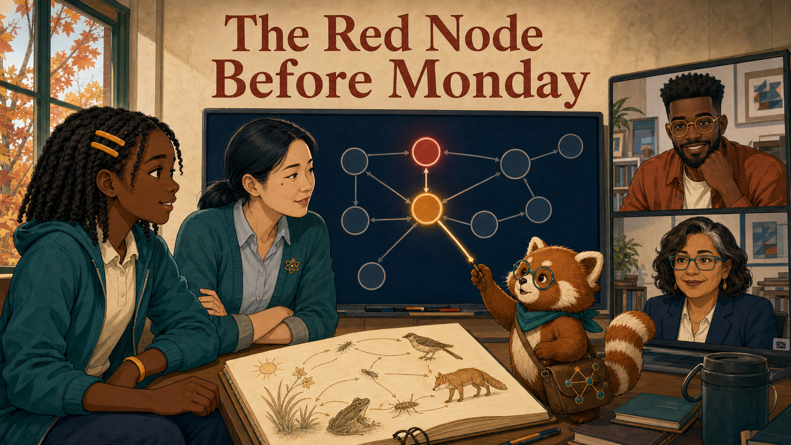
    A red mastery mark sends Leila, Maya, Noah, Elena, and Rowan upstream through a
    concept graph. The clue reveals a missing prerequisite—and a better response than
    simply reteaching the difficult lesson.

- **[The Simulation Everyone Escaped](the-simulation-everyone-escaped/index.md)**

    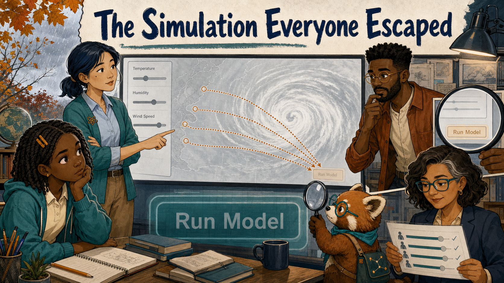
    Repeated exits from a climate MicroSim look like science confusion until the team
    reproduces the learner's path. Sometimes the learner is not broken—the button is.

- **[Two Paths Through the Storm](two-paths-through-the-storm/index.md)**

    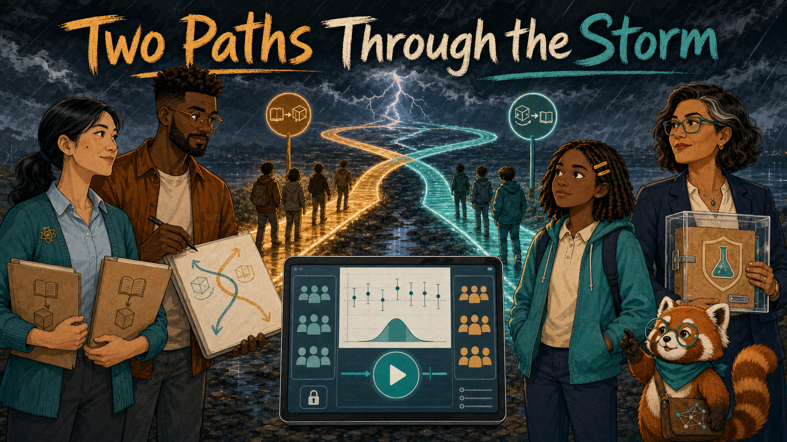
    Reading before simulation or simulation before reading? The team tests both lesson
    sequences fairly and learns how uncertainty, safeguards, and student voice turn a
    comparison into a defensible improvement.

- **[The School That Faded from the Map](the-school-that-faded-from-the-map/index.md)**

    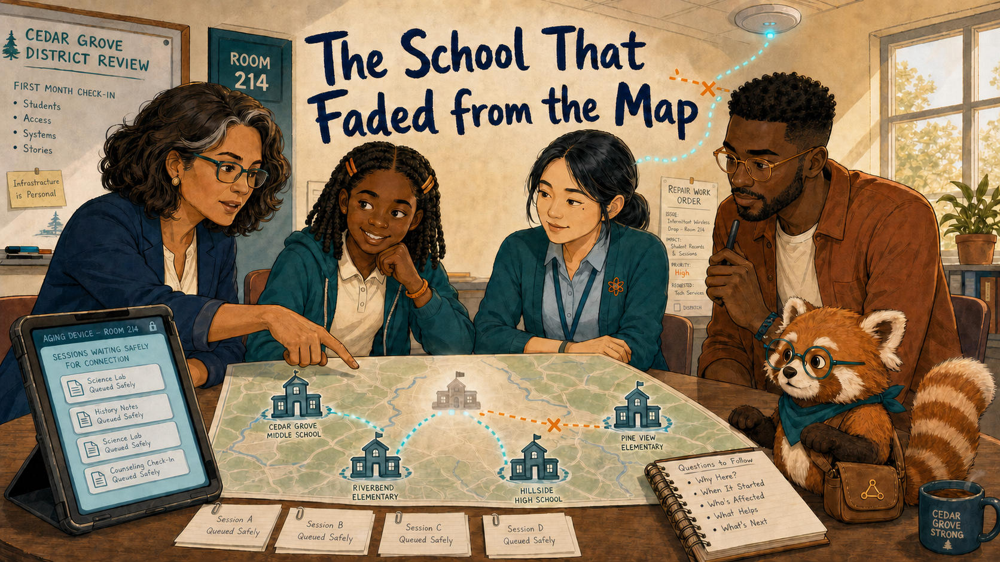
    A quiet adoption map leads beyond assumptions to unstable wireless access, hidden
    effort, and a repair shared by infrastructure and textbook design.

- **[The Question with Two Right Answers](the-question-with-two-right-answers/index.md)**

    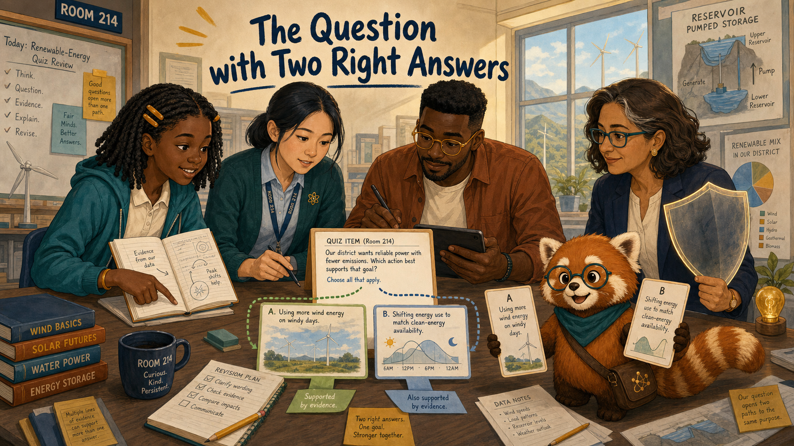
    Leila's careful objection exposes an ambiguous assessment item and shows how a fair
    correction must propagate through every summary that used it.

- **[The Case of the Missing Tuesday](the-case-of-the-missing-tuesday/index.md)**

    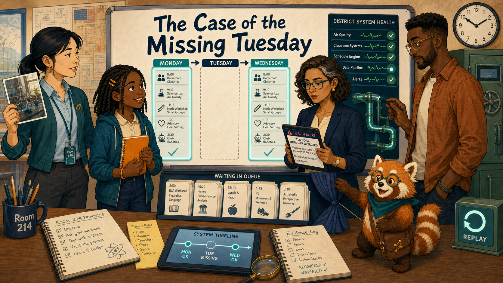
    A blank dashboard day conflicts with a lively lab, sending the team through stored
    statements, delayed summaries, and an auditable replay.

- **[A New Classroom, the Same Learning Journey](a-new-classroom-the-same-learning-journey/index.md)**

    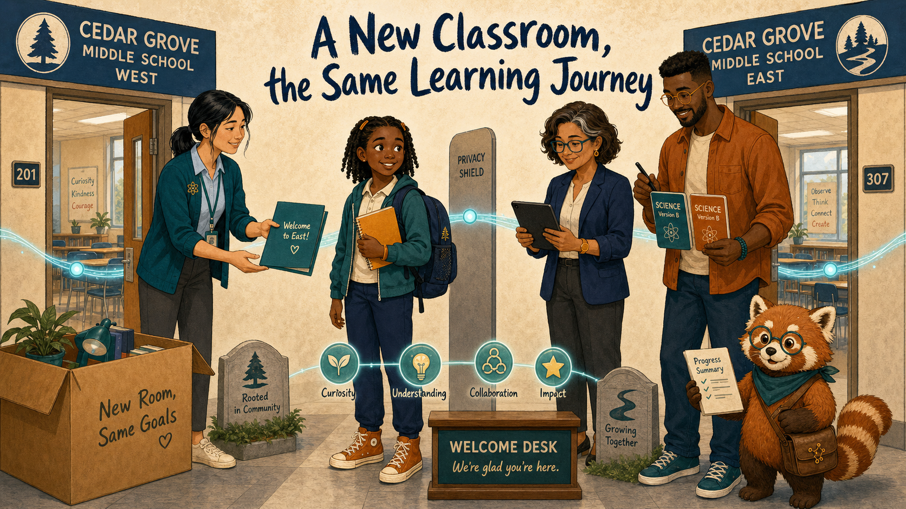
    A mid-semester transfer tests whether portable, version-aware records can preserve
    momentum while keeping the learner in the conversation.

- **[The Small Group Behind the Curtain](the-small-group-behind-the-curtain/index.md)**

    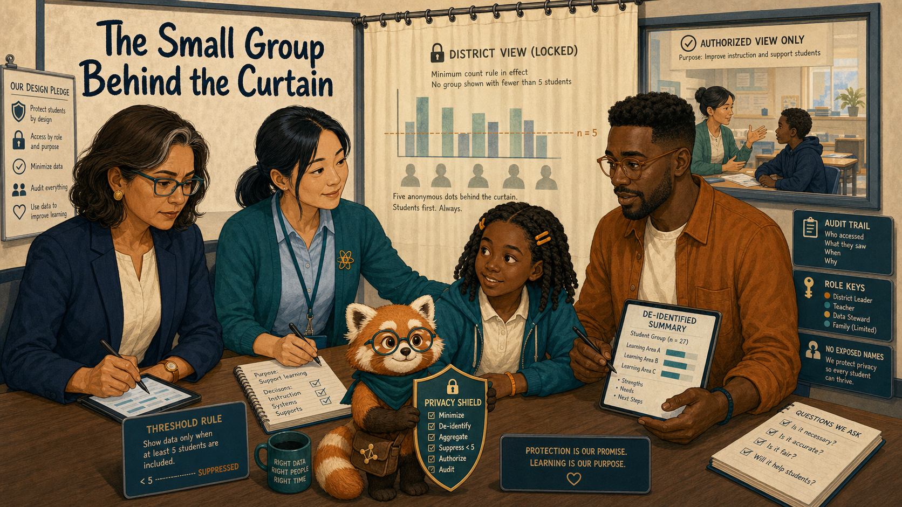
    A hidden result reveals how thresholds, roles, and access audits protect a small
    group without blocking personal teaching support or useful design feedback.

- **[Reading, Doing, and the Empty Middle](reading-doing-and-the-empty-middle/index.md)**

    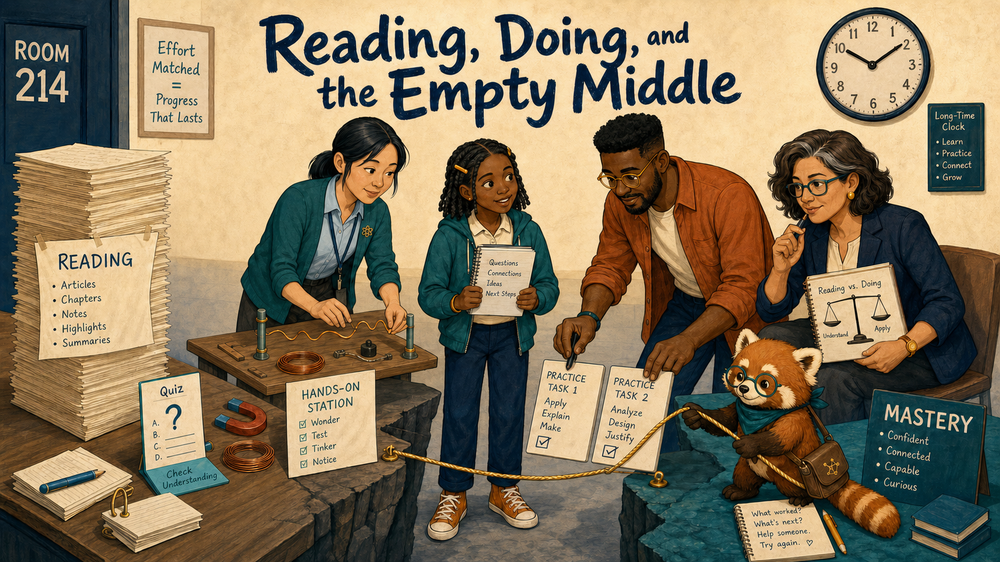
    Long reading time and weak confidence reveal a missing bridge of prediction,
    practice, feedback, and explanation.

- **[The Chapter with the Vanishing Ending](the-chapter-with-the-vanishing-ending/index.md)**

    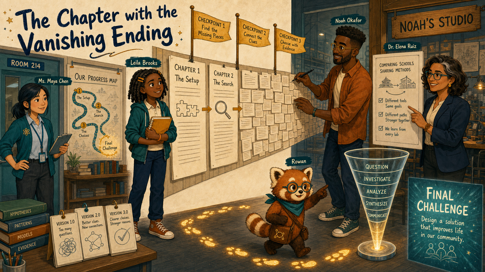
    A sharp completion bottleneck leads to a recap redesign that makes progress visible
    without lowering the final learning goal.

- **[The Three Versions of Wednesday](the-three-versions-of-wednesday/index.md)**

    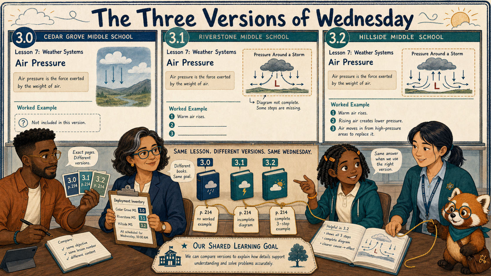
    Conflicting reports become intelligible when the team follows each record to the
    exact textbook release and page students actually saw.

- **[The Evidence Council](the-evidence-council/index.md)**

    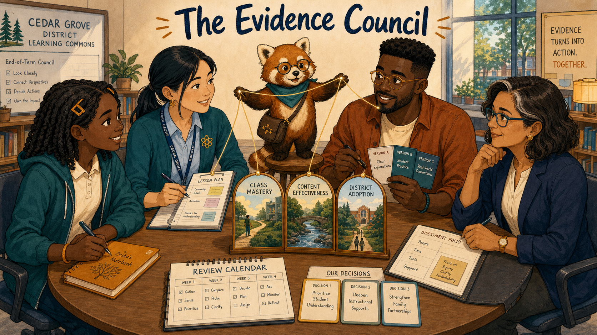
    Four incomplete evidence views meet student voice at a round table, producing three
    accountable changes and a scheduled return to the evidence.

- **[Shifting Gears: The Five Levels of AI in Learning](shifting-gears/index.md)**

    <!-- 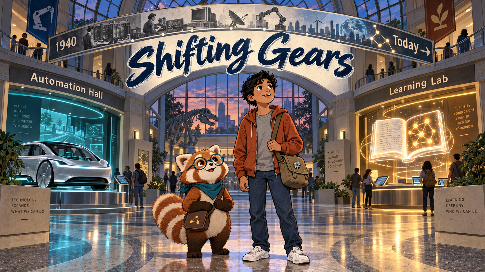 -->
    A museum tour from the clutch pedal to the self-driving dream maps the history of
    car automation onto the five levels of AI-powered textbooks — and asks what each
    added convenience costs in student data.

## Story-Idea Collections

- [LRS Graph Novel Story Ideas by Claude](story-ideas-claude.md)
- [LRS Graphic Novel Story Ideas by ChatGPT](story-ideas-chatgpt.md)
- [LRS Graphic Novel Story Ideas by Antigravity](story-ideas-antigravity.md)
