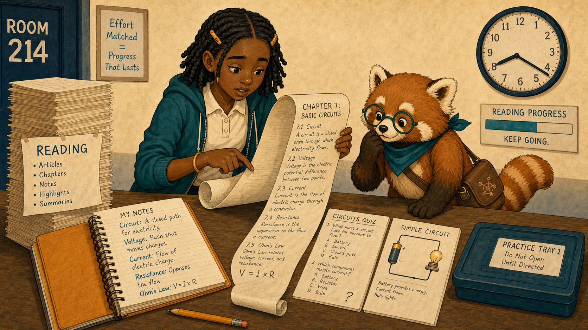
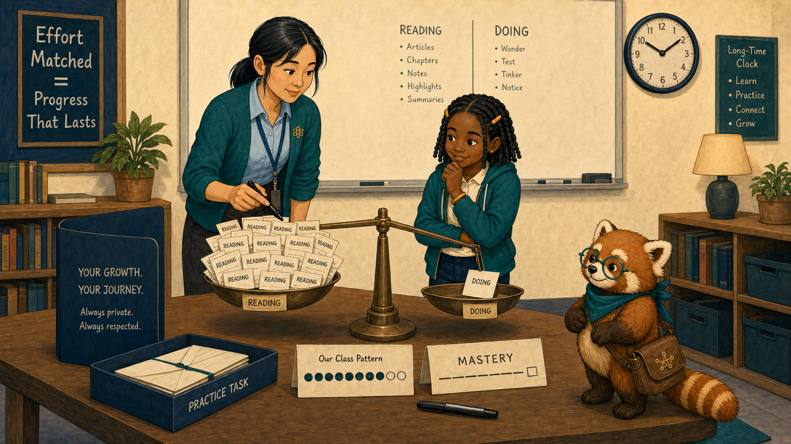
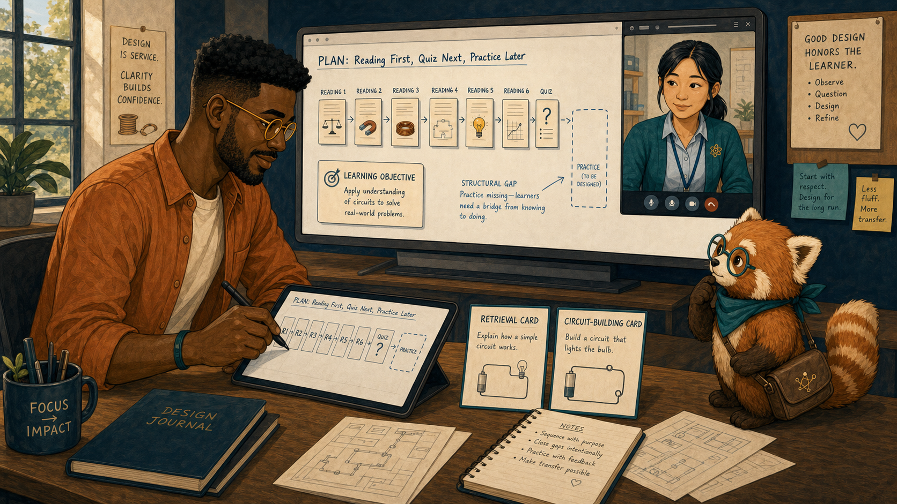
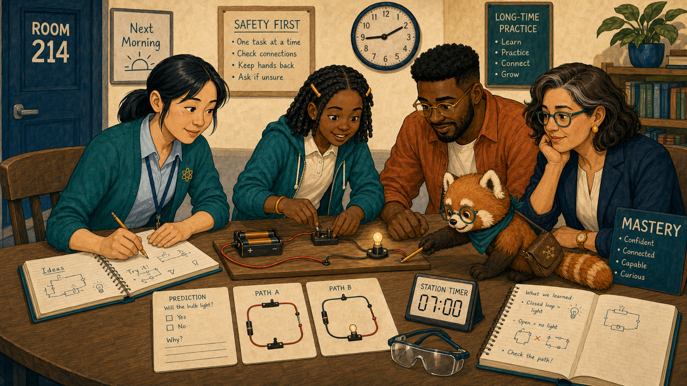
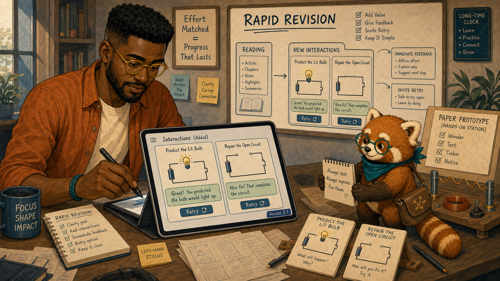
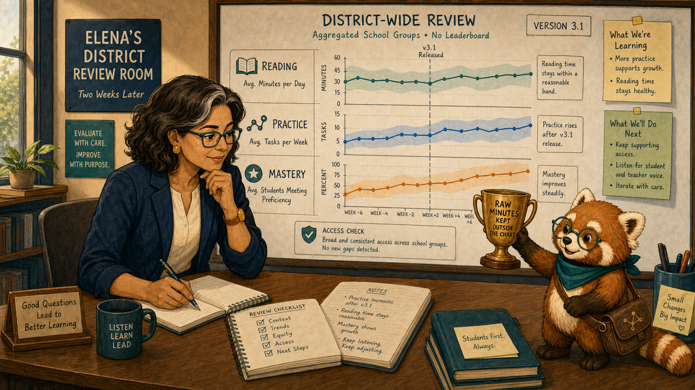
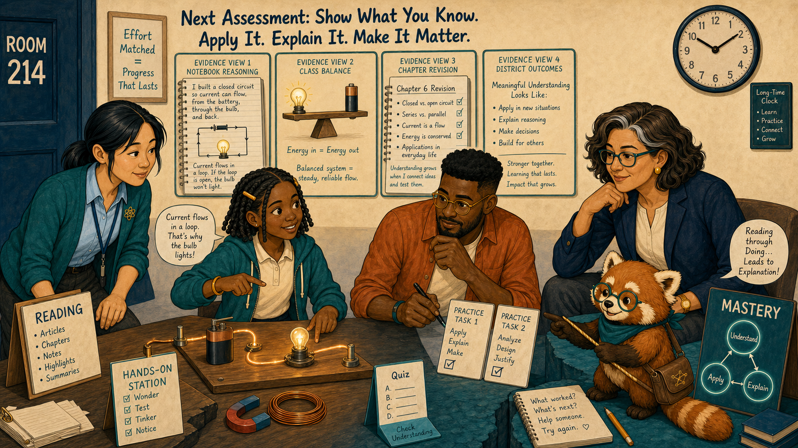

# Reading, Doing, and the Empty Middle

Cover Image Prompt

(This is the Cover Image. Do not include this label in the image.)
Generate a wide-landscape 16:9 illustration in a warm contemporary educational-comic style with clean ink contours, softly painted color, expressive natural faces, gentle paper texture, realistic proportions, and a navy, deep-teal, cinnamon, cream, and amber palette. Set the scene in Room 214 beside a chapter path with a visible empty middle. Show Leila Brooks, a 13-year-old Black American girl with a slender, age-appropriate build, rich dark-brown skin, a heart-shaped full-cheeked face, broad nose, large dark-brown eyes, and a small gap between her upper front teeth visible when she smiles; her black shoulder-length two-strand twists have a center part and are held back by two symmetrical matte amber barrettes, and she wears a cream short-sleeved polo under a teal zip-front school hoodie, dark-navy straight-leg trousers, cinnamon high-top sneakers, and an amber elastic wristband on her left wrist. Show Ms. Maya Chen, a 35-year-old Chinese American woman with a compact athletic build, light warm-beige skin, a softly square face with rounded cheeks, a small beauty mark below the outer corner of her left eye, and dark-brown almond-shaped eyes; her straight blue-black hair is center-parted in a low ponytail with two short face-framing strands, and she wears a deep-teal cardigan with pushed-up sleeves over a pale-blue button-front shirt, charcoal ankle trousers, white low-profile sneakers, an amber atom pin, and a dark-teal school lanyard. Show Noah Okafor, a 31-year-old Nigerian American man who is tall and lean, with deep umber-brown skin, a long oval face, broad nose, high forehead, dark-brown eyes behind round translucent amber glasses, a very short boxed beard and mustache, and dense black hair in a neat flat-topped coil cut with faded sides; he wears an open cinnamon overshirt over a cream crew-neck shirt, dark indigo trousers, teal canvas shoes, and a narrow deep-teal woven bracelet on his right wrist, and he usually holds a black stylus in his left hand. Show Dr. Elena Ruiz, a 47-year-old Mexican American woman of medium height and build, with warm medium-brown skin, an oval high-cheekboned face, dark-brown eyes behind thin rectangular deep-teal glasses, and a collarbone-length wavy espresso-brown bob with a side part and one narrow silver streak at her right temple; she wears a navy blazer over a cream collarless blouse, charcoal trousers, small hammered-gold circular studs, and a slim amber watch on her left wrist. Show Rowan, a small rounded anthropomorphic red panda about desk height, with cinnamon-orange fur, a cream muzzle, cream eyebrow patches and belly, large kind brown eyes, dark-brown legs, and a thick ringed cinnamon-and-cream tail; he wears round deep-teal glasses, a deep-teal triangular neckerchief, and a compact brown cross-body satchel bearing a small gold connected-dots emblem. Create a visual path from a tall stack of cream reading pages to a teal mastery destination, with a missing bridge section in the middle. Leila stands at the gap holding her notebook; Maya adds a hands-on station, Noah places two practice cards, Elena studies a reading-versus-doing balance, and Rowan stretches a gold connection across the gap. Include a long-time clock, a quiz card, magnets and wire, and no screen-time trophy. Render the exact title “Reading, Doing, and the Empty Middle” once in bold hand-lettered navy type. Emotional tone: effort recognized and matched with meaningful practice. Keep every named character exactly consistent with this description, keep Rowan desk-height, and show no brands, logos, rankings, exposed private records, or decorative data. Generate the image immediately without asking clarifying questions.

Narrative Prompt

This fictional seven-panel story distinguishes time spent reading from opportunities to apply an idea. Preserve the recurring cast. The chapter teaches electric circuits: students read extensively but have almost no retrieval or construction practice. The fix adds one physical station and two short interactions; outcomes track mastery separately from raw minutes.

### Prologue – Effort Without a Bridge

Leila Brooks is a 13-year-old seventh-grade science student at Cedar Grove Middle School. She had spent forty careful minutes reading the circuits chapter. At quiz time, the facts felt familiar—but she could not decide where current would flow.

## Panel 1: Forty Minutes, Little Confidence

Image Prompt

(This is Panel 01. Do not include the panel number in the image.)
Generate a wide-landscape 16:9 illustration in a warm contemporary educational-comic style with clean ink contours, softly painted color, expressive natural faces, gentle paper texture, realistic proportions, and a navy, deep-teal, cinnamon, cream, and amber palette. Set the scene at a Room 214 desk during a circuits lesson. Show Leila Brooks, a 13-year-old Black American girl with a slender, age-appropriate build, rich dark-brown skin, a heart-shaped full-cheeked face, broad nose, large dark-brown eyes, and a small gap between her upper front teeth visible when she smiles; her black shoulder-length two-strand twists have a center part and are held back by two symmetrical matte amber barrettes, and she wears a cream short-sleeved polo under a teal zip-front school hoodie, dark-navy straight-leg trousers, cinnamon high-top sneakers, and an amber elastic wristband on her left wrist. Show Rowan, a small rounded anthropomorphic red panda about desk height, with cinnamon-orange fur, a cream muzzle, cream eyebrow patches and belly, large kind brown eyes, dark-brown legs, and a thick ringed cinnamon-and-cream tail; he wears round deep-teal glasses, a deep-teal triangular neckerchief, and a compact brown cross-body satchel bearing a small gold connected-dots emblem. Leila scrolls through a long cream-colored chapter while a clock shows forty minutes and an unopened practice tray sits nearby. Include her amber notebook full of copied definitions, a simple circuit quiz, a battery-and-bulb diagram, a reading progress bar, a hesitant pencil, and Rowan looking from pages to the empty tray.  Emotional tone: visible effort meeting an instructional gap. Keep every named character exactly consistent with this description, keep Rowan desk-height, and show no brands, logos, rankings, exposed private records, or decorative data. Generate the image immediately without asking clarifying questions.

Rowan is the textbook's red-panda learning guide, helping people follow evidence without deciding for them. “I recognize every word,” Leila said, “but I still don't know what to do first.” Rowan pointed not at her score, but at the long stretch between reading and answering.

## Panel 2: The Balance Is Empty

Image Prompt

(This is Panel 02. Do not include the panel number in the image.)
Generate a wide-landscape 16:9 illustration in a warm contemporary educational-comic style with clean ink contours, softly painted color, expressive natural faces, gentle paper texture, realistic proportions, and a navy, deep-teal, cinnamon, cream, and amber palette. Set the scene at Maya's authorized class view after the lesson. Show Ms. Maya Chen, a 35-year-old Chinese American woman with a compact athletic build, light warm-beige skin, a softly square face with rounded cheeks, a small beauty mark below the outer corner of her left eye, and dark-brown almond-shaped eyes; her straight blue-black hair is center-parted in a low ponytail with two short face-framing strands, and she wears a deep-teal cardigan with pushed-up sleeves over a pale-blue button-front shirt, charcoal ankle trousers, white low-profile sneakers, an amber atom pin, and a dark-teal school lanyard. Show Leila Brooks, a 13-year-old Black American girl with a slender, age-appropriate build, rich dark-brown skin, a heart-shaped full-cheeked face, broad nose, large dark-brown eyes, and a small gap between her upper front teeth visible when she smiles; her black shoulder-length two-strand twists have a center part and are held back by two symmetrical matte amber barrettes, and she wears a cream short-sleeved polo under a teal zip-front school hoodie, dark-navy straight-leg trousers, cinnamon high-top sneakers, and an amber elastic wristband on her left wrist. Show Rowan, a small rounded anthropomorphic red panda about desk height, with cinnamon-orange fur, a cream muzzle, cream eyebrow patches and belly, large kind brown eyes, dark-brown legs, and a thick ringed cinnamon-and-cream tail; he wears round deep-teal glasses, a deep-teal triangular neckerchief, and a compact brown cross-body satchel bearing a small gold connected-dots emblem. Maya and Leila study a balance graphic loaded with many reading cards on one side and almost no doing cards on the other. Include a class-level pattern, blurred names, a mastery line separate from time, the unopened practice tray, Maya's black marker, and a privacy shield.  Emotional tone: recognition without blaming effort. Keep every named character exactly consistent with this description, keep Rowan desk-height, and show no brands, logos, rankings, exposed private records, or decorative data. Generate the image immediately without asking clarifying questions.

Ms. Maya Chen teaches Leila's science class. The class record showed sustained reading and almost no interaction beyond page turns. Mastery remained weak. Maya said, “The evidence shows effort. It also shows that the lesson gave that effort nowhere to practice.”

## Panel 3: Inspect the Chapter Structure

Image Prompt

(This is Panel 03. Do not include the panel number in the image.)
Generate a wide-landscape 16:9 illustration in a warm contemporary educational-comic style with clean ink contours, softly painted color, expressive natural faces, gentle paper texture, realistic proportions, and a navy, deep-teal, cinnamon, cream, and amber palette. Set the scene in Noah's design studio that afternoon. Show Noah Okafor, a 31-year-old Nigerian American man who is tall and lean, with deep umber-brown skin, a long oval face, broad nose, high forehead, dark-brown eyes behind round translucent amber glasses, a very short boxed beard and mustache, and dense black hair in a neat flat-topped coil cut with faded sides; he wears an open cinnamon overshirt over a cream crew-neck shirt, dark indigo trousers, teal canvas shoes, and a narrow deep-teal woven bracelet on his right wrist, and he usually holds a black stylus in his left hand. Show Ms. Maya Chen, a 35-year-old Chinese American woman with a compact athletic build, light warm-beige skin, a softly square face with rounded cheeks, a small beauty mark below the outer corner of her left eye, and dark-brown almond-shaped eyes; her straight blue-black hair is center-parted in a low ponytail with two short face-framing strands, and she wears a deep-teal cardigan with pushed-up sleeves over a pale-blue button-front shirt, charcoal ankle trousers, white low-profile sneakers, an amber atom pin, and a dark-teal school lanyard. Show Rowan, a small rounded anthropomorphic red panda about desk height, with cinnamon-orange fur, a cream muzzle, cream eyebrow patches and belly, large kind brown eyes, dark-brown legs, and a thick ringed cinnamon-and-cream tail; he wears round deep-teal glasses, a deep-teal triangular neckerchief, and a compact brown cross-body satchel bearing a small gold connected-dots emblem. Noah maps a path of six reading pages followed immediately by a quiz, with a large blank span where practice should be; Maya appears on a video tile. Include a left-hand stylus, page thumbnails, one learning objective, a retrieval card, a circuit-building card, and a structural-gap annotation.  Emotional tone: design accountability and constructive focus. Keep every named character exactly consistent with this description, keep Rowan desk-height, and show no brands, logos, rankings, exposed private records, or decorative data. Generate the image immediately without asking clarifying questions.

Noah Okafor designs the class's interactive intelligent textbook. The chapter explained circuits clearly, but its sequence jumped from recognition to assessment. Noah marked the empty middle: no prediction, no construction, no feedback, and no second attempt.

## Panel 4: Build Before You Submit

Image Prompt

(This is Panel 04. Do not include the panel number in the image.)
Generate a wide-landscape 16:9 illustration in a warm contemporary educational-comic style with clean ink contours, softly painted color, expressive natural faces, gentle paper texture, realistic proportions, and a navy, deep-teal, cinnamon, cream, and amber palette. Set the scene in Room 214 the next morning. Show Ms. Maya Chen, a 35-year-old Chinese American woman with a compact athletic build, light warm-beige skin, a softly square face with rounded cheeks, a small beauty mark below the outer corner of her left eye, and dark-brown almond-shaped eyes; her straight blue-black hair is center-parted in a low ponytail with two short face-framing strands, and she wears a deep-teal cardigan with pushed-up sleeves over a pale-blue button-front shirt, charcoal ankle trousers, white low-profile sneakers, an amber atom pin, and a dark-teal school lanyard. Show Leila Brooks, a 13-year-old Black American girl with a slender, age-appropriate build, rich dark-brown skin, a heart-shaped full-cheeked face, broad nose, large dark-brown eyes, and a small gap between her upper front teeth visible when she smiles; her black shoulder-length two-strand twists have a center part and are held back by two symmetrical matte amber barrettes, and she wears a cream short-sleeved polo under a teal zip-front school hoodie, dark-navy straight-leg trousers, cinnamon high-top sneakers, and an amber elastic wristband on her left wrist. Show Rowan, a small rounded anthropomorphic red panda about desk height, with cinnamon-orange fur, a cream muzzle, cream eyebrow patches and belly, large kind brown eyes, dark-brown legs, and a thick ringed cinnamon-and-cream tail; he wears round deep-teal glasses, a deep-teal triangular neckerchief, and a compact brown cross-body satchel bearing a small gold connected-dots emblem. Maya sits at student eye level while Leila and three recurring classmates build a safe low-voltage circuit with battery holder, wires, switch, and bulb. Include a prediction card, two possible wire paths, amber notebook sketches, safety glasses on the table, a station timer, and Rowan tracing the closed loop.  Emotional tone: active curiosity and low-stakes testing. Keep every named character exactly consistent with this description, keep Rowan desk-height, and show no brands, logos, rankings, exposed private records, or decorative data. Generate the image immediately without asking clarifying questions.

Maya added a ten-minute station before the quiz. Leila predicted which arrangement would light the bulb, built it, noticed the open loop, and revised her diagram. The mistake became an event she could reason about rather than a final mark.

## Panel 5: Two Small Practice Bridges

Image Prompt

(This is Panel 05. Do not include the panel number in the image.)
Generate a wide-landscape 16:9 illustration in a warm contemporary educational-comic style with clean ink contours, softly painted color, expressive natural faces, gentle paper texture, realistic proportions, and a navy, deep-teal, cinnamon, cream, and amber palette. Set the scene in Noah's studio during a rapid revision. Show Noah Okafor, a 31-year-old Nigerian American man who is tall and lean, with deep umber-brown skin, a long oval face, broad nose, high forehead, dark-brown eyes behind round translucent amber glasses, a very short boxed beard and mustache, and dense black hair in a neat flat-topped coil cut with faded sides; he wears an open cinnamon overshirt over a cream crew-neck shirt, dark indigo trousers, teal canvas shoes, and a narrow deep-teal woven bracelet on his right wrist, and he usually holds a black stylus in his left hand. Show Rowan, a small rounded anthropomorphic red panda about desk height, with cinnamon-orange fur, a cream muzzle, cream eyebrow patches and belly, large kind brown eyes, dark-brown legs, and a thick ringed cinnamon-and-cream tail; he wears round deep-teal glasses, a deep-teal triangular neckerchief, and a compact brown cross-body satchel bearing a small gold connected-dots emblem. Noah adds two compact interactions between reading and quiz: predict the lit bulb and repair the open circuit. Include immediate explanatory feedback, a retry arrow, unchanged reading pages, a version tag 3.1, a left-hand stylus, and a paper prototype matching the physical station.  Emotional tone: focused redesign with restraint. Keep every named character exactly consistent with this description, keep Rowan desk-height, and show no brands, logos, rankings, exposed private records, or decorative data. Generate the image immediately without asking clarifying questions.

Noah embedded two short practices: predict a circuit, then repair one. Each response produced explanatory feedback and another attempt. He did not add points, streaks, or extra minutes. The goal was action connected to the idea.

## Panel 6: Measure Meaningful Use

Image Prompt

(This is Panel 06. Do not include the panel number in the image.)
Generate a wide-landscape 16:9 illustration in a warm contemporary educational-comic style with clean ink contours, softly painted color, expressive natural faces, gentle paper texture, realistic proportions, and a navy, deep-teal, cinnamon, cream, and amber palette. Set the scene in Elena's district review room two weeks later. Show Dr. Elena Ruiz, a 47-year-old Mexican American woman of medium height and build, with warm medium-brown skin, an oval high-cheekboned face, dark-brown eyes behind thin rectangular deep-teal glasses, and a collarbone-length wavy espresso-brown bob with a side part and one narrow silver streak at her right temple; she wears a navy blazer over a cream collarless blouse, charcoal trousers, small hammered-gold circular studs, and a slim amber watch on her left wrist. Show Rowan, a small rounded anthropomorphic red panda about desk height, with cinnamon-orange fur, a cream muzzle, cream eyebrow patches and belly, large kind brown eyes, dark-brown legs, and a thick ringed cinnamon-and-cream tail; he wears round deep-teal glasses, a deep-teal triangular neckerchief, and a compact brown cross-body satchel bearing a small gold connected-dots emblem. Elena studies three separate lines labeled reading, practice, and mastery; practice rises after version 3.1 while reading time stays reasonable and mastery improves. Include aggregated school groups, uncertainty bands, no leaderboard, a version marker, an access check, and Rowan keeping a raw-minutes trophy outside the chart.  Emotional tone: careful evaluation of meaningful activity. Keep every named character exactly consistent with this description, keep Rowan desk-height, and show no brands, logos, rankings, exposed private records, or decorative data. Generate the image immediately without asking clarifying questions.

Dr. Elena Ruiz is the district learning director and reviews de-identified patterns across schools. She kept reading time, practice completion, and mastery as separate measures. The balance improved, but raw minutes never became a target; lingering on a page was not automatically learning.

## Panel 7: The Middle Holds

Image Prompt

(This is Panel 07. Do not include the panel number in the image.)
Generate a wide-landscape 16:9 illustration in a warm contemporary educational-comic style with clean ink contours, softly painted color, expressive natural faces, gentle paper texture, realistic proportions, and a navy, deep-teal, cinnamon, cream, and amber palette. Set the scene in Room 214 during the next assessment. Show Leila Brooks, a 13-year-old Black American girl with a slender, age-appropriate build, rich dark-brown skin, a heart-shaped full-cheeked face, broad nose, large dark-brown eyes, and a small gap between her upper front teeth visible when she smiles; her black shoulder-length two-strand twists have a center part and are held back by two symmetrical matte amber barrettes, and she wears a cream short-sleeved polo under a teal zip-front school hoodie, dark-navy straight-leg trousers, cinnamon high-top sneakers, and an amber elastic wristband on her left wrist. Show Ms. Maya Chen, a 35-year-old Chinese American woman with a compact athletic build, light warm-beige skin, a softly square face with rounded cheeks, a small beauty mark below the outer corner of her left eye, and dark-brown almond-shaped eyes; her straight blue-black hair is center-parted in a low ponytail with two short face-framing strands, and she wears a deep-teal cardigan with pushed-up sleeves over a pale-blue button-front shirt, charcoal ankle trousers, white low-profile sneakers, an amber atom pin, and a dark-teal school lanyard. Show Noah Okafor, a 31-year-old Nigerian American man who is tall and lean, with deep umber-brown skin, a long oval face, broad nose, high forehead, dark-brown eyes behind round translucent amber glasses, a very short boxed beard and mustache, and dense black hair in a neat flat-topped coil cut with faded sides; he wears an open cinnamon overshirt over a cream crew-neck shirt, dark indigo trousers, teal canvas shoes, and a narrow deep-teal woven bracelet on his right wrist, and he usually holds a black stylus in his left hand. Show Dr. Elena Ruiz, a 47-year-old Mexican American woman of medium height and build, with warm medium-brown skin, an oval high-cheekboned face, dark-brown eyes behind thin rectangular deep-teal glasses, and a collarbone-length wavy espresso-brown bob with a side part and one narrow silver streak at her right temple; she wears a navy blazer over a cream collarless blouse, charcoal trousers, small hammered-gold circular studs, and a slim amber watch on her left wrist. Show Rowan, a small rounded anthropomorphic red panda about desk height, with cinnamon-orange fur, a cream muzzle, cream eyebrow patches and belly, large kind brown eyes, dark-brown legs, and a thick ringed cinnamon-and-cream tail; he wears round deep-teal glasses, a deep-teal triangular neckerchief, and a compact brown cross-body satchel bearing a small gold connected-dots emblem. Leila confidently draws a closed circuit and explains current flow while the team appears around four evidence views: notebook reasoning, class balance, chapter revision, and district outcomes. Include the physical circuit glowing softly, two practice cards, a teal mastery node, no confetti, and Rowan connecting reading through doing to explanation.  Emotional tone: earned confidence grounded in application. Keep every named character exactly consistent with this description, keep Rowan desk-height, and show no brands, logos, rankings, exposed private records, or decorative data. Generate the image immediately without asking clarifying questions.

Leila drew the path before choosing an answer and explained why the bulb would light. Maya saw effort turn into reasoning; Noah saw the redesigned sequence work; Elena saw improvement without rewarding screen time. The empty middle had become a bridge.

### Epilogue – Engagement Has a Shape

The team refused to collapse learning into one engagement number. Reading supported vocabulary and explanation; doing supported prediction, feedback, and transfer. Measuring the balance exposed a structural gap and made the redesign testable.

| Challenge | How the Team Responded | Lesson for Today |
|---|---|---|
| Long reading looked like engagement | Maya compared activity types with mastery | Effort and opportunity are different |
| The chapter jumped straight to a quiz | Noah mapped the missing practice | Sequence shapes what learners can do |
| Practice needed classroom context | Maya added a physical station | Records should complement observation |
| More activity could become another vanity metric | Elena separated minutes, practice, and mastery | Measure meaningful use, not applause |

### Call to Action

When learners spend time but remain unsure, ask what the experience lets them do with the idea. Build a bridge of prediction, practice, feedback, and explanation—and measure each part without turning time into a score.

---

*“I had read the path. I needed a chance to walk it.”* 
—Leila Brooks, fictional student

*“Engagement is not one number.”* 
—Ms. Maya Chen, fictional teacher

*“The middle of a lesson is where explanation becomes action.”* 
—Noah Okafor, fictional designer

---

## References

1. [Wikipedia: Active learning](https://en.wikipedia.org/wiki/Active_learning) - Overview of learning through meaningful participation and practice
2. [Wikipedia: Experiential learning](https://en.wikipedia.org/wiki/Experiential_learning) - Background on learning through experience and reflection
3. [Wikipedia: Testing effect](https://en.wikipedia.org/wiki/Testing_effect) - Research concept describing learning benefits from retrieval practice
4. [CAST: UDL Guidelines](https://udlguidelines.cast.org/) - Guidance for providing multiple means of engagement and action
5. [IES Practice Guide: Organizing Instruction and Study](https://ies.ed.gov/ncee/wwc/PracticeGuide/1) - Evidence-based recommendations for practice, spacing, and learning
