# Shifting Gears: The Five Levels of AI in Learning

Cover Image Prompt

(This is the Cover Image. Do not include this label in the image.)
Create a wide-landscape 16:9 graphic-novel cover in a warm contemporary educational-comic style with clean ink contours, softly painted color, gentle paper texture, realistic proportions, and no logos. Show a museum atrium at dusk, split down the middle by a soaring glass archway. On the left, "Automation Hall" glows with a sleek silver self-driving concept car on a rotating platform, its dashboard screens lit teal. On the right, "Learning Lab" glows with a floating holographic open book whose pages shift from plain text to a glowing amber concept graph. In the center foreground stand Rowan, a small rounded anthropomorphic red panda about desk height with cinnamon-orange fur, a cream muzzle, cream eyebrow patches and belly, large kind brown eyes, dark-brown legs, a thick ringed cinnamon-and-cream tail, round deep-teal glasses, a deep-teal triangular neckerchief, and a compact brown cross-body satchel with a small gold connected-dots emblem, and Theo Alvarez, a 14-year-old Latino American boy with warm tan-brown skin, short wavy black hair, warm dark-brown eyes, an easy curious smile, a rust-orange zip hoodie over a heather-gray tee, dark denim jeans, white sneakers, and a canvas messenger bag with a small enamel gear-shaped pin. Both look upward, awestruck, lit by the twin glows. Include a polished terrazzo floor reflecting both colors, a suspended timeline banner arcing overhead from "1940" to "Today," soft museum spotlights, and the exact title text "Shifting Gears" in a bold hand-lettered navy-and-silver typeface across the archway. Palette: navy, deep teal, cinnamon, cream, amber, and a restrained brushed-silver accent. Emotional tone: wonder and curiosity, not spectacle. Generate the image immediately without asking clarifying questions.

Narrative Prompt

This fictional sixteen-panel story is set in the present day at a fictional science museum called the Museum of Motion and Mind, inside two connected wings: Automation Hall (the history of car automation) and the Learning Lab (the five levels of AI-powered textbooks). Rowan, the textbook's red-panda learning guide, leads Theo Alvarez, a curious 14-year-old visitor, through both wings on a single afternoon. Every historical scene — the 1930s clutch, the 1940 automatic transmission, 1940s cruise control, 1990s radar sensors, 2010s cameras, a modern conditional self-driving demo, and a concept Level 5 vehicle — appears as a museum exhibit, diorama, or screen that Rowan and Theo view together, so Rowan and Theo themselves stay in their same present-day appearance and wardrobe throughout all sixteen panels; only the exhibits behind the glass change era. Maintain the warm contemporary educational-comic style, the navy-teal-cinnamon-cream-amber palette with a brushed-silver automotive accent, and the canonical Rowan design (round teal glasses, teal neckerchief, connected-dots satchel, desk-height scale) in every panel. No real vehicle brand names, product names, or trademarks appear in any image — describe cars and technology generically. Exhibit placards may show simple numbers or icons but not dense rendered paragraphs.

### Prologue – Two Rooms, One Question

Every field trip starts with a map, but Rowan started this one with a question: "How much should a machine do for you before it starts doing your thinking for you?" Theo Alvarez had come to the Museum of Motion and Mind expecting a room full of old cars. He did not expect that same question to follow him into a room full of books. Rowan flipped open the guide pamphlet, and on it were two matching diagrams — one drawn from a steering wheel, one drawn from a page — each climbing through five levels toward the word "autonomous." "Let's follow the record," Rowan said, "one exhibit at a time."

## Panel 1: The Clutch Barrier

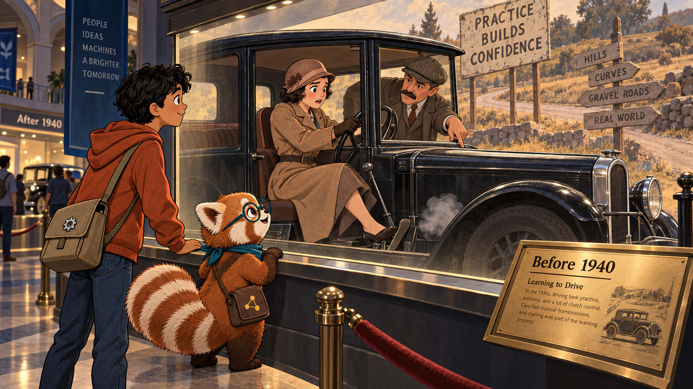

Image Prompt

(This is Panel 01. Do not include the panel number in the image.)
I am about to ask you to generate a series of images for a graphic novel. Please make the images have a consistent style and consistent characters. Do not ask any clarifying questions. Just generate the image immediately when asked.

Please generate a wide-landscape 16:9 image in a warm contemporary educational-comic style depicting panel 1 of 16, set inside a museum diorama window labeled "Before 1940" at the Museum of Motion and Mind. Behind the glass, show a 1930s driving lesson: a nervous young woman in a period cloche hat and belted coat sits in a boxy black sedan with an exposed floor gearshift, her foot pressed hard on a clutch pedal, the car caught mid-stall with a small puff of exhaust smoke; a mustached instructor in a flat cap leans in through the open window pointing at her feet. In the foreground, present-day Rowan, a small rounded cinnamon-and-cream red panda with round teal glasses, teal neckerchief, ringed tail, and connected-dots satchel, and Theo Alvarez, a 14-year-old Latino American boy in a rust-orange zip hoodie and canvas messenger bag, watch through the glass with curious expressions. Include a brass museum placard, warm gallery spotlights, a coiled velvet rope, dusty period road signage in the diorama background, and Theo's hand resting on the glass rail. Palette: navy, deep teal, cinnamon, cream, amber, brushed silver. Emotional tone: sympathetic amusement at how hard driving used to be. Generate the image immediately without asking clarifying questions.

Before 1940, learning to drive meant learning a machine first and a road second. A new driver had to master the clutch, feel the exact moment to shift gears, and coordinate three pedals at once — or stall in front of everyone. That barrier was not really about cars. It was about who got to participate at all, because anyone who could not master the mechanism could not drive, no matter how well they understood the road.

## Panel 2: Gears for Everyone

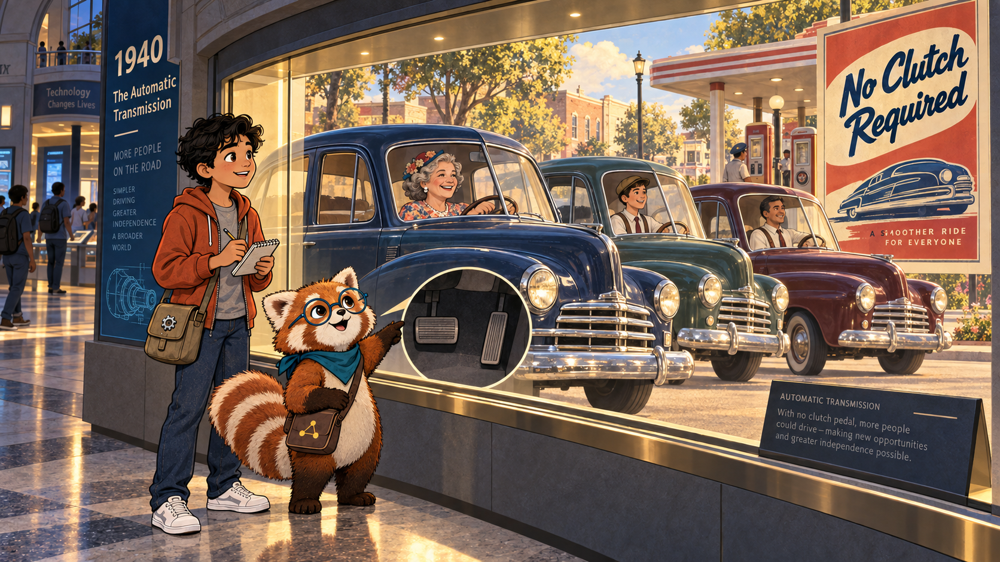

Image Prompt

(This is Panel 02. Do not include the panel number in the image.)
Generate a wide-landscape 16:9 image in the same warm educational-comic style, depicting panel 2 of 16, in the next diorama window labeled "1940: The Automatic Transmission." Behind the glass, show a sunny American street where three new drivers — an older woman in a floral dress, a teenage boy in suspenders, and a man missing his left arm's sleeve pinned at the shoulder — each sit confidently in similar rounded 1940s sedans with only two pedals visible, pulling smoothly away from the curb without stalling, warm relief on their faces. In the foreground, Rowan and Theo stand at the glass, with Rowan pointing at the missing clutch pedal in the nearest car's footwell. Include a "No Clutch Required" period advertisement poster on the diorama wall, soft golden afternoon light, a corner gas station backdrop, and Theo scribbling a note in a small pad. Palette: navy, deep teal, cinnamon, cream, amber, brushed silver. Emotional tone: liberation and newfound accessibility. Generate the image immediately without asking clarifying questions.

The automatic transmission changed that. Introduced in 1940, it shifted gears by itself, so a driver no longer needed to know what a clutch even was — only where they wanted to go. Driving stopped being a test of mechanical skill and started being a way to get somewhere. "The car still did the same job," Rowan said, "it just stopped requiring a specialist to run it."

## Panel 3: Set It and Watch the Road

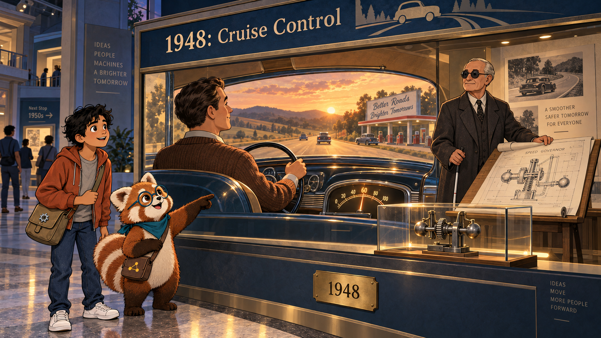

Image Prompt

(This is Panel 03. Do not include the panel number in the image.)
Generate a wide-landscape 16:9 image in the same style, depicting panel 3 of 16, in a diorama labeled "1948: Cruise Control." Behind the glass, show a late-1940s highway scene at golden hour: a relaxed driver in a cardigan keeps both hands loosely on the wheel, eyes forward on the open road, while a small dashboard dial glows showing a steady speed needle instead of a bouncing one. A blind engineer figure with round glasses and a cane, modeled respectfully and with dignity, stands beside a drafting table nearby holding a rolled patent drawing of a governor mechanism. In the foreground, Rowan gestures toward the driver's relaxed hands while Theo leans in, intrigued. Include gentle rolling hills outside the diorama windshield, a period gas-station billboard, warm amber highway light, and a small brass plaque reading only "1948." Palette: navy, deep teal, cinnamon, cream, amber, brushed silver. Emotional tone: calm focus replacing constant vigilance. Generate the image immediately without asking clarifying questions.

Eight years later, engineer Ralph Teetor, who had been blind since childhood, patented a mechanism that could hold a car at one steady speed without the driver's foot on the pedal. Cruise control reached production cars by the late 1950s, and it changed what a driver's attention was for. A driver no longer had to watch the speedometer constantly; the machine held the speed, and the driver's eyes were free for the road ahead.

## Panel 4: The Radar Learns to Follow

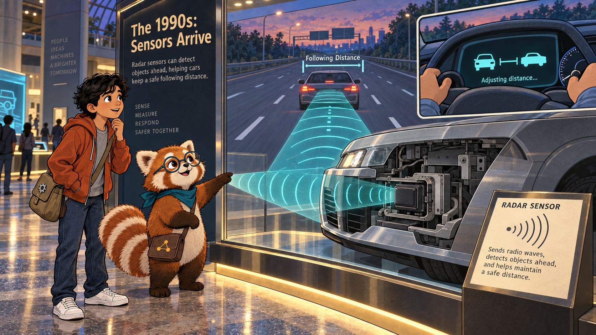

Image Prompt

(This is Panel 04. Do not include the panel number in the image.)
Generate a wide-landscape 16:9 image in the same style, depicting panel 4 of 16, in a diorama labeled "The 1990s: Sensors Arrive." Behind the glass, show a cutaway view of a sedan's front bumper revealing a small radar unit sending a soft teal cone of sensing lines toward a slower car ahead on a highway; inside the cabin, a dashboard icon shows two car silhouettes connected by an adjustable-distance bracket, and the driver's hands rest calmly on the wheel as the car eases its own speed down. In the foreground, Rowan traces the radar cone with one paw while Theo watches the dashboard icon, fascinated. Include highway lane markings fading into the distance, a soft dusk sky, small floating labels showing "following distance," and a museum placard with a simple radar-wave icon. Palette: navy, deep teal, cinnamon, cream, amber, brushed silver. Emotional tone: quiet technological wonder. Generate the image immediately without asking clarifying questions.

By the late 1990s, radar and laser sensors let a car sense the vehicle ahead of it and adjust automatically. This was adaptive cruise control: instead of holding one fixed speed forever, the car could slow down when traffic ahead slowed and speed back up when the road cleared, keeping a safe following distance without the driver's foot ever touching the pedal. The car had started sensing its world, not just obeying a dial.

## Panel 5: Eyes on Every Side

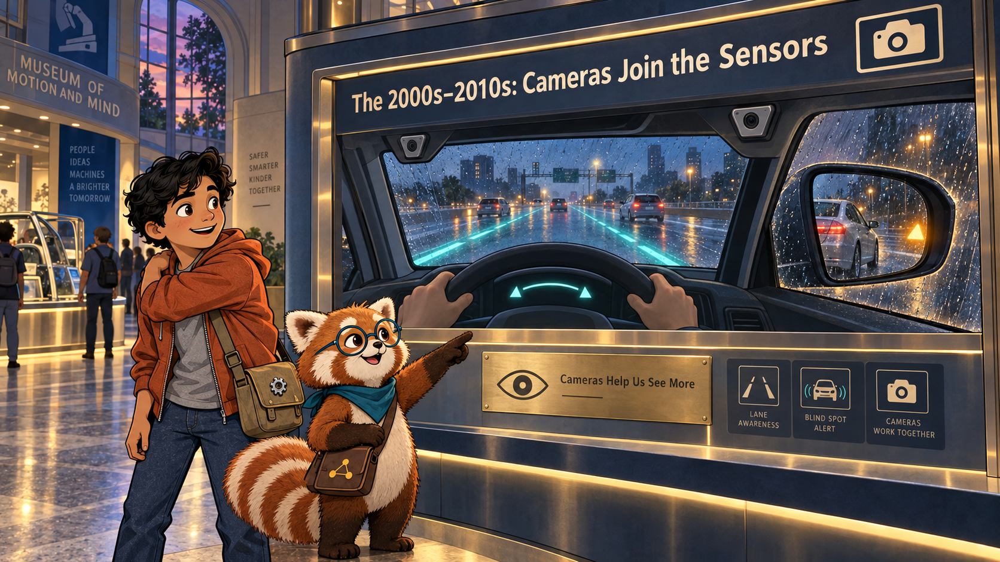

Image Prompt

(This is Panel 05. Do not include the panel number in the image.)
Generate a wide-landscape 16:9 image in the same style, depicting panel 5 of 16, in a diorama labeled "The 2000s–2010s: Cameras Join the Sensors." Behind the glass, show a driver's-eye view through a windshield where a soft teal overlay highlights the painted lane lines on both sides of the car, gently nudging the wheel back toward center; in a side mirror inset, a small amber warning glow appears as another car passes through the blind spot. In the foreground, Rowan points at the glowing mirror while Theo mimics checking over his own shoulder, learning the habit. Include a rain-streaked side window for texture, small camera-icon decals on the diorama's mock windshield frame, warm interior cabin light, and a brass plaque with a simple eye icon. Palette: navy, deep teal, cinnamon, cream, amber, brushed silver. Emotional tone: reassurance, an extra set of watchful eyes. Generate the image immediately without asking clarifying questions.

Cameras joined the sensors next. Through the 2000s and 2010s, a car could watch the painted lines on the road and nudge itself gently back toward the center of its lane, and mirror-mounted sensors could glow a warning when another car hid in the driver's blind spot. The car was no longer only reacting to speed — it was starting to watch the space around it the way a careful passenger would.

## Panel 6: Tell It Where, and It Drives

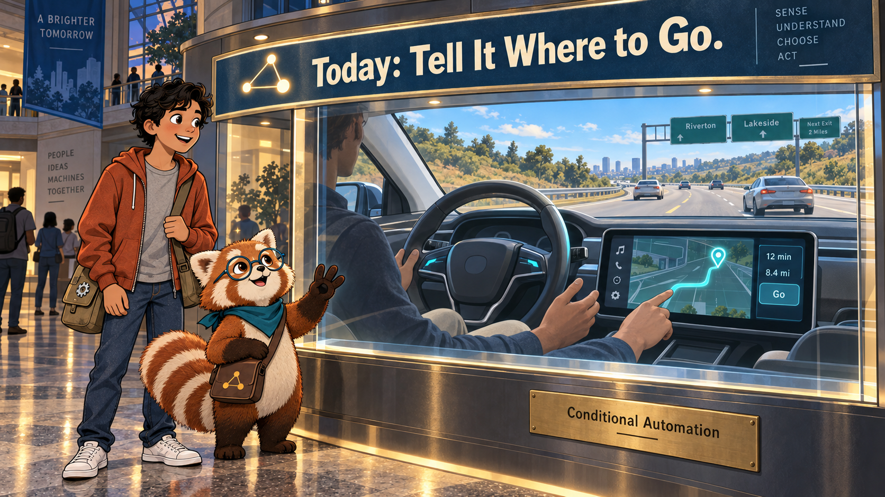

Image Prompt

(This is Panel 06. Do not include the panel number in the image.)
Generate a wide-landscape 16:9 image in the same style, depicting panel 6 of 16, in a diorama labeled "Today: Tell It Where to Go." Behind the glass, show a modern sedan's interior where a driver's finger taps a glowing destination pin on a dashboard navigation screen; through the windshield, a wide clear sunny highway stretches ahead with dry pavement, gentle curves, and light traffic, the steering wheel turning gently on its own while the driver's hands hover nearby, relaxed but ready. In the foreground, Rowan holds up a small paw showing "3" fingers-worth of pride while Theo grins at the ease of it. Include a soft teal route line glowing on the navigation screen, clear blue sky, simple road signage, and a brass plaque reading "Conditional Automation." Palette: navy, deep teal, cinnamon, cream, amber, brushed silver. Emotional tone: confident ease under good conditions. Generate the image immediately without asking clarifying questions.

Now a driver can type in a destination, and under good conditions the car can drive there almost entirely on its own — dry roads, clear weather, simple highway merges. Engineers call this conditional automation: the system truly is driving, but only inside a set of conditions it was designed to handle. "It's a real leap," Rowan said, "but notice the word *conditional*. That word is doing a lot of work."

## Panel 7: When the Road Gets Hard

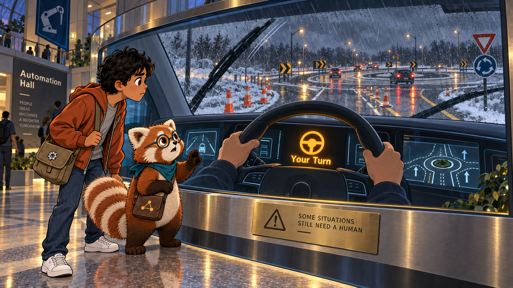

Image Prompt

(This is Panel 07. Do not include the panel number in the image.)
Generate a wide-landscape 16:9 image in the same style, depicting panel 7 of 16, in the same modern-car diorama now showing a harder scene. Behind the glass, through the windshield show orange construction cones narrowing the lane, heavy rain streaking the glass, a dusting of snow on the shoulder, and a complex multi-lane roundabout ahead; on the dashboard, a bold amber steering-wheel icon flashes beside the words rendered simply as "Your Turn," and the driver's hands move back to the wheel with focused attention. In the foreground, Rowan raises a cautionary paw while Theo leans forward, newly serious. Include windshield wiper motion lines, wet reflective road markings, a brass plaque with a small caution-triangle icon, and dim gray storm light. Palette: navy, deep teal, cinnamon, cream, amber, brushed silver, with the amber warning glow as the brightest point. Emotional tone: alertness, a handoff of responsibility. Generate the image immediately without asking clarifying questions.

The same car that drove so confidently on a clear highway meets its limits fast: construction zones, heavy rain, snow-covered lanes, and a tangled roundabout can all push a conditional system past what it was designed to handle. When that happens, it hands control back to the human, sometimes with only seconds of warning. The gap between "drives itself" and "drives itself everywhere, always" turned out to be enormous.

## Panel 8: The Level 5 Dream

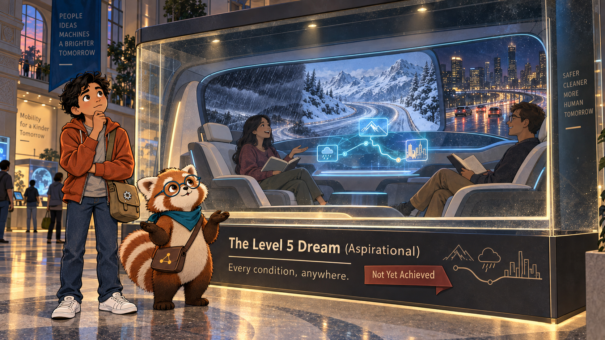

Image Prompt

(This is Panel 08. Do not include the panel number in the image.)
Generate a wide-landscape 16:9 image in the same style, depicting panel 8 of 16, in a diorama labeled "The Level 5 Dream (Aspirational)." Behind the glass, show a sleek concept-car cabin with no steering wheel or pedals at all, facing seats where two passengers read and chat comfortably; through a wraparound window, blend a single continuous scene of driving rain, a snowy mountain pass, and a busy night city all visible in soft sequence to suggest "every condition, anywhere." In the foreground, Rowan shrugs with an honest, thoughtful expression while Theo tilts his head, weighing the idea. Include a small "Not Yet Achieved" ribbon on the diorama placard, soft blue ambient cabin lighting, a faint holographic route map floating between the passengers, and gentle dust on the display glass suggesting this exhibit is more concept than artifact. Palette: navy, deep teal, cinnamon, cream, amber, brushed silver. Emotional tone: hopeful but honest about an unfinished goal. Generate the image immediately without asking clarifying questions.

Engineers describe a fifth, final level: full automation, in every condition, with no steering wheel and no human ever needed to take over. It is a real design goal, and pieces of it already exist in limited places. But as of this museum's most recent update, no system anywhere drives that reliably in every condition — the exhibit is honestly labeled a dream still being built, not a working machine on the floor.

## Panel 9: Naming the Levels

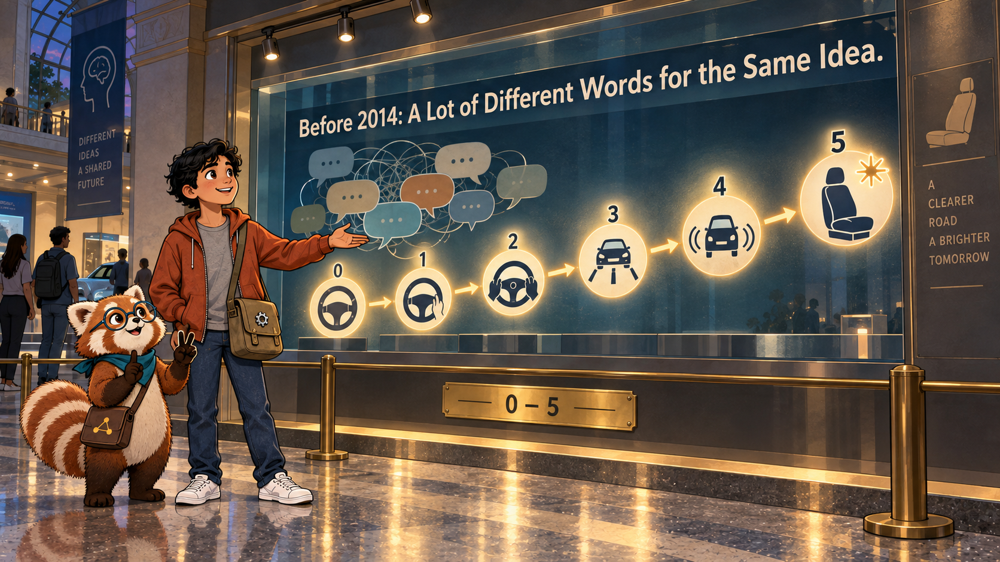

Image Prompt

(This is Panel 09. Do not include the panel number in the image.)
Generate a wide-landscape 16:9 image in the same style, depicting panel 9 of 16, in a wide gallery wall display labeled "Before 2014: A Lot of Different Words for the Same Idea." Behind the glass, show a large backlit wall chart with six simple numbered icons in a rising row, from "0" (a plain steering wheel) through "5" (an empty driver's seat with a small starburst), each icon connected by a soft glowing arrow; to one side, faded overlapping speech-bubble shapes hint at old jumbled marketing words without spelling any brand out, suggesting confusion before the chart existed. In the foreground, Rowan stands proudly beside the chart gesturing along its rising arrow while Theo counts the icons on his fingers. Include soft gallery track lighting, a brass placard with only the numerals "0–5," a polished floor reflection of the chart, and museum guardrail posts. Palette: navy, deep teal, cinnamon, cream, amber, brushed silver. Emotional tone: relief at finally having a shared vocabulary. Generate the image immediately without asking clarifying questions.

For years, car makers used words like "autopilot" and "self-driving" so loosely that nobody — drivers, regulators, or researchers — could tell what a system actually did. In 2014, an engineering standard named J3016 fixed that by defining six numbered levels, zero through five, based only on one clear question at each level: who is actually driving, the human or the system, and under what conditions? "A number can't be marketed," Rowan said. "That's exactly why it works."

## Panel 10: The Same Five Steps, A New Machine

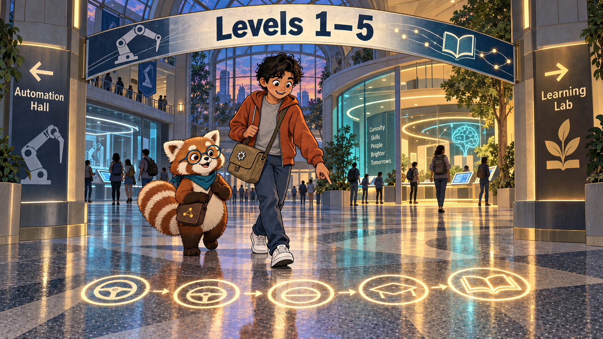

Image Prompt

(This is Panel 10. Do not include the panel number in the image.)
Generate a wide-landscape 16:9 image in the same style, depicting panel 10 of 16, at the glass archway connecting "Automation Hall" to the "Learning Lab." Show Rowan and Theo walking together through the archway; on the polished terrazzo floor beneath their feet, a glowing inlaid path shows five footprint-sized icons morphing gradually from a small steering-wheel silhouette into an open-book silhouette, left to right. Overhead, a suspended banner reads simply "Levels 1–5" in bold lettering on one side and continues past the archway. In the background, warm teal light spills from the Learning Lab wing ahead while cooler silver light fades behind them from Automation Hall. Include Theo pointing down at the morphing floor icons with delight, Rowan mid-stride with his satchel swinging, soft directional gallery signage, and reflective floor highlights. Palette: navy, deep teal, cinnamon, cream, amber, brushed silver blending into warmer tones ahead. Emotional tone: a satisfying "aha" of pattern recognition. Generate the image immediately without asking clarifying questions.

"Here's the question I promised you," Rowan said, stepping through the archway. "Textbooks have been climbing the same five steps — static, interactive, adaptive, chatbot-assisted, and someday autonomous — and just like cars, each step gives you more help by asking for more information about you." Theo looked down at the floor icons shifting from wheel to book beneath his sneakers. "So a smarter textbook is basically a self-driving car for learning," he said. Rowan smiled. "Let's find out exactly how far that idea holds up."

## Panel 11: Level 1: A Book That Cannot Change

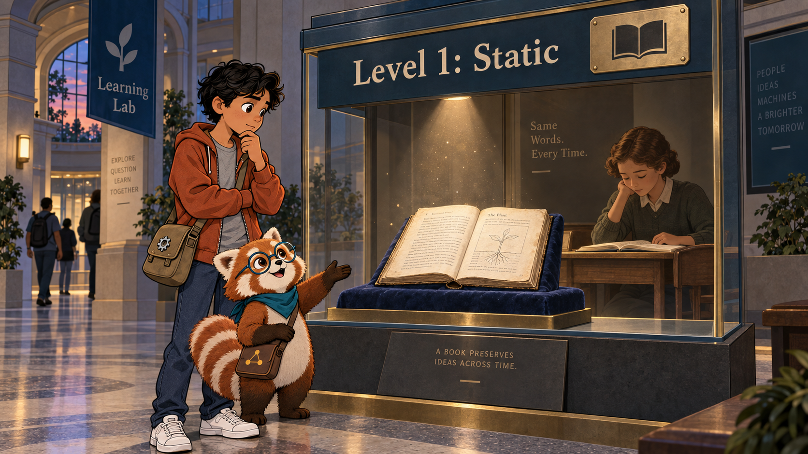

Image Prompt

(This is Panel 11. Do not include the panel number in the image.)
Generate a wide-landscape 16:9 image in the same style, depicting panel 11 of 16, in a Learning Lab diorama labeled "Level 1: Static." Behind the glass, show a single worn printed textbook lying open on a velvet cushion under a spotlight, its pages showing plain black text and one simple diagram, completely unchanged from decades ago; beside it, a period-neutral student figure sits quietly reading the exact same page any other reader would see. In the foreground, Rowan gestures to the book with an open paw while Theo studies the plain page, comparing it mentally to the shiny car exhibits behind him. Include soft even gallery light with no glowing screens anywhere in this diorama, a brass plaque with a single closed-book icon, dust motes in the spotlight beam, and a stark contrast in mood from the tech-heavy hall before it. Palette: navy, deep teal, cinnamon, cream, amber, brushed silver, deliberately muted here. Emotional tone: plain, honest simplicity — nothing hidden, nothing adaptive. Generate the image immediately without asking clarifying questions.

Level 1 is the plainest exhibit in the whole museum: a static textbook, printed or digital, that never changes no matter who reads it. It collects no data about the reader at all, because it has no way to. Every learner gets exactly the same page in exactly the same order — which is honest, dependable, and still how the overwhelming majority of textbooks work today.

## Panel 12: Level 2: A Book That Talks Back

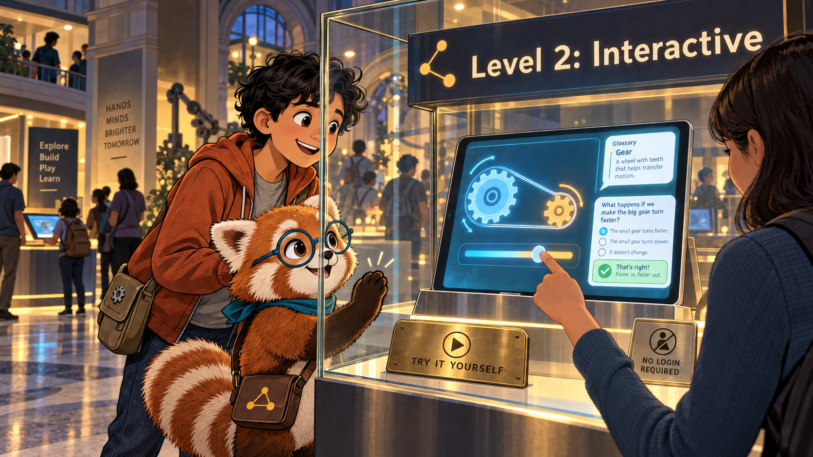

Image Prompt

(This is Panel 12. Do not include the panel number in the image.)
Generate a wide-landscape 16:9 image in the same style, depicting panel 12 of 16, in a diorama labeled "Level 2: Interactive." Behind the glass, show a bright tablet propped on a stand displaying a small glowing interactive simulation with a slider and a moving diagram, alongside a pop-up glossary bubble and a short instant-feedback quiz question; a period-neutral visitor taps the slider and watches the diagram respond immediately. In the foreground, Rowan taps his own paw against the glass in rhythm with the diagram's motion while Theo leans in, clearly wanting to try it himself. Include soft glowing screen light reflecting on the display case, a brass plaque with a simple play-button icon, a small "no login required" sign, and warm gallery ambiance. Palette: navy, deep teal, cinnamon, cream, amber, brushed silver. Emotional tone: playful engagement without pressure. Generate the image immediately without asking clarifying questions.

Level 2 adds interactivity: simulations you can nudge and watch respond, glossaries you can tap, quizzes that check your answer instantly. This is a real leap in engagement — studies on interactive simulations show meaningful learning gains over plain reading — and yet it still asks almost nothing of the reader personally. Anyone can use it anonymously, the same way anyone can walk up and press play.

## Panel 13: Level 3: A Book That Remembers You

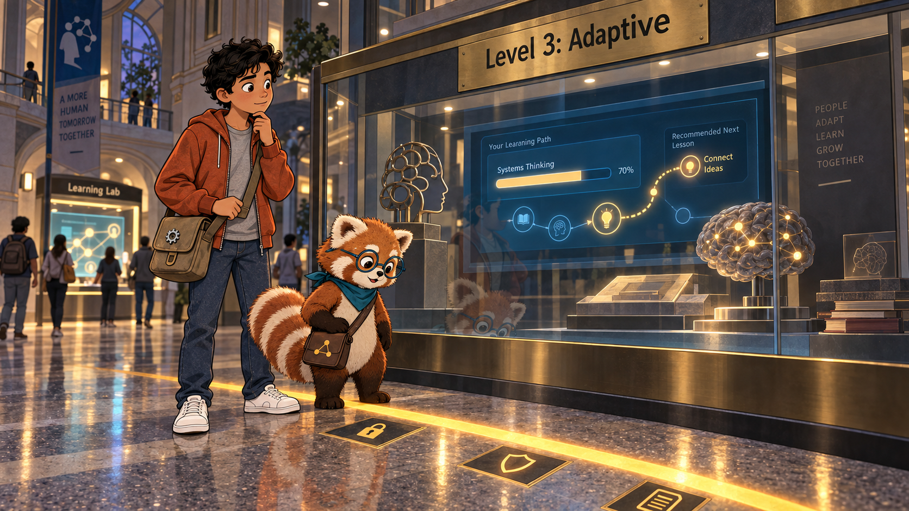

Image Prompt

(This is Panel 13. Do not include the panel number in the image.)
Generate a wide-landscape 16:9 image in the same style, depicting panel 13 of 16, in a diorama labeled "Level 3: Adaptive." Behind the glass, show a personalized dashboard screen displaying one named progress bar and a small glowing concept-map path bending to show a personalized recommended next lesson; on the gallery floor in front of the display case, a bright amber line is painted across the floor with small icon plaques beside it showing a simple padlock, a small shield, and a document icon. In the foreground, Rowan stands with one foot deliberately just behind the amber line, expression thoughtful rather than alarmed, while Theo studies the floor line, noticing it for the first time. Include soft screen glow illuminating the case, a brass plaque reading only "Level 3," warm but slightly more serious gallery lighting than the prior two dioramas, and a faint reflection of Theo in the glass. Palette: navy, deep teal, cinnamon, cream, amber, brushed silver, with the amber floor line as a clear visual marker. Emotional tone: genuine helpfulness paired with new responsibility. Generate the image immediately without asking clarifying questions.

Here the exhibit changes tone, and Rowan pauses at a bright line painted on the floor. To adapt to *you* specifically, Level 3 has to track *you* specifically: every quiz answer, every wrong turn, every concept you have and have not mastered yet. That is genuinely useful — it can catch a gap before it grows — but it also means the textbook now keeps an education record about a real person, which is exactly the kind of record that laws like FERPA, COPPA, and GDPR exist to protect.

## Panel 14: Level 4: A Book That Listens

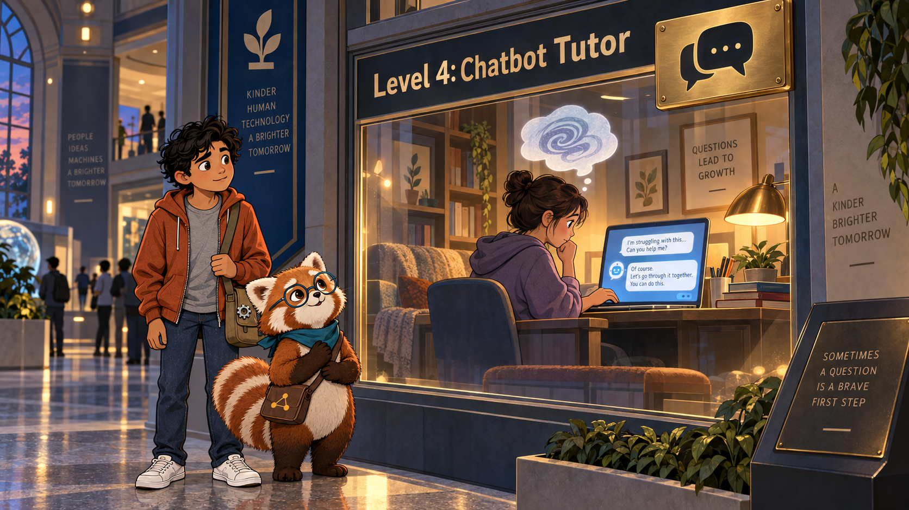

Image Prompt

(This is Panel 14. Do not include the panel number in the image.)
Generate a wide-landscape 16:9 image in the same style, depicting panel 14 of 16, in a diorama labeled "Level 4: Chatbot Tutor." Behind the glass, show a cozy reading nook where a period-neutral student types a hesitant question into a glowing chat interface on a laptop, and the screen shows a warm, patient text reply bubble; a soft thought-bubble above the student's head, rendered as a gentle abstract swirl rather than literal text, hints at an unspoken worry being typed out. In the foreground, Rowan places a gentle paw near his own chest, an empathetic gesture, while Theo watches with a slightly more guarded, reflective expression than in earlier panels. Include warm lamp light, a stack of books beside the laptop, a brass plaque with a simple speech-bubble icon, and soft shadows suggesting privacy and quiet trust. Palette: navy, deep teal, cinnamon, cream, amber, brushed silver. Emotional tone: tender trust mixed with quiet vulnerability. Generate the image immediately without asking clarifying questions.

Level 4 adds a conversational AI tutor, and something interesting happens: students sometimes tell an AI things they would never say out loud to a teacher — "I don't understand any of this" or a question that feels embarrassing to ask a person. That candor helps the tutor teach better, but it also means the system now holds a complete, searchable log of a student's most uncertain moments. Trust has to be earned here, not assumed.

## Panel 15: Level 5: The Unfinished Exhibit

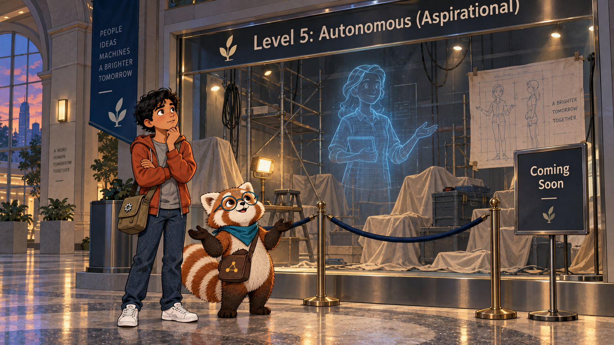

Image Prompt

(This is Panel 15. Do not include the panel number in the image.)
Generate a wide-landscape 16:9 image in the same style, depicting panel 15 of 16, in a mostly empty diorama space labeled "Level 5: Autonomous (Aspirational)." Behind the glass, show scaffolding, a few unplugged cables, and a single faint translucent holographic outline of a tutor figure sketched in soft blue light, clearly unfinished, beside a simple "Coming Soon" placard. In the foreground, Rowan spreads both paws in an honest, open shrug, while Theo crosses his arms, thinking hard rather than disappointed. Include a small velvet rope blocking full entry, dim construction-style work lights, a faint blueprint pinned to the diorama wall, and dust sheets draped over unfinished set pieces. Palette: navy, deep teal, cinnamon, cream, amber, brushed silver, deliberately desaturated here. Emotional tone: honest incompleteness, not disappointment. Generate the image immediately without asking clarifying questions.

Level 5 would mean an AI that fully understands each learner's mind and generates a perfectly personalized lesson on the spot, every time, with no human oversight needed at all. Like its automotive counterpart, it remains aspirational: no system today reliably achieves it across real classrooms. "Notice the museum doesn't hide that," Rowan said. "An honest exhibit about the future says so, instead of pretending it's already built."

## Panel 16: The Scale in the Atrium

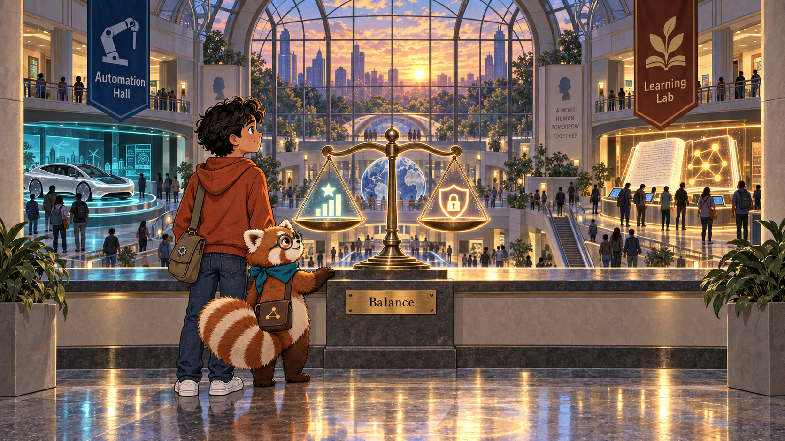

Image Prompt

(This is Panel 16. Do not include the panel number in the image.)
Generate a wide-landscape 16:9 image in the same style, depicting panel 16 of 16, at a large atrium window overlooking both wings of the museum at once, cars glowing silver-teal on one side and books glowing amber-teal on the other. In the center of the window ledge, show a stylized glowing balance scale sculpture with two pans: one pan etched with a small rising-star "benefit" icon, the other with a small shield-and-lock "risk" icon, both pans lifted roughly level, neither one overwhelming the other. Rowan and Theo stand together at the ledge, calm and thoughtful, Rowan's paw resting lightly on the scale's base, Theo looking out at the whole atrium with quiet resolve rather than worry. Include warm late-afternoon light through the glass ceiling, soft reflections of both wings in the polished floor, a small brass plaque reading only "Balance," and both wings' banners visible in the far background. Palette: navy, deep teal, cinnamon, cream, amber, brushed silver, evenly balanced across the whole frame. Emotional tone: grounded hope, not triumph or alarm. Generate the image immediately without asking clarifying questions.

Rowan led Theo to the window where both wings could be seen at once, and pointed at a small sculpture shaped like a scale. "Every level we walked through today gave more help by asking for more information," Rowan said. "Cars, books — it doesn't matter which. The benefit goes up, and so does the risk, at the same rate." Theo studied the two even pans. "So the goal isn't to stop climbing," he said slowly. "It's to make sure the risk pan never gets ahead of what we're protecting." Rowan nodded. "That's the whole point of walking through it carefully instead of jumping straight to Level 5."

### Epilogue – What Every Level Costs, What Every Level Gives

By the end of the tour, Theo had stopped seeing "smarter" as automatically "better" and started seeing it as a trade to examine, one level at a time. A textbook that knows you well enough to help you well also knows you well enough to hurt you if that knowledge is mishandled. The museum's answer was not to stop building — it was to build honestly, name each level plainly, and protect what each new level asks a learner to reveal.

| Challenge | How the Five Levels Responded | Lesson for Today |
|---|---|---|
| Car makers used vague marketing words like "autopilot" for very different systems | The SAE J3016 standard defined six numbered levels by capability, not marketing | Intelligent textbooks need the same plain-language scale, so schools know exactly what a system does and does not do |
| Automation crept in one convenience at a time — transmission, cruise control, sensors, cameras | Each addition removed one manual task while a human stayed in charge overall | Adaptive learning tools should add capability gradually too, always leaving a visible, working human override |
| More driving capability required more real-time data about the car's exact surroundings | Level 3+ vehicles need continuous sensor data to act safely at all | Level 3+ textbooks need continuous learner data to personalize safely — and that data deserves the same seriousness as a safety system |
| Full automation remains unfinished for both cars and classrooms | Engineers openly label Level 5 "aspirational" rather than overselling it | Honesty about what AI cannot yet do protects trust better than promising a fully "self-driving" classroom |

### Call to Action

The next time a textbook, an app, or a tutor offers to do something for you automatically, pause for one question: what does it need to know about me to do that? Ask it the way Rowan asks it — not to refuse the help, but to understand the trade clearly enough to accept it on purpose. The goal was never to stop the climb toward Level 5. It is to use AI carefully enough to protect what a student's data can cost them, while keeping everything that more autonomous learning can give: room to follow real curiosity, room to build empathy and critical thinking, and room to simply enjoy learning.

---

*"The more a system does for you, the more it needs to know about you. Let's follow that trade honestly."*
—Rowan

*"So the goal isn't to stop climbing. It's to make sure the risk pan never gets ahead of what we're protecting."*
—Theo Alvarez, fictional student

---

## References

1. [Wikipedia: Automatic transmission](https://en.wikipedia.org/wiki/Automatic_transmission) - History and mechanics of the transmission that removed the clutch pedal starting in 1940
2. [Wikipedia: Cruise control](https://en.wikipedia.org/wiki/Cruise_control) - Origins of Ralph Teetor's speed-holding mechanism and its path into production cars
3. [Wikipedia: Self-driving car](https://en.wikipedia.org/wiki/Self-driving_car) - Overview of automated-driving technology and the SAE J3016 levels of driving automation
4. [NHTSA: Automated Vehicles for Safety](https://www.nhtsa.gov/technology-innovation/automated-vehicles-safety) - The U.S. National Highway Traffic Safety Administration's official explanation of the levels of driving automation
5. [Dan McCreary: A Five-Level Classification Framework for Intelligent Textbooks](https://github.com/dmccreary/intelligent-textbooks/blob/main/papers/five-levels/main.tex) - The source paper proposing the five levels of intelligent textbooks used throughout this story
