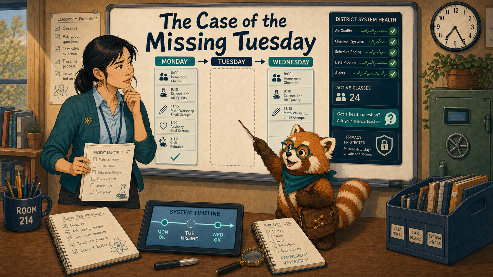
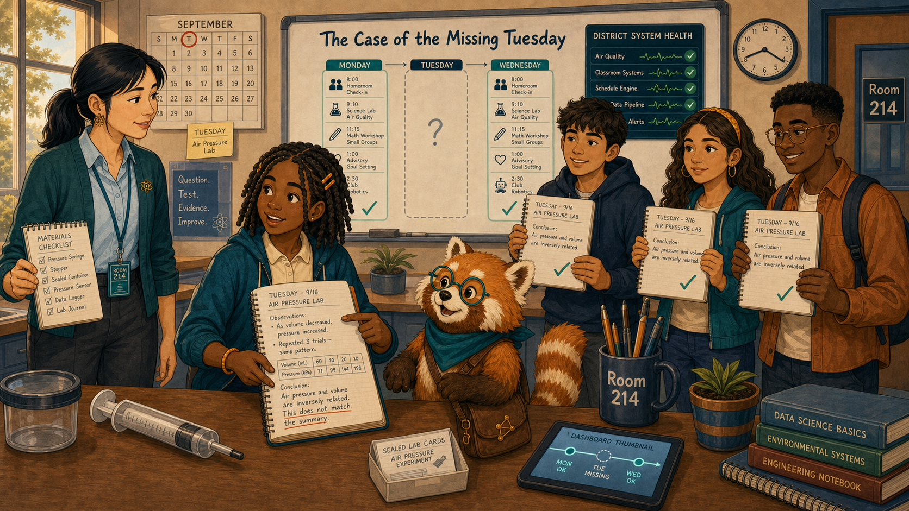
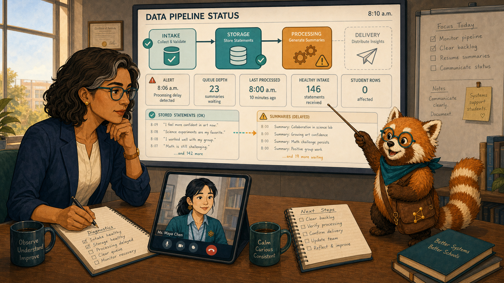
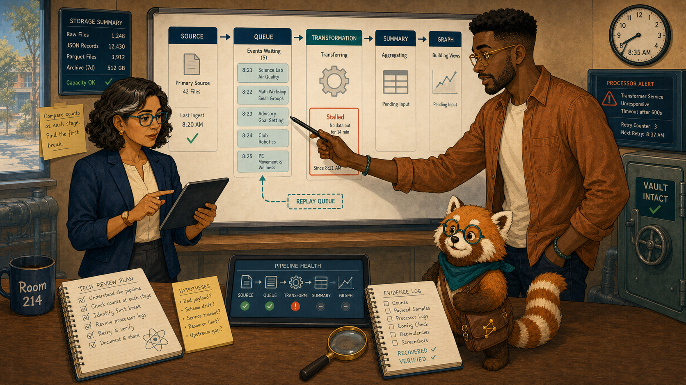
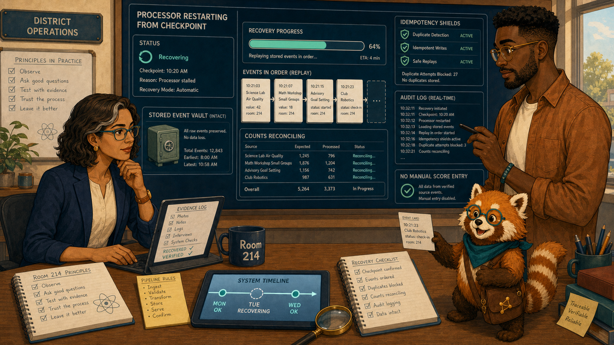
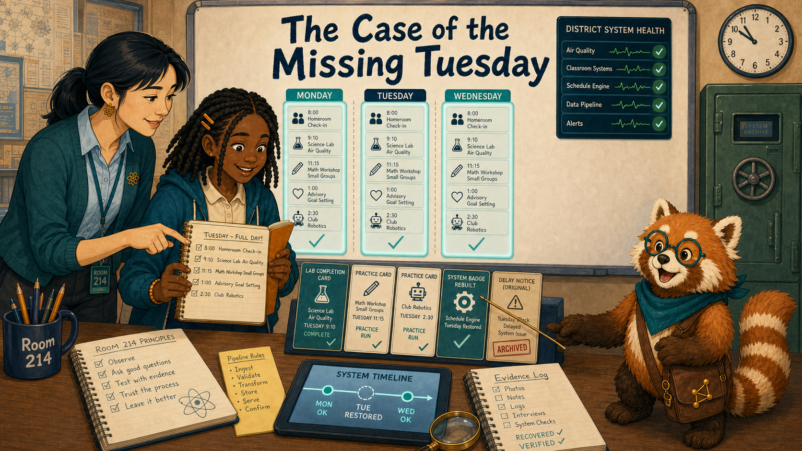
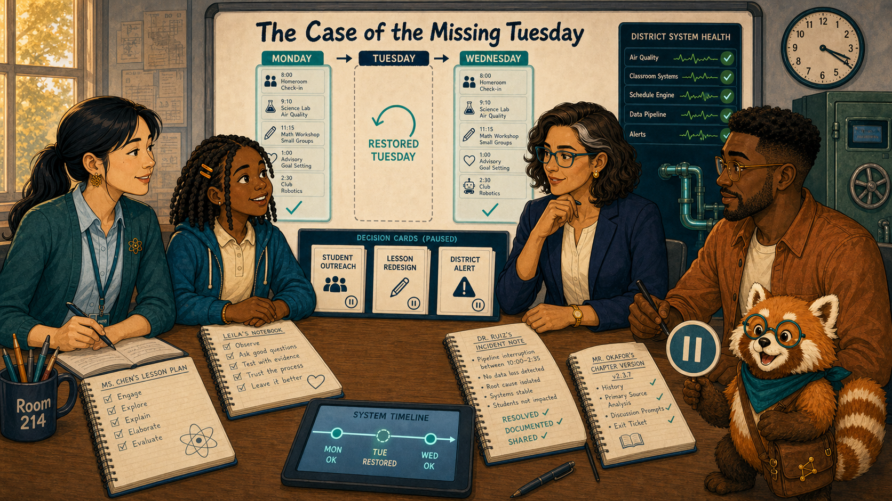
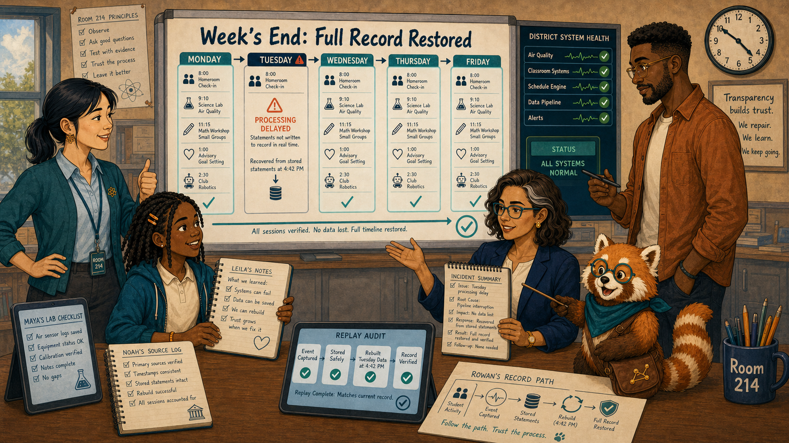

# The Case of the Missing Tuesday

Cover Image Prompt

(This is the Cover Image. Do not include this label in the image.)
Generate a wide-landscape 16:9 illustration in a warm contemporary educational-comic style with clean ink contours, softly painted color, expressive natural faces, gentle paper texture, realistic proportions, and a navy, deep-teal, cinnamon, cream, and amber palette. Set the scene across Room 214 and a district system-health view on Wednesday morning. Show Ms. Maya Chen, a 35-year-old Chinese American woman with a compact athletic build, light warm-beige skin, a softly square face with rounded cheeks, a small beauty mark below the outer corner of her left eye, and dark-brown almond-shaped eyes; her straight blue-black hair is center-parted in a low ponytail with two short face-framing strands, and she wears a deep-teal cardigan with pushed-up sleeves over a pale-blue button-front shirt, charcoal ankle trousers, white low-profile sneakers, an amber atom pin, and a dark-teal school lanyard. Show Leila Brooks, a 13-year-old Black American girl with a slender, age-appropriate build, rich dark-brown skin, a heart-shaped full-cheeked face, broad nose, large dark-brown eyes, and a small gap between her upper front teeth visible when she smiles; her black shoulder-length two-strand twists have a center part and are held back by two symmetrical matte amber barrettes, and she wears a cream short-sleeved polo under a teal zip-front school hoodie, dark-navy straight-leg trousers, cinnamon high-top sneakers, and an amber elastic wristband on her left wrist. Show Dr. Elena Ruiz, a 47-year-old Mexican American woman of medium height and build, with warm medium-brown skin, an oval high-cheekboned face, dark-brown eyes behind thin rectangular deep-teal glasses, and a collarbone-length wavy espresso-brown bob with a side part and one narrow silver streak at her right temple; she wears a navy blazer over a cream collarless blouse, charcoal trousers, small hammered-gold circular studs, and a slim amber watch on her left wrist. Show Noah Okafor, a 31-year-old Nigerian American man who is tall and lean, with deep umber-brown skin, a long oval face, broad nose, high forehead, dark-brown eyes behind round translucent amber glasses, a very short boxed beard and mustache, and dense black hair in a neat flat-topped coil cut with faded sides; he wears an open cinnamon overshirt over a cream crew-neck shirt, dark indigo trousers, teal canvas shoes, and a narrow deep-teal woven bracelet on his right wrist, and he usually holds a black stylus in his left hand. Show Rowan, a small rounded anthropomorphic red panda about desk height, with cinnamon-orange fur, a cream muzzle, cream eyebrow patches and belly, large kind brown eyes, dark-brown legs, and a thick ringed cinnamon-and-cream tail; he wears round deep-teal glasses, a deep-teal triangular neckerchief, and a compact brown cross-body satchel bearing a small gold connected-dots emblem. Place a large weekly timeline at center with Monday and Wednesday glowing teal and Tuesday visibly blank; behind the blank space, intact event cards wait in a navy queue. Maya holds a lab photo, Leila holds her amber notebook, Elena studies a health alert, Noah traces the pipeline, and Rowan opens a curtain onto the waiting cards. Include a replay arrow, a clock, a green storage vault, and no lost-work symbolism. Render the exact title “The Case of the Missing Tuesday” once in bold hand-lettered navy type. Emotional tone: technical mystery resolved by verifiable recovery. Keep every named character exactly consistent with this description, keep Rowan desk-height, show no brands, logos, surveillance imagery, rankings, or decorative data. Generate the image immediately without asking clarifying questions.

Narrative Prompt

This fictional eight-panel story distinguishes missing summaries from missing learning. Preserve the recurring cast and portray the LRS pipeline clearly: statements were durably stored, processing lagged, and summaries were rebuilt by replay. No one changes instruction or labels students until data health is verified.

### Prologue – The Day the Chart Forgot

Ms. Maya Chen teaches seventh-grade science at Cedar Grove Middle School. On Wednesday morning, Maya's dashboard showed no activity for Tuesday. Her memory showed something else: a noisy, focused lab in which every table had produced evidence.

## Panel 1: An Empty Column

Image Prompt

(This is Panel 01. Do not include the panel number in the image.)
Generate a wide-landscape 16:9 illustration in a warm contemporary educational-comic style with clean ink contours, softly painted color, expressive natural faces, gentle paper texture, realistic proportions, and a navy, deep-teal, cinnamon, cream, and amber palette. Set the scene at Maya's teacher display before school on Wednesday. Show Ms. Maya Chen, a 35-year-old Chinese American woman with a compact athletic build, light warm-beige skin, a softly square face with rounded cheeks, a small beauty mark below the outer corner of her left eye, and dark-brown almond-shaped eyes; her straight blue-black hair is center-parted in a low ponytail with two short face-framing strands, and she wears a deep-teal cardigan with pushed-up sleeves over a pale-blue button-front shirt, charcoal ankle trousers, white low-profile sneakers, an amber atom pin, and a dark-teal school lanyard. Show Rowan, a small rounded anthropomorphic red panda about desk height, with cinnamon-orange fur, a cream muzzle, cream eyebrow patches and belly, large kind brown eyes, dark-brown legs, and a thick ringed cinnamon-and-cream tail; he wears round deep-teal glasses, a deep-teal triangular neckerchief, and a compact brown cross-body satchel bearing a small gold connected-dots emblem. The weekly class timeline shows teal Monday, a blank Tuesday column, and early Wednesday events; Maya holds a Tuesday lab checklist. Include a system-time clock, a de-identified class count, a small health-question icon, Maya's black marker, a privacy shield, and Rowan pointing at the gap rather than the class.  Emotional tone: skepticism grounded in classroom memory. Keep every named character exactly consistent with this description, keep Rowan desk-height, show no brands, logos, surveillance imagery, rankings, or decorative data. Generate the image immediately without asking clarifying questions.

Rowan is the textbook's red-panda learning guide, helping people follow evidence without deciding for them. “Let's follow the record,” Rowan said. Maya did not send reminders or plan a remedial lesson. First she compared the chart with attendance, notebooks, and her own observation.

## Panel 2: Tuesday Really Happened

Image Prompt

(This is Panel 02. Do not include the panel number in the image.)
Generate a wide-landscape 16:9 illustration in a warm contemporary educational-comic style with clean ink contours, softly painted color, expressive natural faces, gentle paper texture, realistic proportions, and a navy, deep-teal, cinnamon, cream, and amber palette. Set the scene in Room 214 as students arrive. Show Leila Brooks, a 13-year-old Black American girl with a slender, age-appropriate build, rich dark-brown skin, a heart-shaped full-cheeked face, broad nose, large dark-brown eyes, and a small gap between her upper front teeth visible when she smiles; her black shoulder-length two-strand twists have a center part and are held back by two symmetrical matte amber barrettes, and she wears a cream short-sleeved polo under a teal zip-front school hoodie, dark-navy straight-leg trousers, cinnamon high-top sneakers, and an amber elastic wristband on her left wrist. Show Ms. Maya Chen, a 35-year-old Chinese American woman with a compact athletic build, light warm-beige skin, a softly square face with rounded cheeks, a small beauty mark below the outer corner of her left eye, and dark-brown almond-shaped eyes; her straight blue-black hair is center-parted in a low ponytail with two short face-framing strands, and she wears a deep-teal cardigan with pushed-up sleeves over a pale-blue button-front shirt, charcoal ankle trousers, white low-profile sneakers, an amber atom pin, and a dark-teal school lanyard. Show Rowan, a small rounded anthropomorphic red panda about desk height, with cinnamon-orange fur, a cream muzzle, cream eyebrow patches and belly, large kind brown eyes, dark-brown legs, and a thick ringed cinnamon-and-cream tail; he wears round deep-teal glasses, a deep-teal triangular neckerchief, and a compact brown cross-body satchel bearing a small gold connected-dots emblem. Leila opens an amber notebook to a dated Tuesday air-pressure lab with observations and a conclusion; Maya holds the matching materials checklist. Include three recurring classmates showing completed work, a wall calendar on Tuesday, a pressure syringe, sealed lab cards, the blank dashboard thumbnail, and morning light.  Emotional tone: confident contradiction of a faulty summary. Keep every named character exactly consistent with this description, keep Rowan desk-height, show no brands, logos, surveillance imagery, rankings, or decorative data. Generate the image immediately without asking clarifying questions.

Leila Brooks is a 13-year-old student in Maya's science class. She opened her dated lab notes and explained the pressure result without hesitation. The learning existed; the visible summary did not. That distinction changed the investigation.

## Panel 3: Check the System Before the Story

Image Prompt

(This is Panel 03. Do not include the panel number in the image.)
Generate a wide-landscape 16:9 illustration in a warm contemporary educational-comic style with clean ink contours, softly painted color, expressive natural faces, gentle paper texture, realistic proportions, and a navy, deep-teal, cinnamon, cream, and amber palette. Set the scene in Elena's district review room at 8:10 a.m.. Show Dr. Elena Ruiz, a 47-year-old Mexican American woman of medium height and build, with warm medium-brown skin, an oval high-cheekboned face, dark-brown eyes behind thin rectangular deep-teal glasses, and a collarbone-length wavy espresso-brown bob with a side part and one narrow silver streak at her right temple; she wears a navy blazer over a cream collarless blouse, charcoal trousers, small hammered-gold circular studs, and a slim amber watch on her left wrist. Show Ms. Maya Chen, a 35-year-old Chinese American woman with a compact athletic build, light warm-beige skin, a softly square face with rounded cheeks, a small beauty mark below the outer corner of her left eye, and dark-brown almond-shaped eyes; her straight blue-black hair is center-parted in a low ponytail with two short face-framing strands, and she wears a deep-teal cardigan with pushed-up sleeves over a pale-blue button-front shirt, charcoal ankle trousers, white low-profile sneakers, an amber atom pin, and a dark-teal school lanyard. Show Rowan, a small rounded anthropomorphic red panda about desk height, with cinnamon-orange fur, a cream muzzle, cream eyebrow patches and belly, large kind brown eyes, dark-brown legs, and a thick ringed cinnamon-and-cream tail; he wears round deep-teal glasses, a deep-teal triangular neckerchief, and a compact brown cross-body satchel bearing a small gold connected-dots emblem. Elena studies a pipeline diagram whose storage stage is teal but processing stage is amber and backed up; Maya appears on a call tile. Include an alert timestamp, queue depth, last-processed time, healthy intake count, no student rows, and Rowan tracing from stored statements to delayed summaries.  Emotional tone: calm operational diagnosis. Keep every named character exactly consistent with this description, keep Rowan desk-height, show no brands, logos, surveillance imagery, rankings, or decorative data. Generate the image immediately without asking clarifying questions.

Dr. Elena Ruiz is the district learning director and oversees trustworthy district evidence. Her health view showed that Tuesday's statements had reached durable storage, but the summary processor had fallen behind. Elena posted a visible data-delay notice so no one would mistake an incomplete chart for a complete account.

## Panel 4: The Waiting Queue

Image Prompt

(This is Panel 04. Do not include the panel number in the image.)
Generate a wide-landscape 16:9 illustration in a warm contemporary educational-comic style with clean ink contours, softly painted color, expressive natural faces, gentle paper texture, realistic proportions, and a navy, deep-teal, cinnamon, cream, and amber palette. Set the scene in a shared technical review at 8:35 a.m.. Show Noah Okafor, a 31-year-old Nigerian American man who is tall and lean, with deep umber-brown skin, a long oval face, broad nose, high forehead, dark-brown eyes behind round translucent amber glasses, a very short boxed beard and mustache, and dense black hair in a neat flat-topped coil cut with faded sides; he wears an open cinnamon overshirt over a cream crew-neck shirt, dark indigo trousers, teal canvas shoes, and a narrow deep-teal woven bracelet on his right wrist, and he usually holds a black stylus in his left hand. Show Dr. Elena Ruiz, a 47-year-old Mexican American woman of medium height and build, with warm medium-brown skin, an oval high-cheekboned face, dark-brown eyes behind thin rectangular deep-teal glasses, and a collarbone-length wavy espresso-brown bob with a side part and one narrow silver streak at her right temple; she wears a navy blazer over a cream collarless blouse, charcoal trousers, small hammered-gold circular studs, and a slim amber watch on her left wrist. Show Rowan, a small rounded anthropomorphic red panda about desk height, with cinnamon-orange fur, a cream muzzle, cream eyebrow patches and belly, large kind brown eyes, dark-brown legs, and a thick ringed cinnamon-and-cream tail; he wears round deep-teal glasses, a deep-teal triangular neckerchief, and a compact brown cross-body satchel bearing a small gold connected-dots emblem. Noah points with his left-hand stylus to a queue of timestamped event cards waiting behind one stalled transformation; Elena compares storage counts. Include source, queue, summary, and graph stages, a retry counter, an intact vault, a processor alert, and a dashed replay path.  Emotional tone: precise troubleshooting without panic. Keep every named character exactly consistent with this description, keep Rowan desk-height, show no brands, logos, surveillance imagery, rankings, or decorative data. Generate the image immediately without asking clarifying questions.

Noah Okafor designs the interactive textbook that emitted the learning statements. He confirmed the source timestamps and event identifiers. The book had sent the records once; the pipeline had preserved them. The failure lay between stored evidence and derived summaries.

## Panel 5: Repair Without Inventing

Image Prompt

(This is Panel 05. Do not include the panel number in the image.)
Generate a wide-landscape 16:9 illustration in a warm contemporary educational-comic style with clean ink contours, softly painted color, expressive natural faces, gentle paper texture, realistic proportions, and a navy, deep-teal, cinnamon, cream, and amber palette. Set the scene in the district operations view later that morning. Show Dr. Elena Ruiz, a 47-year-old Mexican American woman of medium height and build, with warm medium-brown skin, an oval high-cheekboned face, dark-brown eyes behind thin rectangular deep-teal glasses, and a collarbone-length wavy espresso-brown bob with a side part and one narrow silver streak at her right temple; she wears a navy blazer over a cream collarless blouse, charcoal trousers, small hammered-gold circular studs, and a slim amber watch on her left wrist. Show Noah Okafor, a 31-year-old Nigerian American man who is tall and lean, with deep umber-brown skin, a long oval face, broad nose, high forehead, dark-brown eyes behind round translucent amber glasses, a very short boxed beard and mustache, and dense black hair in a neat flat-topped coil cut with faded sides; he wears an open cinnamon overshirt over a cream crew-neck shirt, dark indigo trousers, teal canvas shoes, and a narrow deep-teal woven bracelet on his right wrist, and he usually holds a black stylus in his left hand. Show Rowan, a small rounded anthropomorphic red panda about desk height, with cinnamon-orange fur, a cream muzzle, cream eyebrow patches and belly, large kind brown eyes, dark-brown legs, and a thick ringed cinnamon-and-cream tail; he wears round deep-teal glasses, a deep-teal triangular neckerchief, and a compact brown cross-body satchel bearing a small gold connected-dots emblem. Show the stalled processor restarting from a clearly marked checkpoint while stored event cards move in order; Elena watches counts reconcile and Noah checks duplicate protection. Include idempotency shields, ordered timestamps, a progress bar, the intact raw-event vault, an audit log, and no manual score entry.  Emotional tone: controlled recovery and traceability. Keep every named character exactly consistent with this description, keep Rowan desk-height, show no brands, logos, surveillance imagery, rankings, or decorative data. Generate the image immediately without asking clarifying questions.

The operations team restarted processing from the last confirmed checkpoint. Duplicate protection kept the replay from counting events twice. Elena watched stored, processed, and summarized totals reconcile before removing the delay notice.

## Panel 6: Tuesday Reappears

Image Prompt

(This is Panel 06. Do not include the panel number in the image.)
Generate a wide-landscape 16:9 illustration in a warm contemporary educational-comic style with clean ink contours, softly painted color, expressive natural faces, gentle paper texture, realistic proportions, and a navy, deep-teal, cinnamon, cream, and amber palette. Set the scene at Maya's display just before lunch. Show Ms. Maya Chen, a 35-year-old Chinese American woman with a compact athletic build, light warm-beige skin, a softly square face with rounded cheeks, a small beauty mark below the outer corner of her left eye, and dark-brown almond-shaped eyes; her straight blue-black hair is center-parted in a low ponytail with two short face-framing strands, and she wears a deep-teal cardigan with pushed-up sleeves over a pale-blue button-front shirt, charcoal ankle trousers, white low-profile sneakers, an amber atom pin, and a dark-teal school lanyard. Show Leila Brooks, a 13-year-old Black American girl with a slender, age-appropriate build, rich dark-brown skin, a heart-shaped full-cheeked face, broad nose, large dark-brown eyes, and a small gap between her upper front teeth visible when she smiles; her black shoulder-length two-strand twists have a center part and are held back by two symmetrical matte amber barrettes, and she wears a cream short-sleeved polo under a teal zip-front school hoodie, dark-navy straight-leg trousers, cinnamon high-top sneakers, and an amber elastic wristband on her left wrist. Show Rowan, a small rounded anthropomorphic red panda about desk height, with cinnamon-orange fur, a cream muzzle, cream eyebrow patches and belly, large kind brown eyes, dark-brown legs, and a thick ringed cinnamon-and-cream tail; he wears round deep-teal glasses, a deep-teal triangular neckerchief, and a compact brown cross-body satchel bearing a small gold connected-dots emblem. The blank Tuesday column fills with teal lab events in chronological order while Maya and Leila compare it to the amber notebook. Include matching timestamps, one lab-completion card, two practice cards, a rebuilt badge, the original delay notice archived, and Rowan connecting notebook evidence to the restored line.  Emotional tone: relief supported by matching evidence. Keep every named character exactly consistent with this description, keep Rowan desk-height, show no brands, logos, surveillance imagery, rankings, or decorative data. Generate the image immediately without asking clarifying questions.

Tuesday returned to the timeline in the same order Maya remembered. Leila's lab activity, practice attempts, and explanation now appeared without anyone re-entering them. The replay recovered the summary because the original statements had remained intact.

## Panel 7: No Conclusions During an Outage

Image Prompt

(This is Panel 07. Do not include the panel number in the image.)
Generate a wide-landscape 16:9 illustration in a warm contemporary educational-comic style with clean ink contours, softly painted color, expressive natural faces, gentle paper texture, realistic proportions, and a navy, deep-teal, cinnamon, cream, and amber palette. Set the scene in a four-way review that afternoon. Show Leila Brooks, a 13-year-old Black American girl with a slender, age-appropriate build, rich dark-brown skin, a heart-shaped full-cheeked face, broad nose, large dark-brown eyes, and a small gap between her upper front teeth visible when she smiles; her black shoulder-length two-strand twists have a center part and are held back by two symmetrical matte amber barrettes, and she wears a cream short-sleeved polo under a teal zip-front school hoodie, dark-navy straight-leg trousers, cinnamon high-top sneakers, and an amber elastic wristband on her left wrist. Show Ms. Maya Chen, a 35-year-old Chinese American woman with a compact athletic build, light warm-beige skin, a softly square face with rounded cheeks, a small beauty mark below the outer corner of her left eye, and dark-brown almond-shaped eyes; her straight blue-black hair is center-parted in a low ponytail with two short face-framing strands, and she wears a deep-teal cardigan with pushed-up sleeves over a pale-blue button-front shirt, charcoal ankle trousers, white low-profile sneakers, an amber atom pin, and a dark-teal school lanyard. Show Noah Okafor, a 31-year-old Nigerian American man who is tall and lean, with deep umber-brown skin, a long oval face, broad nose, high forehead, dark-brown eyes behind round translucent amber glasses, a very short boxed beard and mustache, and dense black hair in a neat flat-topped coil cut with faded sides; he wears an open cinnamon overshirt over a cream crew-neck shirt, dark indigo trousers, teal canvas shoes, and a narrow deep-teal woven bracelet on his right wrist, and he usually holds a black stylus in his left hand. Show Dr. Elena Ruiz, a 47-year-old Mexican American woman of medium height and build, with warm medium-brown skin, an oval high-cheekboned face, dark-brown eyes behind thin rectangular deep-teal glasses, and a collarbone-length wavy espresso-brown bob with a side part and one narrow silver streak at her right temple; she wears a navy blazer over a cream collarless blouse, charcoal trousers, small hammered-gold circular studs, and a slim amber watch on her left wrist. Show Rowan, a small rounded anthropomorphic red panda about desk height, with cinnamon-orange fur, a cream muzzle, cream eyebrow patches and belly, large kind brown eyes, dark-brown legs, and a thick ringed cinnamon-and-cream tail; he wears round deep-teal glasses, a deep-teal triangular neckerchief, and a compact brown cross-body satchel bearing a small gold connected-dots emblem. Place three paused decision cards—student outreach, lesson redesign, district alert—beside the restored Tuesday timeline; each remains unissued. Include Maya's lesson plan, Noah's unchanged chapter version, Elena's incident note, Leila's completed notebook, and Rowan holding a pause symbol.  Emotional tone: discipline rewarded by avoided mistakes. Keep every named character exactly consistent with this description, keep Rowan desk-height, show no brands, logos, surveillance imagery, rankings, or decorative data. Generate the image immediately without asking clarifying questions.

Maya had not contacted families about inactivity. Noah had not redesigned a healthy lab. Elena had not compared schools using an incomplete week. Their pause was not indecision; it was respect for the limits of the available evidence.

## Panel 8: A Gap the System Can Explain

Image Prompt

(This is Panel 08. Do not include the panel number in the image.)
Generate a wide-landscape 16:9 illustration in a warm contemporary educational-comic style with clean ink contours, softly painted color, expressive natural faces, gentle paper texture, realistic proportions, and a navy, deep-teal, cinnamon, cream, and amber palette. Set the scene in Room 214 and the district review room at week's end. Show Leila Brooks, a 13-year-old Black American girl with a slender, age-appropriate build, rich dark-brown skin, a heart-shaped full-cheeked face, broad nose, large dark-brown eyes, and a small gap between her upper front teeth visible when she smiles; her black shoulder-length two-strand twists have a center part and are held back by two symmetrical matte amber barrettes, and she wears a cream short-sleeved polo under a teal zip-front school hoodie, dark-navy straight-leg trousers, cinnamon high-top sneakers, and an amber elastic wristband on her left wrist. Show Ms. Maya Chen, a 35-year-old Chinese American woman with a compact athletic build, light warm-beige skin, a softly square face with rounded cheeks, a small beauty mark below the outer corner of her left eye, and dark-brown almond-shaped eyes; her straight blue-black hair is center-parted in a low ponytail with two short face-framing strands, and she wears a deep-teal cardigan with pushed-up sleeves over a pale-blue button-front shirt, charcoal ankle trousers, white low-profile sneakers, an amber atom pin, and a dark-teal school lanyard. Show Noah Okafor, a 31-year-old Nigerian American man who is tall and lean, with deep umber-brown skin, a long oval face, broad nose, high forehead, dark-brown eyes behind round translucent amber glasses, a very short boxed beard and mustache, and dense black hair in a neat flat-topped coil cut with faded sides; he wears an open cinnamon overshirt over a cream crew-neck shirt, dark indigo trousers, teal canvas shoes, and a narrow deep-teal woven bracelet on his right wrist, and he usually holds a black stylus in his left hand. Show Dr. Elena Ruiz, a 47-year-old Mexican American woman of medium height and build, with warm medium-brown skin, an oval high-cheekboned face, dark-brown eyes behind thin rectangular deep-teal glasses, and a collarbone-length wavy espresso-brown bob with a side part and one narrow silver streak at her right temple; she wears a navy blazer over a cream collarless blouse, charcoal trousers, small hammered-gold circular studs, and a slim amber watch on her left wrist. Show Rowan, a small rounded anthropomorphic red panda about desk height, with cinnamon-orange fur, a cream muzzle, cream eyebrow patches and belly, large kind brown eyes, dark-brown legs, and a thick ringed cinnamon-and-cream tail; he wears round deep-teal glasses, a deep-teal triangular neckerchief, and a compact brown cross-body satchel bearing a small gold connected-dots emblem. Gather the team around a complete weekly timeline with Tuesday annotated processing delayed, later rebuilt from stored statements. Include a health-status badge, replay audit, Maya's lab checklist, Leila's notebook, Noah's source log, Elena's incident summary, and Rowan tracing the full record path.  Emotional tone: trust strengthened by transparent repair. Keep every named character exactly consistent with this description, keep Rowan desk-height, show no brands, logos, surveillance imagery, rankings, or decorative data. Generate the image immediately without asking clarifying questions.

The final report kept the incident annotation instead of hiding it. Students' work was visible, the pipeline's delay was explainable, and the recovery was auditable. Trust grew because the system could show both the gap and the path used to repair it.

### Epilogue – Verify the Record First

The dashboard was a projection, not the original learning event log. By checking classroom artifacts, storage health, timestamps, processing checkpoints, and replay totals, the team recovered without inventing or duplicating evidence.

| Challenge | How the Team Responded | Lesson for Today |
|---|---|---|
| Tuesday looked empty | Maya checked classroom evidence | A dashboard can be incomplete |
| Learning statements were stored | Elena separated storage from processing health | Pipeline stages have different failure modes |
| Summaries lagged | The team replayed from a checkpoint | Recoverable records support trustworthy repair |
| Decisions were tempting | Everyone paused until reconciliation | Verify evidence health before acting |

### Call to Action

When a chart conflicts with lived evidence, check completeness, timestamps, and pipeline health before drawing a conclusion. A trustworthy system does not merely recover—it explains what failed and how the record was rebuilt.

---

*“Tuesday happened, even when the chart forgot it.”* 
—Leila Brooks, fictional student

*“Let's follow the record.”* 
—Rowan

*“A visible delay is safer than an invisible assumption.”* 
—Dr. Elena Ruiz, fictional district learning director

---

## References

1. [Wikipedia: Data quality](https://en.wikipedia.org/wiki/Data_quality) - Overview of completeness, accuracy, consistency, and timeliness
2. [Wikipedia: Event-driven architecture](https://en.wikipedia.org/wiki/Event-driven_architecture) - Background on systems that process streams of events
3. [Wikipedia: Eventual consistency](https://en.wikipedia.org/wiki/Eventual_consistency) - Introduction to delayed convergence in distributed systems
4. [ADL: Experience API specification](https://github.com/adlnet/xAPI-Spec) - Specification for storing and retrieving learning statements
5. [OpenTelemetry: Observability Primer](https://opentelemetry.io/docs/concepts/observability-primer/) - Guidance on traces, metrics, and logs for system health
