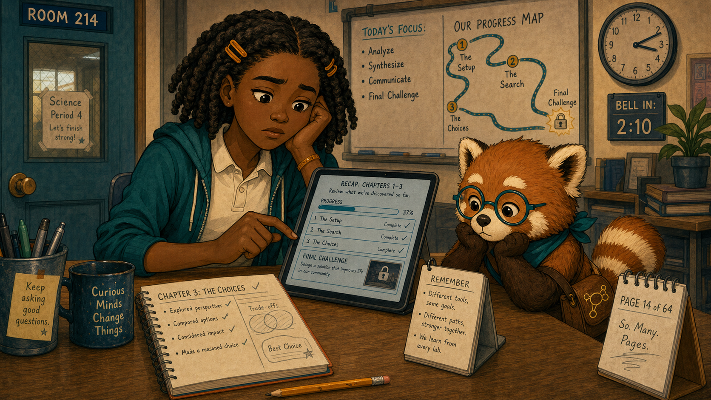
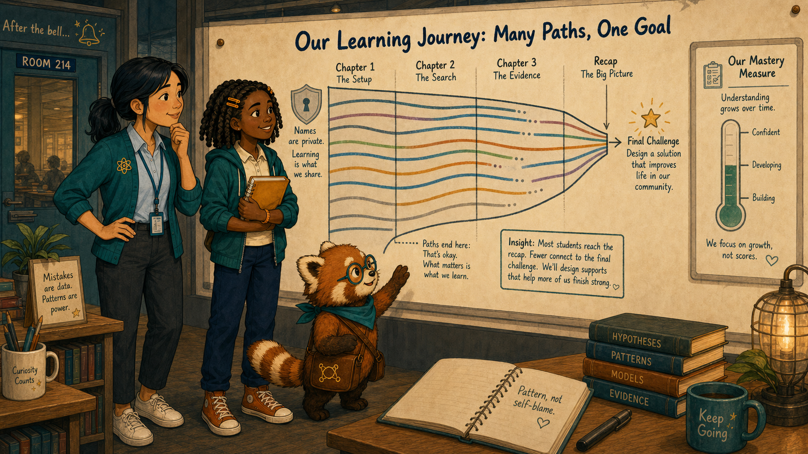
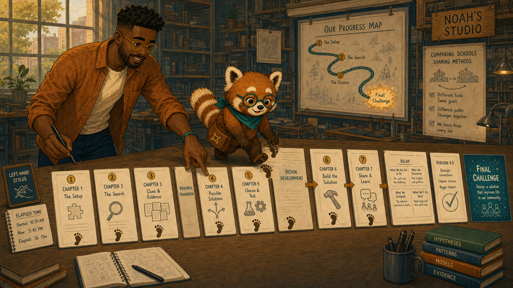
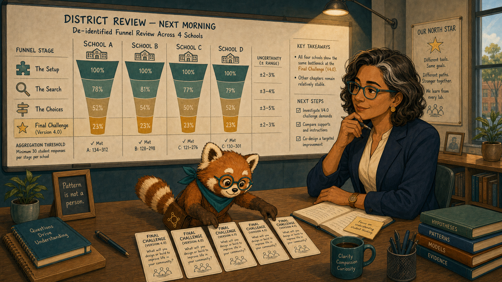
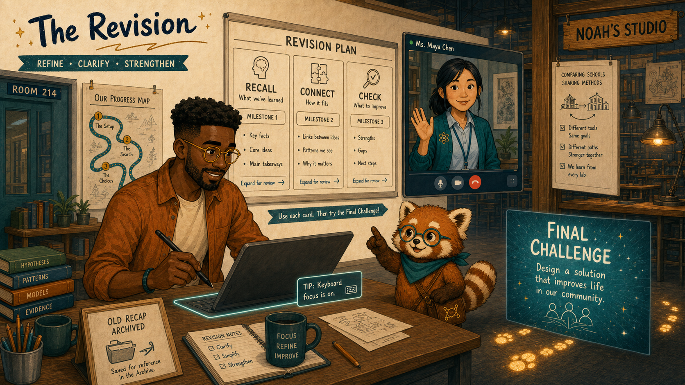
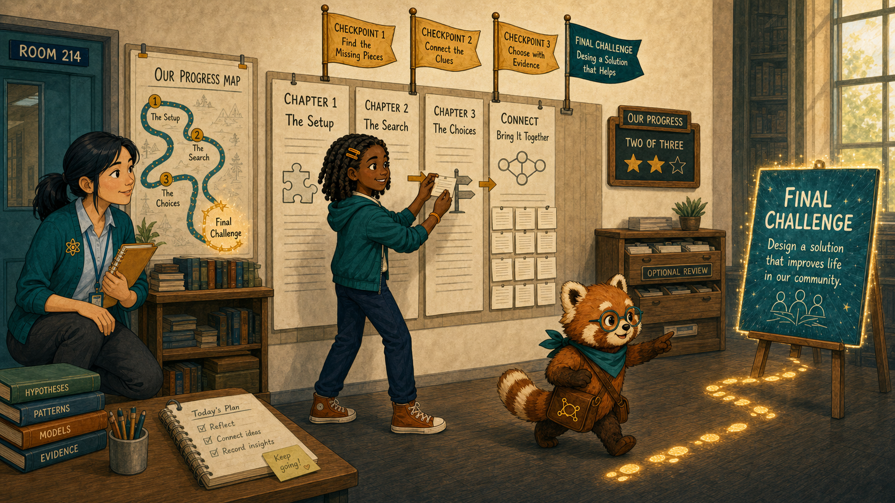
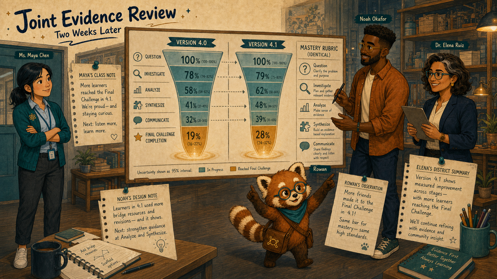
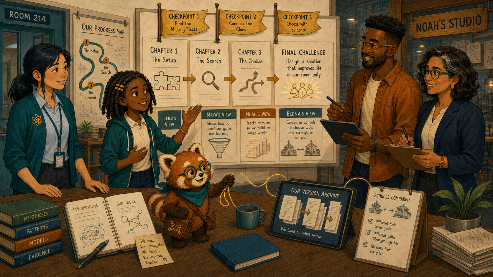

# The Chapter with the Vanishing Ending

Cover Image Prompt

(This is the Cover Image. Do not include this label in the image.)
Generate a wide-landscape 16:9 illustration in a warm contemporary educational-comic style with clean ink contours, softly painted color, expressive natural faces, gentle paper texture, realistic proportions, and a navy, deep-teal, cinnamon, cream, and amber palette. Set the scene inside a visualized science chapter path spanning Room 214 and Noah's studio. Show Leila Brooks, a 13-year-old Black American girl with a slender, age-appropriate build, rich dark-brown skin, a heart-shaped full-cheeked face, broad nose, large dark-brown eyes, and a small gap between her upper front teeth visible when she smiles; her black shoulder-length two-strand twists have a center part and are held back by two symmetrical matte amber barrettes, and she wears a cream short-sleeved polo under a teal zip-front school hoodie, dark-navy straight-leg trousers, cinnamon high-top sneakers, and an amber elastic wristband on her left wrist. Show Ms. Maya Chen, a 35-year-old Chinese American woman with a compact athletic build, light warm-beige skin, a softly square face with rounded cheeks, a small beauty mark below the outer corner of her left eye, and dark-brown almond-shaped eyes; her straight blue-black hair is center-parted in a low ponytail with two short face-framing strands, and she wears a deep-teal cardigan with pushed-up sleeves over a pale-blue button-front shirt, charcoal ankle trousers, white low-profile sneakers, an amber atom pin, and a dark-teal school lanyard. Show Noah Okafor, a 31-year-old Nigerian American man who is tall and lean, with deep umber-brown skin, a long oval face, broad nose, high forehead, dark-brown eyes behind round translucent amber glasses, a very short boxed beard and mustache, and dense black hair in a neat flat-topped coil cut with faded sides; he wears an open cinnamon overshirt over a cream crew-neck shirt, dark indigo trousers, teal canvas shoes, and a narrow deep-teal woven bracelet on his right wrist, and he usually holds a black stylus in his left hand. Show Dr. Elena Ruiz, a 47-year-old Mexican American woman of medium height and build, with warm medium-brown skin, an oval high-cheekboned face, dark-brown eyes behind thin rectangular deep-teal glasses, and a collarbone-length wavy espresso-brown bob with a side part and one narrow silver streak at her right temple; she wears a navy blazer over a cream collarless blouse, charcoal trousers, small hammered-gold circular studs, and a slim amber watch on her left wrist. Show Rowan, a small rounded anthropomorphic red panda about desk height, with cinnamon-orange fur, a cream muzzle, cream eyebrow patches and belly, large kind brown eyes, dark-brown legs, and a thick ringed cinnamon-and-cream tail; he wears round deep-teal glasses, a deep-teal triangular neckerchief, and a compact brown cross-body satchel bearing a small gold connected-dots emblem. Create a sequence of cream page cards narrowing into a dense wall of recap text before a glowing teal final challenge. Leila stands at the bottleneck with her amber notebook; Maya marks the class funnel, Noah divides the wall into checkpoints, Elena compares schools, and Rowan follows a gold trail of footprints. Include a progress map, three milestone flags, version cards, a completion funnel, and no failure labels. Render the exact title “The Chapter with the Vanishing Ending” once in bold hand-lettered navy type. Emotional tone: a burdensome path becoming navigable. Keep every named character exactly consistent with this description, keep Rowan desk-height, and show no brands, logos, rankings, exposed private records, or decorative data. Generate the image immediately without asking clarifying questions.

Narrative Prompt

This fictional eight-panel story follows a completion funnel that narrows at a long recap page before a final ecosystems challenge. Preserve the recurring cast. The redesign splits the recap into meaningful checkpoints with visible progress and optional review, while the final learning objective remains unchanged. Completion and mastery remain separate measures.

### Prologue – Almost at the End

Leila Brooks is a 13-year-old seventh-grade science student at Cedar Grove Middle School. She had completed nearly an entire ecosystems chapter when a long recap made the final challenge feel farther away than it had at the beginning.

## Panel 1: The Page That Kept Growing

Image Prompt

(This is Panel 01. Do not include the panel number in the image.)
Generate a wide-landscape 16:9 illustration in a warm contemporary educational-comic style with clean ink contours, softly painted color, expressive natural faces, gentle paper texture, realistic proportions, and a navy, deep-teal, cinnamon, cream, and amber palette. Set the scene at a Room 214 desk late in a science period. Show Leila Brooks, a 13-year-old Black American girl with a slender, age-appropriate build, rich dark-brown skin, a heart-shaped full-cheeked face, broad nose, large dark-brown eyes, and a small gap between her upper front teeth visible when she smiles; her black shoulder-length two-strand twists have a center part and are held back by two symmetrical matte amber barrettes, and she wears a cream short-sleeved polo under a teal zip-front school hoodie, dark-navy straight-leg trousers, cinnamon high-top sneakers, and an amber elastic wristband on her left wrist. Show Rowan, a small rounded anthropomorphic red panda about desk height, with cinnamon-orange fur, a cream muzzle, cream eyebrow patches and belly, large kind brown eyes, dark-brown legs, and a thick ringed cinnamon-and-cream tail; he wears round deep-teal glasses, a deep-teal triangular neckerchief, and a compact brown cross-body satchel bearing a small gold connected-dots emblem. Leila scrolls a dense recap page whose progress indicator barely moves while the final challenge remains a distant locked-looking thumbnail. Include her amber notebook with completed work, a classroom clock near the bell, four long text sections, an unhelpful page counter, a tired pencil, and Rowan studying the path rather than pushing her onward.  Emotional tone: fatigue without helplessness. Keep every named character exactly consistent with this description, keep Rowan desk-height, and show no brands, logos, rankings, exposed private records, or decorative data. Generate the image immediately without asking clarifying questions.

Rowan is the textbook's red-panda learning guide, helping people follow evidence without deciding for them. Leila understood the earlier activities, but the recap repeated everything in one unbroken stretch. “I thought I was almost there,” she said. “Then the ending moved away.”

## Panel 2: A Funnel with One Narrow Step

Image Prompt

(This is Panel 02. Do not include the panel number in the image.)
Generate a wide-landscape 16:9 illustration in a warm contemporary educational-comic style with clean ink contours, softly painted color, expressive natural faces, gentle paper texture, realistic proportions, and a navy, deep-teal, cinnamon, cream, and amber palette. Set the scene at Maya's authorized class display after the bell. Show Ms. Maya Chen, a 35-year-old Chinese American woman with a compact athletic build, light warm-beige skin, a softly square face with rounded cheeks, a small beauty mark below the outer corner of her left eye, and dark-brown almond-shaped eyes; her straight blue-black hair is center-parted in a low ponytail with two short face-framing strands, and she wears a deep-teal cardigan with pushed-up sleeves over a pale-blue button-front shirt, charcoal ankle trousers, white low-profile sneakers, an amber atom pin, and a dark-teal school lanyard. Show Leila Brooks, a 13-year-old Black American girl with a slender, age-appropriate build, rich dark-brown skin, a heart-shaped full-cheeked face, broad nose, large dark-brown eyes, and a small gap between her upper front teeth visible when she smiles; her black shoulder-length two-strand twists have a center part and are held back by two symmetrical matte amber barrettes, and she wears a cream short-sleeved polo under a teal zip-front school hoodie, dark-navy straight-leg trousers, cinnamon high-top sneakers, and an amber elastic wristband on her left wrist. Show Rowan, a small rounded anthropomorphic red panda about desk height, with cinnamon-orange fur, a cream muzzle, cream eyebrow patches and belly, large kind brown eyes, dark-brown legs, and a thick ringed cinnamon-and-cream tail; he wears round deep-teal glasses, a deep-teal triangular neckerchief, and a compact brown cross-body satchel bearing a small gold connected-dots emblem. Maya and Leila examine a funnel of chapter pages that stays broad until the recap, where many anonymous paths stop before the final challenge. Include blurred names, a privacy shield, equal earlier page widths, one sharply narrow recap stage, a mastery measure shown separately, and Maya's black marker.  Emotional tone: a shared pattern replacing self-blame. Keep every named character exactly consistent with this description, keep Rowan desk-height, and show no brands, logos, rankings, exposed private records, or decorative data. Generate the image immediately without asking clarifying questions.

Ms. Maya Chen teaches Leila's science class. The class funnel narrowed at the same recap page, while earlier explanations and practice looked healthy. Maya asked Leila what the page felt like. The stop point was visible; the reason came from the learner.

## Panel 3: Trace Every Page

Image Prompt

(This is Panel 03. Do not include the panel number in the image.)
Generate a wide-landscape 16:9 illustration in a warm contemporary educational-comic style with clean ink contours, softly painted color, expressive natural faces, gentle paper texture, realistic proportions, and a navy, deep-teal, cinnamon, cream, and amber palette. Set the scene in Noah's design studio that afternoon. Show Noah Okafor, a 31-year-old Nigerian American man who is tall and lean, with deep umber-brown skin, a long oval face, broad nose, high forehead, dark-brown eyes behind round translucent amber glasses, a very short boxed beard and mustache, and dense black hair in a neat flat-topped coil cut with faded sides; he wears an open cinnamon overshirt over a cream crew-neck shirt, dark indigo trousers, teal canvas shoes, and a narrow deep-teal woven bracelet on his right wrist, and he usually holds a black stylus in his left hand. Show Rowan, a small rounded anthropomorphic red panda about desk height, with cinnamon-orange fur, a cream muzzle, cream eyebrow patches and belly, large kind brown eyes, dark-brown legs, and a thick ringed cinnamon-and-cream tail; he wears round deep-teal glasses, a deep-teal triangular neckerchief, and a compact brown cross-body satchel bearing a small gold connected-dots emblem. Noah lays eight page cards in order across a long table and walks a finger path toward the recap card, which contains four dense sections and no milestones. Include a left-hand stylus, elapsed-time notes, the unchanged final challenge, three paper dividers, a version 4.0 card, and Rowan placing a footprint at each page.  Emotional tone: patient reproduction and design accountability. Keep every named character exactly consistent with this description, keep Rowan desk-height, and show no brands, logos, rankings, exposed private records, or decorative data. Generate the image immediately without asking clarifying questions.

Noah Okafor designs the interactive textbook and its chapter flows. He followed the exact sequence at student pace. The recap asked learners to review four ideas, make three connections, and sustain attention without a checkpoint. Its content was useful; its shape was exhausting.

## Panel 4: Not Just One Classroom

Image Prompt

(This is Panel 04. Do not include the panel number in the image.)
Generate a wide-landscape 16:9 illustration in a warm contemporary educational-comic style with clean ink contours, softly painted color, expressive natural faces, gentle paper texture, realistic proportions, and a navy, deep-teal, cinnamon, cream, and amber palette. Set the scene in Elena's district review room the next morning. Show Dr. Elena Ruiz, a 47-year-old Mexican American woman of medium height and build, with warm medium-brown skin, an oval high-cheekboned face, dark-brown eyes behind thin rectangular deep-teal glasses, and a collarbone-length wavy espresso-brown bob with a side part and one narrow silver streak at her right temple; she wears a navy blazer over a cream collarless blouse, charcoal trousers, small hammered-gold circular studs, and a slim amber watch on her left wrist. Show Rowan, a small rounded anthropomorphic red panda about desk height, with cinnamon-orange fur, a cream muzzle, cream eyebrow patches and belly, large kind brown eyes, dark-brown legs, and a thick ringed cinnamon-and-cream tail; he wears round deep-teal glasses, a deep-teal triangular neckerchief, and a compact brown cross-body satchel bearing a small gold connected-dots emblem. Elena studies de-identified funnels from four schools, all narrowing at the same page in version 4.0, while other chapters remain stable. Include an aggregation threshold, version labels, school icons, uncertainty ranges, no names, and Rowan aligning the identical bottleneck cards.  Emotional tone: careful confirmation of a content-specific pattern. Keep every named character exactly consistent with this description, keep Rowan desk-height, and show no brands, logos, rankings, exposed private records, or decorative data. Generate the image immediately without asking clarifying questions.

Dr. Elena Ruiz is the district learning director and reviews de-identified patterns across schools. The same version narrowed at the same page in four schools. Other chapters at those schools did not. Elena could distinguish a content bottleneck from a claim about school performance.

## Panel 5: Turn the Wall into Checkpoints

Image Prompt

(This is Panel 05. Do not include the panel number in the image.)
Generate a wide-landscape 16:9 illustration in a warm contemporary educational-comic style with clean ink contours, softly painted color, expressive natural faces, gentle paper texture, realistic proportions, and a navy, deep-teal, cinnamon, cream, and amber palette. Set the scene in Noah's studio during the revision. Show Noah Okafor, a 31-year-old Nigerian American man who is tall and lean, with deep umber-brown skin, a long oval face, broad nose, high forehead, dark-brown eyes behind round translucent amber glasses, a very short boxed beard and mustache, and dense black hair in a neat flat-topped coil cut with faded sides; he wears an open cinnamon overshirt over a cream crew-neck shirt, dark indigo trousers, teal canvas shoes, and a narrow deep-teal woven bracelet on his right wrist, and he usually holds a black stylus in his left hand. Show Ms. Maya Chen, a 35-year-old Chinese American woman with a compact athletic build, light warm-beige skin, a softly square face with rounded cheeks, a small beauty mark below the outer corner of her left eye, and dark-brown almond-shaped eyes; her straight blue-black hair is center-parted in a low ponytail with two short face-framing strands, and she wears a deep-teal cardigan with pushed-up sleeves over a pale-blue button-front shirt, charcoal ankle trousers, white low-profile sneakers, an amber atom pin, and a dark-teal school lanyard. Show Rowan, a small rounded anthropomorphic red panda about desk height, with cinnamon-orange fur, a cream muzzle, cream eyebrow patches and belly, large kind brown eyes, dark-brown legs, and a thick ringed cinnamon-and-cream tail; he wears round deep-teal glasses, a deep-teal triangular neckerchief, and a compact brown cross-body satchel bearing a small gold connected-dots emblem. Noah divides the dense recap into three short cards labeled Recall, Connect, and Check, each with a visible milestone; Maya reviews on a video tile. Include optional expand-for-review links, a persistent progress trail, the unchanged final challenge, a left-hand stylus, a keyboard focus outline, and the old recap archived.  Emotional tone: clarity and restraint. Keep every named character exactly consistent with this description, keep Rowan desk-height, and show no brands, logos, rankings, exposed private records, or decorative data. Generate the image immediately without asking clarifying questions.

Noah split the recap into three purposeful checkpoints: recall the concepts, connect them, and check one explanation. Maya preserved an optional deeper review for students who wanted it. The team changed pacing and navigation, not the learning goal.

## Panel 6: The Ending Stays in Sight

Image Prompt

(This is Panel 06. Do not include the panel number in the image.)
Generate a wide-landscape 16:9 illustration in a warm contemporary educational-comic style with clean ink contours, softly painted color, expressive natural faces, gentle paper texture, realistic proportions, and a navy, deep-teal, cinnamon, cream, and amber palette. Set the scene in Room 214 during the next chapter trial. Show Leila Brooks, a 13-year-old Black American girl with a slender, age-appropriate build, rich dark-brown skin, a heart-shaped full-cheeked face, broad nose, large dark-brown eyes, and a small gap between her upper front teeth visible when she smiles; her black shoulder-length two-strand twists have a center part and are held back by two symmetrical matte amber barrettes, and she wears a cream short-sleeved polo under a teal zip-front school hoodie, dark-navy straight-leg trousers, cinnamon high-top sneakers, and an amber elastic wristband on her left wrist. Show Ms. Maya Chen, a 35-year-old Chinese American woman with a compact athletic build, light warm-beige skin, a softly square face with rounded cheeks, a small beauty mark below the outer corner of her left eye, and dark-brown almond-shaped eyes; her straight blue-black hair is center-parted in a low ponytail with two short face-framing strands, and she wears a deep-teal cardigan with pushed-up sleeves over a pale-blue button-front shirt, charcoal ankle trousers, white low-profile sneakers, an amber atom pin, and a dark-teal school lanyard. Show Rowan, a small rounded anthropomorphic red panda about desk height, with cinnamon-orange fur, a cream muzzle, cream eyebrow patches and belly, large kind brown eyes, dark-brown legs, and a thick ringed cinnamon-and-cream tail; he wears round deep-teal glasses, a deep-teal triangular neckerchief, and a compact brown cross-body satchel bearing a small gold connected-dots emblem. Leila completes the Connect checkpoint while all three milestone flags and the final challenge remain visible on one path. Maya watches from student eye level. Include her amber notebook, a concise progress label two of three, an optional review drawer, recurring classmates at different checkpoints, and Rowan tracing the remaining short route.  Emotional tone: steady effort supported by visible progress. Keep every named character exactly consistent with this description, keep Rowan desk-height, and show no brands, logos, rankings, exposed private records, or decorative data. Generate the image immediately without asking clarifying questions.

Leila could see where she was, what each checkpoint asked, and how much remained. She opened one optional review, skipped another she could already explain, and reached the final challenge before the bell. The ending had not become easier; it had become visible.

## Panel 7: More Arrivals, Same Standard

Image Prompt

(This is Panel 07. Do not include the panel number in the image.)
Generate a wide-landscape 16:9 illustration in a warm contemporary educational-comic style with clean ink contours, softly painted color, expressive natural faces, gentle paper texture, realistic proportions, and a navy, deep-teal, cinnamon, cream, and amber palette. Set the scene in a joint evidence review two weeks later. Show Ms. Maya Chen, a 35-year-old Chinese American woman with a compact athletic build, light warm-beige skin, a softly square face with rounded cheeks, a small beauty mark below the outer corner of her left eye, and dark-brown almond-shaped eyes; her straight blue-black hair is center-parted in a low ponytail with two short face-framing strands, and she wears a deep-teal cardigan with pushed-up sleeves over a pale-blue button-front shirt, charcoal ankle trousers, white low-profile sneakers, an amber atom pin, and a dark-teal school lanyard. Show Noah Okafor, a 31-year-old Nigerian American man who is tall and lean, with deep umber-brown skin, a long oval face, broad nose, high forehead, dark-brown eyes behind round translucent amber glasses, a very short boxed beard and mustache, and dense black hair in a neat flat-topped coil cut with faded sides; he wears an open cinnamon overshirt over a cream crew-neck shirt, dark indigo trousers, teal canvas shoes, and a narrow deep-teal woven bracelet on his right wrist, and he usually holds a black stylus in his left hand. Show Dr. Elena Ruiz, a 47-year-old Mexican American woman of medium height and build, with warm medium-brown skin, an oval high-cheekboned face, dark-brown eyes behind thin rectangular deep-teal glasses, and a collarbone-length wavy espresso-brown bob with a side part and one narrow silver streak at her right temple; she wears a navy blazer over a cream collarless blouse, charcoal trousers, small hammered-gold circular studs, and a slim amber watch on her left wrist. Show Rowan, a small rounded anthropomorphic red panda about desk height, with cinnamon-orange fur, a cream muzzle, cream eyebrow patches and belly, large kind brown eyes, dark-brown legs, and a thick ringed cinnamon-and-cream tail; he wears round deep-teal glasses, a deep-teal triangular neckerchief, and a compact brown cross-body satchel bearing a small gold connected-dots emblem. Show version 4.0 and 4.1 funnels side by side: more learners reach the final challenge in 4.1, while the mastery rubric remains identical. Include uncertainty bands, a version marker, no leaderboard, Maya's class note, Noah's design note, Elena's district summary, and Rowan pointing to both completion and mastery.  Emotional tone: measured improvement without overclaiming. Keep every named character exactly consistent with this description, keep Rowan desk-height, and show no brands, logos, rankings, exposed private records, or decorative data. Generate the image immediately without asking clarifying questions.

Version 4.1 carried more learners to the final challenge. Mastery at the end remained a separate measure and improved modestly, not magically. The evidence supported a pacing repair, while keeping the scientific standard intact.

## Panel 8: A Path Worth Finishing

Image Prompt

(This is Panel 08. Do not include the panel number in the image.)
Generate a wide-landscape 16:9 illustration in a warm contemporary educational-comic style with clean ink contours, softly painted color, expressive natural faces, gentle paper texture, realistic proportions, and a navy, deep-teal, cinnamon, cream, and amber palette. Set the scene in Room 214 after school at the end of the unit. Show Leila Brooks, a 13-year-old Black American girl with a slender, age-appropriate build, rich dark-brown skin, a heart-shaped full-cheeked face, broad nose, large dark-brown eyes, and a small gap between her upper front teeth visible when she smiles; her black shoulder-length two-strand twists have a center part and are held back by two symmetrical matte amber barrettes, and she wears a cream short-sleeved polo under a teal zip-front school hoodie, dark-navy straight-leg trousers, cinnamon high-top sneakers, and an amber elastic wristband on her left wrist. Show Ms. Maya Chen, a 35-year-old Chinese American woman with a compact athletic build, light warm-beige skin, a softly square face with rounded cheeks, a small beauty mark below the outer corner of her left eye, and dark-brown almond-shaped eyes; her straight blue-black hair is center-parted in a low ponytail with two short face-framing strands, and she wears a deep-teal cardigan with pushed-up sleeves over a pale-blue button-front shirt, charcoal ankle trousers, white low-profile sneakers, an amber atom pin, and a dark-teal school lanyard. Show Noah Okafor, a 31-year-old Nigerian American man who is tall and lean, with deep umber-brown skin, a long oval face, broad nose, high forehead, dark-brown eyes behind round translucent amber glasses, a very short boxed beard and mustache, and dense black hair in a neat flat-topped coil cut with faded sides; he wears an open cinnamon overshirt over a cream crew-neck shirt, dark indigo trousers, teal canvas shoes, and a narrow deep-teal woven bracelet on his right wrist, and he usually holds a black stylus in his left hand. Show Dr. Elena Ruiz, a 47-year-old Mexican American woman of medium height and build, with warm medium-brown skin, an oval high-cheekboned face, dark-brown eyes behind thin rectangular deep-teal glasses, and a collarbone-length wavy espresso-brown bob with a side part and one narrow silver streak at her right temple; she wears a navy blazer over a cream collarless blouse, charcoal trousers, small hammered-gold circular studs, and a slim amber watch on her left wrist. Show Rowan, a small rounded anthropomorphic red panda about desk height, with cinnamon-orange fur, a cream muzzle, cream eyebrow patches and belly, large kind brown eyes, dark-brown legs, and a thick ringed cinnamon-and-cream tail; he wears round deep-teal glasses, a deep-teal triangular neckerchief, and a compact brown cross-body satchel bearing a small gold connected-dots emblem. Gather the team around the revised chapter path with three checkpoints and a completed final challenge. Include Leila's explanation, Maya's class funnel, Noah's version archive, Elena's school comparison, the old dense wall folded away, and Rowan connecting the four views with a gold thread.  Emotional tone: earned completion and shared responsibility. Keep every named character exactly consistent with this description, keep Rowan desk-height, and show no brands, logos, rankings, exposed private records, or decorative data. Generate the image immediately without asking clarifying questions.

Leila explained which checkpoint restored her sense of direction. Maya knew where to encourage without pushing blindly; Noah could see where pacing had failed; Elena could separate the design issue from school performance. The path ended because the team noticed where it had become too heavy.

### Epilogue – Where Learners Stop Matters

A funnel revealed the location of a problem, not its cause. The team paired the stop pattern with learner explanation, reproduced the sequence, compared versions and schools, then changed the path while preserving the destination.

| Challenge | How the Team Responded | Lesson for Today |
|---|---|---|
| A long recap felt like personal fatigue | Leila described the moving ending | Learner voice explains stop points |
| Many paths stopped together | Maya identified one bottleneck | Where learners stop guides inquiry |
| The same page failed across schools | Elena compared like versions | Broader patterns localize design issues |
| The redesign raised completion | The team kept mastery separate | Arrival and learning are related, not identical |

### Call to Action

When a learning path narrows, inspect the exact step, ask learners what made it heavy, and keep the destination visible. A useful funnel helps redesign the journey without lowering the goal.

---

*“I didn't need the ending moved closer. I needed to see the path.”* 
—Leila Brooks, fictional student

*“A funnel shows where to ask why.”* 
—Ms. Maya Chen, fictional teacher

*“Pacing is part of content design.”* 
—Noah Okafor, fictional designer

---

## References

1. [Wikipedia: Funnel analysis](https://en.wikipedia.org/wiki/Funnel_analysis) - Overview of analyzing progression and drop-off through a sequence
2. [Wikipedia: Cognitive load](https://en.wikipedia.org/wiki/Cognitive_load) - Background on demands placed on working memory
3. [Wikipedia: Chunking (psychology)](https://en.wikipedia.org/wiki/Chunking_(psychology)) - Introduction to organizing information into manageable units
4. [CAST: UDL Guidelines](https://udlguidelines.cast.org/) - Guidance for supporting effort, persistence, and comprehension
5. [Nielsen Norman Group: Progress Indicators](https://www.nngroup.com/articles/progress-indicators/) - Usability guidance for making progress and waiting visible
