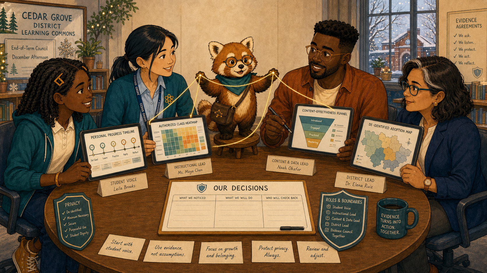
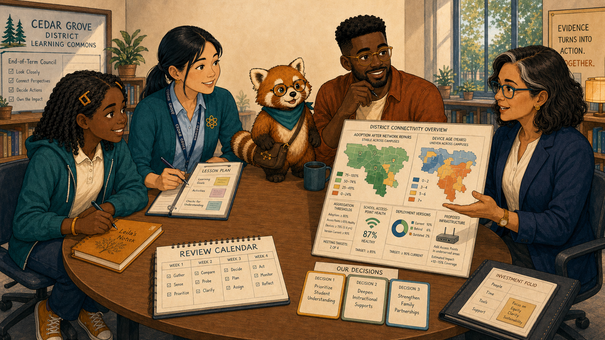
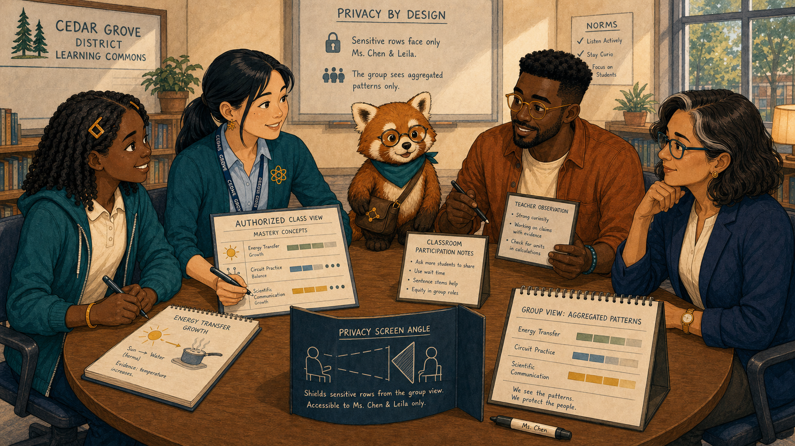
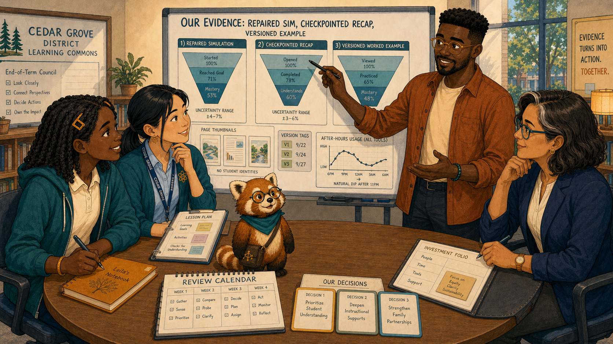
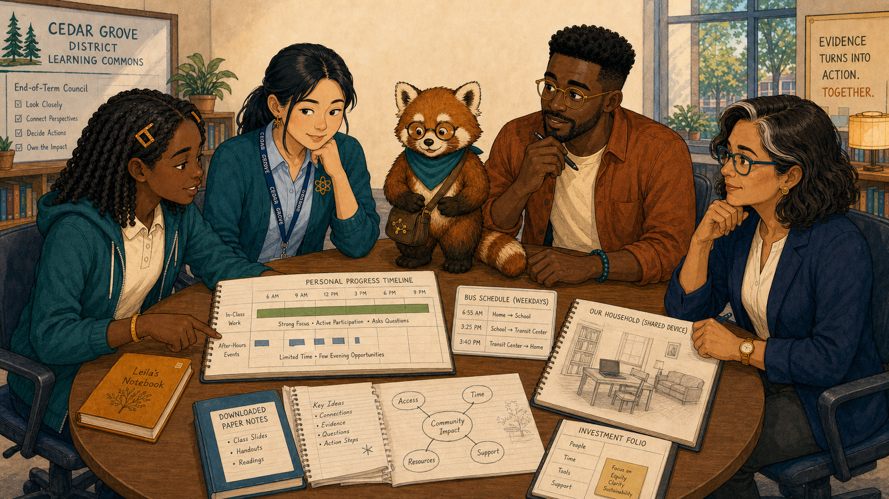
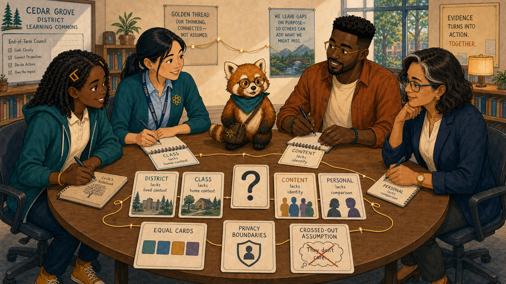
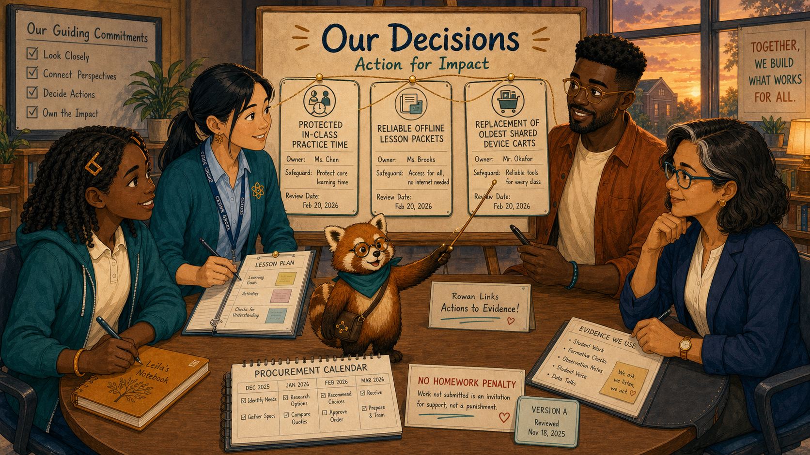
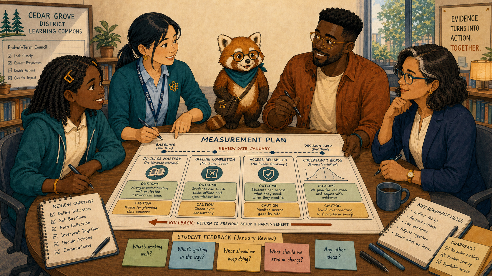
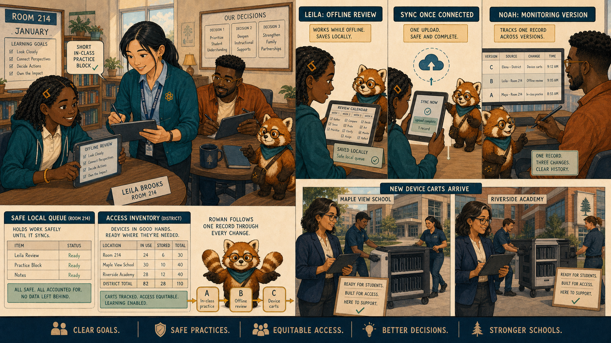
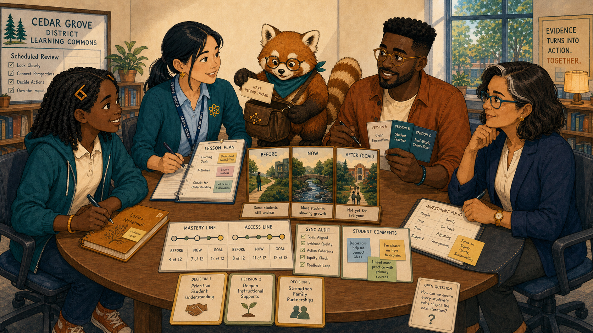

# The Evidence Council

Cover Image Prompt

(This is the Cover Image. Do not include this label in the image.)
Generate a wide-landscape 16:9 illustration in a warm contemporary educational-comic style with clean ink contours, softly painted color, expressive natural faces, gentle paper texture, realistic proportions, and a navy, deep-teal, cinnamon, cream, and amber palette. Set the scene in the Cedar Grove district learning commons at an end-of-term council. Show Leila Brooks, a 13-year-old Black American girl with a slender, age-appropriate build, rich dark-brown skin, a heart-shaped full-cheeked face, broad nose, large dark-brown eyes, and a small gap between her upper front teeth visible when she smiles; her black shoulder-length two-strand twists have a center part and are held back by two symmetrical matte amber barrettes, and she wears a cream short-sleeved polo under a teal zip-front school hoodie, dark-navy straight-leg trousers, cinnamon high-top sneakers, and an amber elastic wristband on her left wrist. Show Ms. Maya Chen, a 35-year-old Chinese American woman with a compact athletic build, light warm-beige skin, a softly square face with rounded cheeks, a small beauty mark below the outer corner of her left eye, and dark-brown almond-shaped eyes; her straight blue-black hair is center-parted in a low ponytail with two short face-framing strands, and she wears a deep-teal cardigan with pushed-up sleeves over a pale-blue button-front shirt, charcoal ankle trousers, white low-profile sneakers, an amber atom pin, and a dark-teal school lanyard. Show Noah Okafor, a 31-year-old Nigerian American man who is tall and lean, with deep umber-brown skin, a long oval face, broad nose, high forehead, dark-brown eyes behind round translucent amber glasses, a very short boxed beard and mustache, and dense black hair in a neat flat-topped coil cut with faded sides; he wears an open cinnamon overshirt over a cream crew-neck shirt, dark indigo trousers, teal canvas shoes, and a narrow deep-teal woven bracelet on his right wrist, and he usually holds a black stylus in his left hand. Show Dr. Elena Ruiz, a 47-year-old Mexican American woman of medium height and build, with warm medium-brown skin, an oval high-cheekboned face, dark-brown eyes behind thin rectangular deep-teal glasses, and a collarbone-length wavy espresso-brown bob with a side part and one narrow silver streak at her right temple; she wears a navy blazer over a cream collarless blouse, charcoal trousers, small hammered-gold circular studs, and a slim amber watch on her left wrist. Show Rowan, a small rounded anthropomorphic red panda about desk height, with cinnamon-orange fur, a cream muzzle, cream eyebrow patches and belly, large kind brown eyes, dark-brown legs, and a thick ringed cinnamon-and-cream tail; he wears round deep-teal glasses, a deep-teal triangular neckerchief, and a compact brown cross-body satchel bearing a small gold connected-dots emblem. Arrange the four human characters as equal participants around a round table holding four distinct windows: personal progress, class mastery, content effectiveness, and district adoption. Rowan stands on a low stool connecting the views with a gold thread. Include Leila's amber notebook, Maya's lesson plan, Noah's version cards, Elena's investment folio, three decision cards, a review calendar, and no head seat. Render the exact title “The Evidence Council” once in bold hand-lettered navy type. Emotional tone: participatory evidence turning into accountable action. Keep every named character exactly consistent with this description, keep Rowan desk-height, and show no brands, logos, rankings, exposed private records, or decorative data. Generate the image immediately without asking clarifying questions.

Narrative Prompt

This fictional ten-panel synthesis concludes the twelve-story anthology. Preserve every recurring character anchor and introduce each role within the standalone narrative. Four evidence views reveal different limits. Leila's lived explanation changes the interpretation of a stubborn after-hours pattern. The council chooses one teaching change, one textbook revision, and one district investment, each with a measure, safeguard, and review date.

### Prologue – No View Is the Whole View

Dr. Elena Ruiz is the district learning director, responsible for coordinating improvement across Cedar Grove schools. At the end of term, she invited a student, teacher, and textbook designer to an evidence council. No one sat at the head of the round table.

## Panel 1: Four Windows

Image Prompt

(This is Panel 01. Do not include the panel number in the image.)
Generate a wide-landscape 16:9 illustration in a warm contemporary educational-comic style with clean ink contours, softly painted color, expressive natural faces, gentle paper texture, realistic proportions, and a navy, deep-teal, cinnamon, cream, and amber palette. Set the scene in the district learning commons on a December afternoon. Show Dr. Elena Ruiz, a 47-year-old Mexican American woman of medium height and build, with warm medium-brown skin, an oval high-cheekboned face, dark-brown eyes behind thin rectangular deep-teal glasses, and a collarbone-length wavy espresso-brown bob with a side part and one narrow silver streak at her right temple; she wears a navy blazer over a cream collarless blouse, charcoal trousers, small hammered-gold circular studs, and a slim amber watch on her left wrist. Show Leila Brooks, a 13-year-old Black American girl with a slender, age-appropriate build, rich dark-brown skin, a heart-shaped full-cheeked face, broad nose, large dark-brown eyes, and a small gap between her upper front teeth visible when she smiles; her black shoulder-length two-strand twists have a center part and are held back by two symmetrical matte amber barrettes, and she wears a cream short-sleeved polo under a teal zip-front school hoodie, dark-navy straight-leg trousers, cinnamon high-top sneakers, and an amber elastic wristband on her left wrist. Show Ms. Maya Chen, a 35-year-old Chinese American woman with a compact athletic build, light warm-beige skin, a softly square face with rounded cheeks, a small beauty mark below the outer corner of her left eye, and dark-brown almond-shaped eyes; her straight blue-black hair is center-parted in a low ponytail with two short face-framing strands, and she wears a deep-teal cardigan with pushed-up sleeves over a pale-blue button-front shirt, charcoal ankle trousers, white low-profile sneakers, an amber atom pin, and a dark-teal school lanyard. Show Noah Okafor, a 31-year-old Nigerian American man who is tall and lean, with deep umber-brown skin, a long oval face, broad nose, high forehead, dark-brown eyes behind round translucent amber glasses, a very short boxed beard and mustache, and dense black hair in a neat flat-topped coil cut with faded sides; he wears an open cinnamon overshirt over a cream crew-neck shirt, dark indigo trousers, teal canvas shoes, and a narrow deep-teal woven bracelet on his right wrist, and he usually holds a black stylus in his left hand. Show Rowan, a small rounded anthropomorphic red panda about desk height, with cinnamon-orange fur, a cream muzzle, cream eyebrow patches and belly, large kind brown eyes, dark-brown legs, and a thick ringed cinnamon-and-cream tail; he wears round deep-teal glasses, a deep-teal triangular neckerchief, and a compact brown cross-body satchel bearing a small gold connected-dots emblem. Each participant opens one view facing the group: Elena's de-identified adoption map, Maya's authorized class heatmap, Noah's content-effectiveness funnel, and Leila's personal progress timeline. Rowan connects the four screens without merging them. Include privacy shields, role labels, equal chairs, paper note cards, and a blank decision board.  Emotional tone: shared authority with clear boundaries. Keep every named character exactly consistent with this description, keep Rowan desk-height, and show no brands, logos, rankings, exposed private records, or decorative data. Generate the image immediately without asking clarifying questions.

Leila Brooks is a 13-year-old seventh-grade science student. Ms. Maya Chen teaches Leila's science class. Noah Okafor designs their interactive textbook. Rowan is the textbook's red-panda learning guide. Each person could see something the others could not—and each view had a boundary.

## Panel 2: The District View

Image Prompt

(This is Panel 02. Do not include the panel number in the image.)
Generate a wide-landscape 16:9 illustration in a warm contemporary educational-comic style with clean ink contours, softly painted color, expressive natural faces, gentle paper texture, realistic proportions, and a navy, deep-teal, cinnamon, cream, and amber palette. Set the scene at the council's round table. Show Dr. Elena Ruiz, a 47-year-old Mexican American woman of medium height and build, with warm medium-brown skin, an oval high-cheekboned face, dark-brown eyes behind thin rectangular deep-teal glasses, and a collarbone-length wavy espresso-brown bob with a side part and one narrow silver streak at her right temple; she wears a navy blazer over a cream collarless blouse, charcoal trousers, small hammered-gold circular studs, and a slim amber watch on her left wrist. Show Leila Brooks, a 13-year-old Black American girl with a slender, age-appropriate build, rich dark-brown skin, a heart-shaped full-cheeked face, broad nose, large dark-brown eyes, and a small gap between her upper front teeth visible when she smiles; her black shoulder-length two-strand twists have a center part and are held back by two symmetrical matte amber barrettes, and she wears a cream short-sleeved polo under a teal zip-front school hoodie, dark-navy straight-leg trousers, cinnamon high-top sneakers, and an amber elastic wristband on her left wrist. Show Ms. Maya Chen, a 35-year-old Chinese American woman with a compact athletic build, light warm-beige skin, a softly square face with rounded cheeks, a small beauty mark below the outer corner of her left eye, and dark-brown almond-shaped eyes; her straight blue-black hair is center-parted in a low ponytail with two short face-framing strands, and she wears a deep-teal cardigan with pushed-up sleeves over a pale-blue button-front shirt, charcoal ankle trousers, white low-profile sneakers, an amber atom pin, and a dark-teal school lanyard. Show Noah Okafor, a 31-year-old Nigerian American man who is tall and lean, with deep umber-brown skin, a long oval face, broad nose, high forehead, dark-brown eyes behind round translucent amber glasses, a very short boxed beard and mustache, and dense black hair in a neat flat-topped coil cut with faded sides; he wears an open cinnamon overshirt over a cream crew-neck shirt, dark indigo trousers, teal canvas shoes, and a narrow deep-teal woven bracelet on his right wrist, and he usually holds a black stylus in his left hand. Show Rowan, a small rounded anthropomorphic red panda about desk height, with cinnamon-orange fur, a cream muzzle, cream eyebrow patches and belly, large kind brown eyes, dark-brown legs, and a thick ringed cinnamon-and-cream tail; he wears round deep-teal glasses, a deep-teal triangular neckerchief, and a compact brown cross-body satchel bearing a small gold connected-dots emblem. Elena turns a de-identified map toward everyone, showing stable adoption after network repairs but uneven device age. Include aggregation thresholds, school access-point health, deployment versions, no names, Elena's open palm, and one proposed infrastructure card.  Emotional tone: system responsibility without abstraction from people. Keep every named character exactly consistent with this description, keep Rowan desk-height, and show no brands, logos, rankings, exposed private records, or decorative data. Generate the image immediately without asking clarifying questions.

Elena showed that district adoption had stabilized after the network repair, while older devices remained concentrated at two schools. Her view could locate an inequity. It could not explain how an old device felt during a lesson.

## Panel 3: The Classroom View

Image Prompt

(This is Panel 03. Do not include the panel number in the image.)
Generate a wide-landscape 16:9 illustration in a warm contemporary educational-comic style with clean ink contours, softly painted color, expressive natural faces, gentle paper texture, realistic proportions, and a navy, deep-teal, cinnamon, cream, and amber palette. Set the scene at the same council table. Show Ms. Maya Chen, a 35-year-old Chinese American woman with a compact athletic build, light warm-beige skin, a softly square face with rounded cheeks, a small beauty mark below the outer corner of her left eye, and dark-brown almond-shaped eyes; her straight blue-black hair is center-parted in a low ponytail with two short face-framing strands, and she wears a deep-teal cardigan with pushed-up sleeves over a pale-blue button-front shirt, charcoal ankle trousers, white low-profile sneakers, an amber atom pin, and a dark-teal school lanyard. Show Leila Brooks, a 13-year-old Black American girl with a slender, age-appropriate build, rich dark-brown skin, a heart-shaped full-cheeked face, broad nose, large dark-brown eyes, and a small gap between her upper front teeth visible when she smiles; her black shoulder-length two-strand twists have a center part and are held back by two symmetrical matte amber barrettes, and she wears a cream short-sleeved polo under a teal zip-front school hoodie, dark-navy straight-leg trousers, cinnamon high-top sneakers, and an amber elastic wristband on her left wrist. Show Dr. Elena Ruiz, a 47-year-old Mexican American woman of medium height and build, with warm medium-brown skin, an oval high-cheekboned face, dark-brown eyes behind thin rectangular deep-teal glasses, and a collarbone-length wavy espresso-brown bob with a side part and one narrow silver streak at her right temple; she wears a navy blazer over a cream collarless blouse, charcoal trousers, small hammered-gold circular studs, and a slim amber watch on her left wrist. Show Noah Okafor, a 31-year-old Nigerian American man who is tall and lean, with deep umber-brown skin, a long oval face, broad nose, high forehead, dark-brown eyes behind round translucent amber glasses, a very short boxed beard and mustache, and dense black hair in a neat flat-topped coil cut with faded sides; he wears an open cinnamon overshirt over a cream crew-neck shirt, dark indigo trousers, teal canvas shoes, and a narrow deep-teal woven bracelet on his right wrist, and he usually holds a black stylus in his left hand. Show Rowan, a small rounded anthropomorphic red panda about desk height, with cinnamon-orange fur, a cream muzzle, cream eyebrow patches and belly, large kind brown eyes, dark-brown legs, and a thick ringed cinnamon-and-cream tail; he wears round deep-teal glasses, a deep-teal triangular neckerchief, and a compact brown cross-body satchel bearing a small gold connected-dots emblem. Maya shares an authorized class view with mastery concepts beside classroom participation notes; sensitive rows face only Maya and Leila while the group sees aggregated patterns. Include energy-transfer growth, circuit-practice balance, a teacher observation card, a privacy screen angle, and Maya's marker.  Emotional tone: classroom context enriching the chart. Keep every named character exactly consistent with this description, keep Rowan desk-height, and show no brands, logos, rankings, exposed private records, or decorative data. Generate the image immediately without asking clarifying questions.

Maya showed stronger energy-transfer explanations and better circuit practice, alongside one stubborn pattern: activity dropped sharply after 6 p.m. She knew homework conditions varied. Her class view could identify the time; it could not supply the reason.

## Panel 4: The Content View

Image Prompt

(This is Panel 04. Do not include the panel number in the image.)
Generate a wide-landscape 16:9 illustration in a warm contemporary educational-comic style with clean ink contours, softly painted color, expressive natural faces, gentle paper texture, realistic proportions, and a navy, deep-teal, cinnamon, cream, and amber palette. Set the scene at the council table with a large content board. Show Noah Okafor, a 31-year-old Nigerian American man who is tall and lean, with deep umber-brown skin, a long oval face, broad nose, high forehead, dark-brown eyes behind round translucent amber glasses, a very short boxed beard and mustache, and dense black hair in a neat flat-topped coil cut with faded sides; he wears an open cinnamon overshirt over a cream crew-neck shirt, dark indigo trousers, teal canvas shoes, and a narrow deep-teal woven bracelet on his right wrist, and he usually holds a black stylus in his left hand. Show Leila Brooks, a 13-year-old Black American girl with a slender, age-appropriate build, rich dark-brown skin, a heart-shaped full-cheeked face, broad nose, large dark-brown eyes, and a small gap between her upper front teeth visible when she smiles; her black shoulder-length two-strand twists have a center part and are held back by two symmetrical matte amber barrettes, and she wears a cream short-sleeved polo under a teal zip-front school hoodie, dark-navy straight-leg trousers, cinnamon high-top sneakers, and an amber elastic wristband on her left wrist. Show Ms. Maya Chen, a 35-year-old Chinese American woman with a compact athletic build, light warm-beige skin, a softly square face with rounded cheeks, a small beauty mark below the outer corner of her left eye, and dark-brown almond-shaped eyes; her straight blue-black hair is center-parted in a low ponytail with two short face-framing strands, and she wears a deep-teal cardigan with pushed-up sleeves over a pale-blue button-front shirt, charcoal ankle trousers, white low-profile sneakers, an amber atom pin, and a dark-teal school lanyard. Show Dr. Elena Ruiz, a 47-year-old Mexican American woman of medium height and build, with warm medium-brown skin, an oval high-cheekboned face, dark-brown eyes behind thin rectangular deep-teal glasses, and a collarbone-length wavy espresso-brown bob with a side part and one narrow silver streak at her right temple; she wears a navy blazer over a cream collarless blouse, charcoal trousers, small hammered-gold circular studs, and a slim amber watch on her left wrist. Show Rowan, a small rounded anthropomorphic red panda about desk height, with cinnamon-orange fur, a cream muzzle, cream eyebrow patches and belly, large kind brown eyes, dark-brown legs, and a thick ringed cinnamon-and-cream tail; he wears round deep-teal glasses, a deep-teal triangular neckerchief, and a compact brown cross-body satchel bearing a small gold connected-dots emblem. Noah displays de-identified funnels for the repaired simulation, checkpointed recap, and versioned worked example. Include page thumbnails, version tags, uncertainty ranges, a left-hand stylus, one after-hours usage dip, and no student identities.  Emotional tone: design evidence offered with humility. Keep every named character exactly consistent with this description, keep Rowan desk-height, and show no brands, logos, rankings, exposed private records, or decorative data. Generate the image immediately without asking clarifying questions.

Noah showed where revised pages reduced exits and where version context clarified reports. He had assumed the evening drop meant the homework pages loaded too slowly. The pattern supported investigation, not his preferred explanation.

## Panel 5: The Personal View

Image Prompt

(This is Panel 05. Do not include the panel number in the image.)
Generate a wide-landscape 16:9 illustration in a warm contemporary educational-comic style with clean ink contours, softly painted color, expressive natural faces, gentle paper texture, realistic proportions, and a navy, deep-teal, cinnamon, cream, and amber palette. Set the scene at the same table with Leila's notebook centered. Show Leila Brooks, a 13-year-old Black American girl with a slender, age-appropriate build, rich dark-brown skin, a heart-shaped full-cheeked face, broad nose, large dark-brown eyes, and a small gap between her upper front teeth visible when she smiles; her black shoulder-length two-strand twists have a center part and are held back by two symmetrical matte amber barrettes, and she wears a cream short-sleeved polo under a teal zip-front school hoodie, dark-navy straight-leg trousers, cinnamon high-top sneakers, and an amber elastic wristband on her left wrist. Show Ms. Maya Chen, a 35-year-old Chinese American woman with a compact athletic build, light warm-beige skin, a softly square face with rounded cheeks, a small beauty mark below the outer corner of her left eye, and dark-brown almond-shaped eyes; her straight blue-black hair is center-parted in a low ponytail with two short face-framing strands, and she wears a deep-teal cardigan with pushed-up sleeves over a pale-blue button-front shirt, charcoal ankle trousers, white low-profile sneakers, an amber atom pin, and a dark-teal school lanyard. Show Noah Okafor, a 31-year-old Nigerian American man who is tall and lean, with deep umber-brown skin, a long oval face, broad nose, high forehead, dark-brown eyes behind round translucent amber glasses, a very short boxed beard and mustache, and dense black hair in a neat flat-topped coil cut with faded sides; he wears an open cinnamon overshirt over a cream crew-neck shirt, dark indigo trousers, teal canvas shoes, and a narrow deep-teal woven bracelet on his right wrist, and he usually holds a black stylus in his left hand. Show Dr. Elena Ruiz, a 47-year-old Mexican American woman of medium height and build, with warm medium-brown skin, an oval high-cheekboned face, dark-brown eyes behind thin rectangular deep-teal glasses, and a collarbone-length wavy espresso-brown bob with a side part and one narrow silver streak at her right temple; she wears a navy blazer over a cream collarless blouse, charcoal trousers, small hammered-gold circular studs, and a slim amber watch on her left wrist. Show Rowan, a small rounded anthropomorphic red panda about desk height, with cinnamon-orange fur, a cream muzzle, cream eyebrow patches and belly, large kind brown eyes, dark-brown legs, and a thick ringed cinnamon-and-cream tail; he wears round deep-teal glasses, a deep-teal triangular neckerchief, and a compact brown cross-body satchel bearing a small gold connected-dots emblem. Leila places her amber notebook beside her personal progress timeline, pointing to strong in-class work and sparse after-hours events. Include a bus schedule card, a shared-device household sketch without family identities, downloaded paper notes, her tooth-gap smile fading into serious focus, and Rowan listening with paws folded.  Emotional tone: learner expertise changing the interpretation. Keep every named character exactly consistent with this description, keep Rowan desk-height, and show no brands, logos, rankings, exposed private records, or decorative data. Generate the image immediately without asking clarifying questions.

Leila's personal timeline confirmed the evening gap, but her explanation changed its meaning. She spent the bus ride home helping with responsibilities and shared one device later in the evening. “The page isn't the only thing loading slowly,” she said. The council crossed out its first assumption.

## Panel 6: Name What Each View Cannot Know

Image Prompt

(This is Panel 06. Do not include the panel number in the image.)
Generate a wide-landscape 16:9 illustration in a warm contemporary educational-comic style with clean ink contours, softly painted color, expressive natural faces, gentle paper texture, realistic proportions, and a navy, deep-teal, cinnamon, cream, and amber palette. Set the scene around the round table moments later. Show Leila Brooks, a 13-year-old Black American girl with a slender, age-appropriate build, rich dark-brown skin, a heart-shaped full-cheeked face, broad nose, large dark-brown eyes, and a small gap between her upper front teeth visible when she smiles; her black shoulder-length two-strand twists have a center part and are held back by two symmetrical matte amber barrettes, and she wears a cream short-sleeved polo under a teal zip-front school hoodie, dark-navy straight-leg trousers, cinnamon high-top sneakers, and an amber elastic wristband on her left wrist. Show Ms. Maya Chen, a 35-year-old Chinese American woman with a compact athletic build, light warm-beige skin, a softly square face with rounded cheeks, a small beauty mark below the outer corner of her left eye, and dark-brown almond-shaped eyes; her straight blue-black hair is center-parted in a low ponytail with two short face-framing strands, and she wears a deep-teal cardigan with pushed-up sleeves over a pale-blue button-front shirt, charcoal ankle trousers, white low-profile sneakers, an amber atom pin, and a dark-teal school lanyard. Show Noah Okafor, a 31-year-old Nigerian American man who is tall and lean, with deep umber-brown skin, a long oval face, broad nose, high forehead, dark-brown eyes behind round translucent amber glasses, a very short boxed beard and mustache, and dense black hair in a neat flat-topped coil cut with faded sides; he wears an open cinnamon overshirt over a cream crew-neck shirt, dark indigo trousers, teal canvas shoes, and a narrow deep-teal woven bracelet on his right wrist, and he usually holds a black stylus in his left hand. Show Dr. Elena Ruiz, a 47-year-old Mexican American woman of medium height and build, with warm medium-brown skin, an oval high-cheekboned face, dark-brown eyes behind thin rectangular deep-teal glasses, and a collarbone-length wavy espresso-brown bob with a side part and one narrow silver streak at her right temple; she wears a navy blazer over a cream collarless blouse, charcoal trousers, small hammered-gold circular studs, and a slim amber watch on her left wrist. Show Rowan, a small rounded anthropomorphic red panda about desk height, with cinnamon-orange fur, a cream muzzle, cream eyebrow patches and belly, large kind brown eyes, dark-brown legs, and a thick ringed cinnamon-and-cream tail; he wears round deep-teal glasses, a deep-teal triangular neckerchief, and a compact brown cross-body satchel bearing a small gold connected-dots emblem. Each participant writes one limit card beneath their view: district lacks lived context, class lacks home context, content lacks identity, personal lacks comparison. Include four equal cards, a large question mark, privacy boundaries, the crossed-out assumption, a gold thread with deliberate gaps, and Rowan holding no answer card.  Emotional tone: intellectual humility and mutual respect. Keep every named character exactly consistent with this description, keep Rowan desk-height, and show no brands, logos, rankings, exposed private records, or decorative data. Generate the image immediately without asking clarifying questions.

The council named the limits aloud. Elena's map lacked lived context; Maya's class view stopped at the classroom boundary; Noah's content view was intentionally de-identified; Leila's experience could explain a pattern without representing every learner. The gaps became safeguards against overconfidence.

## Panel 7: Choose Three Actions

Image Prompt

(This is Panel 07. Do not include the panel number in the image.)
Generate a wide-landscape 16:9 illustration in a warm contemporary educational-comic style with clean ink contours, softly painted color, expressive natural faces, gentle paper texture, realistic proportions, and a navy, deep-teal, cinnamon, cream, and amber palette. Set the scene at the decision board before sunset. Show Leila Brooks, a 13-year-old Black American girl with a slender, age-appropriate build, rich dark-brown skin, a heart-shaped full-cheeked face, broad nose, large dark-brown eyes, and a small gap between her upper front teeth visible when she smiles; her black shoulder-length two-strand twists have a center part and are held back by two symmetrical matte amber barrettes, and she wears a cream short-sleeved polo under a teal zip-front school hoodie, dark-navy straight-leg trousers, cinnamon high-top sneakers, and an amber elastic wristband on her left wrist. Show Ms. Maya Chen, a 35-year-old Chinese American woman with a compact athletic build, light warm-beige skin, a softly square face with rounded cheeks, a small beauty mark below the outer corner of her left eye, and dark-brown almond-shaped eyes; her straight blue-black hair is center-parted in a low ponytail with two short face-framing strands, and she wears a deep-teal cardigan with pushed-up sleeves over a pale-blue button-front shirt, charcoal ankle trousers, white low-profile sneakers, an amber atom pin, and a dark-teal school lanyard. Show Noah Okafor, a 31-year-old Nigerian American man who is tall and lean, with deep umber-brown skin, a long oval face, broad nose, high forehead, dark-brown eyes behind round translucent amber glasses, a very short boxed beard and mustache, and dense black hair in a neat flat-topped coil cut with faded sides; he wears an open cinnamon overshirt over a cream crew-neck shirt, dark indigo trousers, teal canvas shoes, and a narrow deep-teal woven bracelet on his right wrist, and he usually holds a black stylus in his left hand. Show Dr. Elena Ruiz, a 47-year-old Mexican American woman of medium height and build, with warm medium-brown skin, an oval high-cheekboned face, dark-brown eyes behind thin rectangular deep-teal glasses, and a collarbone-length wavy espresso-brown bob with a side part and one narrow silver streak at her right temple; she wears a navy blazer over a cream collarless blouse, charcoal trousers, small hammered-gold circular studs, and a slim amber watch on her left wrist. Show Rowan, a small rounded anthropomorphic red panda about desk height, with cinnamon-orange fur, a cream muzzle, cream eyebrow patches and belly, large kind brown eyes, dark-brown legs, and a thick ringed cinnamon-and-cream tail; he wears round deep-teal glasses, a deep-teal triangular neckerchief, and a compact brown cross-body satchel bearing a small gold connected-dots emblem. Place three equal decision cards on the board: protected in-class practice time, reliable offline lesson packets, and replacement of the oldest shared device carts. Each card includes an owner, safeguard, and review date. Include a no-homework-penalty note, version tag, procurement calendar, and Rowan linking actions to evidence.  Emotional tone: focused agency rather than a wish list. Keep every named character exactly consistent with this description, keep Rowan desk-height, and show no brands, logos, rankings, exposed private records, or decorative data. Generate the image immediately without asking clarifying questions.

Together they chose one teaching change, one textbook revision, and one district investment. Maya would protect in-class practice time. Noah would make key review activities reliably available offline. Elena would replace the oldest shared device carts first.

## Panel 8: Decide What Would Count

Image Prompt

(This is Panel 08. Do not include the panel number in the image.)
Generate a wide-landscape 16:9 illustration in a warm contemporary educational-comic style with clean ink contours, softly painted color, expressive natural faces, gentle paper texture, realistic proportions, and a navy, deep-teal, cinnamon, cream, and amber palette. Set the scene at the same board with a measurement plan. Show Leila Brooks, a 13-year-old Black American girl with a slender, age-appropriate build, rich dark-brown skin, a heart-shaped full-cheeked face, broad nose, large dark-brown eyes, and a small gap between her upper front teeth visible when she smiles; her black shoulder-length two-strand twists have a center part and are held back by two symmetrical matte amber barrettes, and she wears a cream short-sleeved polo under a teal zip-front school hoodie, dark-navy straight-leg trousers, cinnamon high-top sneakers, and an amber elastic wristband on her left wrist. Show Ms. Maya Chen, a 35-year-old Chinese American woman with a compact athletic build, light warm-beige skin, a softly square face with rounded cheeks, a small beauty mark below the outer corner of her left eye, and dark-brown almond-shaped eyes; her straight blue-black hair is center-parted in a low ponytail with two short face-framing strands, and she wears a deep-teal cardigan with pushed-up sleeves over a pale-blue button-front shirt, charcoal ankle trousers, white low-profile sneakers, an amber atom pin, and a dark-teal school lanyard. Show Noah Okafor, a 31-year-old Nigerian American man who is tall and lean, with deep umber-brown skin, a long oval face, broad nose, high forehead, dark-brown eyes behind round translucent amber glasses, a very short boxed beard and mustache, and dense black hair in a neat flat-topped coil cut with faded sides; he wears an open cinnamon overshirt over a cream crew-neck shirt, dark indigo trousers, teal canvas shoes, and a narrow deep-teal woven bracelet on his right wrist, and he usually holds a black stylus in his left hand. Show Dr. Elena Ruiz, a 47-year-old Mexican American woman of medium height and build, with warm medium-brown skin, an oval high-cheekboned face, dark-brown eyes behind thin rectangular deep-teal glasses, and a collarbone-length wavy espresso-brown bob with a side part and one narrow silver streak at her right temple; she wears a navy blazer over a cream collarless blouse, charcoal trousers, small hammered-gold circular studs, and a slim amber watch on her left wrist. Show Rowan, a small rounded anthropomorphic red panda about desk height, with cinnamon-orange fur, a cream muzzle, cream eyebrow patches and belly, large kind brown eyes, dark-brown legs, and a thick ringed cinnamon-and-cream tail; he wears round deep-teal glasses, a deep-teal triangular neckerchief, and a compact brown cross-body satchel bearing a small gold connected-dots emblem. Under each action card, show one outcome and one caution: in-class mastery without workload increase, offline completion without sync loss, access reliability without public rankings. Include baseline markers, a January review date, student feedback cards, uncertainty bands, and a rollback arrow.  Emotional tone: accountability before implementation. Keep every named character exactly consistent with this description, keep Rowan desk-height, and show no brands, logos, rankings, exposed private records, or decorative data. Generate the image immediately without asking clarifying questions.

For each action, the council wrote what improvement would look like and what evidence would make them reconsider. They included workload, sync reliability, mastery, access, and student feedback. A decision without a check would not close the loop.

## Panel 9: The Changes Meet the Classroom

Image Prompt

(This is Panel 09. Do not include the panel number in the image.)
Generate a wide-landscape 16:9 illustration in a warm contemporary educational-comic style with clean ink contours, softly painted color, expressive natural faces, gentle paper texture, realistic proportions, and a navy, deep-teal, cinnamon, cream, and amber palette. Set the scene in a January composite of Room 214 and two district schools. Show Leila Brooks, a 13-year-old Black American girl with a slender, age-appropriate build, rich dark-brown skin, a heart-shaped full-cheeked face, broad nose, large dark-brown eyes, and a small gap between her upper front teeth visible when she smiles; her black shoulder-length two-strand twists have a center part and are held back by two symmetrical matte amber barrettes, and she wears a cream short-sleeved polo under a teal zip-front school hoodie, dark-navy straight-leg trousers, cinnamon high-top sneakers, and an amber elastic wristband on her left wrist. Show Ms. Maya Chen, a 35-year-old Chinese American woman with a compact athletic build, light warm-beige skin, a softly square face with rounded cheeks, a small beauty mark below the outer corner of her left eye, and dark-brown almond-shaped eyes; her straight blue-black hair is center-parted in a low ponytail with two short face-framing strands, and she wears a deep-teal cardigan with pushed-up sleeves over a pale-blue button-front shirt, charcoal ankle trousers, white low-profile sneakers, an amber atom pin, and a dark-teal school lanyard. Show Noah Okafor, a 31-year-old Nigerian American man who is tall and lean, with deep umber-brown skin, a long oval face, broad nose, high forehead, dark-brown eyes behind round translucent amber glasses, a very short boxed beard and mustache, and dense black hair in a neat flat-topped coil cut with faded sides; he wears an open cinnamon overshirt over a cream crew-neck shirt, dark indigo trousers, teal canvas shoes, and a narrow deep-teal woven bracelet on his right wrist, and he usually holds a black stylus in his left hand. Show Dr. Elena Ruiz, a 47-year-old Mexican American woman of medium height and build, with warm medium-brown skin, an oval high-cheekboned face, dark-brown eyes behind thin rectangular deep-teal glasses, and a collarbone-length wavy espresso-brown bob with a side part and one narrow silver streak at her right temple; she wears a navy blazer over a cream collarless blouse, charcoal trousers, small hammered-gold circular studs, and a slim amber watch on her left wrist. Show Rowan, a small rounded anthropomorphic red panda about desk height, with cinnamon-orange fur, a cream muzzle, cream eyebrow patches and belly, large kind brown eyes, dark-brown legs, and a thick ringed cinnamon-and-cream tail; he wears round deep-teal glasses, a deep-teal triangular neckerchief, and a compact brown cross-body satchel bearing a small gold connected-dots emblem. Show Maya protecting a short in-class practice block, Leila using an offline review that later syncs once, Noah monitoring the version, and Elena watching new device carts arrive at two schools. Include identical learning goals, a safe local queue, an access inventory, no celebration badges, and Rowan following one record through all three changes.  Emotional tone: coordinated improvement becoming ordinary practice. Keep every named character exactly consistent with this description, keep Rowan desk-height, and show no brands, logos, rankings, exposed private records, or decorative data. Generate the image immediately without asking clarifying questions.

In January, the actions arrived as ordinary supports rather than a grand launch. Leila practiced before leaving school, an offline review synced without duplication, and new devices reached the schools with the oldest carts. Each change addressed a different part of the same pattern.

## Panel 10: The Conversation Begins Again

Image Prompt

(This is Panel 10. Do not include the panel number in the image.)
Generate a wide-landscape 16:9 illustration in a warm contemporary educational-comic style with clean ink contours, softly painted color, expressive natural faces, gentle paper texture, realistic proportions, and a navy, deep-teal, cinnamon, cream, and amber palette. Set the scene in the learning commons at the scheduled review. Show Leila Brooks, a 13-year-old Black American girl with a slender, age-appropriate build, rich dark-brown skin, a heart-shaped full-cheeked face, broad nose, large dark-brown eyes, and a small gap between her upper front teeth visible when she smiles; her black shoulder-length two-strand twists have a center part and are held back by two symmetrical matte amber barrettes, and she wears a cream short-sleeved polo under a teal zip-front school hoodie, dark-navy straight-leg trousers, cinnamon high-top sneakers, and an amber elastic wristband on her left wrist. Show Ms. Maya Chen, a 35-year-old Chinese American woman with a compact athletic build, light warm-beige skin, a softly square face with rounded cheeks, a small beauty mark below the outer corner of her left eye, and dark-brown almond-shaped eyes; her straight blue-black hair is center-parted in a low ponytail with two short face-framing strands, and she wears a deep-teal cardigan with pushed-up sleeves over a pale-blue button-front shirt, charcoal ankle trousers, white low-profile sneakers, an amber atom pin, and a dark-teal school lanyard. Show Noah Okafor, a 31-year-old Nigerian American man who is tall and lean, with deep umber-brown skin, a long oval face, broad nose, high forehead, dark-brown eyes behind round translucent amber glasses, a very short boxed beard and mustache, and dense black hair in a neat flat-topped coil cut with faded sides; he wears an open cinnamon overshirt over a cream crew-neck shirt, dark indigo trousers, teal canvas shoes, and a narrow deep-teal woven bracelet on his right wrist, and he usually holds a black stylus in his left hand. Show Dr. Elena Ruiz, a 47-year-old Mexican American woman of medium height and build, with warm medium-brown skin, an oval high-cheekboned face, dark-brown eyes behind thin rectangular deep-teal glasses, and a collarbone-length wavy espresso-brown bob with a side part and one narrow silver streak at her right temple; she wears a navy blazer over a cream collarless blouse, charcoal trousers, small hammered-gold circular studs, and a slim amber watch on her left wrist. Show Rowan, a small rounded anthropomorphic red panda about desk height, with cinnamon-orange fur, a cream muzzle, cream eyebrow patches and belly, large kind brown eyes, dark-brown legs, and a thick ringed cinnamon-and-cream tail; he wears round deep-teal glasses, a deep-teal triangular neckerchief, and a compact brown cross-body satchel bearing a small gold connected-dots emblem. The round table holds before-and-after evidence with modest improvement and visible uncertainty; all five participants retain equal positions. Include the three action cards, student comments, mastery and access lines, a sync audit, one remaining question card, and Rowan opening his satchel for the next record thread.  Emotional tone: hopeful, cautious, and ready to revise. Keep every named character exactly consistent with this description, keep Rowan desk-height, and show no brands, logos, rankings, exposed private records, or decorative data. Generate the image immediately without asking clarifying questions.

At the review, access reliability improved, in-class practice increased, and evening gaps mattered less—but one school still showed sync delays. The council kept the successful changes, assigned a new investigation, and left one card blank for what learners would notice next. The record had not ended the conversation. It had helped the right conversation begin.

### Epilogue – Evidence Belongs in Conversation

The council combined four legitimate but incomplete views. Learner explanation changed an initial interpretation; explicit limits prevented overclaiming; three coordinated actions gained owners, safeguards, measures, and review dates. Feedback became a shared practice rather than a one-way dashboard.

| Challenge | How the Team Responded | Lesson for Today |
|---|---|---|
| Four views described one semester | The council kept them distinct and compared them | No view is complete |
| An evening gap invited a technical story | Leila supplied lived context | People represented by records interpret them |
| Many improvements were possible | The group chose three owned actions | Focus makes feedback actionable |
| Good intentions could drift | Every action gained a measure and review date | A feedback loop must return |

### Call to Action

Build evidence councils wherever records influence learning. Put the people represented at the table, name what each view cannot know, choose a small number of accountable actions, and schedule the moment when everyone will look again.

---

*“My record can bring me to the table, but it cannot speak for me.”* 
—Leila Brooks, fictional student

*“What does the evidence show—and what can it not show?”* 
—Rowan

*“A high-quality record helps the right conversation begin.”* 
—Dr. Elena Ruiz, fictional district learning director

---

## References

1. [Wikipedia: Learning analytics](https://en.wikipedia.org/wiki/Learning_analytics) - Overview of evidence used to understand and improve learning
2. [Wikipedia: Participatory design](https://en.wikipedia.org/wiki/Participatory_design) - Background on involving affected people in design decisions
3. [Wikipedia: Feedback loop](https://en.wikipedia.org/wiki/Feedback) - Introduction to feedback and iterative adjustment
4. [CAST: UDL Guidelines](https://udlguidelines.cast.org/) - Guidance for learner agency and flexible design
5. [ADL: Experience API specification](https://github.com/adlnet/xAPI-Spec) - Specification for interoperable learning-experience records
