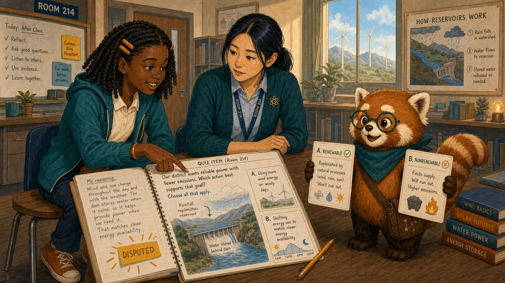
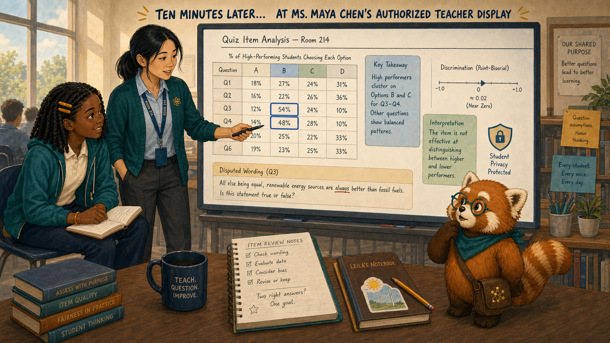
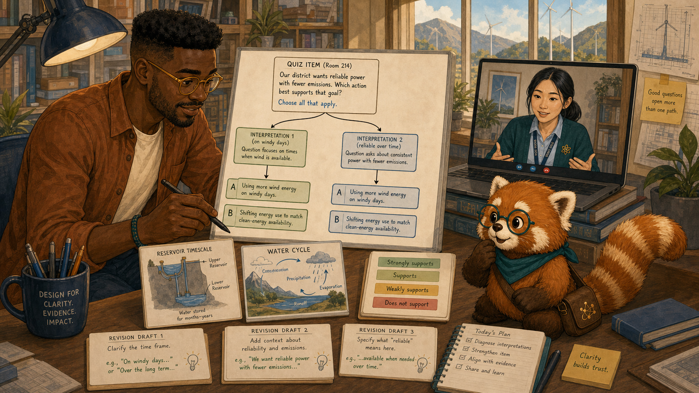
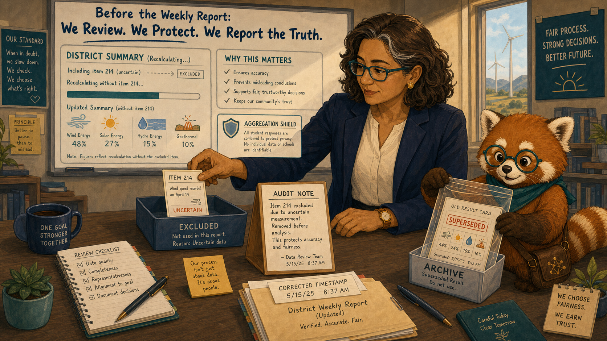
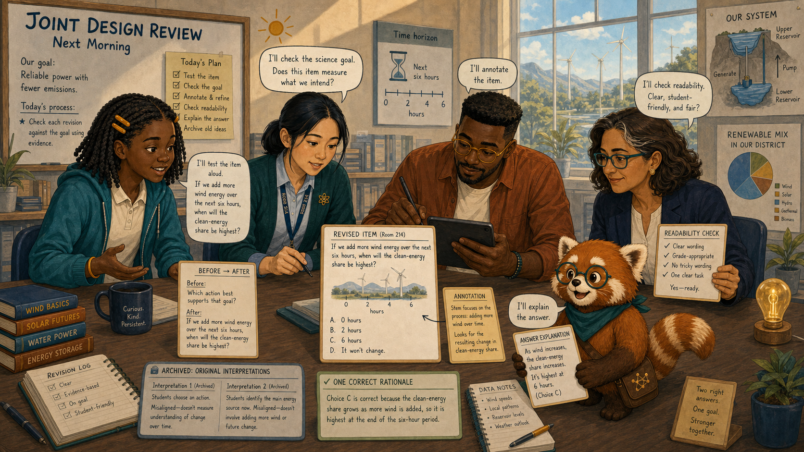
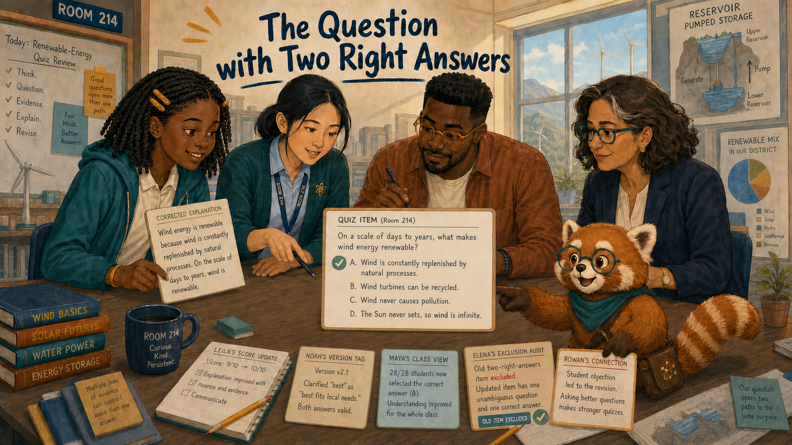

# The Question with Two Right Answers

Cover Image Prompt

(This is the Cover Image. Do not include this label in the image.)
Generate a wide-landscape 16:9 illustration in a warm contemporary educational-comic style with clean ink contours, softly painted color, expressive natural faces, gentle paper texture, realistic proportions, and a navy, deep-teal, cinnamon, cream, and amber palette. Set the scene in Room 214 during a renewable-energy quiz review. Show Leila Brooks, a 13-year-old Black American girl with a slender, age-appropriate build, rich dark-brown skin, a heart-shaped full-cheeked face, broad nose, large dark-brown eyes, and a small gap between her upper front teeth visible when she smiles; her black shoulder-length two-strand twists have a center part and are held back by two symmetrical matte amber barrettes, and she wears a cream short-sleeved polo under a teal zip-front school hoodie, dark-navy straight-leg trousers, cinnamon high-top sneakers, and an amber elastic wristband on her left wrist. Show Ms. Maya Chen, a 35-year-old Chinese American woman with a compact athletic build, light warm-beige skin, a softly square face with rounded cheeks, a small beauty mark below the outer corner of her left eye, and dark-brown almond-shaped eyes; her straight blue-black hair is center-parted in a low ponytail with two short face-framing strands, and she wears a deep-teal cardigan with pushed-up sleeves over a pale-blue button-front shirt, charcoal ankle trousers, white low-profile sneakers, an amber atom pin, and a dark-teal school lanyard. Show Noah Okafor, a 31-year-old Nigerian American man who is tall and lean, with deep umber-brown skin, a long oval face, broad nose, high forehead, dark-brown eyes behind round translucent amber glasses, a very short boxed beard and mustache, and dense black hair in a neat flat-topped coil cut with faded sides; he wears an open cinnamon overshirt over a cream crew-neck shirt, dark indigo trousers, teal canvas shoes, and a narrow deep-teal woven bracelet on his right wrist, and he usually holds a black stylus in his left hand. Show Dr. Elena Ruiz, a 47-year-old Mexican American woman of medium height and build, with warm medium-brown skin, an oval high-cheekboned face, dark-brown eyes behind thin rectangular deep-teal glasses, and a collarbone-length wavy espresso-brown bob with a side part and one narrow silver streak at her right temple; she wears a navy blazer over a cream collarless blouse, charcoal trousers, small hammered-gold circular studs, and a slim amber watch on her left wrist. Show Rowan, a small rounded anthropomorphic red panda about desk height, with cinnamon-orange fur, a cream muzzle, cream eyebrow patches and belly, large kind brown eyes, dark-brown legs, and a thick ringed cinnamon-and-cream tail; he wears round deep-teal glasses, a deep-teal triangular neckerchief, and a compact brown cross-body satchel bearing a small gold connected-dots emblem. Center one fictional quiz card branching into two equally bright answer paths, with Leila pointing to evidence in her amber notebook and Maya comparing the wording. Noah annotates the item on a tablet, Elena holds a shield over a district chart, and Rowan balances two answer cards. Include wind turbines, a reservoir diagram, response bars, a revision pencil, and no red failure mark. Render the exact title “The Question with Two Right Answers” once in bold hand-lettered navy type. Emotional tone: a fair-minded mystery led by student reasoning. Keep every named character exactly consistent with this description, keep Rowan desk-height, show no brands, logos, surveillance imagery, rankings, or decorative data. Generate the image immediately without asking clarifying questions.

Narrative Prompt

This fictional six-panel story shows item analysis revealing an ambiguous renewable-energy question. Preserve the recurring cast. Both answers must be visibly reasonable under the original wording; the corrected item clarifies time scale and process. No flawed score is used to rank a learner, teacher, or school.

### Prologue – A Score Can Be Wrong

Leila Brooks is a 13-year-old seventh-grade science student at Cedar Grove Middle School. When her quiz marked one answer wrong, Leila did not ask for a free point. She opened her notebook and explained why the question supported two answers.

## Panel 1: Show Your Reasoning

Image Prompt

(This is Panel 01. Do not include the panel number in the image.)
Generate a wide-landscape 16:9 illustration in a warm contemporary educational-comic style with clean ink contours, softly painted color, expressive natural faces, gentle paper texture, realistic proportions, and a navy, deep-teal, cinnamon, cream, and amber palette. Set the scene at a Room 214 lab table after class. Show Leila Brooks, a 13-year-old Black American girl with a slender, age-appropriate build, rich dark-brown skin, a heart-shaped full-cheeked face, broad nose, large dark-brown eyes, and a small gap between her upper front teeth visible when she smiles; her black shoulder-length two-strand twists have a center part and are held back by two symmetrical matte amber barrettes, and she wears a cream short-sleeved polo under a teal zip-front school hoodie, dark-navy straight-leg trousers, cinnamon high-top sneakers, and an amber elastic wristband on her left wrist. Show Ms. Maya Chen, a 35-year-old Chinese American woman with a compact athletic build, light warm-beige skin, a softly square face with rounded cheeks, a small beauty mark below the outer corner of her left eye, and dark-brown almond-shaped eyes; her straight blue-black hair is center-parted in a low ponytail with two short face-framing strands, and she wears a deep-teal cardigan with pushed-up sleeves over a pale-blue button-front shirt, charcoal ankle trousers, white low-profile sneakers, an amber atom pin, and a dark-teal school lanyard. Show Rowan, a small rounded anthropomorphic red panda about desk height, with cinnamon-orange fur, a cream muzzle, cream eyebrow patches and belly, large kind brown eyes, dark-brown legs, and a thick ringed cinnamon-and-cream tail; he wears round deep-teal glasses, a deep-teal triangular neckerchief, and a compact brown cross-body satchel bearing a small gold connected-dots emblem. Leila points from the quiz wording to a diagram showing water stored behind a dam and replenished by rainfall; Maya listens at eye level. Include the two options renewable and nonrenewable, Leila's written reasoning, an amber disputed marker instead of a red X, a pencil, a science poster, and Rowan holding both answer cards level.  Emotional tone: respectful disagreement and precise thinking. Keep every named character exactly consistent with this description, keep Rowan desk-height, show no brands, logos, surveillance imagery, rankings, or decorative data. Generate the image immediately without asking clarifying questions.

Ms. Maya Chen teaches Leila's seventh-grade science class. Rowan is the textbook's red-panda learning guide, helping people follow evidence without deciding for them. Leila argued that the question never specified whether it meant the water cycle or a particular reservoir's usable supply. Maya read it again and paused.

## Panel 2: A Strange Response Pattern

Image Prompt

(This is Panel 02. Do not include the panel number in the image.)
Generate a wide-landscape 16:9 illustration in a warm contemporary educational-comic style with clean ink contours, softly painted color, expressive natural faces, gentle paper texture, realistic proportions, and a navy, deep-teal, cinnamon, cream, and amber palette. Set the scene at Maya's authorized teacher display ten minutes later. Show Ms. Maya Chen, a 35-year-old Chinese American woman with a compact athletic build, light warm-beige skin, a softly square face with rounded cheeks, a small beauty mark below the outer corner of her left eye, and dark-brown almond-shaped eyes; her straight blue-black hair is center-parted in a low ponytail with two short face-framing strands, and she wears a deep-teal cardigan with pushed-up sleeves over a pale-blue button-front shirt, charcoal ankle trousers, white low-profile sneakers, an amber atom pin, and a dark-teal school lanyard. Show Leila Brooks, a 13-year-old Black American girl with a slender, age-appropriate build, rich dark-brown skin, a heart-shaped full-cheeked face, broad nose, large dark-brown eyes, and a small gap between her upper front teeth visible when she smiles; her black shoulder-length two-strand twists have a center part and are held back by two symmetrical matte amber barrettes, and she wears a cream short-sleeved polo under a teal zip-front school hoodie, dark-navy straight-leg trousers, cinnamon high-top sneakers, and an amber elastic wristband on her left wrist. Show Rowan, a small rounded anthropomorphic red panda about desk height, with cinnamon-orange fur, a cream muzzle, cream eyebrow patches and belly, large kind brown eyes, dark-brown legs, and a thick ringed cinnamon-and-cream tail; he wears round deep-teal glasses, a deep-teal triangular neckerchief, and a compact brown cross-body satchel bearing a small gold connected-dots emblem. A de-identified item chart shows high-performing students divided between options B and C while other questions show ordinary patterns. Include a discrimination arrow near zero, blurred student rows, a privacy shield, the disputed wording, Maya's black marker, and Leila's notebook beside the screen.  Emotional tone: a pattern challenging an assumption. Keep every named character exactly consistent with this description, keep Rowan desk-height, show no brands, logos, surveillance imagery, rankings, or decorative data. Generate the image immediately without asking clarifying questions.

The class item analysis showed that many students who explained energy sources well had split between the same two options. The question did not distinguish understanding from interpretation. Maya suspended the item before its result could shape instruction.

## Panel 3: Trace the Ambiguity

Image Prompt

(This is Panel 03. Do not include the panel number in the image.)
Generate a wide-landscape 16:9 illustration in a warm contemporary educational-comic style with clean ink contours, softly painted color, expressive natural faces, gentle paper texture, realistic proportions, and a navy, deep-teal, cinnamon, cream, and amber palette. Set the scene in Noah's design studio that afternoon. Show Noah Okafor, a 31-year-old Nigerian American man who is tall and lean, with deep umber-brown skin, a long oval face, broad nose, high forehead, dark-brown eyes behind round translucent amber glasses, a very short boxed beard and mustache, and dense black hair in a neat flat-topped coil cut with faded sides; he wears an open cinnamon overshirt over a cream crew-neck shirt, dark indigo trousers, teal canvas shoes, and a narrow deep-teal woven bracelet on his right wrist, and he usually holds a black stylus in his left hand. Show Ms. Maya Chen, a 35-year-old Chinese American woman with a compact athletic build, light warm-beige skin, a softly square face with rounded cheeks, a small beauty mark below the outer corner of her left eye, and dark-brown almond-shaped eyes; her straight blue-black hair is center-parted in a low ponytail with two short face-framing strands, and she wears a deep-teal cardigan with pushed-up sleeves over a pale-blue button-front shirt, charcoal ankle trousers, white low-profile sneakers, an amber atom pin, and a dark-teal school lanyard. Show Rowan, a small rounded anthropomorphic red panda about desk height, with cinnamon-orange fur, a cream muzzle, cream eyebrow patches and belly, large kind brown eyes, dark-brown legs, and a thick ringed cinnamon-and-cream tail; he wears round deep-teal glasses, a deep-teal triangular neckerchief, and a compact brown cross-body satchel bearing a small gold connected-dots emblem. Noah draws two grammar branches from the original question to two scientifically defensible interpretations while Maya appears on a video tile. Include the original item, a reservoir timescale card, a water-cycle card, response bars, three revision drafts, and Noah's left-hand stylus.  Emotional tone: accountable diagnosis rather than defensiveness. Keep every named character exactly consistent with this description, keep Rowan desk-height, show no brands, logos, surveillance imagery, rankings, or decorative data. Generate the image immediately without asking clarifying questions.

Noah Okafor designs the class's interactive intelligent textbook and assessments. He traced the sentence instead of defending the answer key. One branch treated flowing water as renewable; the other treated a depleted local reservoir as limited on the stated time horizon. The wording had created the contradiction.

## Panel 4: Protect the Record

Image Prompt

(This is Panel 04. Do not include the panel number in the image.)
Generate a wide-landscape 16:9 illustration in a warm contemporary educational-comic style with clean ink contours, softly painted color, expressive natural faces, gentle paper texture, realistic proportions, and a navy, deep-teal, cinnamon, cream, and amber palette. Set the scene in Elena's district review room before the weekly report. Show Dr. Elena Ruiz, a 47-year-old Mexican American woman of medium height and build, with warm medium-brown skin, an oval high-cheekboned face, dark-brown eyes behind thin rectangular deep-teal glasses, and a collarbone-length wavy espresso-brown bob with a side part and one narrow silver streak at her right temple; she wears a navy blazer over a cream collarless blouse, charcoal trousers, small hammered-gold circular studs, and a slim amber watch on her left wrist. Show Rowan, a small rounded anthropomorphic red panda about desk height, with cinnamon-orange fur, a cream muzzle, cream eyebrow patches and belly, large kind brown eyes, dark-brown legs, and a thick ringed cinnamon-and-cream tail; he wears round deep-teal glasses, a deep-teal triangular neckerchief, and a compact brown cross-body satchel bearing a small gold connected-dots emblem. Elena places the ambiguous item into a clearly labeled excluded tray while a district summary recalculates without it. Include an audit note, no school rankings, an aggregation shield, the item identifier, a corrected timestamp, and Rowan sealing the old result card in an archive sleeve.  Emotional tone: procedural fairness and restraint. Keep every named character exactly consistent with this description, keep Rowan desk-height, show no brands, logos, surveillance imagery, rankings, or decorative data. Generate the image immediately without asking clarifying questions.

Dr. Elena Ruiz is the district learning director, responsible for fair use of de-identified evidence across schools. Elena excluded the flawed item from student, class, and school summaries and recorded why. Correcting a question also meant correcting the decisions that might have depended on it.

## Panel 5: Ask One Clear Thing

Image Prompt

(This is Panel 05. Do not include the panel number in the image.)
Generate a wide-landscape 16:9 illustration in a warm contemporary educational-comic style with clean ink contours, softly painted color, expressive natural faces, gentle paper texture, realistic proportions, and a navy, deep-teal, cinnamon, cream, and amber palette. Set the scene in a joint design review the next morning. Show Leila Brooks, a 13-year-old Black American girl with a slender, age-appropriate build, rich dark-brown skin, a heart-shaped full-cheeked face, broad nose, large dark-brown eyes, and a small gap between her upper front teeth visible when she smiles; her black shoulder-length two-strand twists have a center part and are held back by two symmetrical matte amber barrettes, and she wears a cream short-sleeved polo under a teal zip-front school hoodie, dark-navy straight-leg trousers, cinnamon high-top sneakers, and an amber elastic wristband on her left wrist. Show Ms. Maya Chen, a 35-year-old Chinese American woman with a compact athletic build, light warm-beige skin, a softly square face with rounded cheeks, a small beauty mark below the outer corner of her left eye, and dark-brown almond-shaped eyes; her straight blue-black hair is center-parted in a low ponytail with two short face-framing strands, and she wears a deep-teal cardigan with pushed-up sleeves over a pale-blue button-front shirt, charcoal ankle trousers, white low-profile sneakers, an amber atom pin, and a dark-teal school lanyard. Show Noah Okafor, a 31-year-old Nigerian American man who is tall and lean, with deep umber-brown skin, a long oval face, broad nose, high forehead, dark-brown eyes behind round translucent amber glasses, a very short boxed beard and mustache, and dense black hair in a neat flat-topped coil cut with faded sides; he wears an open cinnamon overshirt over a cream crew-neck shirt, dark indigo trousers, teal canvas shoes, and a narrow deep-teal woven bracelet on his right wrist, and he usually holds a black stylus in his left hand. Show Rowan, a small rounded anthropomorphic red panda about desk height, with cinnamon-orange fur, a cream muzzle, cream eyebrow patches and belly, large kind brown eyes, dark-brown legs, and a thick ringed cinnamon-and-cream tail; he wears round deep-teal glasses, a deep-teal triangular neckerchief, and a compact brown cross-body satchel bearing a small gold connected-dots emblem. Show the revised item with a clear time horizon and one process-focused stem; Leila tests it aloud, Maya checks the science goal, and Noah annotates with his left hand. Include a before-and-after wording card, a single correct rationale, a readability check, an answer explanation, and two archived original interpretations.  Emotional tone: clarity built collaboratively. Keep every named character exactly consistent with this description, keep Rowan desk-height, show no brands, logos, surveillance imagery, rankings, or decorative data. Generate the image immediately without asking clarifying questions.

Noah rewrote the item to name the time scale and ask about the energy source rather than the reservoir's condition. Maya checked alignment with the lesson. Leila read it without seeing the answer choices first and described exactly one interpretation.

## Panel 6: One Objection, Better Evidence

Image Prompt

(This is Panel 06. Do not include the panel number in the image.)
Generate a wide-landscape 16:9 illustration in a warm contemporary educational-comic style with clean ink contours, softly painted color, expressive natural faces, gentle paper texture, realistic proportions, and a navy, deep-teal, cinnamon, cream, and amber palette. Set the scene in Room 214 during the next quiz review. Show Leila Brooks, a 13-year-old Black American girl with a slender, age-appropriate build, rich dark-brown skin, a heart-shaped full-cheeked face, broad nose, large dark-brown eyes, and a small gap between her upper front teeth visible when she smiles; her black shoulder-length two-strand twists have a center part and are held back by two symmetrical matte amber barrettes, and she wears a cream short-sleeved polo under a teal zip-front school hoodie, dark-navy straight-leg trousers, cinnamon high-top sneakers, and an amber elastic wristband on her left wrist. Show Ms. Maya Chen, a 35-year-old Chinese American woman with a compact athletic build, light warm-beige skin, a softly square face with rounded cheeks, a small beauty mark below the outer corner of her left eye, and dark-brown almond-shaped eyes; her straight blue-black hair is center-parted in a low ponytail with two short face-framing strands, and she wears a deep-teal cardigan with pushed-up sleeves over a pale-blue button-front shirt, charcoal ankle trousers, white low-profile sneakers, an amber atom pin, and a dark-teal school lanyard. Show Noah Okafor, a 31-year-old Nigerian American man who is tall and lean, with deep umber-brown skin, a long oval face, broad nose, high forehead, dark-brown eyes behind round translucent amber glasses, a very short boxed beard and mustache, and dense black hair in a neat flat-topped coil cut with faded sides; he wears an open cinnamon overshirt over a cream crew-neck shirt, dark indigo trousers, teal canvas shoes, and a narrow deep-teal woven bracelet on his right wrist, and he usually holds a black stylus in his left hand. Show Dr. Elena Ruiz, a 47-year-old Mexican American woman of medium height and build, with warm medium-brown skin, an oval high-cheekboned face, dark-brown eyes behind thin rectangular deep-teal glasses, and a collarbone-length wavy espresso-brown bob with a side part and one narrow silver streak at her right temple; she wears a navy blazer over a cream collarless blouse, charcoal trousers, small hammered-gold circular studs, and a slim amber watch on her left wrist. Show Rowan, a small rounded anthropomorphic red panda about desk height, with cinnamon-orange fur, a cream muzzle, cream eyebrow patches and belly, large kind brown eyes, dark-brown legs, and a thick ringed cinnamon-and-cream tail; he wears round deep-teal glasses, a deep-teal triangular neckerchief, and a compact brown cross-body satchel bearing a small gold connected-dots emblem. Arrange the team around a healthy item-analysis card with a clear response pattern; Leila smiles with her small tooth gap while holding the corrected explanation. Include an amended score note, Noah's version tag, Maya's class view, Elena's exclusion audit, Rowan connecting objection to revision, and no trophy.  Emotional tone: earned fairness and shared improvement. Keep every named character exactly consistent with this description, keep Rowan desk-height, show no brands, logos, surveillance imagery, rankings, or decorative data. Generate the image immediately without asking clarifying questions.

Leila received a corrected result, but the larger repair mattered too. Maya trusted the quiz more, Noah improved the item bank, and Elena prevented a faulty question from distorting decisions. One careful objection had made future evidence more truthful.

### Epilogue – Assess the Idea You Mean

Item analysis cannot replace student reasoning, but it can reveal when a question behaves unlike the construct it is supposed to measure. The team treated the anomaly as a quality problem, amended affected records, and tested the revision.

| Challenge | How the Team Responded | Lesson for Today |
|---|---|---|
| One answer was marked wrong | Leila explained a second valid interpretation | Reasoning can expose ambiguity |
| Strong students split between two options | Maya checked item behavior | A strange pattern deserves review |
| The key looked authoritative | Noah traced the wording | Assessment quality includes language quality |
| The result had entered summaries | Elena excluded and documented it | Corrections must reach downstream decisions |

### Call to Action

When an assessment result looks surprising, inspect the item as carefully as the learner. Ask whether the wording distinguishes the knowledge you intended to measure—and repair every summary touched by a flawed question.

---

*“I wasn't asking for the answer. I was asking which question you meant.”* 
—Leila Brooks, fictional student

*“A clean chart cannot rescue an unclear item.”* 
—Ms. Maya Chen, fictional teacher

*“Fairness includes correcting the record.”* 
—Dr. Elena Ruiz, fictional district learning director

---

## References

1. [Wikipedia: Item analysis](https://en.wikipedia.org/wiki/Item_analysis) - Overview of evaluating how assessment questions perform
2. [Wikipedia: Test validity](https://en.wikipedia.org/wiki/Test_validity) - Background on whether an assessment supports its intended interpretation
3. [Wikipedia: Ambiguity](https://en.wikipedia.org/wiki/Ambiguity) - Introduction to language that permits multiple reasonable meanings
4. [NCME: Testing Standards](https://www.testingstandards.net/) - Professional standards for educational and psychological testing
5. [CAST: UDL Guidelines](https://udlguidelines.cast.org/) - Guidance for reducing avoidable barriers in assessment and learning
