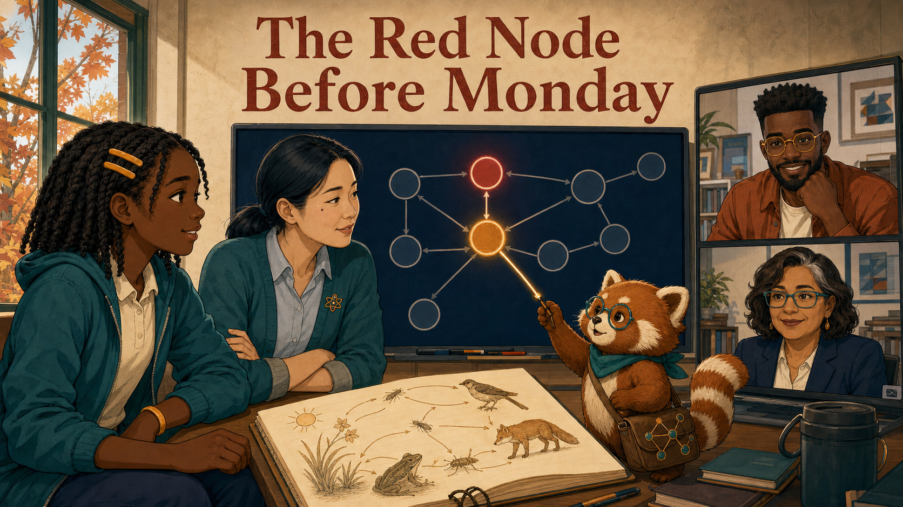

# The Red Node Before Monday

<!--  -->

Cover Image Prompt

(This is the Cover Image. Do not include this label in the image.)
Create a wide-landscape 16:9 graphic-novel cover in a warm contemporary educational-comic style with clean ink contours, softly painted color, gentle paper texture, realistic proportions, and no logos. In Cedar Grove Middle School Room 214 on a Friday afternoon in early October, show Leila Brooks, a 13-year-old Black American girl with rich dark-brown skin, a heart-shaped face, large dark-brown eyes, shoulder-length center-parted two-strand twists held by two matte amber barrettes, a teal zip hoodie over a cream polo, navy trousers, cinnamon high-tops, and an amber left-wrist band. Beside her is Ms. Maya Chen, a 35-year-old Chinese American woman with light warm-beige skin, a softly square face, a beauty mark below her left eye, blue-black hair in a low center-parted ponytail, a deep-teal cardigan, pale-blue shirt, charcoal trousers, white sneakers, amber atom pin, and dark-teal lanyard. Behind them, a wall display shows a navy concept graph whose amber-red Ecosystems node leads upstream to an amber-red Energy Transfer node. On a laptop tile show Noah Okafor, a tall lean 31-year-old Nigerian American man with deep umber-brown skin, flat-topped black coils, close beard, round amber glasses, cinnamon overshirt, and cream shirt. On a second district-view tile show Dr. Elena Ruiz, a 47-year-old Mexican American woman with warm medium-brown skin, thin rectangular teal glasses, a wavy espresso bob with one silver streak at her right temple, navy blazer, and cream blouse. Rowan, a small rounded cinnamon-and-cream red panda with round teal glasses, teal neckerchief, ringed tail, and connected-dots satchel, traces a glowing line between the two red nodes. Include Leila's open amber notebook with a food web, amber autumn window light, teal evidence cards, and the exact title text “The Red Node Before Monday” in a bold hand-lettered navy typeface. Palette: navy, deep teal, cinnamon, cream, amber, and restrained warning red. Emotional tone: mystery turning into shared resolve, never surveillance or blame. Generate the image immediately without asking clarifying questions.

Narrative Prompt

This fictional eight-panel story takes place at Cedar Grove Middle School in the present day. Its central rule is that a mastery warning is a clue, not a label: Leila supplies lived context, Maya interprets classroom evidence, Noah repairs a textbook assumption, Elena coordinates district support, and Rowan helps them follow the record without deciding for them. Preserve the canonical character anchors in `story-ideas-chatgpt.md`, the warm educational-comic style, and the teal-cinnamon-cream-navy-amber palette. Dashboard text is deliberately minimal and de-identified outside Maya's roster-authorized classroom view.

### Prologue – A Mark Is Not a Meaning

By Friday afternoon, one red node seemed to know more about Leila than Leila knew
about herself. It did not. The mark recorded a pattern in recent answers; only people
could discover the story behind it. One event at a time, the team followed the clue
backward before deciding what should happen next.

## Panel 1: Friday's Last Question

<!--  -->

Image Prompt

(This is Panel 01. Do not include the panel number in the image.)
Generate a wide-landscape 16:9 image in the warm contemporary educational-comic style, depicting panel 1 of 8 in Room 214 at Cedar Grove Middle School at 3:35 p.m. on a Friday in early October. Show Leila Brooks, a 13-year-old Black American girl with a slender age-appropriate build, rich dark-brown skin, heart-shaped full-cheeked face, broad nose, large dark-brown eyes, shoulder-length center-parted two-strand twists held by two symmetrical matte amber barrettes, teal zip hoodie over a cream polo, navy trousers, cinnamon high-tops, and amber left-wrist band. She sits at a lab table with tired but determined eyes, one hand on an amber science notebook containing a food web and the other beside a tablet showing a single amber-red node labeled Ecosystems. Rowan, a small rounded cinnamon-and-cream red panda with round teal glasses, teal neckerchief, ringed tail, and a connected-dots satchel, sits at desk height and looks thoughtfully at the record. Include a sharpened pencil, three crossed-out ecosystem answers, a backpack with a cream lightning-bolt patch, empty stools, long amber window shadows, and a wall clock just after 3:35. Palette: navy, teal, cream, cinnamon, amber, and one restrained red clue. Emotional tone: fatigue with dignity and unresolved curiosity, not failure. No brands or logos. Generate the image immediately without asking clarifying questions.

Leila had studied every night, yet the ecosystem questions kept turning red. “I know
the vocabulary,” she said, tapping her food web. Rowan did not explain the mark away.
He looked from the answer history to Leila and asked, “What does the evidence show?”

## Panel 2: The Pattern Is Larger

<!--  -->

Image Prompt

(This is Panel 02. Do not include the panel number in the image.)
Generate a wide-landscape 16:9 image in the same warm educational-comic style, depicting panel 2 of 8 in Room 214 at 3:42 p.m. Show Ms. Maya Chen, a 35-year-old Chinese American woman with a compact athletic build, light warm-beige skin, softly square face, rounded cheeks, a small beauty mark below her left eye, dark-brown almond eyes, and blue-black hair in a low center-parted ponytail with two face-framing strands; she wears a deep-teal cardigan with pushed-up sleeves, pale-blue button-front shirt, charcoal ankle trousers, white sneakers, amber atom pin, and dark-teal school lanyard. Maya sits at Leila's eye level and turns a wall-mounted heatmap toward her. Leila retains her exact twists, amber barrettes, teal hoodie, cream polo, navy trousers, cinnamon high-tops, and amber wristband. The heatmap shows several anonymous amber squares in the Ecosystems column, while names and scores remain blurred except on Maya's authorized view. Include Maya's black marker behind her right ear, Leila's amber notebook, Rowan tracing a line across three amber squares, labeled class columns, a privacy shield icon, autumn light, and two empty lab stools. Palette: teal, navy, cream, amber, cinnamon. Emotional tone: concern becoming a shared investigation. No brands. Generate the image immediately without asking clarifying questions.

Maya checked the class view and found that Leila was not alone. Several students who
participated well in discussion stumbled on the same kind of question. “That makes
this a pattern worth investigating,” Maya said, “not a verdict about any one person.”

## Panel 3: Follow the Arrow Upstream

<!--  -->

Image Prompt

(This is Panel 03. Do not include the panel number in the image.)
Generate a wide-landscape 16:9 image in the same warm educational-comic style, depicting panel 3 of 8 in Room 214 at 3:48 p.m. Maya Chen retains her low ponytail, left-eye beauty mark, teal rolled-sleeve cardigan, pale-blue shirt, amber atom pin, charcoal trousers, and teal lanyard. Leila Brooks retains her shoulder-length twists, two amber barrettes, teal hoodie over cream polo, amber left-wrist band, and amber notebook. They stand beside a large navy concept graph: Ecosystems is amber-red at the right, arrows lead left through Food Webs to Energy Transfer, and Energy Transfer glows amber-red while earlier prerequisites remain teal. Rowan, the small cinnamon-and-cream red panda with round teal glasses, teal neckerchief, ringed tail, and satchel, uses one paw to trace the arrow backward without touching any private student record. Include exactly five legible concept nodes, thin gold dependency arrows, a magnified upstream path, Maya's open palm, Leila leaning forward, a small legend reading “teal: secure / amber: review,” and late-afternoon light. Emotional tone: the instant a hidden relationship becomes visible. Generate the image immediately without asking clarifying questions.

Maya followed the dependency arrows upstream. The first shared weakness was not
ecosystems at all; it was energy transfer, a concept the book had treated as settled.
Leila pointed to her food web. “That is where I lose track of what moves where.”

## Panel 4: A District Clue, Not a Student File

<!--  -->

Image Prompt

(This is Panel 04. Do not include the panel number in the image.)
Generate a wide-landscape 16:9 image in the same warm educational-comic style, depicting panel 4 of 8 in a district review room at 4:00 p.m. Show Dr. Elena Ruiz, a 47-year-old Mexican American woman of medium build with warm medium-brown skin, oval high-cheekboned face, dark-brown eyes behind thin rectangular deep-teal glasses, and a collarbone-length wavy espresso bob with a side part and one narrow silver streak at her right temple; she wears a navy blazer over a cream collarless blouse, charcoal trousers, hammered-gold circular studs, and an amber watch on her left wrist. Elena studies a large de-identified district chart showing four school icons and an amber Energy Transfer band across three schools, with no names or student rows. Rowan stands desk-high beside the screen in his cinnamon-and-cream fur, round teal glasses, teal neckerchief, ringed tail, and connected-dots satchel, holding one sealed evidence card rather than exposing it. Include Elena's navy folio, an aggregation-threshold badge, blurred section counts, a small privacy lock, a map of four schools, a timestamp after 4:00, and warm overhead light. Emotional tone: careful recognition and responsibility, never command or surveillance. Generate the image immediately without asking clarifying questions.

Elena looked only at a de-identified district rollup. The same prerequisite gap
appeared across several schools using the same chapter version. She did not open
Leila's record; she did not need to. The aggregate evidence was enough to ask whether
teachers and materials needed support.

## Panel 5: Build the Missing Bridge

<!--  -->

Image Prompt

(This is Panel 05. Do not include the panel number in the image.)
Generate a wide-landscape 16:9 image in the same warm educational-comic style, depicting panel 5 of 8 in a small design studio at 4:08 p.m. Show Noah Okafor, a tall lean 31-year-old Nigerian American man with deep umber-brown skin, a long oval face, broad nose, high forehead, dark-brown eyes behind round translucent amber glasses, a very short boxed beard and mustache, and dense black hair in a neat flat-topped coil cut with faded sides; he wears an open cinnamon overshirt over a cream crew-neck shirt, dark indigo trousers, teal canvas shoes, and a narrow deep-teal bracelet on his right wrist, drawing with a black stylus in his left hand. His tablet shows a three-step bridge activity: sunlight card, plant card, and animal card connected by movable gold arrows. Include Maya's de-identified note on a side panel, no student names, a thumbnail of the red upstream node, three paper prototypes, a mug without a logo, a charcoal laptop sleeve, Rowan offering a blank evidence card from his satchel, and a desk lamp casting warm amber light. Emotional tone: accountable concentration and constructive urgency. Generate the image immediately without asking clarifying questions.

Noah compared the textbook sequence with Maya's note. The chapter had named energy
transfer, but it had not asked learners to practice tracing it. He built a five-minute
bridge activity that made each transfer visible, then sent Maya a preview instead of
pretending the first design had been complete.

## Panel 6: One Arrow at a Time

<!--  -->

Image Prompt

(This is Panel 06. Do not include the panel number in the image.)
Generate a wide-landscape 16:9 image in the same warm educational-comic style, depicting panel 6 of 8 in Room 214 on Monday morning at 9:10 a.m. Maya Chen retains her low center-parted ponytail, left-eye beauty mark, teal cardigan with rolled sleeves, pale-blue shirt, amber atom pin, charcoal trousers, white sneakers, and teal lanyard; she crouches at student eye level with open hands. Leila Brooks retains her shoulder-length twists, symmetrical amber barrettes, teal hoodie, cream polo, navy trousers, cinnamon high-tops, and amber left-wrist band; she actively drags one gold energy arrow from sunlight to grass on a tablet. Show four diverse unnamed classmates around the lab table, each with a distinct stable accessory, and Rowan at desk height in round teal glasses, teal neckerchief, cinnamon-and-cream fur, ringed tail, and satchel. Include physical sunlight, grass, rabbit, and hawk cards; gold yarn arrows; Leila's amber notebook; a wall concept node changing from amber to half-teal; bright morning light; and no scores. Emotional tone: low-pressure practice and growing clarity. Generate the image immediately without asking clarifying questions.

On Monday, Maya used the bridge with the whole class. Leila moved a gold arrow from
sunlight to grass, then from grass to rabbit, narrating each transfer aloud. “The
energy is moving,” she said. “The animal is not making it from nothing.”

## Panel 7: The Next Records

<!--  -->

Image Prompt

(This is Panel 07. Do not include the panel number in the image.)
Generate a wide-landscape 16:9 image in the same warm educational-comic style, depicting panel 7 of 8 in Room 214 later Monday at 11:45 a.m. Leila retains her exact twists, amber barrettes, teal hoodie, cream polo, navy trousers, cinnamon high-tops, amber wristband, and amber notebook; she sits forward with focused confidence and a small tooth-gap smile. Maya retains her low ponytail, teal cardigan, pale-blue shirt, atom pin, charcoal trousers, and lanyard, watching from beside rather than over Leila's shoulder. A wall graph clearly shows Energy Transfer now teal while Ecosystems is amber and improving, with a short timeline of three new evidence cards. Rowan, the desk-high cinnamon-and-cream red panda with teal glasses, neckerchief, ringed tail, and satchel, connects the new cards with a glowing gold thread. Include Leila's correct annotated food web, a green-teal check on the bridge activity, no rank or reward badge, the same Room 214 windows, three classmates working independently, and soft midday light. Emotional tone: earned progress without a magical instant cure. Generate the image immediately without asking clarifying questions.

The next records changed in the expected order. Energy transfer turned teal first;
ecosystems began improving afterward. The sequence mattered because it matched the
team's hypothesis—and because Leila could explain the science in her own words.

## Panel 8: Four Views, One Decision

<!--  -->

Image Prompt

(This is Panel 08. Do not include the panel number in the image.)
Generate a wide-landscape 16:9 image in the same warm educational-comic style, depicting panel 8 of 8 in Room 214 after school on Monday. Leila appears with her rich dark-brown skin, heart-shaped face, shoulder-length twists, two amber barrettes, teal hoodie, cream polo, navy trousers, cinnamon high-tops, amber wristband, and open amber notebook. Maya appears with her light warm-beige skin, left-eye beauty mark, low blue-black ponytail, rolled teal cardigan, pale-blue shirt, amber atom pin, charcoal trousers, and lanyard. Noah appears on a large video tile with deep umber-brown skin, flat-topped coils, close beard, round amber glasses, cinnamon overshirt, cream shirt, and left-hand stylus. Elena appears on a second tile with warm medium-brown skin, rectangular teal glasses, wavy espresso bob with right-temple silver streak, navy blazer, cream blouse, gold studs, and amber watch. Rowan stands between the screen and table with cinnamon-and-cream fur, teal glasses and neckerchief, ringed tail, and satchel. Include four aligned evidence views—student explanation, class heatmap, content revision, district rollup—plus a teal Energy Transfer node, improving amber Ecosystems node, Elena's coaching calendar, Noah's bridge-version card, and the exact handwritten words “check again Friday” in Leila's notebook. Emotional tone: shared accountability and cautious celebration. Generate the image immediately without asking clarifying questions.

The team did not declare victory from one green mark. Leila described what had finally
made sense; Maya kept the bridge in the week's lessons; Noah queued it for the next
book release; Elena scheduled coaching where the district pattern was strongest.
They agreed to check again Friday, because a good decision includes the evidence that
could prove it wrong.

### Epilogue – What Made the Record Useful?

The dashboard did not diagnose Leila. It gave the team a trail they could compare
with classroom observation, student explanation, content structure, and district
patterns. Their response was small, testable, and aimed upstream. Most importantly,
Leila remained a participant in the interpretation rather than the object of it.

| Challenge | How the Team Responded | Lesson for Today |
|---|---|---|
| A red mastery mark looked personal | Maya checked the class pattern and asked Leila for context | A signal begins an inquiry; it does not finish one |
| The visible struggle was downstream | The team followed prerequisite arrows to Energy Transfer | Help should target the earliest supported gap |
| The textbook assumed prior mastery | Noah created a short practice bridge | Content evidence should improve content |
| One class could have been an exception | Elena checked a de-identified district rollup | Broader action needs appropriately aggregated evidence |

### Call to Action

When a learning signal looks simple, ask what chain of evidence produced it. Follow
the record upstream, invite the learner into the explanation, and choose a response
whose results you can check later.

---

*“A red mark can tell us where to look. It cannot tell us who I am.”*  
—Leila Brooks, fictional student

*“Let's follow the record.”*  
—Rowan

*“Support the prerequisite, then look for the change downstream.”*  
—Ms. Maya Chen, fictional teacher

---

## References

1. [Wikipedia: Learning analytics](https://en.wikipedia.org/wiki/Learning_analytics) - Overview of collecting and analyzing evidence about learners and learning contexts
2. [Wikipedia: Knowledge tracing](https://en.wikipedia.org/wiki/Knowledge_tracing) - Introduction to modeling changes in learner knowledge over time
3. [Wikipedia: Concept map](https://en.wikipedia.org/wiki/Concept_map) - Background on visualizing concepts and their relationships
4. [ADL: Experience API specification](https://github.com/adlnet/xAPI-Spec) - Source specification for interoperable records of learning experiences
5. [CAST: Universal Design for Learning Guidelines](https://udlguidelines.cast.org/) - Guidance for designing flexible supports around learner variability
