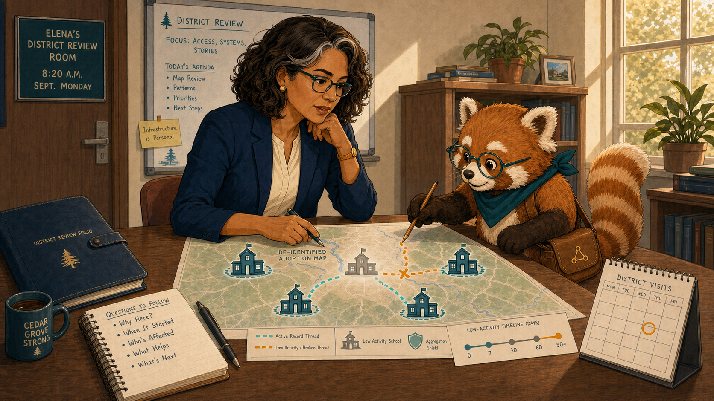
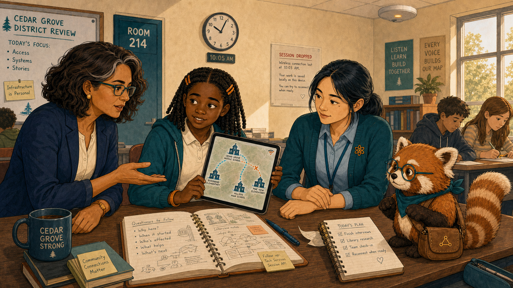
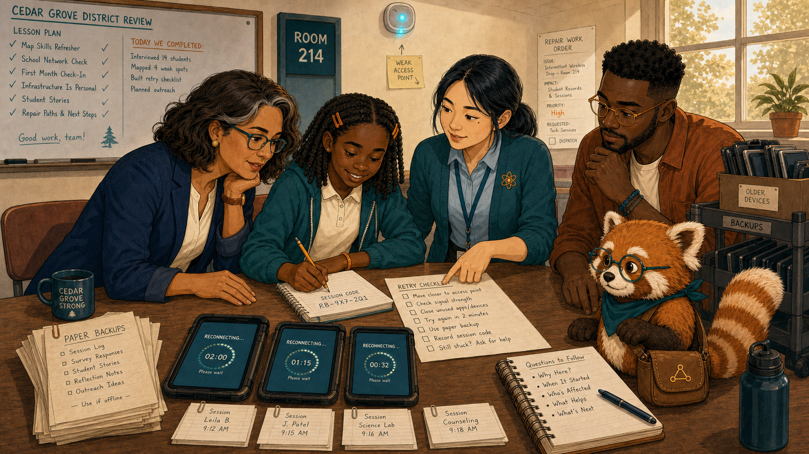
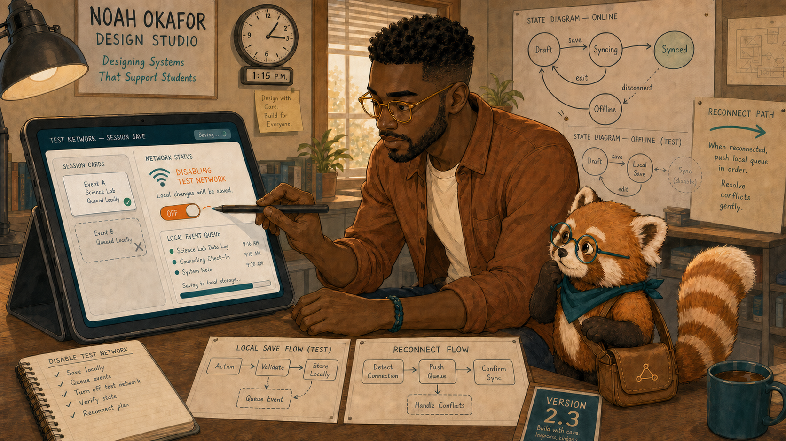
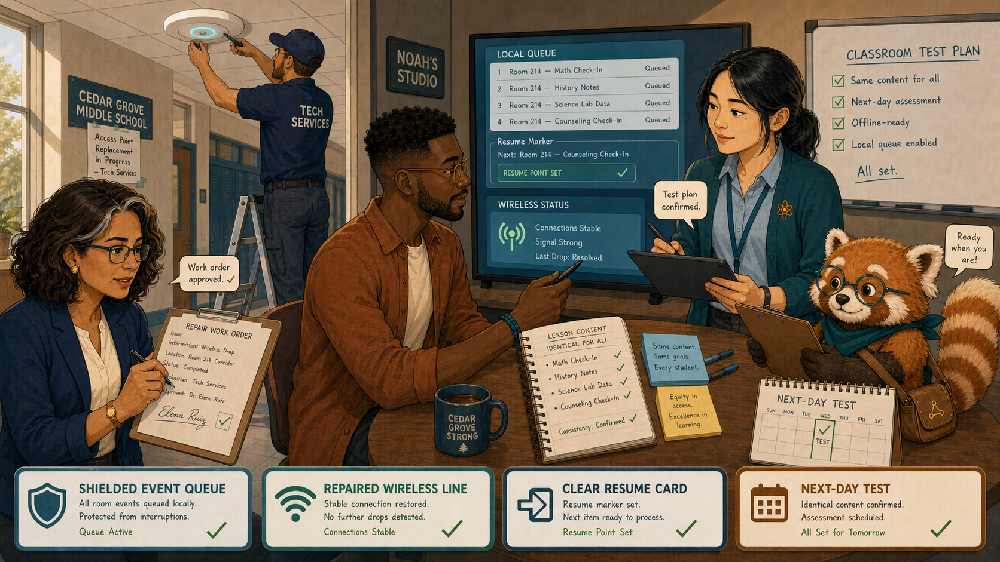
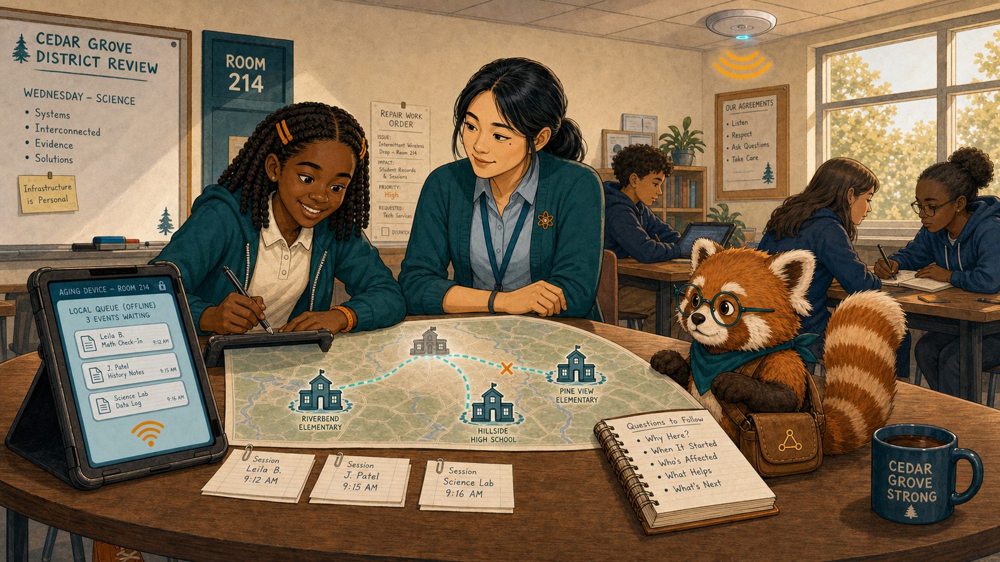
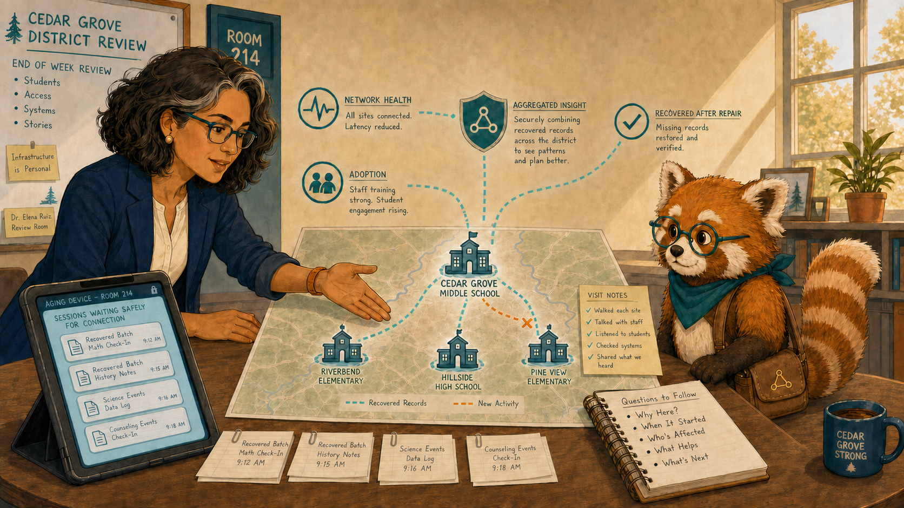
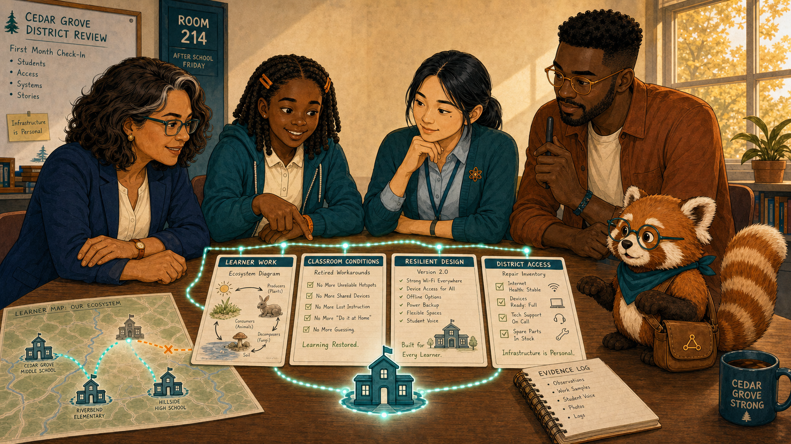

# The School That Faded from the Map

Cover Image Prompt

(This is the Cover Image. Do not include this label in the image.)
Generate a wide-landscape 16:9 illustration in a warm contemporary educational-comic style with clean ink contours, softly painted color, expressive natural faces, gentle paper texture, realistic proportions, and a navy, deep-teal, cinnamon, cream, and amber palette. Set the scene in a Cedar Grove district review room and Room 214 during the first month of school. Show Dr. Elena Ruiz, a 47-year-old Mexican American woman of medium height and build, with warm medium-brown skin, an oval high-cheekboned face, dark-brown eyes behind thin rectangular deep-teal glasses, and a collarbone-length wavy espresso-brown bob with a side part and one narrow silver streak at her right temple; she wears a navy blazer over a cream collarless blouse, charcoal trousers, small hammered-gold circular studs, and a slim amber watch on her left wrist. Show Leila Brooks, a 13-year-old Black American girl with a slender, age-appropriate build, rich dark-brown skin, a heart-shaped full-cheeked face, broad nose, large dark-brown eyes, and a small gap between her upper front teeth visible when she smiles; her black shoulder-length two-strand twists have a center part and are held back by two symmetrical matte amber barrettes, and she wears a cream short-sleeved polo under a teal zip-front school hoodie, dark-navy straight-leg trousers, cinnamon high-top sneakers, and an amber elastic wristband on her left wrist. Show Ms. Maya Chen, a 35-year-old Chinese American woman with a compact athletic build, light warm-beige skin, a softly square face with rounded cheeks, a small beauty mark below the outer corner of her left eye, and dark-brown almond-shaped eyes; her straight blue-black hair is center-parted in a low ponytail with two short face-framing strands, and she wears a deep-teal cardigan with pushed-up sleeves over a pale-blue button-front shirt, charcoal ankle trousers, white low-profile sneakers, an amber atom pin, and a dark-teal school lanyard. Show Noah Okafor, a 31-year-old Nigerian American man who is tall and lean, with deep umber-brown skin, a long oval face, broad nose, high forehead, dark-brown eyes behind round translucent amber glasses, a very short boxed beard and mustache, and dense black hair in a neat flat-topped coil cut with faded sides; he wears an open cinnamon overshirt over a cream crew-neck shirt, dark indigo trousers, teal canvas shoes, and a narrow deep-teal woven bracelet on his right wrist, and he usually holds a black stylus in his left hand. Show Rowan, a small rounded anthropomorphic red panda about desk height, with cinnamon-orange fur, a cream muzzle, cream eyebrow patches and belly, large kind brown eyes, dark-brown legs, and a thick ringed cinnamon-and-cream tail; he wears round deep-teal glasses, a deep-teal triangular neckerchief, and a compact brown cross-body satchel bearing a small gold connected-dots emblem. Arrange the five characters around a district map where one school icon fades into pale gray as a broken amber wireless line interrupts a glowing teal record thread. Include an aging tablet, a ceiling access point, session cards waiting safely on the device, a repair work order, four clear school icons, and late-morning window light. Render the exact title “The School That Faded from the Map” once in bold hand-lettered navy type. Emotional tone: an infrastructure mystery becoming a humane investigation. Keep every named character exactly consistent with this description, keep Rowan desk-height, show no brands, logos, surveillance imagery, rankings, or decorative data. Generate the image immediately without asking clarifying questions.

Narrative Prompt

This fictional eight-panel story follows one school that appears inactive on a district adoption dashboard. Preserve the recurring character anchors and show that low activity is a clue about access, not proof of low motivation. The technical fix combines network repair with resilient session recovery; district views remain de-identified.

### Prologue – Quiet Is Not an Explanation

Dr. Elena Ruiz is the district learning director, responsible for improving access and learning across Cedar Grove schools. When one school nearly disappeared from her adoption map, Elena did not call its students disengaged. A pale icon was evidence of silence in a system—not an explanation for it.

## Panel 1: One Pale School

Image Prompt

(This is Panel 01. Do not include the panel number in the image.)
Generate a wide-landscape 16:9 illustration in a warm contemporary educational-comic style with clean ink contours, softly painted color, expressive natural faces, gentle paper texture, realistic proportions, and a navy, deep-teal, cinnamon, cream, and amber palette. Set the scene in Elena's district review room at 8:20 a.m. on a September Monday. Show Dr. Elena Ruiz, a 47-year-old Mexican American woman of medium height and build, with warm medium-brown skin, an oval high-cheekboned face, dark-brown eyes behind thin rectangular deep-teal glasses, and a collarbone-length wavy espresso-brown bob with a side part and one narrow silver streak at her right temple; she wears a navy blazer over a cream collarless blouse, charcoal trousers, small hammered-gold circular studs, and a slim amber watch on her left wrist. Show Rowan, a small rounded anthropomorphic red panda about desk height, with cinnamon-orange fur, a cream muzzle, cream eyebrow patches and belly, large kind brown eyes, dark-brown legs, and a thick ringed cinnamon-and-cream tail; he wears round deep-teal glasses, a deep-teal triangular neckerchief, and a compact brown cross-body satchel bearing a small gold connected-dots emblem. Elena studies a de-identified adoption map with four teal schools and one pale-gray school; Rowan traces the broken portion of a gold record thread. Include equal-size school icons, a low-activity timeline, an aggregation shield, Elena's navy folio, a visit calendar, and no student names.  Emotional tone: calm scrutiny rather than accusation. Keep every named character exactly consistent with this description, keep Rowan desk-height, show no brands, logos, surveillance imagery, rankings, or decorative data. Generate the image immediately without asking clarifying questions.

Rowan is the textbook's red-panda learning guide, helping people follow evidence without deciding for them. “The map tells us where the records grow quiet,” Elena said. “It does not tell us why.” She scheduled a classroom visit before proposing any response.

## Panel 2: Learning Between Disconnects

Image Prompt

(This is Panel 02. Do not include the panel number in the image.)
Generate a wide-landscape 16:9 illustration in a warm contemporary educational-comic style with clean ink contours, softly painted color, expressive natural faces, gentle paper texture, realistic proportions, and a navy, deep-teal, cinnamon, cream, and amber palette. Set the scene in Room 214 at 10:05 a.m. the next morning. Show Leila Brooks, a 13-year-old Black American girl with a slender, age-appropriate build, rich dark-brown skin, a heart-shaped full-cheeked face, broad nose, large dark-brown eyes, and a small gap between her upper front teeth visible when she smiles; her black shoulder-length two-strand twists have a center part and are held back by two symmetrical matte amber barrettes, and she wears a cream short-sleeved polo under a teal zip-front school hoodie, dark-navy straight-leg trousers, cinnamon high-top sneakers, and an amber elastic wristband on her left wrist. Show Ms. Maya Chen, a 35-year-old Chinese American woman with a compact athletic build, light warm-beige skin, a softly square face with rounded cheeks, a small beauty mark below the outer corner of her left eye, and dark-brown almond-shaped eyes; her straight blue-black hair is center-parted in a low ponytail with two short face-framing strands, and she wears a deep-teal cardigan with pushed-up sleeves over a pale-blue button-front shirt, charcoal ankle trousers, white low-profile sneakers, an amber atom pin, and a dark-teal school lanyard. Show Dr. Elena Ruiz, a 47-year-old Mexican American woman of medium height and build, with warm medium-brown skin, an oval high-cheekboned face, dark-brown eyes behind thin rectangular deep-teal glasses, and a collarbone-length wavy espresso-brown bob with a side part and one narrow silver streak at her right temple; she wears a navy blazer over a cream collarless blouse, charcoal trousers, small hammered-gold circular studs, and a slim amber watch on her left wrist. Show Rowan, a small rounded anthropomorphic red panda about desk height, with cinnamon-orange fur, a cream muzzle, cream eyebrow patches and belly, large kind brown eyes, dark-brown legs, and a thick ringed cinnamon-and-cream tail; he wears round deep-teal glasses, a deep-teal triangular neckerchief, and a compact brown cross-body satchel bearing a small gold connected-dots emblem. Leila holds an aging tablet whose wireless icon flickers while a complete ecosystem diagram remains visible locally. Maya sits at student eye level; Elena listens with an open palm. Include a dropped-session notice, Leila's amber notebook full of work, classmates continuing on paper, a ceiling access point with one amber light, and no blame symbols.  Emotional tone: effort made visible amid practical frustration. Keep every named character exactly consistent with this description, keep Rowan desk-height, show no brands, logos, surveillance imagery, rankings, or decorative data. Generate the image immediately without asking clarifying questions.

Leila Brooks is a 13-year-old seventh-grade science student at Cedar Grove Middle School. Ms. Maya Chen teaches Leila's science class. Leila showed Elena a finished diagram, then watched the session vanish when the wireless signal dropped. “We keep working,” Leila said. “The map just doesn't keep seeing it.”

## Panel 3: The Classroom Workaround

Image Prompt

(This is Panel 03. Do not include the panel number in the image.)
Generate a wide-landscape 16:9 illustration in a warm contemporary educational-comic style with clean ink contours, softly painted color, expressive natural faces, gentle paper texture, realistic proportions, and a navy, deep-teal, cinnamon, cream, and amber palette. Set the scene at a Room 214 lab table moments later. Show Ms. Maya Chen, a 35-year-old Chinese American woman with a compact athletic build, light warm-beige skin, a softly square face with rounded cheeks, a small beauty mark below the outer corner of her left eye, and dark-brown almond-shaped eyes; her straight blue-black hair is center-parted in a low ponytail with two short face-framing strands, and she wears a deep-teal cardigan with pushed-up sleeves over a pale-blue button-front shirt, charcoal ankle trousers, white low-profile sneakers, an amber atom pin, and a dark-teal school lanyard. Show Leila Brooks, a 13-year-old Black American girl with a slender, age-appropriate build, rich dark-brown skin, a heart-shaped full-cheeked face, broad nose, large dark-brown eyes, and a small gap between her upper front teeth visible when she smiles; her black shoulder-length two-strand twists have a center part and are held back by two symmetrical matte amber barrettes, and she wears a cream short-sleeved polo under a teal zip-front school hoodie, dark-navy straight-leg trousers, cinnamon high-top sneakers, and an amber elastic wristband on her left wrist. Show Dr. Elena Ruiz, a 47-year-old Mexican American woman of medium height and build, with warm medium-brown skin, an oval high-cheekboned face, dark-brown eyes behind thin rectangular deep-teal glasses, and a collarbone-length wavy espresso-brown bob with a side part and one narrow silver streak at her right temple; she wears a navy blazer over a cream collarless blouse, charcoal trousers, small hammered-gold circular studs, and a slim amber watch on her left wrist. Show Rowan, a small rounded anthropomorphic red panda about desk height, with cinnamon-orange fur, a cream muzzle, cream eyebrow patches and belly, large kind brown eyes, dark-brown legs, and a thick ringed cinnamon-and-cream tail; he wears round deep-teal glasses, a deep-teal triangular neckerchief, and a compact brown cross-body satchel bearing a small gold connected-dots emblem. Maya lays out a handwritten retry checklist beside three tablets while Leila copies a session code into her notebook. Include paper backups, a reconnect timer, three recurring classmates with stable accessories, the weak access-point light, a cart of older devices, and a wall lesson plan showing real completed work.  Emotional tone: resourceful teaching under avoidable friction. Keep every named character exactly consistent with this description, keep Rowan desk-height, show no brands, logos, surveillance imagery, rankings, or decorative data. Generate the image immediately without asking clarifying questions.

Maya had built a careful workaround: save screenshots, record session codes, and retry after class. It protected learning time, but it also shifted technical labor onto students and teachers. Elena photographed the access-point label—not the learners' screens.

## Panel 4: Reproduce the Drop

Image Prompt

(This is Panel 04. Do not include the panel number in the image.)
Generate a wide-landscape 16:9 illustration in a warm contemporary educational-comic style with clean ink contours, softly painted color, expressive natural faces, gentle paper texture, realistic proportions, and a navy, deep-teal, cinnamon, cream, and amber palette. Set the scene in Noah's small design studio at 1:15 p.m.. Show Noah Okafor, a 31-year-old Nigerian American man who is tall and lean, with deep umber-brown skin, a long oval face, broad nose, high forehead, dark-brown eyes behind round translucent amber glasses, a very short boxed beard and mustache, and dense black hair in a neat flat-topped coil cut with faded sides; he wears an open cinnamon overshirt over a cream crew-neck shirt, dark indigo trousers, teal canvas shoes, and a narrow deep-teal woven bracelet on his right wrist, and he usually holds a black stylus in his left hand. Show Rowan, a small rounded anthropomorphic red panda about desk height, with cinnamon-orange fur, a cream muzzle, cream eyebrow patches and belly, large kind brown eyes, dark-brown legs, and a thick ringed cinnamon-and-cream tail; he wears round deep-teal glasses, a deep-teal triangular neckerchief, and a compact brown cross-body satchel bearing a small gold connected-dots emblem. Noah disables a test network while a fictional textbook session is mid-save; the tablet retains one card but loses another. Include a left-hand stylus, a network toggle, a local event queue, two paper state diagrams, a reconnect arrow, and a version card marked 2.3.  Emotional tone: accountable concentration. Keep every named character exactly consistent with this description, keep Rowan desk-height, show no brands, logos, surveillance imagery, rankings, or decorative data. Generate the image immediately without asking clarifying questions.

Noah Okafor designs the class's interactive intelligent textbook and its MicroSims. He reproduced the interruption and found that the book saved answers but did not reliably resume the learner's place. The network problem was real; so was the product's brittle response to it.

## Panel 5: Two Repairs, One Goal

Image Prompt

(This is Panel 05. Do not include the panel number in the image.)
Generate a wide-landscape 16:9 illustration in a warm contemporary educational-comic style with clean ink contours, softly painted color, expressive natural faces, gentle paper texture, realistic proportions, and a navy, deep-teal, cinnamon, cream, and amber palette. Set the scene in a split scene between the school corridor and Noah's studio that afternoon. Show Dr. Elena Ruiz, a 47-year-old Mexican American woman of medium height and build, with warm medium-brown skin, an oval high-cheekboned face, dark-brown eyes behind thin rectangular deep-teal glasses, and a collarbone-length wavy espresso-brown bob with a side part and one narrow silver streak at her right temple; she wears a navy blazer over a cream collarless blouse, charcoal trousers, small hammered-gold circular studs, and a slim amber watch on her left wrist. Show Noah Okafor, a 31-year-old Nigerian American man who is tall and lean, with deep umber-brown skin, a long oval face, broad nose, high forehead, dark-brown eyes behind round translucent amber glasses, a very short boxed beard and mustache, and dense black hair in a neat flat-topped coil cut with faded sides; he wears an open cinnamon overshirt over a cream crew-neck shirt, dark indigo trousers, teal canvas shoes, and a narrow deep-teal woven bracelet on his right wrist, and he usually holds a black stylus in his left hand. Show Ms. Maya Chen, a 35-year-old Chinese American woman with a compact athletic build, light warm-beige skin, a softly square face with rounded cheeks, a small beauty mark below the outer corner of her left eye, and dark-brown almond-shaped eyes; her straight blue-black hair is center-parted in a low ponytail with two short face-framing strands, and she wears a deep-teal cardigan with pushed-up sleeves over a pale-blue button-front shirt, charcoal ankle trousers, white low-profile sneakers, an amber atom pin, and a dark-teal school lanyard. Show Rowan, a small rounded anthropomorphic red panda about desk height, with cinnamon-orange fur, a cream muzzle, cream eyebrow patches and belly, large kind brown eyes, dark-brown legs, and a thick ringed cinnamon-and-cream tail; he wears round deep-teal glasses, a deep-teal triangular neckerchief, and a compact brown cross-body satchel bearing a small gold connected-dots emblem. A technician replaces the corridor access point while Noah adds a teal local queue and resume marker; Maya checks a classroom test plan and Elena approves the work order. Include a shielded event queue, a repaired wireless line, a clear resume card, identical lesson content, and a next-day test calendar.  Emotional tone: coordinated practical action. Keep every named character exactly consistent with this description, keep Rowan desk-height, show no brands, logos, surveillance imagery, rankings, or decorative data. Generate the image immediately without asking clarifying questions.

Elena authorized the access-point repair. Noah added local queuing and a clear “Resume where you stopped” state. Maya insisted that the test happen during an ordinary lesson, because resilience had to work in the room where interruptions actually occurred.

## Panel 6: The Record Waits Safely

Image Prompt

(This is Panel 06. Do not include the panel number in the image.)
Generate a wide-landscape 16:9 illustration in a warm contemporary educational-comic style with clean ink contours, softly painted color, expressive natural faces, gentle paper texture, realistic proportions, and a navy, deep-teal, cinnamon, cream, and amber palette. Set the scene in Room 214 during Wednesday's science lesson. Show Leila Brooks, a 13-year-old Black American girl with a slender, age-appropriate build, rich dark-brown skin, a heart-shaped full-cheeked face, broad nose, large dark-brown eyes, and a small gap between her upper front teeth visible when she smiles; her black shoulder-length two-strand twists have a center part and are held back by two symmetrical matte amber barrettes, and she wears a cream short-sleeved polo under a teal zip-front school hoodie, dark-navy straight-leg trousers, cinnamon high-top sneakers, and an amber elastic wristband on her left wrist. Show Ms. Maya Chen, a 35-year-old Chinese American woman with a compact athletic build, light warm-beige skin, a softly square face with rounded cheeks, a small beauty mark below the outer corner of her left eye, and dark-brown almond-shaped eyes; her straight blue-black hair is center-parted in a low ponytail with two short face-framing strands, and she wears a deep-teal cardigan with pushed-up sleeves over a pale-blue button-front shirt, charcoal ankle trousers, white low-profile sneakers, an amber atom pin, and a dark-teal school lanyard. Show Rowan, a small rounded anthropomorphic red panda about desk height, with cinnamon-orange fur, a cream muzzle, cream eyebrow patches and belly, large kind brown eyes, dark-brown legs, and a thick ringed cinnamon-and-cream tail; he wears round deep-teal glasses, a deep-teal triangular neckerchief, and a compact brown cross-body satchel bearing a small gold connected-dots emblem. The wireless icon briefly turns amber while Leila keeps working; three event cards wait in a teal local queue, then flow together when the icon returns. Include the same aging tablet, amber notebook, repaired ceiling access point, classmates continuing normally, a small resume marker, and no celebratory badges.  Emotional tone: quiet reliability letting learning continue. Keep every named character exactly consistent with this description, keep Rowan desk-height, show no brands, logos, surveillance imagery, rankings, or decorative data. Generate the image immediately without asking clarifying questions.

The signal dipped once on Wednesday. This time Leila's work stayed on the tablet, and the queued records moved only after the connection returned. Maya did not stop the lesson. The technology finally absorbed the interruption instead of passing it to the class.

## Panel 7: The School Returns

Image Prompt

(This is Panel 07. Do not include the panel number in the image.)
Generate a wide-landscape 16:9 illustration in a warm contemporary educational-comic style with clean ink contours, softly painted color, expressive natural faces, gentle paper texture, realistic proportions, and a navy, deep-teal, cinnamon, cream, and amber palette. Set the scene in Elena's review room at the end of the week. Show Dr. Elena Ruiz, a 47-year-old Mexican American woman of medium height and build, with warm medium-brown skin, an oval high-cheekboned face, dark-brown eyes behind thin rectangular deep-teal glasses, and a collarbone-length wavy espresso-brown bob with a side part and one narrow silver streak at her right temple; she wears a navy blazer over a cream collarless blouse, charcoal trousers, small hammered-gold circular studs, and a slim amber watch on her left wrist. Show Rowan, a small rounded anthropomorphic red panda about desk height, with cinnamon-orange fur, a cream muzzle, cream eyebrow patches and belly, large kind brown eyes, dark-brown legs, and a thick ringed cinnamon-and-cream tail; he wears round deep-teal glasses, a deep-teal triangular neckerchief, and a compact brown cross-body satchel bearing a small gold connected-dots emblem. The formerly pale school icon now matches the others in teal, with a note separating recovered records from new activity. Include a network-health line, an adoption line, an annotation reading recovered after repair, an aggregation shield, Elena's open palm, and the visit notes beside the chart.  Emotional tone: restrained satisfaction with careful interpretation. Keep every named character exactly consistent with this description, keep Rowan desk-height, show no brands, logos, surveillance imagery, rankings, or decorative data. Generate the image immediately without asking clarifying questions.

The school returned to the map, but Elena separated replayed records from newly recorded activity. A rising line supported the repair; it did not rewrite the week of hidden effort. The visit remained part of the evidence.

## Panel 8: Visible Without Being Watched

Image Prompt

(This is Panel 08. Do not include the panel number in the image.)
Generate a wide-landscape 16:9 illustration in a warm contemporary educational-comic style with clean ink contours, softly painted color, expressive natural faces, gentle paper texture, realistic proportions, and a navy, deep-teal, cinnamon, cream, and amber palette. Set the scene in Room 214 after school on Friday. Show Leila Brooks, a 13-year-old Black American girl with a slender, age-appropriate build, rich dark-brown skin, a heart-shaped full-cheeked face, broad nose, large dark-brown eyes, and a small gap between her upper front teeth visible when she smiles; her black shoulder-length two-strand twists have a center part and are held back by two symmetrical matte amber barrettes, and she wears a cream short-sleeved polo under a teal zip-front school hoodie, dark-navy straight-leg trousers, cinnamon high-top sneakers, and an amber elastic wristband on her left wrist. Show Ms. Maya Chen, a 35-year-old Chinese American woman with a compact athletic build, light warm-beige skin, a softly square face with rounded cheeks, a small beauty mark below the outer corner of her left eye, and dark-brown almond-shaped eyes; her straight blue-black hair is center-parted in a low ponytail with two short face-framing strands, and she wears a deep-teal cardigan with pushed-up sleeves over a pale-blue button-front shirt, charcoal ankle trousers, white low-profile sneakers, an amber atom pin, and a dark-teal school lanyard. Show Noah Okafor, a 31-year-old Nigerian American man who is tall and lean, with deep umber-brown skin, a long oval face, broad nose, high forehead, dark-brown eyes behind round translucent amber glasses, a very short boxed beard and mustache, and dense black hair in a neat flat-topped coil cut with faded sides; he wears an open cinnamon overshirt over a cream crew-neck shirt, dark indigo trousers, teal canvas shoes, and a narrow deep-teal woven bracelet on his right wrist, and he usually holds a black stylus in his left hand. Show Dr. Elena Ruiz, a 47-year-old Mexican American woman of medium height and build, with warm medium-brown skin, an oval high-cheekboned face, dark-brown eyes behind thin rectangular deep-teal glasses, and a collarbone-length wavy espresso-brown bob with a side part and one narrow silver streak at her right temple; she wears a navy blazer over a cream collarless blouse, charcoal trousers, small hammered-gold circular studs, and a slim amber watch on her left wrist. Show Rowan, a small rounded anthropomorphic red panda about desk height, with cinnamon-orange fur, a cream muzzle, cream eyebrow patches and belly, large kind brown eyes, dark-brown legs, and a thick ringed cinnamon-and-cream tail; he wears round deep-teal glasses, a deep-teal triangular neckerchief, and a compact brown cross-body satchel bearing a small gold connected-dots emblem. Gather the team around four aligned cards labeled learner work, classroom conditions, resilient design, and district access. Include Leila's completed ecosystem diagram, Maya's retired workaround checklist, Noah's version card, Elena's repair inventory, the stable teal school icon, and a glowing thread joining evidence without exposing names.  Emotional tone: shared relief and infrastructure fairness. Keep every named character exactly consistent with this description, keep Rowan desk-height, show no brands, logos, surveillance imagery, rankings, or decorative data. Generate the image immediately without asking clarifying questions.

Leila's effort had never disappeared; only its path into the record had failed. Maya retired the retry routine, Noah kept testing interrupted sessions, and Elena added network health beside adoption. The school became visible without turning its students into objects of surveillance.

### Epilogue – Investigate the Silence

Low activity was not a diagnosis. The team combined an on-site conversation, classroom artifacts, a reproducible failure, infrastructure evidence, and a measured repair. Trustworthy learning records depend on trustworthy access.

| Challenge | How the Team Responded | Lesson for Today |
|---|---|---|
| One school looked inactive | Elena visited before judging | A quiet dashboard is a question |
| Students worked through network drops | Maya and Leila showed the hidden labor | Human context explains missing activity |
| The network and textbook both failed | The district and Noah repaired both layers | Resilience is a shared responsibility |
| Recovered records raised the line | Elena labeled replayed and new activity separately | Honest recovery preserves history |

### Call to Action

When a place fades from a dashboard, investigate the path between learning and the record. Measure access conditions alongside activity, and design systems that can wait safely when a connection cannot.

---

*“The map didn't see our work, but we still did it.”* 
—Leila Brooks, fictional student

*“Quiet is not an explanation.”* 
—Dr. Elena Ruiz, fictional district learning director

*“Resilient tools return control to the classroom.”* 
—Noah Okafor, fictional designer

---

## References

1. [Wikipedia: Digital divide](https://en.wikipedia.org/wiki/Digital_divide) - Background on unequal access to reliable digital infrastructure
2. [Wikipedia: Wireless network](https://en.wikipedia.org/wiki/Wireless_network) - Overview of wireless connectivity and common network components
3. [Wikipedia: Offline-first](https://en.wikipedia.org/wiki/Offline-first) - Introduction to software designed to remain useful during interrupted connectivity
4. [W3C: Web Application Working Group](https://www.w3.org/groups/wg/webapps/) - Standards work supporting robust web applications
5. [ADL: Experience API specification](https://github.com/adlnet/xAPI-Spec) - Specification for interoperable learning-experience records
