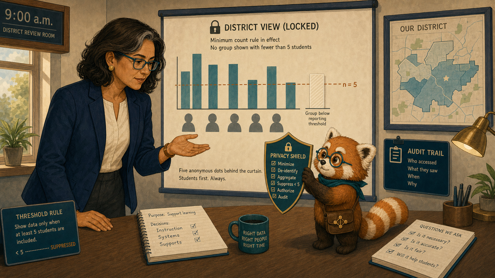
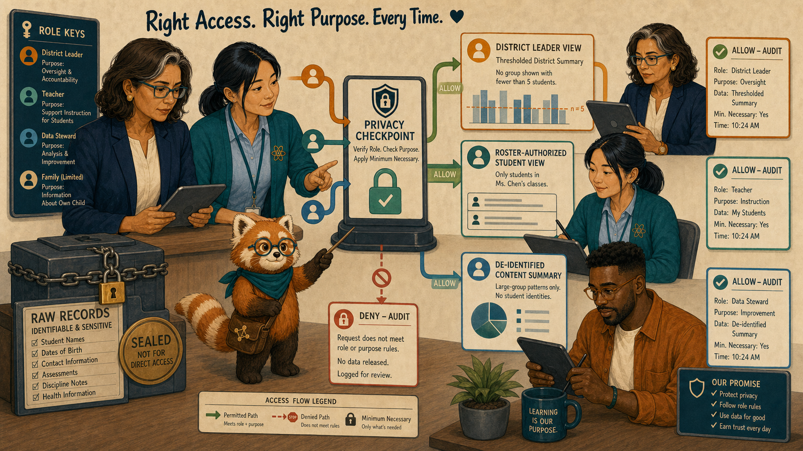
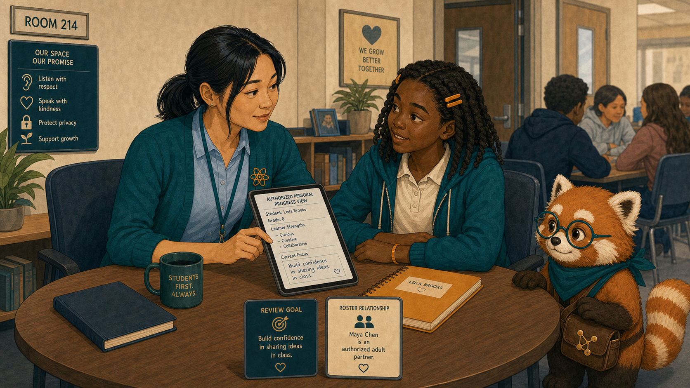
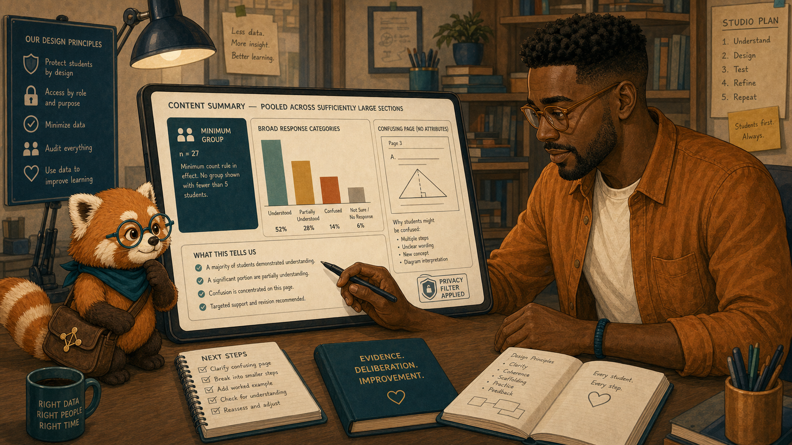
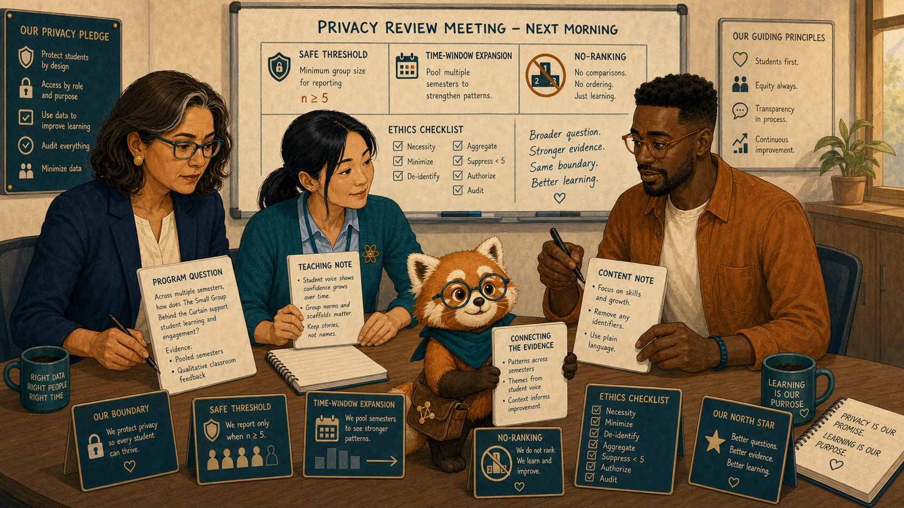
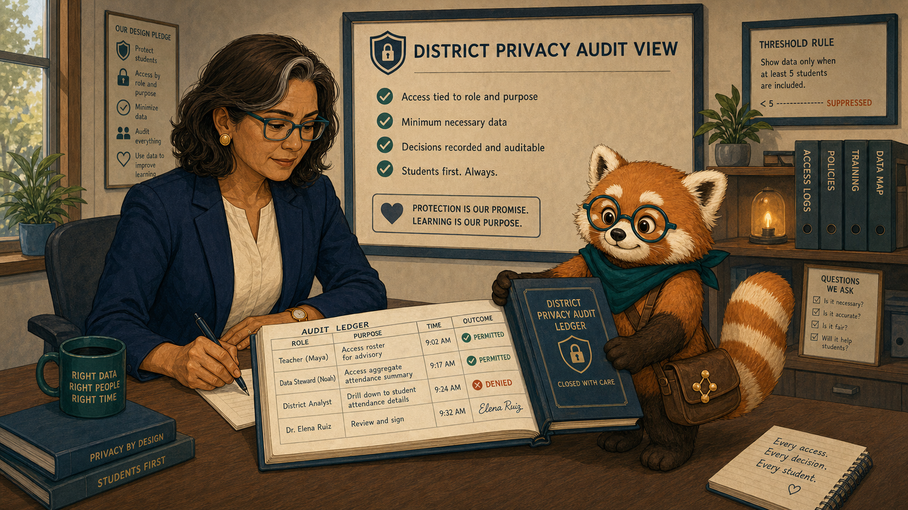
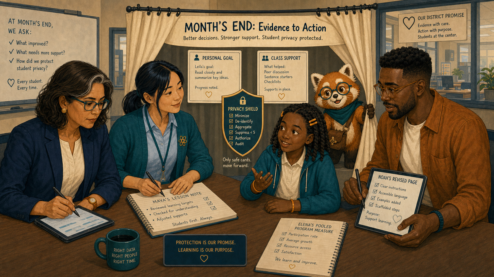

# The Small Group Behind the Curtain

Cover Image Prompt

(This is the Cover Image. Do not include this label in the image.)
Generate a wide-landscape 16:9 illustration in a warm contemporary educational-comic style with clean ink contours, softly painted color, expressive natural faces, gentle paper texture, realistic proportions, and a navy, deep-teal, cinnamon, cream, and amber palette. Set the scene in a district review room with a classroom visible beyond a translucent privacy curtain. Show Dr. Elena Ruiz, a 47-year-old Mexican American woman of medium height and build, with warm medium-brown skin, an oval high-cheekboned face, dark-brown eyes behind thin rectangular deep-teal glasses, and a collarbone-length wavy espresso-brown bob with a side part and one narrow silver streak at her right temple; she wears a navy blazer over a cream collarless blouse, charcoal trousers, small hammered-gold circular studs, and a slim amber watch on her left wrist. Show Ms. Maya Chen, a 35-year-old Chinese American woman with a compact athletic build, light warm-beige skin, a softly square face with rounded cheeks, a small beauty mark below the outer corner of her left eye, and dark-brown almond-shaped eyes; her straight blue-black hair is center-parted in a low ponytail with two short face-framing strands, and she wears a deep-teal cardigan with pushed-up sleeves over a pale-blue button-front shirt, charcoal ankle trousers, white low-profile sneakers, an amber atom pin, and a dark-teal school lanyard. Show Leila Brooks, a 13-year-old Black American girl with a slender, age-appropriate build, rich dark-brown skin, a heart-shaped full-cheeked face, broad nose, large dark-brown eyes, and a small gap between her upper front teeth visible when she smiles; her black shoulder-length two-strand twists have a center part and are held back by two symmetrical matte amber barrettes, and she wears a cream short-sleeved polo under a teal zip-front school hoodie, dark-navy straight-leg trousers, cinnamon high-top sneakers, and an amber elastic wristband on her left wrist. Show Noah Okafor, a 31-year-old Nigerian American man who is tall and lean, with deep umber-brown skin, a long oval face, broad nose, high forehead, dark-brown eyes behind round translucent amber glasses, a very short boxed beard and mustache, and dense black hair in a neat flat-topped coil cut with faded sides; he wears an open cinnamon overshirt over a cream crew-neck shirt, dark indigo trousers, teal canvas shoes, and a narrow deep-teal woven bracelet on his right wrist, and he usually holds a black stylus in his left hand. Show Rowan, a small rounded anthropomorphic red panda about desk height, with cinnamon-orange fur, a cream muzzle, cream eyebrow patches and belly, large kind brown eyes, dark-brown legs, and a thick ringed cinnamon-and-cream tail; he wears round deep-teal glasses, a deep-teal triangular neckerchief, and a compact brown cross-body satchel bearing a small gold connected-dots emblem. Place a translucent cream curtain over a tiny district bar chart while leaving a teacher-to-student conversation visible in a separate authorized window. Elena studies the threshold rule, Maya sits beside Leila, Noah receives a larger de-identified summary, and Rowan holds a privacy shield. Include five anonymous dots behind the curtain, an audit trail, role keys, a locked district view, and no exposed names. Render the exact title “The Small Group Behind the Curtain” once in bold hand-lettered navy type. Emotional tone: protection shown as responsible design rather than secrecy. Keep every named character exactly consistent with this description, keep Rowan desk-height, and show no brands, logos, rankings, exposed private records, or decorative data. Generate the image immediately without asking clarifying questions.

Narrative Prompt

This fictional seven-panel story explains aggregation thresholds and role-based access. Preserve the recurring cast. A small-group district result is hidden because it could identify students; Maya may still use Leila's roster-authorized record for teaching, while Noah receives only sufficiently large de-identified content evidence. Show the privacy filter as a single consistent checkpoint.

### Prologue – Hidden for a Reason

Dr. Elena Ruiz is the district learning director, responsible for improving programs without exposing individual students. At an end-of-month review, one result sat behind a cream curtain marked “group too small to display.” Elena asked what useful question could still be answered safely.

## Panel 1: The Covered Bar

Image Prompt

(This is Panel 01. Do not include the panel number in the image.)
Generate a wide-landscape 16:9 illustration in a warm contemporary educational-comic style with clean ink contours, softly painted color, expressive natural faces, gentle paper texture, realistic proportions, and a navy, deep-teal, cinnamon, cream, and amber palette. Set the scene in Elena's district review room at 9:00 a.m.. Show Dr. Elena Ruiz, a 47-year-old Mexican American woman of medium height and build, with warm medium-brown skin, an oval high-cheekboned face, dark-brown eyes behind thin rectangular deep-teal glasses, and a collarbone-length wavy espresso-brown bob with a side part and one narrow silver streak at her right temple; she wears a navy blazer over a cream collarless blouse, charcoal trousers, small hammered-gold circular studs, and a slim amber watch on her left wrist. Show Rowan, a small rounded anthropomorphic red panda about desk height, with cinnamon-orange fur, a cream muzzle, cream eyebrow patches and belly, large kind brown eyes, dark-brown legs, and a thick ringed cinnamon-and-cream tail; he wears round deep-teal glasses, a deep-teal triangular neckerchief, and a compact brown cross-body satchel bearing a small gold connected-dots emblem. A district chart shows several large teal group bars and one cream-covered bar labeled group below reporting threshold; Rowan holds a shield between five anonymous dots and the public chart. Include a threshold rule card, no names, Elena's open palm, an audit icon, a school map, and a question note.  Emotional tone: curiosity bounded by responsibility. Keep every named character exactly consistent with this description, keep Rowan desk-height, and show no brands, logos, rankings, exposed private records, or decorative data. Generate the image immediately without asking clarifying questions.

Rowan is the textbook's red-panda learning guide, helping people follow evidence without deciding for them. He explained that combining the chart with local knowledge could reveal which students produced the tiny result. The curtain did not say the group was unimportant. It said the reporting context was unsafe.

## Panel 2: Different Roles, Different Views

Image Prompt

(This is Panel 02. Do not include the panel number in the image.)
Generate a wide-landscape 16:9 illustration in a warm contemporary educational-comic style with clean ink contours, softly painted color, expressive natural faces, gentle paper texture, realistic proportions, and a navy, deep-teal, cinnamon, cream, and amber palette. Set the scene in an abstract role-based access scene. Show Dr. Elena Ruiz, a 47-year-old Mexican American woman of medium height and build, with warm medium-brown skin, an oval high-cheekboned face, dark-brown eyes behind thin rectangular deep-teal glasses, and a collarbone-length wavy espresso-brown bob with a side part and one narrow silver streak at her right temple; she wears a navy blazer over a cream collarless blouse, charcoal trousers, small hammered-gold circular studs, and a slim amber watch on her left wrist. Show Ms. Maya Chen, a 35-year-old Chinese American woman with a compact athletic build, light warm-beige skin, a softly square face with rounded cheeks, a small beauty mark below the outer corner of her left eye, and dark-brown almond-shaped eyes; her straight blue-black hair is center-parted in a low ponytail with two short face-framing strands, and she wears a deep-teal cardigan with pushed-up sleeves over a pale-blue button-front shirt, charcoal ankle trousers, white low-profile sneakers, an amber atom pin, and a dark-teal school lanyard. Show Noah Okafor, a 31-year-old Nigerian American man who is tall and lean, with deep umber-brown skin, a long oval face, broad nose, high forehead, dark-brown eyes behind round translucent amber glasses, a very short boxed beard and mustache, and dense black hair in a neat flat-topped coil cut with faded sides; he wears an open cinnamon overshirt over a cream crew-neck shirt, dark indigo trousers, teal canvas shoes, and a narrow deep-teal woven bracelet on his right wrist, and he usually holds a black stylus in his left hand. Show Rowan, a small rounded anthropomorphic red panda about desk height, with cinnamon-orange fur, a cream muzzle, cream eyebrow patches and belly, large kind brown eyes, dark-brown legs, and a thick ringed cinnamon-and-cream tail; he wears round deep-teal glasses, a deep-teal triangular neckerchief, and a compact brown cross-body satchel bearing a small gold connected-dots emblem. Show one central privacy checkpoint routing a roster-authorized student view to Maya, a thresholded district summary to Elena, and a de-identified large content summary to Noah. Include role keys, purpose labels, sealed raw records, deny and allow audit cards, and Rowan tracing the permitted paths.  Emotional tone: clear, comprehensible governance. Keep every named character exactly consistent with this description, keep Rowan desk-height, and show no brands, logos, rankings, exposed private records, or decorative data. Generate the image immediately without asking clarifying questions.

Ms. Maya Chen teaches the participating seventh-grade science class. Noah Okafor designs the interactive textbook. Their roles created different legitimate needs: Maya could support enrolled students; Noah could improve content from grouped evidence; Elena could monitor programs only above a safe reporting threshold.

## Panel 3: Private Support Still Works

Image Prompt

(This is Panel 03. Do not include the panel number in the image.)
Generate a wide-landscape 16:9 illustration in a warm contemporary educational-comic style with clean ink contours, softly painted color, expressive natural faces, gentle paper texture, realistic proportions, and a navy, deep-teal, cinnamon, cream, and amber palette. Set the scene at a quiet corner table in Room 214. Show Ms. Maya Chen, a 35-year-old Chinese American woman with a compact athletic build, light warm-beige skin, a softly square face with rounded cheeks, a small beauty mark below the outer corner of her left eye, and dark-brown almond-shaped eyes; her straight blue-black hair is center-parted in a low ponytail with two short face-framing strands, and she wears a deep-teal cardigan with pushed-up sleeves over a pale-blue button-front shirt, charcoal ankle trousers, white low-profile sneakers, an amber atom pin, and a dark-teal school lanyard. Show Leila Brooks, a 13-year-old Black American girl with a slender, age-appropriate build, rich dark-brown skin, a heart-shaped full-cheeked face, broad nose, large dark-brown eyes, and a small gap between her upper front teeth visible when she smiles; her black shoulder-length two-strand twists have a center part and are held back by two symmetrical matte amber barrettes, and she wears a cream short-sleeved polo under a teal zip-front school hoodie, dark-navy straight-leg trousers, cinnamon high-top sneakers, and an amber elastic wristband on her left wrist. Show Rowan, a small rounded anthropomorphic red panda about desk height, with cinnamon-orange fur, a cream muzzle, cream eyebrow patches and belly, large kind brown eyes, dark-brown legs, and a thick ringed cinnamon-and-cream tail; he wears round deep-teal glasses, a deep-teal triangular neckerchief, and a compact brown cross-body satchel bearing a small gold connected-dots emblem. Maya sits at eye level beside Leila with one authorized personal progress view turned toward both of them. Include Leila's amber notebook, a single review goal, a roster relationship badge, other students out of readable range, a closed classroom door window, and Rowan guarding the edge of the screen.  Emotional tone: warm personal support without exposure. Keep every named character exactly consistent with this description, keep Rowan desk-height, and show no brands, logos, rankings, exposed private records, or decorative data. Generate the image immediately without asking clarifying questions.

Leila Brooks is a 13-year-old student in Maya's science class. Maya could discuss Leila's progress because teaching her created a legitimate relationship. They chose one review goal together. The district's hidden group chart did not block the support Leila needed.

## Panel 4: Useful Without Being Identifying

Image Prompt

(This is Panel 04. Do not include the panel number in the image.)
Generate a wide-landscape 16:9 illustration in a warm contemporary educational-comic style with clean ink contours, softly painted color, expressive natural faces, gentle paper texture, realistic proportions, and a navy, deep-teal, cinnamon, cream, and amber palette. Set the scene in Noah's design studio later that day. Show Noah Okafor, a 31-year-old Nigerian American man who is tall and lean, with deep umber-brown skin, a long oval face, broad nose, high forehead, dark-brown eyes behind round translucent amber glasses, a very short boxed beard and mustache, and dense black hair in a neat flat-topped coil cut with faded sides; he wears an open cinnamon overshirt over a cream crew-neck shirt, dark indigo trousers, teal canvas shoes, and a narrow deep-teal woven bracelet on his right wrist, and he usually holds a black stylus in his left hand. Show Rowan, a small rounded anthropomorphic red panda about desk height, with cinnamon-orange fur, a cream muzzle, cream eyebrow patches and belly, large kind brown eyes, dark-brown legs, and a thick ringed cinnamon-and-cream tail; he wears round deep-teal glasses, a deep-teal triangular neckerchief, and a compact brown cross-body satchel bearing a small gold connected-dots emblem. Noah studies a content summary pooled across sufficiently large sections, showing one confusing page without student attributes. Include a minimum-group badge, broad response categories, a page thumbnail, a left-hand stylus, a privacy-filter stamp, and no school or student names.  Emotional tone: actionable evidence with deliberate limits. Keep every named character exactly consistent with this description, keep Rowan desk-height, and show no brands, logos, rankings, exposed private records, or decorative data. Generate the image immediately without asking clarifying questions.

Noah received a larger de-identified summary showing that a page confused learners across many sections. He could revise the explanation without knowing who belonged to the small group—or even which school produced the suppressed bar.

## Panel 5: Ask a Safer Question

Image Prompt

(This is Panel 05. Do not include the panel number in the image.)
Generate a wide-landscape 16:9 illustration in a warm contemporary educational-comic style with clean ink contours, softly painted color, expressive natural faces, gentle paper texture, realistic proportions, and a navy, deep-teal, cinnamon, cream, and amber palette. Set the scene in a privacy review meeting the next morning. Show Dr. Elena Ruiz, a 47-year-old Mexican American woman of medium height and build, with warm medium-brown skin, an oval high-cheekboned face, dark-brown eyes behind thin rectangular deep-teal glasses, and a collarbone-length wavy espresso-brown bob with a side part and one narrow silver streak at her right temple; she wears a navy blazer over a cream collarless blouse, charcoal trousers, small hammered-gold circular studs, and a slim amber watch on her left wrist. Show Ms. Maya Chen, a 35-year-old Chinese American woman with a compact athletic build, light warm-beige skin, a softly square face with rounded cheeks, a small beauty mark below the outer corner of her left eye, and dark-brown almond-shaped eyes; her straight blue-black hair is center-parted in a low ponytail with two short face-framing strands, and she wears a deep-teal cardigan with pushed-up sleeves over a pale-blue button-front shirt, charcoal ankle trousers, white low-profile sneakers, an amber atom pin, and a dark-teal school lanyard. Show Noah Okafor, a 31-year-old Nigerian American man who is tall and lean, with deep umber-brown skin, a long oval face, broad nose, high forehead, dark-brown eyes behind round translucent amber glasses, a very short boxed beard and mustache, and dense black hair in a neat flat-topped coil cut with faded sides; he wears an open cinnamon overshirt over a cream crew-neck shirt, dark indigo trousers, teal canvas shoes, and a narrow deep-teal woven bracelet on his right wrist, and he usually holds a black stylus in his left hand. Show Rowan, a small rounded anthropomorphic red panda about desk height, with cinnamon-orange fur, a cream muzzle, cream eyebrow patches and belly, large kind brown eyes, dark-brown legs, and a thick ringed cinnamon-and-cream tail; he wears round deep-teal glasses, a deep-teal triangular neckerchief, and a compact brown cross-body satchel bearing a small gold connected-dots emblem. Elena replaces a tiny-group comparison card with a broader program question using pooled semesters and qualitative classroom feedback. Maya contributes a teaching note; Noah contributes a content note. Include a safe threshold, a time-window expansion, a no-ranking symbol, an ethics checklist, and Rowan connecting the broader evidence.  Emotional tone: creative problem-solving under a firm boundary. Keep every named character exactly consistent with this description, keep Rowan desk-height, and show no brands, logos, rankings, exposed private records, or decorative data. Generate the image immediately without asking clarifying questions.

Elena reframed the evaluation. Instead of asking how one tiny group compared with another, the district pooled appropriate time periods and added voluntary qualitative feedback. The safer question still guided improvement without producing a public statistic about identifiable learners.

## Panel 6: Every View Leaves a Trace

Image Prompt

(This is Panel 06. Do not include the panel number in the image.)
Generate a wide-landscape 16:9 illustration in a warm contemporary educational-comic style with clean ink contours, softly painted color, expressive natural faces, gentle paper texture, realistic proportions, and a navy, deep-teal, cinnamon, cream, and amber palette. Set the scene in the district privacy audit view. Show Dr. Elena Ruiz, a 47-year-old Mexican American woman of medium height and build, with warm medium-brown skin, an oval high-cheekboned face, dark-brown eyes behind thin rectangular deep-teal glasses, and a collarbone-length wavy espresso-brown bob with a side part and one narrow silver streak at her right temple; she wears a navy blazer over a cream collarless blouse, charcoal trousers, small hammered-gold circular studs, and a slim amber watch on her left wrist. Show Rowan, a small rounded anthropomorphic red panda about desk height, with cinnamon-orange fur, a cream muzzle, cream eyebrow patches and belly, large kind brown eyes, dark-brown legs, and a thick ringed cinnamon-and-cream tail; he wears round deep-teal glasses, a deep-teal triangular neckerchief, and a compact brown cross-body satchel bearing a small gold connected-dots emblem. Show a concise audit ledger with role, purpose, time, and allowed-or-denied outcome; no sensitive contents are visible. Include Maya's permitted roster access, Noah's permitted aggregate access, one denied district drill-down, Elena's review signature, and Rowan closing the ledger.  Emotional tone: accountability without spectacle. Keep every named character exactly consistent with this description, keep Rowan desk-height, and show no brands, logos, rankings, exposed private records, or decorative data. Generate the image immediately without asking clarifying questions.

The audit showed who had requested each view, which rule applied, and whether access was allowed. Elena saw her own blocked drill-down alongside Maya's permitted classroom view. Leadership did not place her above the privacy boundary.

## Panel 7: Protected and Heard

Image Prompt

(This is Panel 07. Do not include the panel number in the image.)
Generate a wide-landscape 16:9 illustration in a warm contemporary educational-comic style with clean ink contours, softly painted color, expressive natural faces, gentle paper texture, realistic proportions, and a navy, deep-teal, cinnamon, cream, and amber palette. Set the scene in a combined classroom and district scene at month's end. Show Leila Brooks, a 13-year-old Black American girl with a slender, age-appropriate build, rich dark-brown skin, a heart-shaped full-cheeked face, broad nose, large dark-brown eyes, and a small gap between her upper front teeth visible when she smiles; her black shoulder-length two-strand twists have a center part and are held back by two symmetrical matte amber barrettes, and she wears a cream short-sleeved polo under a teal zip-front school hoodie, dark-navy straight-leg trousers, cinnamon high-top sneakers, and an amber elastic wristband on her left wrist. Show Ms. Maya Chen, a 35-year-old Chinese American woman with a compact athletic build, light warm-beige skin, a softly square face with rounded cheeks, a small beauty mark below the outer corner of her left eye, and dark-brown almond-shaped eyes; her straight blue-black hair is center-parted in a low ponytail with two short face-framing strands, and she wears a deep-teal cardigan with pushed-up sleeves over a pale-blue button-front shirt, charcoal ankle trousers, white low-profile sneakers, an amber atom pin, and a dark-teal school lanyard. Show Noah Okafor, a 31-year-old Nigerian American man who is tall and lean, with deep umber-brown skin, a long oval face, broad nose, high forehead, dark-brown eyes behind round translucent amber glasses, a very short boxed beard and mustache, and dense black hair in a neat flat-topped coil cut with faded sides; he wears an open cinnamon overshirt over a cream crew-neck shirt, dark indigo trousers, teal canvas shoes, and a narrow deep-teal woven bracelet on his right wrist, and he usually holds a black stylus in his left hand. Show Dr. Elena Ruiz, a 47-year-old Mexican American woman of medium height and build, with warm medium-brown skin, an oval high-cheekboned face, dark-brown eyes behind thin rectangular deep-teal glasses, and a collarbone-length wavy espresso-brown bob with a side part and one narrow silver streak at her right temple; she wears a navy blazer over a cream collarless blouse, charcoal trousers, small hammered-gold circular studs, and a slim amber watch on her left wrist. Show Rowan, a small rounded anthropomorphic red panda about desk height, with cinnamon-orange fur, a cream muzzle, cream eyebrow patches and belly, large kind brown eyes, dark-brown legs, and a thick ringed cinnamon-and-cream tail; he wears round deep-teal glasses, a deep-teal triangular neckerchief, and a compact brown cross-body satchel bearing a small gold connected-dots emblem. Arrange four separate evidence cards—personal goal, class support, de-identified content revision, thresholded district plan—around an intact privacy shield. Include Leila speaking at the table, Maya's lesson note, Noah's revised page, Elena's pooled program measure, and Rowan holding the curtain open only around the safe cards.  Emotional tone: agency and improvement coexisting with privacy. Keep every named character exactly consistent with this description, keep Rowan desk-height, and show no brands, logos, rankings, exposed private records, or decorative data. Generate the image immediately without asking clarifying questions.

Leila received personal support, Maya kept the detail needed to teach, Noah improved the page, and Elena adjusted the program review. No public chart exposed the small group. Privacy had not stopped learning from the evidence; it had shaped a safer way to learn.

### Epilogue – Privacy Is Part of Usefulness

The team did not treat access as all-or-nothing. Purpose, relationship, group size, and auditability determined which view each role could use. The strongest feedback loop protected learners while still supporting teaching and design.

| Challenge | How the Team Responded | Lesson for Today |
|---|---|---|
| A small result looked missing | Rowan explained identification risk | Suppression can be protective |
| Maya needed individual detail | Roster authorization preserved teaching access | Purpose and relationship matter |
| Noah needed design evidence | He received a large de-identified summary | Useful feedback need not reveal people |
| Leaders needed accountability | Every access request entered the audit | Privacy rules apply to authority too |

### Call to Action

Before sharing a learning statistic, ask who could be identified, who truly needs the detail, and what safer view can answer the question. Privacy is not the absence of feedback; it is feedback designed with boundaries.

---

*“Support me in the classroom. Don't turn me into a public bar.”* 
—Leila Brooks, fictional student

*“The curtain protects people, not problems.”* 
—Rowan

*“A useful answer is not worth an unsafe question.”* 
—Dr. Elena Ruiz, fictional district learning director

---

## References

1. [Wikipedia: Data privacy](https://en.wikipedia.org/wiki/Information_privacy) - Overview of appropriate collection and use of personal information
2. [Wikipedia: Statistical disclosure control](https://en.wikipedia.org/wiki/Statistical_disclosure_control) - Techniques for reducing identification risk in published statistics
3. [Wikipedia: K-anonymity](https://en.wikipedia.org/wiki/K-anonymity) - Background on minimum indistinguishable group sizes
4. [U.S. Department of Education: FERPA](https://studentprivacy.ed.gov/ferpa) - Official guidance on privacy of student education records
5. [NIST Privacy Framework](https://www.nist.gov/privacy-framework) - Risk-management framework for protecting privacy
